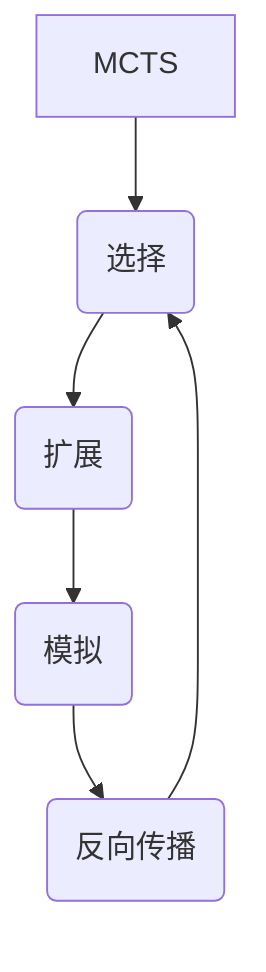

# **蒙特卡洛树搜索在基因组数据分析中的应用**

## 1.背景介绍

### 1.1 基因组数据分析的重要性

随着高通量测序技术的不断发展,生物学家们可以获取大量的基因组数据。基因组数据包含了生物体内部的遗传信息,对于揭示生命奥秘、探索疾病发生机制、开发新的治疗方法等具有重要意义。然而,由于基因组数据的复杂性和海量性,如何高效地分析和利用这些数据成为了一个巨大的挑战。

### 1.2 基因组数据分析中的难点

基因组数据分析面临着诸多难点,例如:

1. **数据量大且复杂**: 一个人类基因组中包含约30亿个碱基对,每个碱基对都可能对生物体的功能产生影响。此外,基因组数据还包括了基因的结构、调控机制等复杂信息。

2. **计算资源需求高**: 由于数据量庞大,对计算资源的需求也随之增加。高效的算法和足够的计算能力对于基因组数据分析至关重要。

3. **噪声和错误**: 测序过程中难免会产生噪声和错误,这些噪声和错误会影响分析结果的准确性。

4. **生物学背景知识的需求**: 基因组数据分析不仅需要计算机科学和数学知识,还需要深入的生物学背景知识,才能正确理解和解释分析结果。

### 1.3 蒙特卡洛树搜索简介

蒙特卡洛树搜索(Monte Carlo Tree Search, MCTS)是一种基于统计的决策算法,它通过构建一棵搜索树来评估不同决策的价值。MCTS算法在游戏领域取得了巨大成功,例如在国际象棋、围棋等游戏中表现出色。近年来,MCTS也开始应用于基因组数据分析领域,帮助研究人员更好地处理复杂的基因组数据。

## 2.核心概念与联系

### 2.1 蒙特卡洛树搜索的核心思想

蒙特卡洛树搜索的核心思想是通过构建一棵搜索树来探索可能的决策空间,并基于统计信息来评估每个决策的价值。MCTS算法通常包括四个主要步骤:

1. **选择(Selection)**: 从根节点开始,根据一定的策略选择子节点,直到到达一个未被充分探索的节点。

2. **扩展(Expansion)**: 从未被充分探索的节点出发,添加一个或多个子节点,扩展搜索树。

3. **模拟(Simulation)**: 从新添加的节点出发,进行一次随机模拟,获得一个模拟结果。

4. **反向传播(Backpropagation)**: 将模拟结果沿着搜索路径向上传播,更新每个节点的统计信息。

通过不断重复上述步骤,MCTS算法可以逐渐构建出一棵覆盖了大部分决策空间的搜索树,并根据统计信息选择出最优决策。



### 2.2 蒙特卡洛树搜索在基因组数据分析中的应用

在基因组数据分析中,我们可以将基因组视为一个巨大的决策空间,每个基因或基因组区域的变异都可以看作是一个决策。MCTS算法可以帮助我们高效地探索这个庞大的决策空间,找出与疾病或其他表型相关的关键基因变异。

具体来说,MCTS算法可以应用于以下基因组数据分析任务:

1. **基因关联分析**: 通过构建搜索树,MCTS算法可以识别与特定疾病或表型相关的基因变异。

2. **基因调控网络推断**: MCTS算法可以用于推断基因之间的调控关系,从而揭示基因调控网络的结构。

3. **基因组结构变异检测**: MCTS算法可以帮助识别基因组中的结构变异,如插入、缺失、倒位等。

4. **基因组进化分析**: 通过模拟基因组演化过程,MCTS算法可以用于研究基因组的进化历史和机制。

5. **个性化医疗**: MCTS算法可以结合个人基因组数据,为每个患者量身定制最佳的治疗方案。

## 3.核心算法原理具体操作步骤

蒙特卡洛树搜索算法在基因组数据分析中的具体操作步骤如下:

### 3.1 构建搜索树

1. **定义决策空间**: 根据具体的分析任务,确定基因组数据中的决策空间。例如,在基因关联分析中,每个基因或基因组区域的变异都可以看作是一个决策。

2. **初始化搜索树**: 创建一个根节点,表示初始状态。

3. **设置模拟策略**: 定义一个模拟策略,用于从当前节点出发进行随机模拟。模拟策略可以根据先验知识或随机采样来确定。

### 3.2 选择、扩展和模拟

1. **选择节点**: 从根节点开始,根据一定的策略选择子节点,直到到达一个未被充分探索的节点。常用的策略包括上确界置信区间树(UCT)策略等。

2. **扩展节点**: 从未被充分探索的节点出发,添加一个或多个子节点,扩展搜索树。

3. **进行模拟**: 从新添加的节点出发,根据模拟策略进行一次随机模拟,获得一个模拟结果。

### 3.3 反向传播和更新

1. **反向传播**: 将模拟结果沿着搜索路径向上传播,更新每个节点的统计信息,如访问次数、累积奖励等。

2. **更新策略**: 根据更新后的统计信息,调整选择节点的策略,以更好地探索有价值的决策空间。

3. **重复步骤**: 重复执行选择、扩展、模拟和反向传播步骤,直到达到预设的计算资源限制或收敛条件。

### 3.4 结果输出

1. **评估节点价值**: 根据累积的统计信息,评估每个节点代表决策的价值。

2. **输出结果**: 输出最有价值的决策,即与目标表型或疾病最相关的基因变异或基因组区域。

## 4.数学模型和公式详细讲解举例说明

在蒙特卡洛树搜索算法中,常用的数学模型和公式包括:

### 4.1 上确界置信区间树(UCT)策略

UCT策略是MCTS算法中常用的一种节点选择策略,它试图在探索(exploration)和利用(exploitation)之间达到平衡。UCT策略的公式如下:

$$
UCT = \frac{Q(n)}{N(n)} + C \sqrt{\frac{2\ln N(p)}{N(n)}}
$$

其中:

- $Q(n)$表示节点$n$的累积奖励
- $N(n)$表示节点$n$被访问的次数
- $N(p)$表示父节点$p$被访问的次数
- $C$是一个调节探索和利用权衡的常数

UCT策略将累积奖励和探索项相结合,选择具有较高UCT值的节点作为下一步扩展的节点。这样可以在充分利用已知的好决策的同时,也不会忽略潜在的好决策。

### 4.2 基因组关联分析中的似然比检验

在基因关联分析中,我们需要评估每个基因变异与目标表型之间的相关性。一种常用的方法是似然比检验(Likelihood Ratio Test, LRT)。

假设我们有一组基因型数据$G$和表型数据$P$,我们希望测试某个基因变异$v$是否与表型$P$相关。我们可以构建两个对数似然函数:

$$
\begin{aligned}
\ell_0 &= \ln P(P|G,v\text{ 与 }P\text{ 无关}) \\
\ell_1 &= \ln P(P|G,v\text{ 与 }P\text{ 相关})
\end{aligned}
$$

然后计算似然比统计量:

$$
\Lambda = -2(\ell_0 - \ell_1)
$$

如果$\Lambda$的值足够大,我们就可以拒绝零假设(即$v$与$P$无关),认为$v$与$P$相关。

### 4.3 基因调控网络推断中的贝叶斯网络模型

在基因调控网络推断中,我们可以使用贝叶斯网络模型来表示基因之间的调控关系。

假设我们有$n$个基因$G_1, G_2, \ldots, G_n$,每个基因都有两个可能的表达状态(表达或不表达)。我们可以用一个向量$\mathbf{x} = (x_1, x_2, \ldots, x_n)$来表示所有基因的表达状态,其中$x_i \in \{0, 1\}$表示基因$G_i$的表达状态。

根据贝叶斯网络的定义,我们可以写出联合概率分布:

$$
P(\mathbf{x}) = \prod_{i=1}^n P(x_i | \text{parents}(x_i))
$$

其中$\text{parents}(x_i)$表示调控基因$G_i$的父节点(即调控$G_i$的其他基因)。

通过学习这个贝叶斯网络模型的参数,我们可以推断出基因之间的调控关系,从而重构基因调控网络。

## 5.项目实践:代码实例和详细解释说明

为了更好地理解蒙特卡洛树搜索算法在基因组数据分析中的应用,我们提供了一个基于Python的示例代码。这个示例代码实现了一个简单的基因关联分析任务,使用MCTS算法来识别与某种疾病相关的基因变异。

### 5.1 代码结构

```
mcts_gene_association/
├── data/
│   └── gene_data.csv
├── mcts.py
├── utils.py
└── main.py
```

- `data/gene_data.csv`: 包含了一组虚构的基因型数据和表型数据(是否患有某种疾病)。
- `mcts.py`: 实现了MCTS算法的核心逻辑。
- `utils.py`: 包含了一些辅助函数,如数据加载、似然比检验等。
- `main.py`: 主程序入口,负责调用MCTS算法进行基因关联分析。

### 5.2 核心代码解释

#### 5.2.1 MCTS算法实现

在`mcts.py`文件中,我们实现了MCTS算法的核心逻辑。下面是`MonteCarloTreeSearch`类的主要方法:

```python
class MonteCarloTreeSearch:
    def __init__(self, gene_data, phenotype, max_iterations):
        ...

    def select_node(self, node):
        ...

    def expand_node(self, node):
        ...

    def simulate(self, node):
        ...

    def backpropagate(self, node, reward):
        ...

    def run(self):
        ...
```

- `__init__`方法初始化MCTS对象,包括加载基因数据、表型数据和设置最大迭代次数。
- `select_node`方法实现了节点选择策略,我们使用了UCT策略。
- `expand_node`方法从当前节点出发,添加一个新的子节点,扩展搜索树。
- `simulate`方法从新添加的节点出发,进行一次随机模拟,获得一个模拟结果(奖励)。
- `backpropagate`方法将模拟结果沿着搜索路径向上传播,更新每个节点的统计信息。
- `run`方法是MCTS算法的主循环,重复执行选择、扩展、模拟和反向传播步骤,直到达到最大迭代次数。

#### 5.2.2 辅助函数

在`utils.py`文件中,我们实现了一些辅助函数,包括:

```python
def load_gene_data(file_path):
    ...

def likelihood_ratio_test(genotypes, phenotypes, variant):
    ...
```

- `load_gene_data`函数从CSV文件中加载基因型数据和表型数据。
- `likelihood_ratio_test`函数实现了似然比检验,用于评估基因变异与表型之间的相关性。

#### 5.2.3 主程序

在`main.py`文件中,我们编写了主程序逻辑:

```python
import mcts
import utils

def main():
    