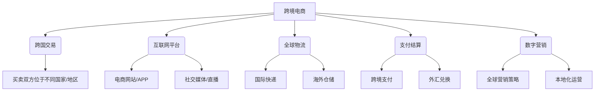
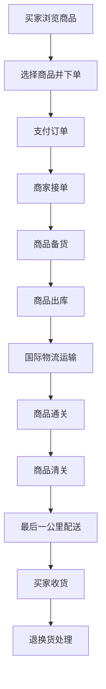

# 跨境电商新格局：全球化发展，开拓新兴市场

## 1.背景介绍

### 1.1 电子商务的全球化趋势

随着互联网和信息技术的迅速发展,电子商务正在向全球化迈进。传统的商业模式受到了前所未有的冲击和挑战,而跨境电子商务则应运而生。跨境电商是指买卖双方位于不同的国家或地区,通过互联网平台进行商品交易和资金结算的一种新型国际贸易方式。

全球化发展是当前电子商务的主旋律,各国政府也都在积极推动跨境电商的发展,为企业开拓国际市场创造有利环境。根据联合国贸易和发展会议的数据,2021年全球跨境电商零售额达到1.2万亿美元,占全球电商零售总额的28.8%。预计到2025年,全球跨境电商零售额将超过2万亿美元。

### 1.2 新兴市场的巨大潜力

随着发达国家市场趋于饱和,新兴市场成为跨境电商发展的新热土。新兴市场拥有庞大的人口基数和中产阶级群体,互联网和移动支付的快速普及为跨境电商奠定了坚实基础。根据联合国数据,到2025年,新兴市场将占全球电商零售额的63%。

中国、印度、东南亚、拉丁美洲、中东和非洲等新兴市场正在崛起,成为跨境电商的主战场。这些地区消费者对国际品牌和优质商品的需求与日俱增,为跨境电商带来了巨大的增长空间。

## 2.核心概念与联系

### 2.1 跨境电商的核心概念



跨境电商是指买卖双方位于不同的国家或地区,通过互联网平台进行商品交易和资金结算的新型国际贸易方式。它涉及跨国交易、互联网平台、全球物流、支付结算和数字营销等多个核心要素。

### 2.2 核心要素之间的关联

1. **跨国交易**是跨境电商的基本前提,买卖双方必须位于不同的国家或地区。
2. **互联网平台**是跨境电商的载体,包括电商网站/APP、社交媒体和直播平台等。
3. **全球物流**确保商品能够顺利跨境运输,涉及国际快递和海外仓储等环节。
4. **支付结算**是交易的关键环节,需要实现跨境支付和外汇兑换。
5. **数字营销**是吸引全球消费者的重要手段,包括全球营销策略和本地化运营。

这些核心要素相互关联、相互作用,共同构建了跨境电商的完整生态系统。

## 3.核心算法原理具体操作步骤

### 3.1 跨境电商交易流程



跨境电商交易流程包括以下主要步骤:

1. **买家浏览商品**: 买家在电商平台上浏览感兴趣的商品。
2. **选择商品并下单**: 买家选择商品,填写收货地址等信息并提交订单。
3. **支付订单**: 买家通过跨境支付渠道支付订单款项。
4. **商家接单**: 商家接收到订单后进行处理。
5. **商品备货**: 商家根据订单信息备货。
6. **商品出库**: 商品从仓库出库,准备发货。
7. **国际物流运输**: 商品通过国际快递公司运输。
8. **商品通关**: 商品抵达目的地国家,进行海关通关。
9. **商品清关**: 商品通过海关检查后,完成清关手续。
10. **最后一公里配送**: 商品由最后一公里配送公司送达买家手中。
11. **买家收货**: 买家收到商品后进行验货。
12. **退换货处理**: 如有退换货需求,进行退换货处理。

### 3.2 核心算法原理

跨境电商涉及多个环节,需要通过算法来优化各个流程,提高效率和用户体验。其中,一些核心算法原理包括:

1. **推荐算法**: 基于协同过滤、内容过滤等算法,为用户推荐感兴趣的商品。
2. **定价算法**: 根据供需关系、竞争对手价格等因素,动态调整商品价格。
3. **物流路径优化算法**: 利用图论算法,规划最优的物流路径,降低运输成本。
4. **库存管理算法**: 通过时间序列分析等算法,预测需求,优化库存水平。
5. **风控算法**: 基于机器学习等技术,识别和防范欺诈行为。

这些算法原理的具体实现步骤因算法而异,通常包括数据预处理、模型训练、预测和优化等环节。

## 4.数学模型和公式详细讲解举例说明

在跨境电商中,数学模型和公式广泛应用于算法设计、数据分析和决策优化等领域。以下是一些典型的数学模型和公式:

### 4.1 协同过滤推荐算法

协同过滤推荐算法是基于用户之间的相似性来预测用户对商品的喜好程度。常用的相似度计算公式包括:

1. **欧几里得距离**:

$$
sim(u,v)=\frac{1}{1+\sqrt{\sum_{i\in I}(r_{ui}-r_{vi})^2}}
$$

其中,u和v分别表示两个用户,I是两个用户均已评分的商品集合,r~ui~和r~vi~分别表示u和v对商品i的评分。

2. **皮尔逊相关系数**:

$$
sim(u,v)=\frac{\sum_{i\in I}(r_{ui}-\overline{r_u})(r_{vi}-\overline{r_v})}{\sqrt{\sum_{i\in I}(r_{ui}-\overline{r_u})^2}\sqrt{\sum_{i\in I}(r_{vi}-\overline{r_v})^2}}
$$

其中,\overline{r_u}和\overline{r_v}分别表示用户u和v的平均评分。

### 4.2 物流路径优化

物流路径优化问题可以转化为旅行商问题(TSP),使用整数线性规划模型求解:

$$
\begin{aligned}
\min \quad & \sum_{i=1}^{n}\sum_{j=1}^{n}c_{ij}x_{ij}\\
\text{s.t.} \quad & \sum_{i=1}^{n}x_{ij}=1,\quad \forall j\in \{1,2,\ldots,n\}\\
& \sum_{j=1}^{n}x_{ij}=1,\quad \forall i\in \{1,2,\ldots,n\}\\
& \sum_{i\in S}\sum_{j\in S}x_{ij}\leq |S|-1,\quad \forall S\subset \{1,2,\ldots,n\},\; 2\leq |S|\leq n-1\\
& x_{ij}\in \{0,1\},\quad \forall i,j\in \{1,2,\ldots,n\}
\end{aligned}
$$

其中,n是城市数量,c~ij~是城市i到城市j的距离,x~ij~是决策变量,当路径经过城市i到城市j时取值为1,否则为0。

### 4.3 时间序列分析

时间序列分析常用于预测商品需求,以优化库存水平。常用的时间序列模型包括:

1. **移动平均模型(MA)**:

$$
y_t=\mu+\sum_{i=1}^{q}\theta_i\varepsilon_{t-i}+\varepsilon_t
$$

2. **自回归模型(AR)**:

$$
y_t=c+\sum_{i=1}^{p}\phi_iy_{t-i}+\varepsilon_t
$$

3. **自回归移动平均模型(ARMA)**:

$$
y_t=c+\sum_{i=1}^{p}\phi_iy_{t-i}+\sum_{i=1}^{q}\theta_i\varepsilon_{t-i}+\varepsilon_t
$$

其中,y~t~是时间t的观测值,μ和c是常数项,φ~i~和θ~i~是模型参数,ε~t~是白噪声项。

通过对历史数据建模并预测未来值,可以优化库存水平,避免库存过剩或库存短缺。

## 5.项目实践:代码实例和详细解释说明

为了更好地理解跨境电商中的数学模型和算法原理,我们以Python为例,实现一个基于协同过滤的商品推荐系统。

### 5.1 数据准备

我们使用MovieLens 100K数据集,该数据集包含100,000条电影评分记录,由943位用户对1682部电影的评分组成。数据格式如下:

```
user_id,movie_id,rating,timestamp
196,242,3,881250949
...
```

我们将数据加载到Pandas DataFrame中:

```python
import pandas as pd

# 加载数据
ratings = pd.read_csv('ratings.dat', sep='::', engine='python', names=['user_id', 'movie_id', 'rating', 'timestamp'])

# 去除时间戳列
ratings = ratings.drop('timestamp', axis=1)
```

### 5.2 构建用户-商品评分矩阵

为了应用协同过滤算法,我们需要构建用户-商品评分矩阵:

```python
from scipy.sparse import lil_matrix

# 获取用户和商品的数量
n_users = ratings.user_id.unique().shape[0]
n_items = ratings.movie_id.unique().shape[0]

# 构建用户-商品评分矩阵
data_matrix = lil_matrix((n_users, n_items), dtype=np.int8)

# 填充评分矩阵
for row in ratings.itertuples(index=False):
    user_id, movie_id, rating = row
    data_matrix[user_id - 1, movie_id - 1] = rating
```

### 5.3 计算用户相似度

我们使用皮尔逊相关系数计算用户之间的相似度:

```python
import numpy as np

def pearson_similarity(data_matrix, user1, user2):
    # 获取用户评分向量
    u_vec = np.asarray(data_matrix.getrow(user1).todense())
    v_vec = np.asarray(data_matrix.getrow(user2).todense())
    
    # 计算非零评分的索引
    non_zero_idx = np.logical_and(u_vec > 0, v_vec > 0)
    
    # 计算皮尔逊相关系数
    u_vec_non_zero = u_vec[non_zero_idx]
    v_vec_non_zero = v_vec[non_zero_idx]
    
    sim = np.corrcoef(u_vec_non_zero, v_vec_non_zero)[0, 1]
    
    return sim
```

### 5.4 基于用户相似度进行推荐

我们基于用户相似度,为目标用户推荐尚未评分的商品:

```python
def recommend(data_matrix, user_id, topN=10):
    # 计算目标用户与其他用户的相似度
    similarities = [pearson_similarity(data_matrix, user_id, other_user) for other_user in range(data_matrix.shape[0])]
    
    # 排序,获取最相似的K个用户
    k_nearest_users = np.argsort(similarities)[-topN-1:-1]
    
    # 获取目标用户尚未评分的商品
    rated_items = data_matrix[user_id].nonzero()[1]
    unrated_items = [item for item in range(data_matrix.shape[1]) if item not in rated_items]
    
    # 计算预测评分
    item_scores = []
    for item in unrated_items:
        user_ratings = data_matrix[:, item].toarray().ravel()
        top_k_user_ratings = user_ratings[k_nearest_users]
        top