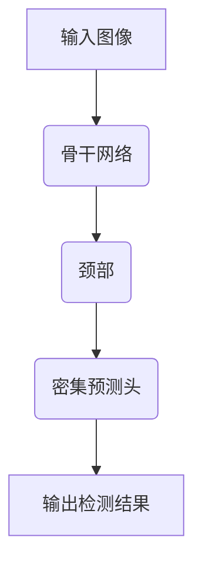

# 跨平台无障碍:YOLOv8多语言支持探秘

## 1. 背景介绍

### 1.1 人工智能视觉识别的重要性

在当今科技飞速发展的时代,人工智能(AI)已经渗透到我们生活的方方面面。其中,计算机视觉是人工智能领域中一个非常重要的分支,它赋予机器以类似于人类视觉的能力,使其能够从图像或视频中识别、理解和分析信息。

### 1.2 跨平台需求的挑战

随着人工智能技术的不断进步,越来越多的应用程序需要在不同的平台和设备上运行,如手机、平板电脑、笔记本电脑、服务器等。然而,不同平台之间存在着硬件架构、操作系统、编程语言等方面的差异,这给跨平台部署带来了巨大的挑战。

### 1.3 YOLOv8的崛起

在这种背景下,YOLOv8作为一款新兴的实时目标检测系统,凭借其卓越的性能、高效的推理速度和跨平台支持能力,成为了计算机视觉领域的佼佼者。它不仅能够在各种硬件平台上高效运行,还支持多种编程语言,为开发者提供了无与伦比的灵活性和可扩展性。

## 2. 核心概念与联系

### 2.1 目标检测

目标检测是计算机视觉中一个基础且重要的任务,旨在从图像或视频中定位并识别感兴趣的目标。它广泛应用于安防监控、自动驾驶、机器人导航等领域。

### 2.2 YOLO算法

YOLO(You Only Look Once)是一种先进的实时目标检测系统,它将目标检测任务视为一个回归问题,直接从图像像素预测边界框坐标和类别概率。相比传统的基于区域提议的目标检测算法,YOLO具有更快的推理速度和更高的精度。

### 2.3 YOLOv8架构

YOLOv8是YOLO算法的最新版本,它采用了全新的网络架构和训练策略,进一步提高了精度和速度。其核心组件包括骨干网络(Backbone)、颈部(Neck)和密集预测头(Dense Prediction Head),共同实现了高效的特征提取和目标检测。



### 2.4 多语言支持

YOLOv8不仅支持Python,还支持C++、C#、Java、JavaScript等多种编程语言。这使得开发者可以根据自身需求和项目环境,选择最合适的语言进行开发和部署,大大提高了灵活性和可扩展性。

## 3. 核心算法原理具体操作步骤 

### 3.1 骨干网络

YOLOv8的骨干网络负责从输入图像中提取特征,它采用了一种新型的混合架构,结合了传统卷积神经网络(CNN)和新兴的视觉转换器(ViT)的优点。具体步骤如下:

1. 输入图像经过一系列卷积层和下采样层,提取低级特征。
2. 特征图被分割成多个patch(图像块),并输入到ViT模块中。
3. ViT模块通过自注意力机制捕获全局信息,生成高级语义特征。
4. CNN特征和ViT特征进行融合,形成丰富的混合特征表示。

### 3.2 颈部

颈部的作用是对骨干网络提取的特征进行整合和增强,为后续的目标检测做准备。YOLOv8采用了一种新颖的FPN+PAN架构,具体步骤如下:

1. 利用特征金字塔网络(FPN)融合不同尺度的特征,获得丰富的多尺度特征。
2. 通过路径聚合网络(PAN)捕获不同层次之间的关联信息。
3. 使用注意力模块进一步增强特征表示的discriminability。

### 3.3 密集预测头

密集预测头负责从增强后的特征中预测目标的边界框、类别和其他属性。YOLOv8采用了一种新型的密集预测头,具体步骤如下:

1. 对每个特征级别进行独立的预测,生成初始预测结果。
2. 将不同级别的预测结果进行融合,获得更加鲁棒的预测。
3. 应用非极大值抑制(NMS)算法去除重复的预测框。
4. 输出最终的目标检测结果。

## 4. 数学模型和公式详细讲解举例说明

### 4.1 损失函数

YOLOv8采用了一种新型的综合损失函数,它将分类损失、回归损失和目标置信度损失等多个部分进行了整合,从而提高了模型的收敛速度和精度。损失函数的数学表达式如下:

$$
\mathcal{L} = \lambda_{cls} \mathcal{L}_{cls} + \lambda_{reg} \mathcal{L}_{reg} + \lambda_{obj} \mathcal{L}_{obj} + \lambda_{mask} \mathcal{L}_{mask}
$$

其中:

- $\mathcal{L}_{cls}$ 表示分类损失,用于优化目标类别的预测。
- $\mathcal{L}_{reg}$ 表示回归损失,用于优化目标边界框的预测。
- $\mathcal{L}_{obj}$ 表示目标置信度损失,用于区分目标和背景。
- $\mathcal{L}_{mask}$ 表示掩码损失,用于优化实例分割任务中的掩码预测。
- $\lambda_{cls}$, $\lambda_{reg}$, $\lambda_{obj}$, $\lambda_{mask}$ 分别为对应损失项的权重系数。

### 4.2 注意力机制

注意力机制是YOLOv8中一个关键的组件,它能够有效捕获长距离依赖关系,提高特征表示的discriminability。YOLOv8采用了一种新型的注意力机制,称为deformable attention,其数学表达式如下:

$$
\mathrm{Attention}(Q, K, V) = \mathrm{softmax}(\frac{Q(K+\Delta K)^T}{\sqrt{d_k}})V
$$

其中:

- $Q$, $K$, $V$ 分别表示查询(Query)、键(Key)和值(Value)。
- $\Delta K$ 表示对键$K$的偏移量,用于增强注意力机制的几何不变性。
- $d_k$ 表示键$K$的维度。

通过引入可变形卷积核,deformable attention能够自适应地关注感兴趣的区域,从而提高模型的表现力。

### 4.3 非极大值抑制(NMS)

非极大值抑制是目标检测算法中一个重要的后处理步骤,它用于去除重复的预测框,从而获得最终的检测结果。NMS的基本思想是,对于每个预测框,计算其与其他预测框的重叠程度(IoU),如果重叠程度超过一定阈值,则保留置信度更高的那个预测框,删除置信度较低的预测框。

NMS算法的伪代码如下:

```
输入: 预测框列表 bboxes, 置信度列表 confidences, 阈值 threshold
输出: 保留的预测框列表 picked

picked = []
areas = [bbox.area() for bbox in bboxes]  # 计算每个预测框的面积
order = sorted(range(len(confidences)), key=lambda x: confidences[x], reverse=True)  # 根据置信度排序

for i in order:
    keep = True
    for j in picked:
        overlap = bboxes[i].iou(bboxes[j])  # 计算重叠度
        if overlap > threshold:  # 如果重叠度超过阈值
            keep = False
            break
    if keep:
        picked.append(i)

return [bboxes[i] for i in picked]
```

通过NMS算法,YOLOv8能够有效地去除重复的预测框,提高目标检测的精度和鲁棒性。

## 5. 项目实践:代码实例和详细解释说明

在这一部分,我们将通过一个实际的代码示例,展示如何使用YOLOv8进行目标检测。为了方便说明,我们将使用Python作为编程语言。

### 5.1 安装YOLOv8

首先,我们需要安装YOLOv8库。可以使用pip进行安装:

```bash
pip install ultralytics
```

### 5.2 加载模型和图像

接下来,我们需要加载预训练的YOLOv8模型和待检测的图像。

```python
import cv2
from ultralytics import YOLO

# 加载模型
model = YOLO("yolov8n.pt")

# 加载图像
img = cv2.imread("example.jpg")
```

### 5.3 进行目标检测

使用加载好的模型对图像进行目标检测,并可视化结果。

```python
# 进行目标检测
results = model.predict(source=img, save=False, stream=True)

# 可视化结果
for result in results:
    boxes = result.boxes  # 检测框坐标
    for box in boxes:
        # 绘制边界框和类别标签
        x1, y1, x2, y2 = box.xyxy[0]
        x1, y1, x2, y2 = int(x1), int(y1), int(x2), int(y2)
        cv2.rectangle(img, (x1, y1), (x2, y2), (0, 255, 0), 2)
        conf = f"{box.conf:.2f}"
        cls = int(box.cls)
        class_name = model.names[cls]
        label = f"{class_name} {conf}"
        cv2.putText(img, label, (x1, y1 - 10), cv2.FONT_HERSHEY_SIMPLEX, 0.5, (36, 255, 12), 2)

# 显示结果图像
cv2.imshow("Result", img)
cv2.waitKey(0)
cv2.destroyAllWindows()
```

在上述代码中,我们首先加载预训练的YOLOv8模型和待检测的图像。然后,使用`model.predict()`方法对图像进行目标检测,获取检测结果。接下来,我们遍历每个检测框,在原始图像上绘制边界框和类别标签。最后,我们使用OpenCV显示结果图像。

通过这个示例,您可以清楚地了解如何使用YOLOv8进行目标检测任务。当然,在实际应用中,您可能还需要进行一些额外的处理,如调整检测阈值、筛选特定类别的目标等。

## 6. 实际应用场景

YOLOv8的强大性能和跨平台支持能力使其在各种领域都有广泛的应用前景。以下是一些典型的应用场景:

### 6.1 安防监控

在安防监控领域,YOLOv8可以用于实时检测和跟踪可疑目标,如人员、车辆等。它能够快速准确地识别潜在威胁,并及时发出警报,提高安全防范能力。

### 6.2 自动驾驶

在自动驾驶系统中,YOLOv8可以用于检测和识别道路上的各种目标,如行人、车辆、交通标志等。这为无人驾驶汽车的决策和控制提供了关键的视觉信息,确保行车安全。

### 6.3 机器人导航

在机器人导航领域,YOLOv8可以用于检测和识别环境中的各种障碍物,帮助机器人规划最优路径,避免碰撞。这对于服务机器人、物流机器人等具有重要意义。

### 6.4 工业检测

在工业生产中,YOLOv8可以用于检测产品缺陷、识别零件类型等任务。它能够提高质量控制的效率和准确性,降低人工检测的成本和误差。

### 6.5 医疗影像分析

在医疗领域,YOLOv8可以用于分析医学影像,如X光、CT、MRI等,帮助医生快速准确地检测和诊断疾病。这对于及时发现潜在健康问题至关重要。

## 7. 工具和资源推荐

为了帮助开发者更好地使用和学习YOLOv8,我们推荐以下一些有用的工具和资源:

### 7.1 官方文档

YOLOv8的官方文档(https://docs.ultralytics.com/)提供了详细的安装指南、API参考、教程和示例,是学习和使用YOLOv8的重要资源。

### 7.2 预训练模型

Ultralytics官方提供了多种预训练的YOLOv8模型