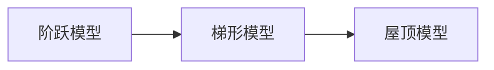
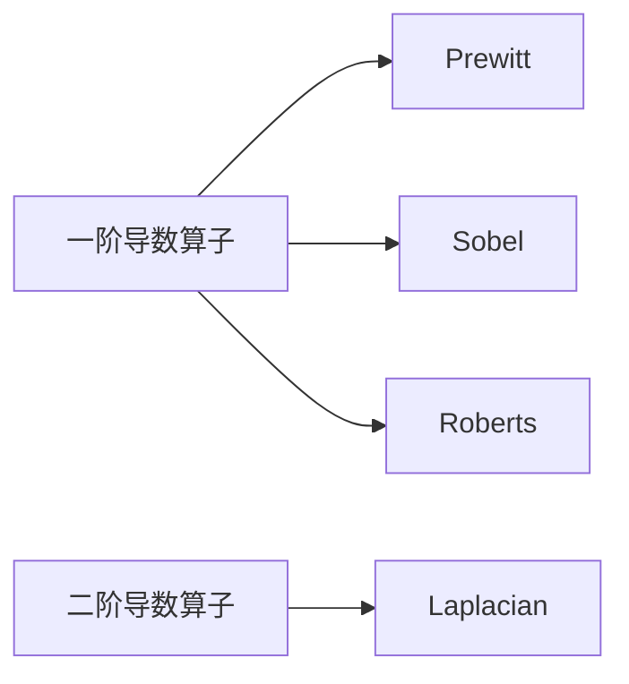
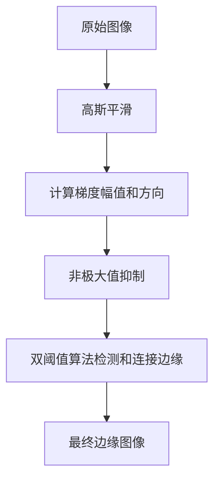

# **边缘检测：揭示图像结构的重要步骤**

## 1.背景介绍

### 1.1 图像处理的重要性

在当今的数字时代,图像处理已经成为许多领域的关键技术,如计算机视觉、医学成像、遥感探测等。图像数据包含了丰富的信息,从而使得图像处理技术在各个领域都有广泛的应用前景。

### 1.2 边缘检测的作用

边缘检测是图像处理中一个基础且重要的步骤。边缘是图像中亮度发生剧烈变化的区域,它们通常对应于物体的边界或物体内部的重要结构特征。准确检测出图像中的边缘信息,对于后续的图像分割、目标识别和目标跟踪等高级视觉任务至关重要。

### 1.3 边缘检测的挑战

尽管边缘检测看似简单,但要获得理想的边缘检测结果并非易事。影响边缘检测性能的因素有:图像噪声、亮度变化不均匀、几何失真等。此外,不同的图像场景对边缘检测算法的要求也不尽相同。因此,设计出鲁棒、高效的边缘检测算法一直是计算机视觉领域的一个重要研究课题。

## 2.核心概念与联系

### 2.1 边缘模型

边缘模型描述了图像中边缘的理想数学表达形式。常见的边缘模型有阶跃模型、屋顶模型、梯形模型等。



### 2.2 边缘检测算子

边缘检测算子是对图像进行卷积运算,以增强和检测边缘的数学工具。常用的一阶导数算子有Prewitt、Sobel和Roberts算子,二阶导数算子则有Laplacian算子。



### 2.3 边缘检测准则

边缘检测准则是评价边缘检测算法性能的标准,主要包括:

1. 良好的噪声抑制能力
2. 准确定位边缘位置 
3. 仅一个响应脉冲对应单个边缘
4. 对不同亮度梯度的边缘有较好的响应

## 3.核心算法原理具体操作步骤

### 3.1 Canny边缘检测算法

Canny边缘检测算法是目前最优秀和使用最广泛的边缘检测算法之一,它由以下几个步骤组成:

1. **高斯平滑** 
    - 使用高斯滤波器对图像进行平滑,减少噪声的影响
    - 平滑程度由高斯核的标准差σ控制

2. **计算梯度幅值和方向**
    - 对平滑后的图像计算梯度幅值和梯度方向
    - 常用Sobel算子近似求梯度

3. **非极大值抑制**
    - 对梯度幅值图像进行非极大值抑制
    - 仅保留梯度方向上的局部最大值

4. **双阈值算法检测和连接边缘**
    - 设置高低阈值,分别获得强边缘和弱边缘
    - 仅保留连接强边缘的弱边缘,剔除孤立的弱边缘



### 3.2 其他常用边缘检测算法

除了Canny算法,其他一些常用的边缘检测算法包括:

- **Sobel算子**
    - 基于一阶导数,使用两个3x3卷积核分别近似计算水平和垂直方向梯度
    - 简单高效,但对噪声敏感

- **Laplacian算子** 
    - 基于二阶导数,使用离散拉普拉斯算子近似计算梯度
    - 对噪声较为敏感,常与高斯平滑结合使用

- **Prewitt算子**
    - 与Sobel算子类似,使用不同的3x3卷积核
    - 对噪声的敏感性介于Sobel和Roberts之间

## 4.数学模型和公式详细讲解举例说明

### 4.1 高斯平滑

高斯平滑是边缘检测的第一步,目的是减少图像噪声对后续边缘检测的影响。平滑后的图像$G(x,y)$可由原始图像$f(x,y)$与二维高斯核$g(x,y,\sigma)$的卷积得到:

$$G(x,y) = f(x,y) * g(x,y,\sigma)$$

其中,二维高斯核的数学表达式为:

$$g(x,y,\sigma) = \frac{1}{2\pi\sigma^2}e^{-\frac{x^2+y^2}{2\sigma^2}}$$

$\sigma$是高斯核的标准差,它控制着平滑的程度。$\sigma$值越大,平滑效果越明显,但也会导致边缘位置发生偏移和细节丢失。

### 4.2 梯度计算

对平滑后的图像计算梯度,可以近似检测出边缘的位置和方向。常用的一阶导数算子有Sobel、Prewitt和Roberts等。以Sobel算子为例,它使用两个3x3卷积核$G_x$和$G_y$分别近似计算水平和垂直方向的梯度:

$$G_x = \begin{bmatrix}
-1 & 0 & 1\\
-2 & 0 & 2\\
-1 & 0 & 1
\end{bmatrix} \quad G_y = \begin{bmatrix}
1 & 2 & 1\\
0 & 0 & 0\\
-1 & -2 & -1
\end{bmatrix}$$

梯度幅值$|G|$和梯度方向$\theta$可由下式计算:

$$|G| = \sqrt{G_x^2 + G_y^2}$$
$$\theta = \tan^{-1}(G_y/G_x)$$

### 4.3 非极大值抑制

非极大值抑制是在梯度幅值图像上进行的操作。对于每个像素点,如果它在梯度方向上的两个相邻像素点的梯度值都比它小,则保留该像素点;否则,将其置为0。这一步可以获得细化的边缘线。

### 4.4 双阈值算法

Canny算法使用双阈值的方法检测和连接边缘。首先设置一个较高的阈值$T_H$和一个较低的阈值$T_L$,对梯度幅值图像进行阈值化操作:

- 若$|G| \geq T_H$,则该像素被标记为强边缘像素
- 若$T_L \leq |G| < T_H$,则该像素被标记为弱边缘像素
- 若$|G| < T_L$,则该像素被抑制

接下来,保留所有强边缘像素,对于弱边缘像素,只有与强边缘像素相连的部分才被保留,其余的弱边缘像素被抑制。这样可以有效地消除孤立的噪声响应。

## 5.项目实践:代码实例和详细解释说明

以下是使用Python和OpenCV库实现Canny边缘检测算法的代码示例:

```python
import cv2
import numpy as np

# 读取图像
img = cv2.imread('image.jpg', 0)

# 高斯平滑
blur = cv2.GaussianBlur(img, (5, 5), 0)

# 计算梯度
grad_x = cv2.Sobel(blur, cv2.CV_16S, 1, 0, ksize=3)
grad_y = cv2.Sobel(blur, cv2.CV_16S, 0, 1, ksize=3)

# 计算梯度幅值和方向
abs_grad_x = cv2.convertScaleAbs(grad_x)
abs_grad_y = cv2.convertScaleAbs(grad_y)
grad = cv2.addWeighted(abs_grad_x, 0.5, abs_grad_y, 0.5, 0)

# 非极大值抑制
edges = cv2.Canny(grad, 50, 150)

# 显示结果
cv2.imshow('Edges', edges)
cv2.waitKey(0)
cv2.destroyAllWindows()
```

代码解释:

1. 首先使用`cv2.imread()`函数读取图像,并转换为灰度图像。
2. 使用`cv2.GaussianBlur()`函数对图像进行高斯平滑,核大小为5x5,标准差为0(由OpenCV自动计算)。
3. 使用`cv2.Sobel()`函数计算图像的水平和垂直梯度,卷积核大小为3x3。
4. 使用`cv2.convertScaleAbs()`函数计算梯度的绝对值,并使用`cv2.addWeighted()`函数合并水平和垂直梯度。
5. 使用OpenCV内置的`cv2.Canny()`函数进行非极大值抑制和双阈值算法,阈值设置为50和150。
6. 最后使用`cv2.imshow()`函数显示边缘检测结果。

## 6.实际应用场景

边缘检测在许多领域有着广泛的应用,包括:

1. **图像分割**: 将图像分割成不同的区域,是图像理解和目标识别的基础步骤。边缘检测可以为图像分割提供重要的边界线索。

2. **目标识别和跟踪**: 在目标识别和跟踪中,边缘信息可用于提取目标的轮廓和特征,从而实现目标检测和跟踪。

3. **医学成像**: 在医学影像领域,边缘检测可用于提取病灶、器官等结构的边界,为医生诊断提供帮助。

4. **遥感图像分析**: 在遥感图像中,边缘检测可用于提取道路、建筑物、水体等地物的边界,为城市规划和环境监测提供支持。

5. **机器人导航**: 边缘检测可以帮助机器人识别周围环境的障碍物,从而实现自主导航和避障。

6. **指纹识别**: 边缘检测是指纹识别系统的重要步骤,用于提取指纹图像中的分叉、终止和其他特征点。

## 7.工具和资源推荐

以下是一些常用的边缘检测工具和资源:

1. **OpenCV**: 一个跨平台的计算机视觉和机器学习库,提供了丰富的图像处理算法,包括Canny、Sobel等边缘检测算法。

2. **Scikit-image**: Python中一个集成的图像处理库,包含了多种边缘检测算法的实现。

3. **MATLAB Image Processing Toolbox**: MATLAB内置的图像处理工具箱,提供了多种边缘检测算法和相关函数。

4. **边缘检测在线工具**: 一些在线工具可以快速演示和测试不同的边缘检测算法,如 [EdgeDetector](https://www.edgedetector.online/)。

5. **边缘检测数据集**: 用于评估和比较不同边缘检测算法性能的公开数据集,如BSD500数据集。

6. **边缘检测教程和文档**: 各种在线教程、课程和文档,如OpenCV官方文档中的 [Canny Edge Detection](https://docs.opencv.org/4.x/da/d22/tutorial_py_canny.html)。

## 8.总结:未来发展趋势与挑战

边缘检测是图像处理的基础技术,在计算机视觉、模式识别等领域扮演着重要角色。尽管已有多种成熟的边缘检测算法,但仍然面临一些挑战和发展方向:

1. **提高鲁棒性**: 设计出对噪声、几何失真等因素更加鲁棒的边缘检测算法,以适应复杂的图像环境。

2. **实时性和高效性**: 开发能够满足实时性和高效性要求的边缘检测算法,以支持实时视觉系统和嵌入式设备的应用。

3. **多尺度和自适应**: 探索多尺度和自适应边缘检测技术,以更好地捕捉图像中不同尺度和类型的边缘信息。

4. **深度学习方法**: 利用深度学习技术,从大量数据中自动学习边缘检测