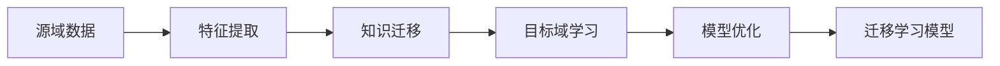

# 迁移学习的数学基础：概率论和信息论

## 1. 背景介绍

迁移学习作为机器学习领域的一个重要分支，其核心思想是利用已有的知识来加速新任务的学习过程。在实际应用中，迁移学习显示出了解决数据稀缺、任务多样性等问题的巨大潜力。然而，要充分发挥迁移学习的能力，我们必须深入理解其背后的数学基础，特别是概率论和信息论这两个理论框架。

## 2. 核心概念与联系

### 2.1 概率论基础
- 随机变量
- 概率分布
- 条件概率
- 贝叶斯定理

### 2.2 信息论基础
- 信息量
- 熵
- 互信息
- Kullback-Leibler散度

### 2.3 迁移学习中的应用
- 源域与目标域
- 分布一致性
- 知识迁移

## 3. 核心算法原理具体操作步骤



### 3.1 特征提取
### 3.2 知识迁移
### 3.3 目标域学习
### 3.4 模型优化

## 4. 数学模型和公式详细讲解举例说明

### 4.1 概率论在迁移学习中的应用
$$ P(Y|X) = \frac{P(X|Y)P(Y)}{P(X)} $$
### 4.2 信息论在迁移学习中的应用
$$ I(X;Y) = \sum_{x \in X}\sum_{y \in Y} p(x,y) \log \frac{p(x,y)}{p(x)p(y)} $$
### 4.3 分布一致性的数学表达
$$ D_{KL}(P||Q) = \sum_{x \in X} P(x) \log \frac{P(x)}{Q(x)} $$
### 4.4 举例说明

## 5. 项目实践：代码实例和详细解释说明

```python
# 示例代码
import numpy as np

# 源域和目标域数据示例
source_data = np.array([...])
target_data = np.array([...])

# 特征提取过程
def feature_extraction(data):
    # 特征提取逻辑
    pass

# 知识迁移过程
def knowledge_transfer(source_feature, target_feature):
    # 知识迁移逻辑
    pass

# 模型训练
def model_training(transferred_feature):
    # 模型训练逻辑
    pass

# 迁移学习流程
source_feature = feature_extraction(source_data)
target_feature = feature_extraction(target_data)
transferred_feature = knowledge_transfer(source_feature, target_feature)
model = model_training(transferred_feature)
```

## 6. 实际应用场景

- 图像识别
- 自然语言处理
- 强化学习

## 7. 工具和资源推荐

- TensorFlow
- PyTorch
- scikit-learn

## 8. 总结：未来发展趋势与挑战

迁移学习的未来发展趋势将更加注重模型的泛化能力和跨领域的适应性。同时，如何减少负迁移的风险、提高算法的可解释性和安全性，将是迁移学习面临的主要挑战。

## 9. 附录：常见问题与解答

- Q1: 迁移学习适用于哪些场景？
- A1: ...

- Q2: 如何评估迁移学习的效果？
- A2: ...

作者：禅与计算机程序设计艺术 / Zen and the Art of Computer Programming