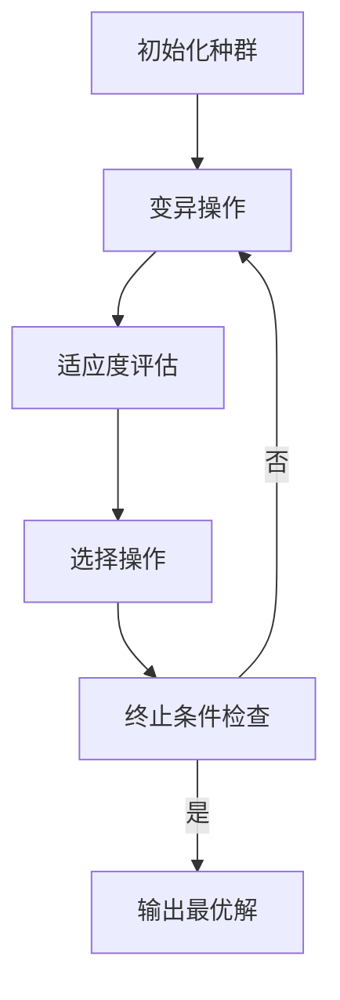

# 进化策略：自适应遗传算法

## 1. 背景介绍

进化策略(Evolution Strategies, ES)是一种基于进化计算的优化算法,源于20世纪60年代在德国柏林发展起来的一种寻优算法。它模拟了生物进化过程中的自然选择和遗传机制,用于解决复杂的黑箱优化问题。与其他经典的进化算法(如遗传算法)相比,进化策略更侧重于利用变异操作来探索解空间,而非交叉操作。

进化策略在早期主要应用于工程领域的参数优化问题,如管道系统设计、结构工程设计等。随着算法的不断发展和计算能力的提高,它逐渐扩展到了机器学习、神经网络训练、机器人控制等诸多领域。尤其是在强化学习的政策搜索和黑箱函数优化等问题上,进化策略展现出了强大的优化能力。

## 2. 核心概念与联系

### 2.1 进化策略的基本思想

进化策略借鉴了生物进化的自然选择和遗传机制,将待优化问题的解空间看作一个种群,通过不断进行变异、选择和复制等操作,逐步优化种群中的个体,最终获得满意的解。其核心思想可总结为:

1. **初始化种群**: 在解空间中随机生成一定数量的初始个体,构成初始种群。
2. **变异操作**: 对种群中的个体进行变异,产生新的候选解。
3. **适应度评估**: 计算每个个体的适应度(目标函数值),作为选择优劣个体的依据。
4. **选择操作**: 根据适应度,从当前种群中选择出优秀个体,构成新的种群。
5. **终止条件检查**: 若满足终止条件(如达到期望解或迭代次数上限),则输出最优解;否则返回步骤2,进行下一轮迭代。

### 2.2 进化策略与其他进化算法的关系

进化策略与其他经典的进化算法(如遗传算法、蚁群算法等)有一些相似之处,但也存在显著差异:

- **相似点**: 都借鉴了生物进化的自然选择和遗传机制,通过种群迭代优化的方式求解优化问题。
- **差异点**:
  - 遗传算法更侧重于利用交叉操作来产生新的个体,而进化策略主要依赖变异操作。
  - 进化策略更适合于连续参数优化问题,而遗传算法常用于离散优化问题。
  - 进化策略中的变异步长是自适应的,而遗传算法的变异概率通常是固定的。

总的来说,进化策略更专注于通过自适应变异来高效探索解空间,在连续参数优化问题上表现出色。

## 3. 核心算法原理具体操作步骤

进化策略算法的核心操作步骤如下:

1. **初始化种群**

   在解空间中随机生成 $\mu$ 个初始个体,构成初始种群 $P_0 = \{x_1, x_2, \ldots, x_\mu\}$,其中每个个体 $x_i$ 都是一个候选解向量。同时,为每个个体分配一个对应的策略参数向量 $\sigma_i$,用于控制变异步长。

2. **变异操作**

   对种群中的每个个体 $x_i$ 进行变异操作,生成 $\lambda$ 个新的变异个体:

   $$x_i' = x_i + N(0, \sigma_i^2)$$

   其中 $N(0, \sigma_i^2)$ 表示服从均值为 0、方差为 $\sigma_i^2$ 的高斯分布的随机向量。变异操作的目的是在解空间中探索新的候选解。

   同时,对策略参数向量 $\sigma_i$ 也进行变异:

   $$\sigma_i' = \sigma_i \cdot \exp(\tau' \cdot N(0, 1) + \tau \cdot N_i(0, 1))$$

   其中 $\tau'$ 和 $\tau$ 是两个学习率参数,用于控制策略参数的变异幅度。$N(0, 1)$ 是标准高斯分布,而 $N_i(0, 1)$ 是对每个维度独立采样的标准高斯分布。这种自适应的策略参数更新机制,使得进化策略能够自动调整变异步长,提高了算法的性能。

   经过变异操作后,我们得到了一个包含 $\mu + \lambda$ 个个体的临时种群 $P_t$。

3. **适应度评估**

   计算每个个体 $x_i'$ 的适应度 $f(x_i')$,作为选择操作的依据。适应度函数 $f(\cdot)$ 就是我们要优化的目标函数。

4. **选择操作**

   根据适应度值,从临时种群 $P_t$ 中选择出 $\mu$ 个最优个体,构成新的种群 $P_{t+1}$。常用的选择策略有:

   - $(\mu, \lambda)$ 策略: 从 $\mu + \lambda$ 个个体中选择适应度最高的 $\mu$ 个个体。
   - $(\mu + \lambda)$ 策略: 从 $\mu + \lambda$ 个个体中选择适应度最高的 $\mu$ 个个体,其中包括父代个体。

   选择操作的目的是保留优秀个体,淘汰劣质个体,从而使种群不断优化。

5. **终止条件检查**

   检查是否满足终止条件,如达到期望的最优解、迭代次数上限等。如果满足,则输出当前种群中适应度最高的个体作为最优解;否则,返回步骤2,进行下一轮迭代。

通过上述操作步骤的不断迭代,进化策略算法逐步优化种群,最终收敛到满意的解。值得注意的是,进化策略的性能很大程度上取决于参数设置(如 $\mu$、$\lambda$、学习率等),不同问题需要调整不同的参数以获得最佳效果。

## 4. 数学模型和公式详细讲解举例说明

进化策略算法中涉及到一些重要的数学模型和公式,下面将对它们进行详细讲解和举例说明。

### 4.1 高斯变异

在进化策略中,变异操作是通过添加服从高斯分布的随机扰动来实现的。对于个体 $x_i$,其变异个体 $x_i'$ 由以下公式给出:

$$x_i' = x_i + N(0, \sigma_i^2)$$

其中 $N(0, \sigma_i^2)$ 表示服从均值为 0、方差为 $\sigma_i^2$ 的高斯分布的随机向量。

**举例说明**:

假设我们要优化一个二维函数 $f(x, y)$,当前个体为 $x_i = (1.5, 2.0)$,策略参数为 $\sigma_i = (0.3, 0.4)$。那么,变异个体 $x_i'$ 可以通过以下方式生成:

1. 从标准高斯分布 $N(0, 1)$ 中分别采样两个随机数,假设为 $\epsilon_1 = 0.2$、$\epsilon_2 = -0.1$。
2. 计算 $x_i'$ 的每个维度:
   $$x_i'(1) = x_i(1) + \sigma_i(1) \cdot \epsilon_1 = 1.5 + 0.3 \cdot 0.2 = 1.56$$
   $$x_i'(2) = x_i(2) + \sigma_i(2) \cdot \epsilon_2 = 2.0 + 0.4 \cdot (-0.1) = 1.96$$
3. 因此,变异个体 $x_i' = (1.56, 1.96)$。

通过高斯变异,我们可以在解空间中产生新的候选解,同时保持一定的局部性,避免过度扰动导致性能下降。

### 4.2 自适应策略参数更新

进化策略算法中的一个关键特性是策略参数 $\sigma_i$ 的自适应更新机制。对于每个个体 $x_i$,其对应的策略参数 $\sigma_i$ 也会进行变异,公式如下:

$$\sigma_i' = \sigma_i \cdot \exp(\tau' \cdot N(0, 1) + \tau \cdot N_i(0, 1))$$

其中:

- $\tau'$ 和 $\tau$ 是两个学习率参数,用于控制策略参数的变异幅度。
- $N(0, 1)$ 是标准高斯分布,对所有维度使用相同的随机数。
- $N_i(0, 1)$ 是对每个维度独立采样的标准高斯分布。

这种自适应的策略参数更新机制,使得进化策略能够自动调整变异步长,提高了算法的性能。

**举例说明**:

假设当前个体 $x_i$ 的策略参数为 $\sigma_i = (0.3, 0.4)$,学习率参数设为 $\tau' = 0.1$、$\tau = 0.2$。那么,更新后的策略参数 $\sigma_i'$ 可以通过以下方式计算:

1. 从标准高斯分布 $N(0, 1)$ 中采样一个随机数,假设为 $\epsilon_0 = 0.1$。
2. 从标准高斯分布 $N_i(0, 1)$ 中分别采样两个随机数,假设为 $\epsilon_1 = -0.2$、$\epsilon_2 = 0.3$。
3. 计算 $\sigma_i'$ 的每个维度:
   $$\sigma_i'(1) = \sigma_i(1) \cdot \exp(\tau' \cdot \epsilon_0 + \tau \cdot \epsilon_1) = 0.3 \cdot \exp(0.1 \cdot 0.1 + 0.2 \cdot (-0.2)) = 0.286$$
   $$\sigma_i'(2) = \sigma_i(2) \cdot \exp(\tau' \cdot \epsilon_0 + \tau \cdot \epsilon_2) = 0.4 \cdot \exp(0.1 \cdot 0.1 + 0.2 \cdot 0.3) = 0.428$$
4. 因此,更新后的策略参数为 $\sigma_i' = (0.286, 0.428)$。

通过上述自适应机制,进化策略可以根据优化过程动态调整变异步长,在探索和利用之间达到更好的平衡。

### 4.3 选择策略

在进化策略中,选择操作是根据个体的适应度来保留优秀个体、淘汰劣质个体的过程。常见的选择策略有 $(\mu, \lambda)$ 策略和 $(\mu + \lambda)$ 策略。

**$(\mu, \lambda)$ 策略**:

在这种策略下,每一代会从 $\lambda$ 个变异个体中选择适应度最高的 $\mu$ 个个体,构成新的种群。数学表达式如下:

$$P_{t+1} = \text{select}_\mu(P_t \cup \{\text{mutate}(x_i, \sigma_i) | x_i \in P_t\})$$

其中 $P_t$ 表示第 $t$ 代种群,`mutate`函数表示对个体进行变异操作,`select`函数表示从集合中选择适应度最高的 $\mu$ 个个体。

**$(\mu + \lambda)$ 策略**:

在这种策略下,每一代会从父代种群 $P_t$ 和变异个体集合中选择适应度最高的 $\mu$ 个个体,构成新的种群 $P_{t+1}$。数学表达式如下:

$$P_{t+1} = \text{select}_\mu(P_t \cup \{\text{mutate}(x_i, \sigma_i) | x_i \in P_t\})$$

相比 $(\mu, \lambda)$ 策略,这种策略允许保留父代中的优秀个体,避免了优良基因的丢失。但同时也可能导致收敛速度变慢。

通常,$(\mu + \lambda)$ 策略在早期迭代时表现较好,因为它可以更好地保留种群的多样性;而在后期迭代时,$(\mu, \lambda)$ 策略可能更有利于快速收敛。因此,在实际应用中,我们可以根据具体问题的特点,选择合适的选择策略或者采用自适应的方式在两种策略之