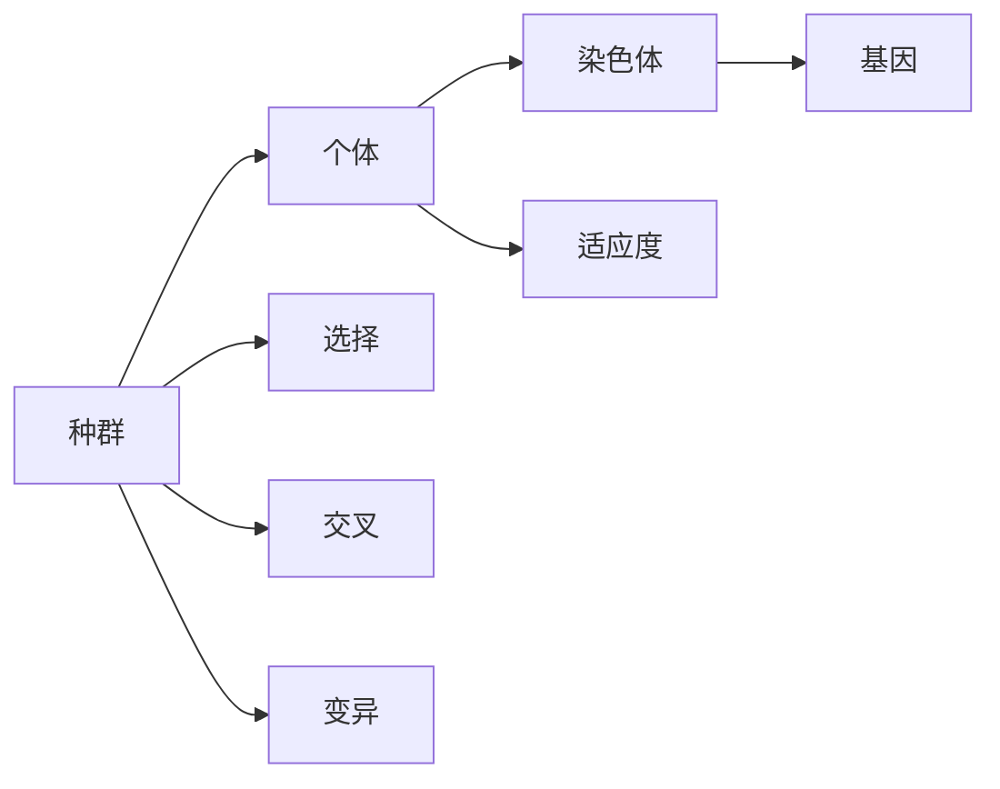

# 遗传算法(Genetic Algorithms) - 原理与代码实例讲解

## 1. 背景介绍
遗传算法（Genetic Algorithms，GA）是模拟生物进化过程的搜索算法，它由美国学者John Holland于20世纪70年代初提出。遗传算法的核心思想是“适者生存，不适者淘汰”，通过模拟自然选择和遗传机制来解决优化问题。在众多领域，如工程优化、机器学习、经济模型等，遗传算法已经证明是一种强大且灵活的工具。

## 2. 核心概念与联系
遗传算法的核心概念包括种群（Population）、个体（Individual）、基因（Gene）、染色体（Chromosome）、适应度（Fitness）、选择（Selection）、交叉（Crossover）和变异（Mutation）。这些概念相互联系，共同构成了遗传算法的基本框架。



## 3. 核心算法原理具体操作步骤
遗传算法的操作步骤可以概括为以下几点：
1. 初始化种群
2. 计算适应度
3. 选择操作
4. 交叉操作
5. 变异操作
6. 生成新一代种群
7. 判断终止条件，若未满足则返回步骤2

## 4. 数学模型和公式详细讲解举例说明
遗传算法中的数学模型主要涉及适应度函数的设计。适应度函数用于评价个体的优劣，其定义取决于具体问题。例如，若问题是求函数 $f(x)$ 的最大值，则适应度函数可以定义为 $Fitness(x) = f(x)$。

$$ Fitness(x) = f(x) $$

## 5. 项目实践：代码实例和详细解释说明
以下是一个简单的遗传算法Python代码实例，用于解决最大化函数 $f(x) = x^2$ 的问题。

```python
import random

# 个体类
class Individual:
    def __init__(self, genes):
        self.genes = genes
        self.fitness = self.calc_fitness()

    def calc_fitness(self):
        # 适应度函数为个体基因值的平方
        return self.genes ** 2

# 遗传算法类
class GeneticAlgorithm:
    def __init__(self, population_size, mutation_rate, crossover_rate, generations):
        self.population_size = population_size
        self.mutation_rate = mutation_rate
        self.crossover_rate = crossover_rate
        self.generations = generations
        self.population = self.init_population()

    def init_population(self):
        return [Individual(random.uniform(-10, 10)) for _ in range(self.population_size)]

    # 省略选择、交叉和变异的具体实现...

# 主函数
def main():
    ga = GeneticAlgorithm(population_size=100, mutation_rate=0.01, crossover_rate=0.7, generations=50)
    # 省略遗传算法运行过程...

if __name__ == "__main__":
    main()
```

## 6. 实际应用场景
遗传算法在多个领域有着广泛的应用，例如：
- 工程设计优化
- 机器学习参数调优
- 路径规划
- 经济模型预测

## 7. 工具和资源推荐
- DEAP（Distributed Evolutionary Algorithms in Python）是一个流行的遗传算法Python库。
- GA库（Genetic Algorithm Library）提供了多种遗传算法的实现。

## 8. 总结：未来发展趋势与挑战
遗传算法作为一种启发式算法，在解决复杂优化问题方面具有独特的优势。未来的发展趋势可能会集中在算法效率的提升、与其他优化算法的结合以及在新领域的应用探索上。挑战包括如何设计更有效的适应度函数、如何处理大规模数据以及如何保证算法的稳定性和可靠性。

## 9. 附录：常见问题与解答
Q1: 遗传算法是否总能找到全局最优解？
A1: 不一定。遗传算法是一种启发式算法，它能够找到较好的解，但不能保证总是全局最优。

Q2: 遗传算法的计算效率如何？
A2: 遗传算法的效率取决于问题的规模、种群大小、适应度函数的复杂度等因素。通常，遗传算法适用于那些传统优化方法难以处理的复杂问题。

作者：禅与计算机程序设计艺术 / Zen and the Art of Computer Programming