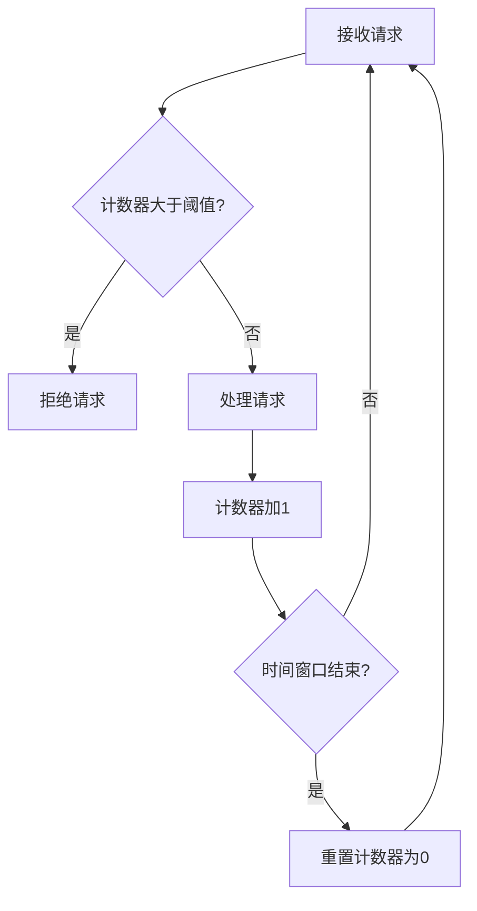
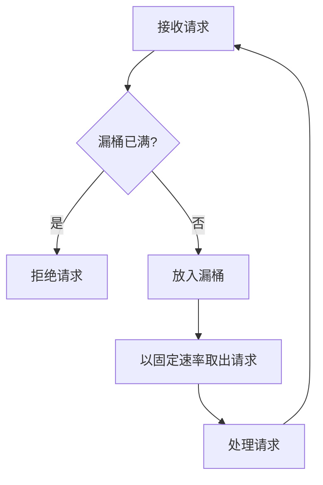
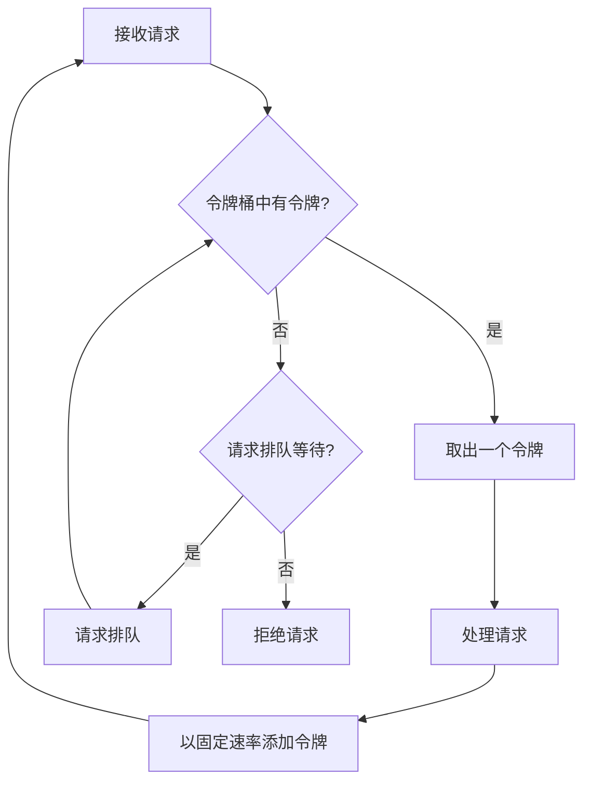

# 限流与降级：保护系统免受过载

## 1. 背景介绍

随着互联网的快速发展和用户量的不断增长,系统的高可用性和稳定性变得越来越重要。然而,在高并发场景下,系统往往会面临过载的风险,导致服务响应变慢甚至宕机。为了应对这一挑战,限流和降级作为系统保护措施应运而生。

限流是一种限制系统入口流量的策略,通过对并发请求进行计数和控制,防止请求过多导致系统资源耗尽。而降级则是在系统出现异常或者达到最大负载时,暂时关闭某些非核心功能,以保证核心业务的正常运行。这两种策略相辅相成,共同为系统提供了一层保护伞,确保了服务的可靠性和可用性。

### 1.1 限流的必要性

在高并发场景下,如果不对流量进行控制,系统可能会遭受以下风险:

1. **资源耗尽**:大量并发请求会消耗系统的计算资源(CPU、内存等),导致资源耗尽,从而影响系统的正常运行。
2. **雪崩效应**:由于某个服务出现故障,导致其他依赖服务也被拖垮,最终整个系统崩溃。
3. **级联失败**:某个服务实例发生故障,流量被转移到其他实例,但其他实例也无法承受如此大的流量,最终导致整个集群全部崩溃。

因此,在高并发场景下,限流策略能够为系统设置一个最大可承载的请求阈值,一旦达到该阈值,新的请求将被拒绝或排队等待,从而保护系统免受过载。

### 1.2 降级的必要性

即使采用了限流策略,系统仍可能出现异常情况,例如:

1. **服务熔断**:某个远程服务发生故障,导致本地服务无法正常调用。
2. **硬件故障**:服务器硬件出现故障,如CPU满载、内存泄漏等。
3. **流量突发**:由于某些原因,如新闻事件、活动等,导致流量突然激增。

此时,如果系统仍然执行所有功能,势必会导致资源耗尽,影响核心业务的正常运行。因此,需要采用降级策略,暂时关闭某些非核心功能,以保证系统的可用性和稳定性。

## 2. 核心概念与联系

### 2.1 限流概念

限流(Rate Limiting)是一种控制系统入口流量的策略,通过对并发请求进行计数和控制,防止请求过多导致系统资源耗尽。常见的限流算法有计数器算法、漏桶算法、令牌桶算法等。

限流可以应用在多个层面,如:

1. **网关层**:通过网关对所有请求进行限流控制。
2. **服务层**:针对具体服务进行限流控制。
3. **实例层**:针对服务的每个实例进行限流控制。

### 2.2 降级概念

降级(Degradation)是一种应对系统过载或故障的策略,通过暂时关闭某些非核心功能,以保证核心业务的正常运行。常见的降级策略包括:

1. **服务降级**:关闭某些非核心服务或功能。
2. **数据源降级**:切换到备用数据源或使用默认数据。
3. **线程降级**:减少线程池大小或关闭部分线程。

降级可以应用在以下场景:

1. **硬件故障**:如CPU满载、内存泄漏等。
2. **流量突发**:突发流量超过系统最大负载。
3. **依赖服务失效**:依赖的外部服务发生故障。

### 2.3 限流与降级的关系

限流和降级是两种不同但相辅相成的策略:

1. **限流是预防措施**:通过控制流量,防止系统过载。
2. **降级是补救措施**:在系统出现异常或过载时,暂时关闭非核心功能。

两者结合使用,能够更好地保护系统免受过载,提高系统的可用性和稳定性。

## 3. 核心算法原理具体操作步骤

### 3.1 计数器算法

计数器算法是最简单的限流算法,它通过维护一个计数器来记录在一个时间窗口内的请求数,如果请求数超过了预设的阈值,则拒绝新的请求。

具体操作步骤如下:

1. 初始化一个计数器,用于记录请求数。
2. 设置一个时间窗口(如1秒)和一个阈值(如100)。
3. 每当收到一个新的请求,计数器加1。
4. 在每个时间窗口结束时,将计数器重置为0。
5. 如果计数器大于阈值,则拒绝新的请求。



计数器算法简单易懂,但存在以下缺点:

1. 没有请求的排队等候机制,请求直接被拒绝。
2. 在时间窗口的边界处,可能会出现突发流量。
3. 无法动态调整限流阈值,缺乏灵活性。

### 3.2 漏桶算法

漏桶算法通过一个固定容量的漏桶来控制流量,漏桶以固定的速度漏出请求,当漏桶满时,新的请求将被拒绝。

具体操作步骤如下:

1. 初始化一个固定容量的漏桶。
2. 设置一个固定的出桶速率(如每秒100个请求)。
3. 每当收到一个新的请求,将其放入漏桶。
4. 如果漏桶已满,则拒绝新的请求。
5. 以固定速率从漏桶中取出请求进行处理。



漏桶算法相比计数器算法有以下优点:

1. 能够对流量进行reshaping,平滑突发流量。
2. 能够通过调整出桶速率来动态调整限流阈值。

但也存在一些缺点:

1. 无法对短时间内的突发流量进行控制,可能会导致资源短暂耗尽。
2. 只有一个固定的出桶速率,无法根据不同的场景进行动态调整。

### 3.3 令牌桶算法

令牌桶算法是对漏桶算法的一种改进,它引入了令牌的概念,每个请求需要获取一个令牌才能被处理。令牌以固定的速率产生,并存储在一个固定容量的令牌桶中。

具体操作步骤如下:

1. 初始化一个固定容量的令牌桶。
2. 设置一个固定的令牌产生速率(如每秒100个令牌)。
3. 每当收到一个新的请求,从令牌桶中取出一个令牌。
4. 如果令牌桶为空,则拒绝新的请求或将其排队等待。
5. 以固定速率向令牌桶中添加令牌。



令牌桶算法相比漏桶算法有以下优点:

1. 能够更好地控制突发流量,防止资源短暂耗尽。
2. 可以通过调整令牌产生速率和桶容量来动态调整限流阈值。
3. 支持请求排队等候,避免直接拒绝请求。

但也存在一些缺点:

1. 算法实现相对复杂,需要维护令牌桶和请求队列。
2. 排队等候会增加请求的延迟时间。

## 4. 数学模型和公式详细讲解举例说明

### 4.1 漏桶算法数学模型

漏桶算法可以用一个队列和一个固定的出桶速率来表示。设:

- $r$为出桶速率(请求/秒)
- $c$为桶的容量(请求数)
- $q(t)$为时刻$t$时桶中的请求数
- $\lambda(t)$为时刻$t$时的入桶速率(请求/秒)

则漏桶算法可以用以下公式描述:

$$
q(t+\Delta t) = \min(c, q(t) + \lambda(t)\Delta t - r\Delta t)
$$

即在时间$\Delta t$内,桶中的请求数变化为:

1. 如果$q(t) + \lambda(t)\Delta t - r\Delta t \leq c$,则新的请求全部进入桶中。
2. 如果$q(t) + \lambda(t)\Delta t - r\Delta t > c$,则桶已满,多余的请求被拒绝。

当$\lambda(t) > r$时,桶中的请求数会不断增加,直到达到容量$c$。当$\lambda(t) < r$时,桶中的请求数会不断减少,直到为0。

### 4.2 令牌桶算法数学模型

令牌桶算法可以用一个令牌桶和一个固定的令牌产生速率来表示。设:

- $r$为令牌产生速率(令牌/秒)
- $c$为桶的容量(令牌数)
- $q(t)$为时刻$t$时桶中的令牌数
- $\lambda(t)$为时刻$t$时的请求到达速率(请求/秒)

则令牌桶算法可以用以下公式描述:

$$
q(t+\Delta t) = \min(c, q(t) + r\Delta t - \lambda(t)\Delta t)
$$

即在时间$\Delta t$内,桶中的令牌数变化为:

1. 如果$q(t) + r\Delta t - \lambda(t)\Delta t \leq c$,则新产生的令牌全部进入桶中。
2. 如果$q(t) + r\Delta t - \lambda(t)\Delta t > c$,则桶已满,多余的令牌被丢弃。

当$\lambda(t) > r$时,桶中的令牌数会不断减少,直到为0。当$\lambda(t) < r$时,桶中的令牌数会不断增加,直到达到容量$c$。

### 4.3 令牌桶算法延迟计算

在令牌桶算法中,如果桶中没有令牌,新的请求需要排队等待。我们可以计算出请求需要等待的时间$d$:

设请求到达时刻为$t_0$,此时桶中的令牌数为$q(t_0)$,令牌产生速率为$r$,请求到达速率为$\lambda(t)$。

如果$q(t_0) \geq 1$,则请求可以立即获取一个令牌,无需等待,即$d=0$。

如果$q(t_0) < 1$,则请求需要等待一段时间$d$,使得在时刻$t_0+d$时,桶中有足够的令牌供请求获取,即:

$$
q(t_0+d) = q(t_0) + rd - \int_{t_0}^{t_0+d}\lambda(t)dt \geq 1
$$

假设请求到达速率$\lambda(t)$在时间$d$内保持不变,则上式可以化简为:

$$
d = \frac{1 - q(t_0)}{r - \lambda(t_0)}
$$

因此,请求需要等待的时间$d$取决于桶中剩余的令牌数$q(t_0)$、令牌产生速率$r$和请求到达速率$\lambda(t_0)$。

## 5. 项目实践:代码实例和详细解释说明

### 5.1 计数器算法实现

以下是使用Java实现计数器算法的示例代码:

```java
import java.util.concurrent.atomic.AtomicInteger;

public class CounterRateLimiter {
    private static final int RATE_