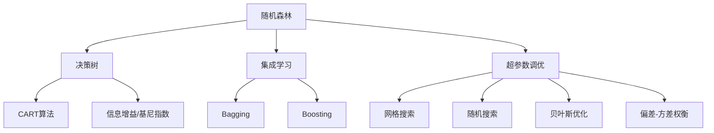

# 随机森林算法的超参数调优策略

## 1. 背景介绍
### 1.1 机器学习中的超参数调优
在机器学习领域,超参数(Hyperparameter)是指在学习过程开始之前设置的参数,而不是通过训练得到的参数。合理地选择超参数对于模型性能的提升至关重要。常见的超参数调优方法包括网格搜索(Grid Search)、随机搜索(Random Search)、贝叶斯优化(Bayesian Optimization)等。

### 1.2 随机森林算法简介
随机森林(Random Forest)是一种基于决策树的集成学习算法,通过构建多棵决策树并将它们的预测结果进行组合来实现分类或回归任务。随机森林具有较高的准确性、鲁棒性和泛化能力,广泛应用于各个领域。

### 1.3 随机森林算法的超参数
随机森林算法中的主要超参数包括:
- n_estimators:决策树的数量
- max_depth:每棵决策树的最大深度 
- min_samples_split:内部节点再划分所需最小样本数
- min_samples_leaf:叶子节点最少样本数
- max_features:寻找最佳分割时考虑的最大特征数
- bootstrap:是否进行有放回的采样

合理地调整这些超参数对于提升随机森林的性能至关重要。

## 2. 核心概念与联系
### 2.1 偏差-方差权衡
在机器学习中,偏差(Bias)和方差(Variance)是评估模型性能的两个重要指标。偏差指模型的预测值与真实值之间的差距,反映了模型本身的拟合能力;方差指模型对不同训练集的敏感程度,反映了模型的稳定性。理想的模型应该在偏差和方差之间取得平衡。

### 2.2 集成学习与随机森林
集成学习(Ensemble Learning)通过构建并组合多个学习器来完成学习任务,常见的集成方法包括Bagging和Boosting。随机森林属于Bagging的一种,通过bootstrap采样和特征随机化,构建多棵不同的决策树,并将它们的预测结果进行组合。

### 2.3 超参数对模型性能的影响
随机森林中的超参数会显著影响模型的偏差和方差:
- 增加n_estimators可以降低模型的方差,提高稳定性,但计算开销也会增加
- 增加max_depth可以降低偏差,提高拟合能力,但也可能导致过拟合
- 增加min_samples_split和min_samples_leaf可以降低方差,提高泛化能力,但也可能导致欠拟合
- 减小max_features可以降低方差,提高模型的多样性,但也可能降低某些重要特征的影响

因此,需要权衡各个超参数,找到模型性能最优的平衡点。下图展示了随机森林算法的核心概念之间的联系:



## 3. 核心算法原理与具体操作步骤
### 3.1 决策树的构建
随机森林中的每棵决策树通过递归划分特征空间来构建。常用的划分准则有信息增益、信息增益比和基尼指数等。以CART(Classification And Regression Tree)算法为例,决策树的构建过程如下:
1. 对当前节点的数据集D,枚举所有可能的特征a和切分点s,找到最优的特征a*和切分点s*,使得按照a*=s*的划分准则,数据集D被划分为D1和D2两部分,且划分后的基尼指数最小。
2. 如果满足预定的停止条件(如达到最大深度、节点样本数量小于阈值等),则将当前节点标记为叶子节点,并将其类别标记为数据集D中样本最多的类别;否则,递归地对D1和D2进行步骤1。

### 3.2 随机森林的构建
随机森林通过bootstrap采样和特征随机化,构建多棵不同的决策树,具体步骤如下:
1. 对于t=1,2,...,T:
   a. 通过bootstrap方法,从训练集中随机抽取N个样本(有放回),作为决策树t的训练集Dt。
   b. 从M个特征中随机选择m个特征(m<<M),作为决策树t的候选特征集At。
   c. 利用Dt和At,按照决策树的构建算法,构建决策树t。
2. 将T棵决策树组合成随机森林。

### 3.3 随机森林的预测
对于分类任务,随机森林通过投票的方式进行预测。对于待预测样本x,每棵决策树给出一个类别预测,将T棵树预测最多的类别作为随机森林的预测结果。对于回归任务,随机森林通过取平均值的方式进行预测。将每棵决策树对样本x的预测值求平均,作为随机森林的预测结果。

## 4. 数学模型和公式详细讲解举例说明
### 4.1 基尼指数
基尼指数(Gini Index)是CART算法中常用的划分准则,用于衡量数据集的纯度。假设数据集D中有K个类别,第k类样本所占的比例为pk,则基尼指数定义为:

$$
Gini(D) = \sum_{k=1}^{K} p_k(1-p_k) = 1 - \sum_{k=1}^{K} p_k^2
$$

基尼指数越小,数据集的纯度越高。例如,假设一个二分类问题,数据集D中正例占60%,负例占40%,则其基尼指数为:

$$
Gini(D) = 1 - (0.6^2 + 0.4^2) = 0.48
$$

### 4.2 信息增益
信息增益(Information Gain)是ID3、C4.5等决策树算法常用的划分准则,用于衡量某个特征对数据集的划分效果。假设数据集D的信息熵为H(D),特征a有V个可能的取值{a1,a2,...,aV},根据a=aj的条件划分后的子数据集为Dj,则特征a对数据集D的信息增益定义为:

$$
Gain(D,a) = H(D) - \sum_{j=1}^{V} \frac{|D^j|}{|D|} H(D^j)
$$

其中,数据集D的信息熵H(D)定义为:

$$
H(D) = -\sum_{k=1}^{K} p_k \log_2 p_k
$$

信息增益越大,表示特征a对数据集D的划分效果越好。

### 4.3 袋外误差
袋外误差(Out-of-Bag Error,简称OOB Error)是评估随机森林泛化性能的重要指标。在随机森林的构建过程中,每棵决策树使用bootstrap采样得到的训练集Dt进行训练,约有1/3的样本没有被采样到,称为袋外样本(Out-of-Bag Samples)。对于每个样本xi,可以用未采样到它的决策树对其进行预测,得到一个预测值yi',称为袋外预测(Out-of-Bag Prediction)。随机森林的袋外误差定义为:

$$
OOB\ Error = \frac{1}{N} \sum_{i=1}^{N} I(y_i \neq y_i')
$$

其中,I为指示函数,当条件成立时取1,否则取0。袋外误差越小,说明随机森林的泛化性能越好。

## 5. 项目实践:代码实例与详细解释说明
下面以Python中的scikit-learn库为例,演示随机森林的构建和超参数调优过程。

### 5.1 数据准备
```python
from sklearn.datasets import load_iris
from sklearn.model_selection import train_test_split

# 加载鸢尾花数据集
iris = load_iris()
X, y = iris.data, iris.target

# 划分训练集和测试集
X_train, X_test, y_train, y_test = train_test_split(X, y, test_size=0.2, random_state=42)
```

### 5.2 随机森林的构建与评估
```python
from sklearn.ensemble import RandomForestClassifier
from sklearn.metrics import accuracy_score

# 构建随机森林分类器
rf = RandomForestClassifier(n_estimators=100, max_depth=5, random_state=42)

# 模型训练
rf.fit(X_train, y_train)

# 模型预测
y_pred = rf.predict(X_test)

# 评估模型性能
accuracy = accuracy_score(y_test, y_pred)
print(f"Accuracy: {accuracy:.4f}")
```

### 5.3 网格搜索进行超参数调优
```python
from sklearn.model_selection import GridSearchCV

# 设置超参数搜索空间
param_grid = {
    'n_estimators': [50, 100, 200],
    'max_depth': [None, 5, 10],
    'min_samples_split': [2, 5, 10],
    'min_samples_leaf': [1, 2, 4],
    'max_features': ['auto', 'sqrt', 'log2']
}

# 进行网格搜索
grid_search = GridSearchCV(estimator=rf, param_grid=param_grid, cv=5, n_jobs=-1)
grid_search.fit(X_train, y_train)

# 输出最优超参数组合
print(f"Best parameters: {grid_search.best_params_}")

# 评估调优后的模型性能
y_pred = grid_search.predict(X_test)
accuracy = accuracy_score(y_test, y_pred)
print(f"Accuracy after tuning: {accuracy:.4f}")
```

## 6. 实际应用场景
随机森林算法凭借其优异的性能和鲁棒性,在许多实际场景中得到广泛应用,例如:
- 金融领域:信用评分、欺诈检测、股票价格预测等
- 医疗领域:疾病诊断、药物疗效预测、基因表达数据分析等
- 工业领域:设备故障诊断、质量检测、生产流程优化等  
- 自然语言处理:文本分类、情感分析、命名实体识别等
- 计算机视觉:图像分类、目标检测、语义分割等

在实际应用中,通过合理地设置随机森林的超参数,可以在不同的任务和数据集上取得优异的性能。

## 7. 工具和资源推荐
- scikit-learn:Python机器学习库,提供了随机森林的高效实现
- R语言randomForest包:R语言中的随机森林实现
- Weka:基于Java的机器学习工具箱,提供了随机森林的实现
- MATLAB:提供了随机森林的实现,并支持并行计算
- XGBoost:基于决策树的梯度提升框架,在Kaggle竞赛中大放异彩
- LightGBM:微软开源的梯度提升框架,速度更快,内存占用更小

此外,Kaggle、UCI机器学习库等网站提供了丰富的数据集资源,可用于随机森林等算法的实验和实践。

## 8. 总结:未来发展趋势与挑战
随机森林算法凭借其优异的性能和鲁棒性,已成为机器学习领域的重要工具之一。未来,随机森林算法的研究和应用还将不断深入,主要趋势和挑战包括:
- 算法改进:如何进一步提高随机森林的性能和效率,如何更好地处理高维、稀疏、不平衡等复杂数据
- 超参数优化:如何更高效、自动化地搜索最优超参数组合,如何权衡计算成本和模型性能
- 解释性:如何增强随机森林的可解释性,让模型的决策过程更加透明和可信
- 适用范围:如何将随机森林拓展到更多的任务和领域,如异常检测、时间序列预测、推荐系统等
- 理论基础:加深对随机森林的理论理解,如泛化误差界、一致性等性质的研究

总之,随机森林算法作为机器学习的重要工具,其研究和应用仍大有可为,需要学术界和工业界的共同努力。

## 9. 附录:常见问题与解答
### 9.1 随机森林容易过拟合吗?
与单棵决策树相比,随机森林通过集成多棵决策树,在一定程度上减轻了过拟合的风险。但如果决策树的数量过多、深度过大,仍然可能