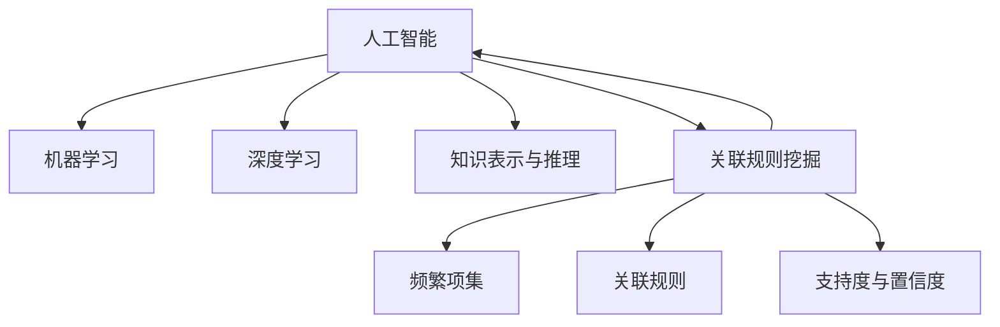

# 面向未来的人工智能发展趋势与关联规则挖掘

## 1. 背景介绍
### 1.1 人工智能的发展历程
#### 1.1.1 人工智能的起源与早期发展
#### 1.1.2 人工智能的黄金时期
#### 1.1.3 人工智能的低谷期与复兴
### 1.2 人工智能的现状与挑战
#### 1.2.1 人工智能技术的现状
#### 1.2.2 人工智能面临的挑战
#### 1.2.3 人工智能的未来展望
### 1.3 关联规则挖掘在人工智能中的应用
#### 1.3.1 关联规则挖掘的基本概念
#### 1.3.2 关联规则挖掘在人工智能中的重要性
#### 1.3.3 关联规则挖掘在人工智能中的应用场景

人工智能(Artificial Intelligence, AI)自1956年达特茅斯会议提出以来，经历了从起步到蓬勃发展的过程。早期的人工智能研究主要集中在搜索算法、专家系统等领域，取得了一定的成果。20世纪80年代到90年代，人工智能迎来了黄金发展期，各种智能算法如神经网络、遗传算法、模糊逻辑等被提出并广泛应用。然而由于当时硬件计算能力的限制和算法的局限性，人工智能的发展一度陷入低谷。

进入21世纪，得益于计算机硬件性能的飞速提升以及海量数据的积累，人工智能迎来了新的春天。深度学习、强化学习等算法的出现，使得人工智能在计算机视觉、自然语言处理、语音识别等领域取得了突破性进展，人工智能开始走进人们的日常生活。

尽管人工智能取得了长足的发展，但仍面临着诸多挑战。算法的可解释性差、缺乏常识推理能力、难以适应复杂多变的现实环境等，都是亟待攻克的难题。此外，如何让人工智能更好地服务于人类社会，符合伦理道德规范，也是人工智能未来发展需要重点关注的问题。

关联规则挖掘作为数据挖掘领域的重要分支，在人工智能的发展中扮演着不可或缺的角色。关联规则挖掘旨在从大规模数据集中发现项之间有趣的、隐含的、先前未知的关联关系或相关性。通过关联规则挖掘，我们可以发现数据背后隐藏的模式和规律，为人工智能系统的决策提供有力支撑。在推荐系统、用户行为分析、异常检测等场景中，关联规则挖掘都有着广泛的应用。

## 2. 核心概念与联系
### 2.1 人工智能的核心概念
#### 2.1.1 机器学习
#### 2.1.2 深度学习
#### 2.1.3 知识表示与推理
### 2.2 关联规则挖掘的核心概念  
#### 2.2.1 频繁项集
#### 2.2.2 关联规则
#### 2.2.3 支持度与置信度
### 2.3 人工智能与关联规则挖掘的联系
#### 2.3.1 关联规则挖掘在人工智能中的作用
#### 2.3.2 人工智能技术在关联规则挖掘中的应用
#### 2.3.3 两者结合的典型应用场景

人工智能的核心概念包括机器学习、深度学习以及知识表示与推理。机器学习是人工智能的一个重要分支,其目标是让计算机系统从数据中自动学习规律,并利用学到的规律对未知数据进行预测。深度学习是机器学习的一个子领域,它模仿人脑的神经网络结构,构建多层次的学习模型,能够从海量复杂数据中学习高层次的抽象特征表示。知识表示与推理则侧重于如何将人类的知识转化为计算机可以处理的形式,并基于这些知识进行逻辑推理和决策。

关联规则挖掘的核心概念包括频繁项集和关联规则。频繁项集是指在数据集中经常同时出现的一组项,它们反映了数据内在的共现模式。关联规则则刻画了频繁项集之间的条件依赖关系,形式为"如果A则B",表示在包含A的记录中,有多大比例的记录同时也包含B。关联规则的重要性由支持度和置信度两个指标度量,前者反映规则在整个数据集中出现的频率,后者反映规则的可信程度。

人工智能与关联规则挖掘之间有着密切的联系。一方面,关联规则挖掘可以为人工智能系统自动发现数据中隐含的关联特征和规律,减少人工特征工程的工作量,提高系统的智能化水平。另一方面,人工智能技术尤其是机器学习算法,可以用于改进关联规则挖掘的效率和效果,克服传统方法面临的维度灾难和计算瓶颈等问题。在实际应用中,两者的结合为智能推荐、用户画像、风险识别等系统带来了新的突破。



## 3. 核心算法原理具体操作步骤
### 3.1 Apriori算法
#### 3.1.1 算法基本思想
#### 3.1.2 算法步骤
#### 3.1.3 算法优化
### 3.2 FP-growth算法
#### 3.2.1 算法基本思想  
#### 3.2.2 FP树的构建
#### 3.2.3 频繁项集的生成
### 3.3 关联规则生成
#### 3.3.1 规则生成的基本方法
#### 3.3.2 规则评估与筛选
#### 3.3.3 规则的应用与解释

关联规则挖掘的核心算法主要包括Apriori和FP-growth两种。Apriori算法基于先验原理,即频繁项集的任何非空子集也必须是频繁的。算法首先找出所有的1-频繁项集,然后由此生成候选的2-频繁项集,通过扫描数据库判断候选集是否频繁,如此迭代直至无法生成更高阶的候选集。Apriori算法的缺点是需要重复扫描数据库,生成和验证候选集的开销很大。

FP-growth算法则采用了一种全新的思路。它首先扫描数据库构建FP树,FP树是一种压缩的数据结构,能够在不损失信息的前提下高效地存储数据集。在FP树上,通过递归地构建条件模式基和条件FP树,可以直接得到频繁项集,避免了候选集的生成。FP-growth算法不需要多次扫描数据库,性能大大优于Apriori算法。

得到频繁项集后,关联规则的生成就比较简单了。基本方法是对每个频繁项集,考察其所有的非空子集,计算子集到整个集合的置信度,高于最小置信度阈值的即为一条关联规则。为了得到更有价值的规则,还需要对规则进行评估和筛选,如计算规则的提升度、利用率等指标,排除冗余的、无效的规则。规则生成后,要与具体的应用场景结合,解释规则的业务含义和应用价值。

## 4. 数学模型和公式详细讲解举例说明
### 4.1 支持度和置信度的数学定义
#### 4.1.1 支持度的定义与计算
#### 4.1.2 置信度的定义与计算
#### 4.1.3 支持度和置信度的阈值选择
### 4.2 提升度和利用率的数学定义
#### 4.2.1 提升度的定义与计算
#### 4.2.2 利用率的定义与计算 
#### 4.2.3 提升度和利用率的应用
### 4.3 数学模型在关联规则挖掘中的应用
#### 4.3.1 基于统计的模型
#### 4.3.2 基于信息论的模型
#### 4.3.3 基于机器学习的模型

关联规则挖掘中,最基本的数学概念是支持度(support)和置信度(confidence)。给定项集X和Y,规则X→Y的支持度定义为:
$$
support(X \rightarrow Y) = \frac{freq(X \cup Y)}{N}
$$
其中,$freq(X \cup Y)$表示X和Y的并集在数据集D中出现的绝对频次,$N$为数据集D的总记录数。支持度反映了规则在整个数据集中出现的频率。

规则X→Y的置信度定义为:
$$
confidence(X \rightarrow Y) = \frac{freq(X \cup Y)}{freq(X)} = \frac{support(X \cup Y)}{support(X)}
$$
置信度反映了在先决条件X出现的情况下,结论Y出现的条件概率,刻画了规则的可信程度。

支持度和置信度是关联规则挖掘的两个重要参数,它们的阈值选择直接影响到挖掘的结果。支持度阈值过高会导致许多有价值但频次较低的规则被过滤,而过低则会产生大量无意义的规则。置信度阈值过高会导致规则的覆盖面过窄,而过低则会产生太多的规则。在实际应用中需要根据具体场景和需求权衡二者。

除了支持度和置信度,关联规则还可以用提升度(lift)和利用率(leverage)等指标来评估。规则X→Y的提升度定义为:
$$
lift(X \rightarrow Y) = \frac{confidence(X \rightarrow Y)}{support(Y)} = \frac{support(X \cup Y)}{support(X) \times support(Y)}
$$
提升度度量了X和Y的相关性,当lift>1时,表明X和Y是正相关的,规则有实际应用价值;当lift<1时,表明X和Y是负相关的;当lift=1时,表明X和Y相互独立。

规则X→Y的利用率定义为:
$$
leverage(X \rightarrow Y) = support(X \cup Y) - support(X) \times support(Y)
$$
利用率度量了规则在数据集中实际出现的频次与按独立性假设期望出现的频次之间的差异,leverage>0表明规则有效,leverage<0则表明规则无效。

在关联规则挖掘的研究中,人们还提出了许多数学模型。基于统计的模型如卡方检验,用于度量规则的显著性;基于信息论的模型如互信息,用于度量规则的新颖性;基于机器学习的模型如决策树,用于生成和优化规则。这些模型从不同角度刻画了规则的特性,为规则评估提供了新的思路。

## 5. 项目实践：代码实例和详细解释说明
### 5.1 数据预处理
#### 5.1.1 数据清洗
#### 5.1.2 数据变换
#### 5.1.3 数据集成
### 5.2 频繁项集挖掘
#### 5.2.1 Apriori算法实现
#### 5.2.2 FP-growth算法实现
#### 5.2.3 算法性能比较
### 5.3 关联规则生成与评估
#### 5.3.1 关联规则生成
#### 5.3.2 关联规则评估与筛选
#### 5.3.3 关联规则可视化展示

下面以一个超市购物篮数据为例,演示关联规则挖掘的完整过程。首先是数据预处理阶段,需要对原始数据进行清洗,剔除噪声和异常值,然后对数据进行适当的变换,如将商品编码转换为具体的商品名称,最后将多个数据源集成到一起,形成一个统一的分析数据集。

频繁项集挖掘是整个过程的核心。以下是Apriori算法的Python实现片段:

```python
def apriori(dataset, min_support):
    C1 = create_C1(dataset)
    D = map(set, dataset)
    L1, support_data = scan_D(D, C1, min_support)
    L = [L1]
    k = 2
    while (len(L[k-2]) > 0):
        Ck = apriori_gen(L[k-2], k)
        Lk, supK = scan_D(D, 