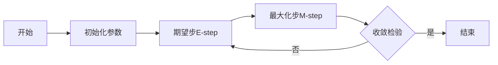

# 高斯混合模型(GMM)原理与代码实战案例讲解

## 1. 背景介绍
在机器学习领域，高斯混合模型（Gaussian Mixture Model，简称GMM）是一种常用的聚类算法，它假设数据是由若干个高斯分布混合而成的。与K-means等硬聚类算法不同，GMM属于软聚类算法，为每个数据点提供了属于各个聚类的概率，这种模糊的成员关系在很多实际问题中更为合适。

## 2. 核心概念与联系
GMM的核心在于使用多个高斯分布的加权和来近似任意形状的数据分布。每个高斯分布称为一个组件，由均值（mean）、协方差矩阵（covariance matrix）和混合系数（mixture coefficient）三个参数定义。数据点属于每个组件的概率由混合系数决定。

## 3. 核心算法原理具体操作步骤
GMM的训练过程通常使用期望最大化（Expectation-Maximization，简称EM）算法。EM算法分为两步：期望步（E-step）和最大化步（M-step）。在E-step中，根据当前参数估计每个数据点属于各个组件的概率；在M-step中，更新每个组件的参数以最大化数据的似然函数。



## 4. 数学模型和公式详细讲解举例说明
GMM的似然函数为：
$$
L(\theta) = \sum_{i=1}^{N} \log \left( \sum_{k=1}^{K} \pi_k \mathcal{N}(x_i | \mu_k, \Sigma_k) \right)
$$
其中，$N$ 是数据点的数量，$K$ 是组件的数量，$\pi_k$ 是第$k$个组件的混合系数，$\mathcal{N}(x_i | \mu_k, \Sigma_k)$ 是高斯分布的概率密度函数，$\mu_k$ 和 $\Sigma_k$ 分别是第$k$个组件的均值和协方差矩阵。

## 5. 项目实践：代码实例和详细解释说明
以下是使用Python中的`sklearn`库实现GMM的一个简单例子：

```python
from sklearn.mixture import GaussianMixture
import numpy as np

# 生成模拟数据
X = np.concatenate([np.random.normal(0, 2, (100, 2)), np.random.normal(5, 1, (100, 2))])

# 创建GMM模型
gmm = GaussianMixture(n_components=2)

# 训练模型
gmm.fit(X)

# 预测数据点的组件
labels = gmm.predict(X)

# 打印组件的均值和协方差矩阵
print("Means:", gmm.means_)
print("Covariances:", gmm.covariances_)
```

## 6. 实际应用场景
GMM在多个领域都有广泛应用，例如图像分割、语音识别、生物信息学等。在金融领域，GMM可以用于识别不同的市场行为模式；在社交网络分析中，GMM有助于识别社区结构。

## 7. 工具和资源推荐
- `sklearn.mixture.GaussianMixture`：Python中的一个强大的GMM实现。
- `GMM在R语言中的实现`：R语言中也有多个包提供了GMM的实现，如`mclust`。
- `Bishop, C. M. (2006). Pattern Recognition and Machine Learning.`：一本详细介绍GMM及其训练算法的书籍。

## 8. 总结：未来发展趋势与挑战
GMM作为一种经典的机器学习算法，其理论基础已经相当成熟。未来的发展趋势可能集中在如何更有效地处理高维数据和大规模数据集，以及如何将GMM与深度学习等其他机器学习技术结合起来。

## 9. 附录：常见问题与解答
Q1: GMM与K-means有什么区别？
A1: GMM提供了数据点属于每个聚类的概率，而K-means只提供硬聚类结果。

Q2: 如何选择GMM的组件数量？
A2: 可以使用模型选择准则如BIC（Bayesian Information Criterion）来确定最佳的组件数量。

Q3: GMM的训练是否总是收敛？
A3: EM算法通常能保证收敛到局部最优解，但不一定是全局最优解。

作者：禅与计算机程序设计艺术 / Zen and the Art of Computer Programming