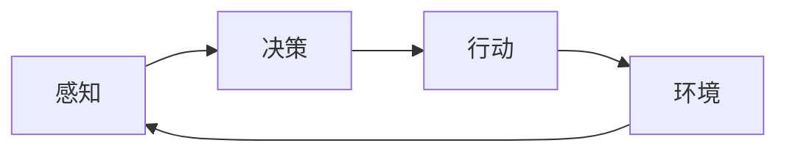

# AI Agent: AI的下一个风口 如何改变用户体验

## 1. 背景介绍
### 1.1 人工智能的发展历程
#### 1.1.1 早期人工智能
#### 1.1.2 机器学习时代  
#### 1.1.3 深度学习时代
### 1.2 AI Agent的兴起
#### 1.2.1 AI Agent的定义
#### 1.2.2 AI Agent的发展现状
#### 1.2.3 AI Agent的应用前景

## 2. 核心概念与联系
### 2.1 AI Agent的核心概念
#### 2.1.1 自主性
#### 2.1.2 交互性
#### 2.1.3 适应性
### 2.2 AI Agent与传统AI的区别
#### 2.2.1 任务导向vs目标导向
#### 2.2.2 被动响应vs主动交互
#### 2.2.3 固定模型vs持续学习
### 2.3 AI Agent与用户体验的关系  
#### 2.3.1 个性化服务
#### 2.3.2 自然交互
#### 2.3.3 主动助理

## 3. 核心算法原理具体操作步骤
### 3.1 强化学习
#### 3.1.1 马尔可夫决策过程
#### 3.1.2 Q-Learning算法
#### 3.1.3 策略梯度算法 
### 3.2 自然语言处理
#### 3.2.1 语言模型
#### 3.2.2 序列到序列模型
#### 3.2.3 注意力机制
### 3.3 多模态感知
#### 3.3.1 计算机视觉
#### 3.3.2 语音识别
#### 3.3.3 多模态融合

## 4. 数学模型和公式详细讲解举例说明
### 4.1 强化学习数学模型
#### 4.1.1 马尔可夫决策过程定义
#### 4.1.2 贝尔曼方程
#### 4.1.3 策略梯度定理
### 4.2 自然语言处理数学模型  
#### 4.2.1 语言模型公式
#### 4.2.2 注意力机制公式
#### 4.2.3 Transformer模型公式
### 4.3 多模态感知数学模型
#### 4.3.1 卷积神经网络
#### 4.3.2 循环神经网络
#### 4.3.3 注意力机制在多模态中的应用

## 5. 项目实践：代码实例和详细解释说明
### 5.1 对话系统实例
#### 5.1.1 任务型对话系统
#### 5.1.2 闲聊型对话系统
#### 5.1.3 个性化对话系统
### 5.2 智能助理实例
#### 5.2.1 日程管理助理
#### 5.2.2 智能家居助理
#### 5.2.3 智能客服助理
### 5.3 自动驾驶实例
#### 5.3.1 感知与定位
#### 5.3.2 路径规划
#### 5.3.3 决策控制

## 6. 实际应用场景
### 6.1 智能客服
#### 6.1.1 客户问题自动应答
#### 6.1.2 个性化服务推荐
#### 6.1.3 客户情绪识别
### 6.2 智能家居
#### 6.2.1 语音控制
#### 6.2.2 情景感知
#### 6.2.3 家电联动
### 6.3 智能医疗 
#### 6.3.1 医疗问答
#### 6.3.2 智能导诊
#### 6.3.3 远程监护

## 7. 工具和资源推荐
### 7.1 开源框架
#### 7.1.1 TensorFlow
#### 7.1.2 PyTorch
#### 7.1.3 OpenAI Gym
### 7.2 预训练模型
#### 7.2.1 BERT
#### 7.2.2 GPT-3
#### 7.2.3 DALL·E
### 7.3 学习资源
#### 7.3.1 在线课程
#### 7.3.2 学术论文
#### 7.3.3 技术博客

## 8. 总结：未来发展趋势与挑战
### 8.1 AI Agent的发展趋势
#### 8.1.1 多模态融合
#### 8.1.2 持续学习
#### 8.1.3 群体智能
### 8.2 AI Agent面临的挑战
#### 8.2.1 数据隐私与安全
#### 8.2.2 伦理与道德
#### 8.2.3 鲁棒性与可解释性
### 8.3 AI Agent的未来展望
#### 8.3.1 无处不在的智能助理
#### 8.3.2 人机协同与增强
#### 8.3.3 通用人工智能的可能性

## 9. 附录：常见问题与解答
### 9.1 AI Agent与人工智能的区别是什么？
### 9.2 AI Agent能否取代人类工作？
### 9.3 如何保障AI Agent的安全性和可靠性？
### 9.4 AI Agent的学习和进化需要多长时间？
### 9.5 普通用户如何参与AI Agent的开发和应用？

---

人工智能（Artificial Intelligence，AI）经过数十年的发展，已经从早期的探索阶段走向了实际应用阶段。近年来，随着深度学习等技术的突破，AI在计算机视觉、自然语言处理、语音识别等领域取得了令人瞩目的成就。而AI Agent作为人工智能的一个新兴分支，正在成为学术界和产业界关注的焦点。

AI Agent是一种能够感知环境、自主决策、与用户交互的智能体。与传统的任务导向型AI不同，AI Agent具有更强的自主性、交互性和适应性。它们不再是被动地响应用户的指令，而是能够主动理解用户的意图，提供个性化的服务。AI Agent代表了人工智能从"工具"向"伙伴"的转变，有望在智能助理、客户服务、医疗健康等领域掀起新一轮的应用浪潮。



在AI Agent的核心算法中，强化学习扮演着重要的角色。强化学习是一种通过与环境交互来学习最优策略的方法。它以马尔可夫决策过程（Markov Decision Process，MDP）为基础，通过不断试错和反馈来优化智能体的决策。常用的强化学习算法包括Q-Learning和策略梯度等。

以Q-Learning为例，其核心思想是估计每个状态-动作对的价值函数Q(s,a)，表示在状态s下采取动作a的长期回报。Q-Learning的更新公式为：

$$Q(s,a) \leftarrow Q(s,a) + \alpha [r + \gamma \max_{a'} Q(s',a') - Q(s,a)]$$

其中，$\alpha$是学习率，$\gamma$是折扣因子，$r$是即时奖励，$s'$是下一个状态。通过不断迭代更新Q值，最终收敛到最优策略。

除了强化学习，AI Agent还涉及自然语言处理、计算机视觉、语音识别等多个AI子领域。在自然语言处理中，Transformer模型以其并行计算和长程依赖捕捉能力，成为了当前最先进的语言模型架构。Transformer的核心是自注意力机制（Self-Attention），可以计算序列中任意两个位置之间的相关性。其数学表达式为：

$$Attention(Q,K,V) = softmax(\frac{QK^T}{\sqrt{d_k}})V$$

其中，$Q$、$K$、$V$分别是查询向量、键向量和值向量，$d_k$是键向量的维度。通过自注意力机制，Transformer能够在并行计算的同时，捕捉序列中的长距离依赖关系，大大提升了语言模型的性能。

在实际应用中，AI Agent已经在多个领域崭露头角。以智能客服为例，传统的客服系统往往只能应对有限的问题，而且缺乏个性化服务。引入AI Agent后，智能客服可以通过自然语言理解技术，准确把握客户的意图，并根据客户的画像和历史行为，提供个性化的回答和推荐。同时，AI Agent还能通过情绪识别技术，及时判断客户的情绪状态，调整服务策略，提升客户满意度。

```python
import torch
import torch.nn as nn
import torch.optim as optim

class ChatBot(nn.Module):
    def __init__(self, vocab_size, embedding_dim, hidden_dim):
        super(ChatBot, self).__init__()
        self.embedding = nn.Embedding(vocab_size, embedding_dim)
        self.encoder = nn.LSTM(embedding_dim, hidden_dim, batch_first=True)
        self.decoder = nn.LSTM(embedding_dim, hidden_dim, batch_first=True)
        self.fc = nn.Linear(hidden_dim, vocab_size)
        
    def forward(self, input_seq, target_seq):
        input_embed = self.embedding(input_seq)
        _, (hidden, cell) = self.encoder(input_embed)
        output, _ = self.decoder(target_seq, (hidden, cell))
        output = self.fc(output)
        return output
        
# 训练智能客服模型
vocab_size = 10000
embedding_dim = 128 
hidden_dim = 256
model = ChatBot(vocab_size, embedding_dim, hidden_dim)
criterion = nn.CrossEntropyLoss()
optimizer = optim.Adam(model.parameters(), lr=0.001)

for epoch in range(num_epochs):
    for input_seq, target_seq in data_loader:
        optimizer.zero_grad()
        output = model(input_seq, target_seq)
        loss = criterion(output.view(-1, vocab_size), target_seq.view(-1))
        loss.backward()
        optimizer.step()
```

以上是一个简单的智能客服聊天机器人的PyTorch实现。通过编码-解码框架，模型可以学习到客户问题和机器回答之间的映射关系。在实际应用中，还需要引入更大规模的语料库和更复杂的模型结构，如Transformer等，才能实现更加智能和人性化的客服服务。

展望未来，AI Agent有望在更多领域得到应用，成为人们生活和工作中不可或缺的智能助手。但与此同时，AI Agent的发展也面临着诸多挑战，如数据隐私与安全、伦理道德风险等。如何在发挥AI Agent潜力的同时，确保其安全性、可靠性和可解释性，是摆在研究者和开发者面前的重要课题。

总之，AI Agent代表了人工智能的一个崭新方向，有望重塑人机交互的方式，为用户带来更加智能和个性化的体验。作为AI从业者，我们应该积极拥抱这一技术浪潮，不断探索AI Agent的新应用和新模式，推动人工智能事业的发展。同时，我们也要高度重视AI Agent可能带来的风险和挑战，以负责任和谨慎的态度开展相关工作，确保AI Agent能够安全、可靠、可信地服务于人类社会。

作者：禅与计算机程序设计艺术 / Zen and the Art of Computer Programming