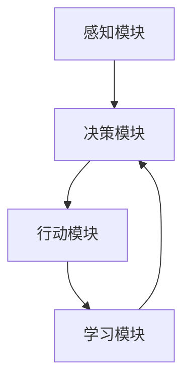

# AI Agent: AI的下一个风口 解决方案与研究方向

## 1.背景介绍

人工智能（AI）已经成为现代科技的核心驱动力之一，从自动驾驶汽车到智能家居，AI的应用无处不在。然而，随着技术的不断进步，AI的应用场景和需求也在不断扩展。AI Agent，即人工智能代理，作为AI技术的一个重要分支，正在成为下一个风口。AI Agent不仅能够自主学习和决策，还能与人类进行自然交互，解决复杂问题。本文将深入探讨AI Agent的核心概念、算法原理、数学模型、实际应用场景以及未来发展趋势。

## 2.核心概念与联系

### 2.1 什么是AI Agent

AI Agent是指能够自主感知环境、进行决策并采取行动的智能系统。它们通常具备以下几个特性：

- **自主性**：能够独立完成任务，无需人类干预。
- **适应性**：能够根据环境变化调整自身行为。
- **交互性**：能够与人类或其他代理进行交互。

### 2.2 AI Agent的分类

AI Agent可以根据不同的标准进行分类：

- **基于功能**：反应型代理、计划型代理、学习型代理。
- **基于应用场景**：工业自动化代理、医疗诊断代理、金融分析代理。

### 2.3 AI Agent与其他AI技术的联系

AI Agent与机器学习、深度学习、自然语言处理等技术密切相关。它们通常利用这些技术来实现感知、学习和决策功能。例如，AI Agent可以使用深度学习模型进行图像识别，使用自然语言处理技术进行人机对话。

## 3.核心算法原理具体操作步骤

### 3.1 感知模块

感知模块负责从环境中获取信息，通常使用传感器、摄像头等设备。感知模块的核心算法包括图像识别、语音识别等。

### 3.2 决策模块

决策模块根据感知模块获取的信息进行分析和决策。常用的算法包括强化学习、贝叶斯网络等。

### 3.3 行动模块

行动模块负责执行决策模块的指令，通常涉及机器人控制、自动化操作等。

### 3.4 学习模块

学习模块使AI Agent能够不断优化自身行为，常用的算法包括监督学习、无监督学习、强化学习等。

以下是一个典型的AI Agent工作流程的Mermaid图：



## 4.数学模型和公式详细讲解举例说明

### 4.1 强化学习

强化学习是AI Agent常用的学习算法之一。其核心思想是通过与环境的交互，学习最优策略。强化学习的数学模型通常包括状态空间、动作空间、奖励函数和策略函数。

#### 4.1.1 状态空间

状态空间 $S$ 是所有可能状态的集合。

#### 4.1.2 动作空间

动作空间 $A$ 是所有可能动作的集合。

#### 4.1.3 奖励函数

奖励函数 $R(s, a)$ 表示在状态 $s$ 执行动作 $a$ 后获得的奖励。

#### 4.1.4 策略函数

策略函数 $\pi(s)$ 表示在状态 $s$ 下选择动作的概率分布。

### 4.2 Q-Learning算法

Q-Learning是一种常用的强化学习算法，其核心公式为：

$$
Q(s, a) \leftarrow Q(s, a) + \alpha [r + \gamma \max_{a'} Q(s', a') - Q(s, a)]
$$

其中，$\alpha$ 是学习率，$\gamma$ 是折扣因子，$r$ 是即时奖励，$s'$ 是执行动作 $a$ 后的新状态。

## 5.项目实践：代码实例和详细解释说明

### 5.1 环境搭建

首先，我们需要搭建一个Python开发环境，并安装必要的库：

```bash
pip install numpy gym
```

### 5.2 Q-Learning代码实例

以下是一个使用Q-Learning算法训练AI Agent的简单示例：

```python
import numpy as np
import gym

# 创建环境
env = gym.make('FrozenLake-v0')

# 初始化Q表
Q = np.zeros([env.observation_space.n, env.action_space.n])

# 设置参数
alpha = 0.8
gamma = 0.95
num_episodes = 2000

# 训练AI Agent
for episode in range(num_episodes):
    state = env.reset()
    done = False
    while not done:
        action = np.argmax(Q[state, :] + np.random.randn(1, env.action_space.n) * (1. / (episode + 1)))
        new_state, reward, done, _ = env.step(action)
        Q[state, action] = Q[state, action] + alpha * (reward + gamma * np.max(Q[new_state, :]) - Q[state, action])
        state = new_state

print("训练完成后的Q表：")
print(Q)
```

### 5.3 代码解释

- **环境创建**：使用Gym库创建一个FrozenLake环境。
- **Q表初始化**：创建一个全零的Q表。
- **参数设置**：设置学习率、折扣因子和训练轮数。
- **训练过程**：通过多次迭代，更新Q表。

## 6.实际应用场景

### 6.1 工业自动化

AI Agent可以用于工业自动化中的设备监控、故障诊断和生产优化。例如，使用强化学习算法优化生产线的调度和资源分配。

### 6.2 医疗诊断

在医疗领域，AI Agent可以辅助医生进行疾病诊断和治疗方案推荐。通过分析患者的病历数据，AI Agent可以提供个性化的治疗建议。

### 6.3 金融分析

在金融领域，AI Agent可以用于股票交易、风险管理和市场预测。通过分析历史数据和市场趋势，AI Agent可以做出高效的投资决策。

## 7.工具和资源推荐

### 7.1 开发工具

- **Python**：广泛使用的编程语言，适用于AI Agent的开发。
- **TensorFlow**：强大的深度学习框架，支持AI Agent的训练和部署。
- **PyTorch**：另一个流行的深度学习框架，具有灵活性和易用性。

### 7.2 学习资源

- **《强化学习：原理与实践》**：一本详细介绍强化学习理论和实践的书籍。
- **Coursera上的AI课程**：提供丰富的AI和机器学习课程，适合初学者和进阶学习者。

## 8.总结：未来发展趋势与挑战

### 8.1 未来发展趋势

- **多模态AI Agent**：未来的AI Agent将能够处理多种类型的数据，如图像、语音和文本，实现更复杂的任务。
- **自主学习与进化**：AI Agent将具备更强的自主学习能力，能够在复杂环境中不断进化和优化自身行为。
- **人机协作**：AI Agent将与人类进行更自然的交互，协同完成任务，提高工作效率。

### 8.2 挑战

- **数据隐私与安全**：AI Agent在处理大量数据时，如何保护用户隐私和数据安全是一个重要挑战。
- **伦理与法律问题**：AI Agent的自主决策能力可能引发伦理和法律问题，需要制定相应的规范和法律框架。
- **技术瓶颈**：当前的AI技术在处理复杂任务时仍存在瓶颈，需要进一步的技术突破。

## 9.附录：常见问题与解答

### 9.1 AI Agent与传统软件的区别是什么？

AI Agent具备自主学习和决策能力，而传统软件通常是基于预定义规则进行操作。

### 9.2 如何选择合适的AI Agent算法？

选择算法时需要考虑具体应用场景、数据特性和计算资源。常用的算法包括强化学习、监督学习和无监督学习。

### 9.3 AI Agent的训练需要多长时间？

训练时间取决于算法复杂度、数据量和计算资源。简单的任务可能只需几分钟，而复杂任务可能需要数天甚至数周。

### 9.4 如何评估AI Agent的性能？

常用的评估指标包括准确率、召回率、F1分数等。具体指标选择应根据应用场景和任务需求。

### 9.5 AI Agent是否可以完全替代人类？

目前的AI Agent仍存在局限性，无法完全替代人类。它们更适合作为辅助工具，提高工作效率和决策质量。

---

作者：禅与计算机程序设计艺术 / Zen and the Art of Computer Programming