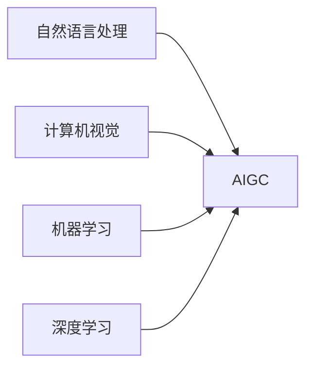

# AIGC从入门到实战：AIGC 小知识

## 1. 背景介绍
随着人工智能技术的飞速发展，AIGC（Artificial Intelligence Generated Content，人工智能生成内容）已经成为了新一代内容创作的热门方向。AIGC技术能够自动化生成文章、音乐、视频等多种形式的内容，极大地提高了内容创作的效率和多样性。本文将深入探讨AIGC的核心概念、算法原理、数学模型，并通过项目实践和实际应用场景，为读者提供一个全面的AIGC技术指南。

## 2. 核心概念与联系
AIGC涉及到多个核心概念，包括但不限于自然语言处理（NLP）、计算机视觉（CV）、机器学习（ML）和深度学习（DL）。这些技术相互联系，共同构成了AIGC的基础框架。



## 3. 核心算法原理具体操作步骤
AIGC的核心算法原理主要基于深度学习模型，如生成对抗网络（GANs）、变分自编码器（VAEs）和Transformer模型。以下是这些算法的具体操作步骤：

### 3.1 生成对抗网络（GANs）
1. 初始化生成器（Generator）和判别器（Discriminator）网络。
2. 生成器接收随机噪声，生成虚假数据。
3. 判别器评估真实数据和虚假数据。
4. 使用判别器的反馈来更新生成器。
5. 重复步骤2-4，直到生成器生成的数据足够真实。

### 3.2 变分自编码器（VAEs）
1. 构建编码器网络，将输入数据编码为潜在空间的表示。
2. 构建解码器网络，将潜在空间的表示解码为原始数据。
3. 通过最小化重构误差和潜在空间的正则化项来训练网络。
4. 使用训练好的模型进行数据生成。

### 3.3 Transformer模型
1. 准备序列化输入数据。
2. 使用自注意力机制处理输入数据。
3. 应用多头注意力和位置编码。
4. 通过编码器-解码器结构生成输出序列。
5. 利用损失函数优化模型参数。

## 4. 数学模型和公式详细讲解举例说明
在AIGC中，数学模型和公式是理解算法原理的关键。以变分自编码器为例，其核心是最大化数据的边际似然的下界（ELBO）：

$$
\mathcal{L}(\theta, \phi; x) = \mathbb{E}_{q_\phi(z|x)}[\log p_\theta(x|z)] - D_{KL}(q_\phi(z|x) || p(z))
$$

其中，$q_\phi(z|x)$ 是编码器网络定义的后验分布，$p_\theta(x|z)$ 是解码器网络定义的条件概率分布，$D_{KL}$ 是Kullback-Leibler散度，用于衡量两个概率分布之间的差异。

## 5. 项目实践：代码实例和详细解释说明
为了更好地理解AIGC技术，我们将通过一个简单的文本生成项目来展示代码实例。以下是使用Python和TensorFlow实现的Transformer模型的代码片段：

```python
import tensorflow as tf

# 定义Transformer模型参数
num_layers = 4
d_model = 128
num_heads = 8
dff = 512
input_vocab_size = 8500
target_vocab_size = 8500
dropout_rate = 0.1

# 构建Transformer模型
transformer = Transformer(num_layers, d_model, num_heads, dff,
                          input_vocab_size, target_vocab_size, dropout_rate)

# 定义损失函数和优化器
loss_object = tf.keras.losses.SparseCategoricalCrossentropy(from_logits=True, reduction='none')
optimizer = tf.keras.optimizers.Adam(learning_rate=0.001)

# 训练模型
for epoch in range(epochs):
    # ...
    # 在这里添加训练代码
    # ...
```

## 6. 实际应用场景
AIGC技术在多个领域都有广泛的应用，例如：

- **内容创作**：自动生成新闻文章、诗歌、小说等。
- **游戏开发**：生成游戏中的对话、故事情节和环境。
- **教育**：自动产生教学材料和习题。
- **媒体娱乐**：创作音乐、视频剪辑和动画。

## 7. 工具和资源推荐
对于想要深入学习AIGC的读者，以下是一些推荐的工具和资源：

- **TensorFlow** 和 **PyTorch**：两个主流的深度学习框架。
- **Hugging Face Transformers**：提供预训练模型和NLP工具。
- **OpenAI GPT-3**：强大的语言生成模型。
- **DeepArt**：基于深度学习的艺术作品生成工具。

## 8. 总结：未来发展趋势与挑战
AIGC技术的未来发展趋势是向着更高的生成质量、更强的创造力和更广泛的应用领域发展。同时，它也面临着诸如内容的真实性验证、版权问题和伦理道德等挑战。

## 9. 附录：常见问题与解答
- **Q1**: AIGC技术是否会取代人类创作者？
- **A1**: AIGC技术是作为人类创作者的辅助工具，而不是替代品。它可以提高创作效率，但创意和情感的深度仍然需要人类参与。

- **Q2**: AIGC生成的内容的版权归属如何确定？
- **A2**: 这是一个复杂的法律问题，目前还没有统一的标准。通常，版权归属于内容生成的委托方或者AIGC技术的开发者。

- **Q3**: 如何评估AIGC生成内容的质量？
- **A3**: 可以通过用户反馈、专家评审和自动评估算法来评估内容质量。

作者：禅与计算机程序设计艺术 / Zen and the Art of Computer Programming