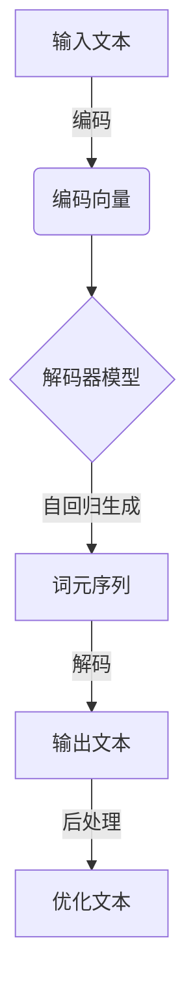
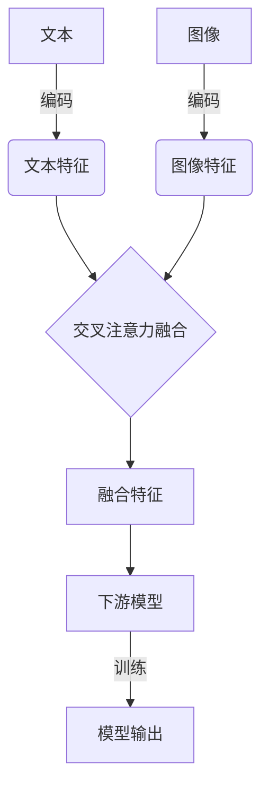

# AIGC从入门到实战：AIGC 带来职场新范式，让 AI 帮你干活，你可以做更多有价值的事

## 1.背景介绍

### 1.1 人工智能时代的到来

人工智能(AI)已经悄然走进了我们的生活,无论是智能手机、智能家居还是无人驾驶汽车,都离不开 AI 的应用。随着计算能力的不断提升和算法的持续优化,AI 技术正在快速发展,给我们的工作和生活带来了翻天覆地的变化。

在这股 AI 浪潮中,AIGC(AI Generated Content,AI 生成内容)技术应运而生,成为了备受瞩目的焦点。AIGC 利用自然语言处理、计算机视觉、知识图谱等 AI 技术,可以自动生成文字、图像、视频、音频等多种形式的内容,大大提高了内容创作的效率。

### 1.2 AIGC的兴起

传统的内容创作过程往往耗时耗力,需要人工进行大量的创作、编辑和优化工作。而 AIGC 技术的出现,为内容创作带来了全新的范式。AIGC 可以根据用户的需求,快速生成高质量的内容,极大地提高了创作效率。

AIGC 技术的发展离不开大规模语料库、强大的计算能力和先进的深度学习算法的支持。近年来,随着算力的不断提升和算法的持续优化,AIGC 技术取得了长足的进步,在多个领域展现出了巨大的潜力。

### 1.3 AIGC的应用前景

AIGC 技术可以广泛应用于多个领域,如新闻写作、营销文案、视频创作、游戏设计等,为这些领域带来了全新的发展机遇。AIGC 不仅可以提高内容创作的效率,还能够帮助创作者突破思维定式,激发创造力。

与此同时,AIGC 技术也带来了一些挑战和争议,如版权问题、内容真实性等。但是,我们有理由相信,随着技术的不断进步和法律法规的完善,这些问题将会得到妥善解决。AIGC 必将为我们的工作和生活带来深远的影响。

## 2.核心概念与联系

### 2.1 AIGC的核心概念

要全面理解 AIGC 技术,我们需要先掌握以下几个核心概念:

1. **自然语言处理(NLP)**:NLP 是 AIGC 的基础技术之一,它能够让计算机理解和生成人类语言。NLP 技术包括词法分析、句法分析、语义分析、文本生成等多个环节。

2. **计算机视觉(CV)**:CV 是另一个 AIGC 的关键技术,它能够让计算机识别和理解图像、视频等视觉信息。CV 技术包括图像分类、目标检测、语义分割等多个任务。

3. **生成对抗网络(GAN)**:GAN 是一种用于生成式建模的深度学习架构,它可以生成逼真的图像、视频等内容。GAN 在 AIGC 中扮演着重要角色。

4. **变分自编码器(VAE)**:VAE 是一种用于生成式建模的深度学习架构,它可以学习数据的潜在分布,并生成新的数据样本。VAE 在 AIGC 中也有广泛应用。

5. **transformer**:transformer 是一种基于注意力机制的深度学习架构,它在 NLP 和 CV 等多个领域取得了卓越的成绩。transformer 是 AIGC 中常用的核心模型。

6. **大型语言模型(LLM)**:LLM 是训练在海量语料库上的大型神经网络模型,它可以生成流畅、连贯的自然语言内容。GPT、BERT 等都是著名的 LLM。

7. **多模态学习**:多模态学习是指同时处理多种形式的数据(如文本、图像、视频等),并捕捉它们之间的关联。多模态学习是 AIGC 的重要研究方向。

### 2.2 AIGC技术的关联

上述这些核心概念并非孤立存在,它们之间存在着紧密的联系:

1. NLP 和 CV 技术为 AIGC 提供了基础能力,如理解语言、识别图像等。

2. GAN、VAE 等生成模型可以基于 NLP 和 CV 技术,生成逼真的文本、图像等内容。

3. transformer 等模型架构可以提升 NLP、CV 等任务的性能,为 AIGC 提供更强大的能力。

4. LLM 可以生成高质量的自然语言内容,是 AIGC 中非常重要的模型。

5. 多模态学习则将上述技术有机结合,实现跨模态的内容理解和生成。

总的来说,AIGC 技术是多种 AI 技术的融合和集成,它们相互促进、相得益彰,共同推动了 AIGC 技术的发展。

## 3.核心算法原理具体操作步骤  

### 3.1 自然语言生成

自然语言生成是 AIGC 中最核心的一个任务,它需要模型根据给定的上下文或提示,生成连贯、流畅的自然语言文本。常见的自然语言生成算法包括:

1. **基于模板的生成**:这是最简单的生成方法,它根据预定义的模板和规则,填充相应的槽位生成文本。这种方法生成的文本质量有限,缺乏多样性。

2. **基于检索的生成**:这种方法从预先构建的语料库中检索与目标文本最相似的片段,并进行拼接和修改,生成新的文本。这种方法的质量取决于语料库的覆盖面。

3. **基于生成式模型的生成**:这是当前主流的生成方法,它利用神经网络模型(如 Seq2Seq、Transformer 等)直接生成目标文本。常见的生成式模型包括 GPT、BART、T5 等。这种方法可以生成质量较高的文本,但也可能出现不连贯、偏差等问题。

生成式模型的基本工作原理如下:

1) 将输入文本(如标题、提示等)编码为向量表示
2) 将编码后的向量输入到解码器模型中
3) 解码器模型根据输入向量和自身的参数,自回归地生成一个个词元(token)
4) 将生成的词元序列解码为最终的文本输出

在实际应用中,我们还需要对生成的文本进行后处理,如去重、纠错、风格转换等,以提高文本质量。



### 3.2 图像生成

图像生成是 AIGC 中另一个重要的任务,它需要模型根据给定的文本描述或语义信息,生成相应的图像。常见的图像生成算法包括:

1. **基于GAN的生成**:生成对抗网络(GAN)是图像生成领域的主流模型,它由一个生成器网络和一个判别器网络组成。生成器网络从随机噪声中生成图像,判别器网络则判断生成的图像是真是假。两个网络相互对抗、相互促进,最终可以生成逼真的图像。

2. **基于VAE的生成**:变分自编码器(VAE)是另一种常用的生成模型,它将输入图像编码为潜在变量的分布,然后从该分布中采样,再解码为输出图像。VAE 生成的图像质量较高,但多样性有限。

3. **基于扩散模型的生成**:扩散模型是近年来兴起的一种生成模型,它通过学习从噪声图像到真实图像的反向过程,实现高质量图像的生成。扩散模型在图像生成领域取得了卓越的成绩。

4. **基于文本-图像模型的生成**:这种方法利用多模态模型(如 DALL-E、Stable Diffusion 等)直接从文本描述生成图像。它将文本和图像信息融合,实现了语义到视觉的直接映射。

以 GAN 为例,其基本工作原理如下:

1) 从噪声分布(如高斯分布)中采样一个随机向量 z
2) 将 z 输入到生成器网络 G 中,生成一个假图像 G(z)
3) 将真实图像和生成的假图像输入到判别器网络 D 中
4) 判别器网络 D 判断输入图像是真是假,并产生一个概率值
5) 根据判别器的输出,更新生成器和判别器的参数,使生成器生成更逼真的图像,判别器判别能力更强

```mermaid
graph LR
    A[噪声向量 z] --> B[生成器 G]
    B --> C[假图像 G(z)]
    D[真实图像] --> E[判别器 D]
    C --> E
    E -->|判别结果| F[更新 G 和 D]
```

### 3.3 多模态融合

多模态融合是 AIGC 中一个重要的研究方向,它旨在将不同模态(如文本、图像、视频等)的信息融合起来,实现跨模态的内容理解和生成。常见的多模态融合算法包括:

1. **早期融合**:将不同模态的数据在底层特征级别进行拼接,然后输入到下游的模型中进行处理。这种方法简单直接,但可能无法充分捕捉模态间的相关性。

2. **晚期融合**:分别对每种模态进行单模态编码,得到各模态的特征表示,然后在更高层级将这些特征进行融合。这种方法可以更好地保留每种模态的特征,但融合过程较为复杂。

3. **交互式融合**:在编码过程中,不同模态的特征通过注意力机制或其他交互方式相互影响和融合。这种方法可以充分捕捉模态间的相关性,是当前主流的融合方式。

4. **基于统一表示的融合**:将不同模态的数据映射到同一个潜在空间的统一表示,然后在该空间中进行建模和推理。这种方法具有很强的泛化能力,但需要大量的数据和计算资源。

以交互式融合为例,其基本工作流程如下:

1) 对每种模态(如文本、图像)分别进行编码,得到模态特征
2) 通过交叉注意力机制,将不同模态的特征进行融合
3) 将融合后的特征输入到下游的模型(如解码器)中
4) 根据任务目标(如文本生成、图像分类等)对模型进行训练



通过上述多模态融合算法,AIGC 模型可以同时处理和生成多种形式的内容,实现跨模态的内容理解和生成,为 AIGC 技术带来了无限的可能性。

## 4.数学模型和公式详细讲解举例说明

### 4.1 自然语言生成的数学模型

自然语言生成任务可以形式化为一个条件概率模型,即给定输入 X,我们需要生成使条件概率 P(Y|X) 最大的输出序列 Y。

在基于序列的生成模型(如 Seq2Seq、Transformer 等)中,上述条件概率可以进一步分解为:

$$P(Y|X) = \prod_{t=1}^{T}P(y_t|y_{<t}, X)$$

其中,T 是输出序列的长度,y_t 是第 t 个词元,y_{<t} 表示前 t-1 个词元的序列。

生成模型的目标是最大化上述条件概率,也就是最大化每个词元的条件概率的乘积。在训练过程中,我们通常最小化该条件概率的负对数似然作为损失函数:

$$\mathcal{L} = -\sum_{t=1}^{T}\log P(y_t|y_{<t}, X)$$

对于基于 Transformer 的生成模型,每个词元的条件概率计算如下:

$$P(y_t|y_{<t}, X) = \mathrm{softmax}(h