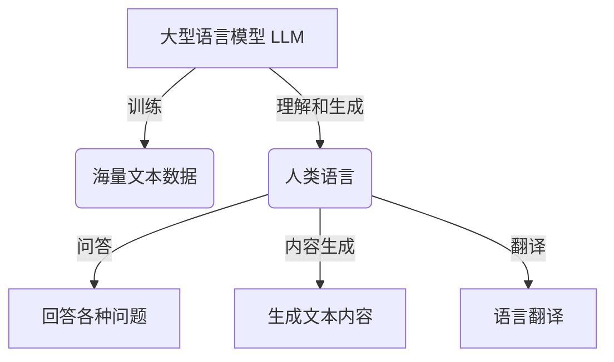
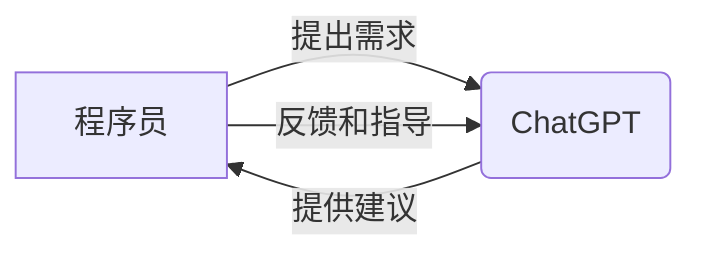
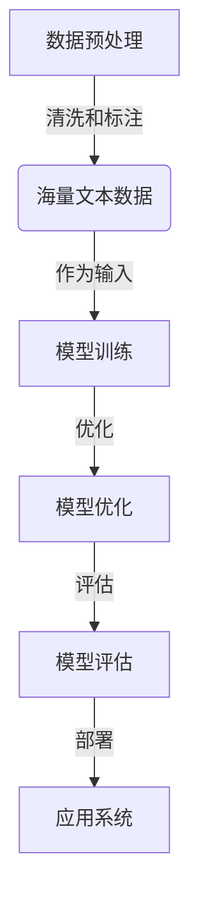

# AIGC从入门到实战：ChatGPT 提升程序员编写代码和设计算法的效率

## 1.背景介绍

### 1.1 人工智能时代的到来

随着人工智能(AI)和大型语言模型(LLM)的不断发展,我们正处于一个前所未有的技术变革时期。传统的编程方式正在被颠覆,而人工智能将为程序员带来全新的工作体验和生产力提升。其中,ChatGPT作为一款先进的对话式AI助手,凭借其强大的自然语言处理能力和广博的知识库,正在改变着程序员编写代码和设计算法的方式。

### 1.2 编程效率的挑战

作为程序员,我们经常面临着各种挑战,例如:

- 编写高质量、可维护的代码
- 快速理解和应用新技术
- 优化算法性能
- 调试和修复代码缺陷

这些挑战不仅需要扎实的编程基础,还需要持续学习和实践。传统的编程方式往往效率低下,容易产生错误和漏洞。

### 1.3 ChatGPT的机遇

ChatGPT作为一款先进的AI助手,可以帮助程序员提高工作效率,减轻工作负担。它不仅能够生成代码片段、解释编程概念,还能优化算法、分析代码缺陷等。通过与ChatGPT的交互,程序员可以快速获取所需的信息和解决方案,从而提高开发效率和代码质量。

## 2.核心概念与联系

### 2.1 大型语言模型(LLM)

ChatGPT是基于大型语言模型(LLM)构建的。LLM是一种利用海量文本数据训练而成的深度神经网络模型,能够理解和生成人类语言。它具有广博的知识库,可以回答各种问题、生成文本内容、翻译语言等。



### 2.2 自然语言处理(NLP)

自然语言处理(NLP)是人工智能的一个重要分支,旨在使计算机能够理解和生成人类语言。ChatGPT利用了NLP技术,能够准确理解用户的自然语言输入,并生成相应的自然语言输出。


### 2.3 人机协作

ChatGPT并非旨在取代程序员,而是作为一种辅助工具,与程序员形成人机协作关系。程序员可以利用ChatGPT快速获取所需信息、生成代码框架、优化算法等,从而提高工作效率。同时,ChatGPT也需要程序员的指导和反馈,不断优化和完善自身能力。



## 3.核心算法原理具体操作步骤

### 3.1 语言模型的训练

ChatGPT是基于大型语言模型(LLM)训练而成的。LLM的训练过程包括以下几个关键步骤:

1. **数据预处理**: 收集海量的文本数据,如书籍、网页、论文等,并进行清洗和标注。

2. **模型架构选择**: 选择合适的神经网络架构,如Transformer、BERT等,作为语言模型的基础。

3. **模型训练**: 利用预处理后的文本数据,对选定的神经网络模型进行训练,使其能够学习到语言的模式和规律。

4. **模型优化**: 通过调整超参数、数据增强等方法,不断优化模型的性能。

5. **模型评估**: 在保留数据集上评估模型的性能,如语言生成质量、问答准确率等。

6. **模型部署**: 将训练好的模型部署到实际的应用系统中,为用户提供服务。



### 3.2 自然语言处理算法

ChatGPT利用了多种自然语言处理(NLP)算法,以实现对自然语言的理解和生成。以下是一些常用的NLP算法:

1. **词向量表示**: 将单词映射到向量空间,使语义相似的单词在向量空间中距离较近,如Word2Vec、GloVe等。

2. **序列标注**: 对文本序列进行标注,如命名实体识别、词性标注等,常用算法有HMM、LSTM-CRF等。

3. **句法分析**: 分析句子的句法结构,构建句法树,常用算法有移位归约Parser、PCFG Parser等。

4. **语义分析**: 理解文本的语义含义,包括词义消歧、关系抽取、情感分析等,常用算法有知识图谱、注意力机制等。

5. **文本生成**: 根据上下文生成连贯的文本,常用算法有序列到序列模型(Seq2Seq)、GPT等。

ChatGPT综合运用了上述多种NLP算法,实现了对自然语言的深度理解和高质量生成。


## 4.数学模型和公式详细讲解举例说明

### 4.1 Transformer模型

Transformer是一种广泛应用于自然语言处理任务的序列到序列(Seq2Seq)模型。它的核心是自注意力(Self-Attention)机制,能够捕捉输入序列中任意两个位置之间的依赖关系。

Transformer的自注意力机制可以用以下公式表示:

$$\text{Attention}(Q, K, V) = \text{softmax}\left(\frac{QK^T}{\sqrt{d_k}}\right)V$$

其中:

- $Q$是查询(Query)向量
- $K$是键(Key)向量
- $V$是值(Value)向量
- $d_k$是缩放因子,用于防止内积过大导致梯度消失

自注意力机制的计算过程如下:

1. 计算查询$Q$与所有键$K$的点积,得到未缩放的分数向量
2. 对分数向量进行缩放,得到缩放后的分数向量
3. 对缩放后的分数向量执行softmax操作,得到注意力权重向量
4. 将注意力权重向量与值向量$V$相乘,得到加权和作为注意力输出

通过多头自注意力(Multi-Head Attention)和位置编码(Positional Encoding),Transformer能够有效地捕捉长距离依赖关系,并保持输入序列的位置信息。

### 4.2 BERT模型

BERT(Bidirectional Encoder Representations from Transformers)是一种基于Transformer的双向编码器模型,在自然语言理解任务上表现出色。它通过掩码语言模型(Masked Language Model)和下一句预测(Next Sentence Prediction)两个预训练任务,学习到了深层次的语义表示。

BERT的掩码语言模型可以用以下公式表示:

$$\mathcal{L}_\text{MLM} = -\sum_{i=1}^{n} \log P(x_i^\text{masked}|x_1, \dots, x_{i-1}, x_{i+1}, \dots, x_n)$$

其中:

- $x_1, \dots, x_n$是输入序列
- $x_i^\text{masked}$是被掩码的词
- $P(x_i^\text{masked}|x_1, \dots, x_{i-1}, x_{i+1}, \dots, x_n)$是根据上下文预测被掩码词的概率

通过最小化掩码语言模型的损失函数$\mathcal{L}_\text{MLM}$,BERT能够学习到深层次的双向语义表示,从而在各种自然语言理解任务上取得卓越表现。

## 5.项目实践:代码实例和详细解释说明

### 5.1 利用ChatGPT生成代码框架

作为程序员,我们经常需要编写各种功能的代码。ChatGPT可以根据我们的需求,快速生成代码框架,节省了大量时间。以下是一个示例:

**需求**: 编写一个Python函数,计算两个矩阵的乘积。

**输入**:

```
请为我生成一个Python函数,用于计算两个矩阵的乘积。
```

**ChatGPT输出**:

```python
def multiply_matrices(matrix1, matrix2):
    """
    计算两个矩阵的乘积
    
    参数:
    matrix1 (list): 第一个矩阵,表示为嵌套列表
    matrix2 (list): 第二个矩阵,表示为嵌套列表
    
    返回:
    result (list): 两个矩阵的乘积,表示为嵌套列表
    """
    
    # 检查矩阵维度是否匹配
    rows_A = len(matrix1)
    cols_A = len(matrix1[0])
    rows_B = len(matrix2)
    cols_B = len(matrix2[0])
    
    if cols_A != rows_B:
        raise ValueError("矩阵维度不匹配,无法相乘")
    
    # 初始化结果矩阵
    result = [[0 for j in range(cols_B)] for i in range(rows_A)]
    
    # 计算矩阵乘积
    for i in range(rows_A):
        for j in range(cols_B):
            for k in range(cols_A):
                result[i][j] += matrix1[i][k] * matrix2[k][j]
    
    return result
```

在这个示例中,ChatGPT生成了一个完整的Python函数,包括函数注释、参数检查、初始化结果矩阵和计算矩阵乘积的核心逻辑。我们只需要根据需求提供简单的描述,就能快速获取可用的代码框架,大大提高了编码效率。

### 5.2 利用ChatGPT优化算法

除了生成代码框架,ChatGPT还可以帮助我们优化算法,提高代码性能。以下是一个示例:

**需求**: 优化矩阵乘法算法,提高计算效率。

**输入**:

```
我有一个Python函数用于计算两个矩阵的乘积,但是在处理大型矩阵时效率较低。请帮我优化这个算法,提高计算效率。
```

**ChatGPT输出**:

```python
def multiply_matrices(matrix1, matrix2):
    """
    计算两个矩阵的乘积(优化版本)
    
    参数:
    matrix1 (list): 第一个矩阵,表示为嵌套列表
    matrix2 (list): 第二个矩阵,表示为嵌套列表
    
    返回:
    result (list): 两个矩阵的乘积,表示为嵌套列表
    """
    
    # 检查矩阵维度是否匹配
    rows_A = len(matrix1)
    cols_A = len(matrix1[0])
    rows_B = len(matrix2)
    cols_B = len(matrix2[0])
    
    if cols_A != rows_B:
        raise ValueError("矩阵维度不匹配,无法相乘")
    
    # 初始化结果矩阵
    result = [[0 for j in range(cols_B)] for i in range(rows_A)]
    
    # 优化: 使用NumPy库加速计算
    import numpy as np
    
    matrix1 = np.array(matrix1)
    matrix2 = np.array(matrix2)
    result = np.matmul(matrix1, matrix2).tolist()
    
    return result
```

在这个优化版本中,ChatGPT建议使用NumPy库进行矩阵乘法计算,因为NumPy的底层实现是用高效的C语言编写的,能够大幅提高矩阵运算的性能。通过简单的修改,我们就能获得一个更高效的算法实现。

### 5.3 利用ChatGPT解释代码

作为程序员,我们经常需要阅读和理解他人编写的代码。ChatGPT可以帮助我们快速理解代码的功能和实现逻辑,提高代码可读性。以下是一个示例:

**需求**: 解释一段Python代码的功