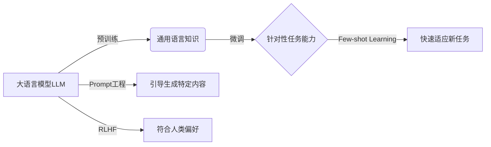
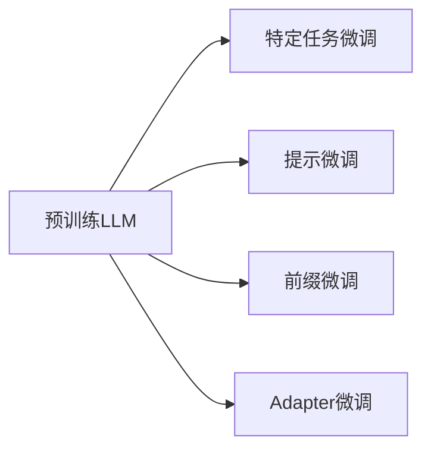

# AIGC从入门到实战：ChatGPT 是新一代的人机交互"操作系统"

## 1. 背景介绍

### 1.1 人工智能发展历程

人工智能(Artificial Intelligence, AI)是计算机科学的一个分支,它致力于研究如何让计算机模拟人类的智能行为。AI的发展历程可以追溯到1950年图灵提出的"图灵测试",之后经历了几次起起伏伏。近年来,得益于大数据、算力提升和深度学习算法的突破,AI迎来了新的春天,在计算机视觉、自然语言处理、语音识别等领域取得了巨大进展。

### 1.2 AIGC的兴起

AIGC(AI Generated Content)是人工智能生成内容的简称,它利用AI技术自动生成文本、图像、音频、视频等多媒体内容。AIGC的兴起源于近年来生成式AI模型的重大突破,尤其是以DALL-E、Stable Diffusion、Midjourney为代表的文本-图像生成模型,以及以GPT-3、PaLM、ChatGPT为代表的大语言模型。这些模型展现了AI在内容创作领域的巨大潜力,引发了业界的广泛关注。

### 1.3 ChatGPT的问世

ChatGPT是由OpenAI开发的一个大型语言模型,于2022年11月30日发布。它基于GPT-3.5架构,经过了大量高质量对话数据的训练,具备了惊人的对话交互和内容生成能力。ChatGPT一经推出就在全球掀起了AI热潮,短短5天用户数就突破了100万。它不仅能够流畅地进行多轮对话,还能根据用户的输入自动生成文章、诗歌、代码等多种内容,展现了通用人工智能的雏形。ChatGPT的问世标志着AIGC进入了一个新的里程碑。

## 2. 核心概念与联系

### 2.1 大语言模型(LLM)

大语言模型是AIGC的核心,它指的是在海量文本语料上训练的神经网络模型,通过自监督学习掌握了语言的统计规律和生成规则。当前主流的LLM都采用Transformer架构,如GPT系列、BERT系列、T5等。LLM具有强大的语义理解和语言生成能力,是实现AIGC的基础。

### 2.2 预训练与微调(Pre-training & Fine-tuning) 

预训练是指在大规模无标注语料上进行自监督学习,让模型学习通用的语言知识。微调是在预训练的基础上,用少量特定领域的标注数据对模型进行针对性训练,使其适应特定任务。这种"预训练+微调"的范式极大地提升了LLM的性能和泛化能力,使得AIGC模型可以快速适应不同的应用场景。

### 2.3 Few-shot Learning

Few-shot learning指的是模型在很少示例的情况下就能快速学习新任务的能力。得益于海量知识的积累,高能力的LLM展现出了惊人的few-shot learning能力。比如GPT-3只需要给出少数几个例子,就能在新任务上取得不错的效果。这使得AIGC模型可以灵活地应对各种应用需求,大大降低了开发和使用门槛。

### 2.4 Prompt工程(Prompt Engineering)

Prompt是指输入给LLM的文本序列,可以是指令、问题、例子等。设计优质的Prompt可以有效引导LLM生成我们期望的内容,这就是Prompt工程。ChatGPT使用了一种称为InstructGPT的技术,通过海量高质量的指令数据微调GPT模型,使其更加擅长理解和执行用户指令。精心设计Prompt是充分发挥AIGC能力的关键。

### 2.5 RLHF(Reinforcement Learning from Human Feedback) 

RLHF是一种利用人类反馈来优化LLM的技术。具体做法是:人类对LLM生成的内容进行打分和排序,把结果作为奖励信号,用强化学习的方法微调模型,使其生成更加符合人类偏好的内容。RLHF可以有效改善LLM的安全性和可控性,是打造高质量AIGC系统的重要手段。据悉ChatGPT也采用了这一技术。

以下是这些概念之间的联系:

## 3. 核心算法原理与操作步骤

### 3.1 Transformer 架构

Transformer是大语言模型的核心架构,它抛弃了此前主流的RNN/LSTM结构,完全依赖注意力机制(Attention)来学习文本的上下文信息。具体来说,Transformer由编码器(Encoder)和解码器(Decoder)组成,编码器用于对输入文本进行特征提取,解码器根据编码器的输出和之前的生成结果,预测下一个单词的概率分布。

Transformer的核心是自注意力机制(Self-Attention),它可以计算文本中不同位置之间的关联度,捕捉长距离依赖。计算过程如下:

1. 将输入文本X映射为三个矩阵:Q(Query)、K(Key)、V(Value)
2. 计算Q与K的点积,得到注意力分数矩阵 $A=softmax(\frac{QK^T}{\sqrt{d_k}})$
3. 用A与V相乘,得到加权求和的结果 $Attention(Q,K,V)=AV$
4. 通过多头注意力(Multi-head Attention)增强特征提取能力

Transformer还引入了位置编码(Positional Encoding)来表示单词的顺序信息,残差连接和Layer Normalization来加速训练。

### 3.2 预训练目标与损失函数

大语言模型的预训练通常采用自回归的方式,即根据前面的单词预测下一个单词。给定一个长度为T的文本序列 $X=(x_1,x_2,...,x_T)$,语言模型的目标是最大化条件概率:

$$P(X)=\prod_{t=1}^T P(x_t|x_{<t})$$

其中 $x_{<t}$ 表示 $x_t$ 之前的所有单词。预训练时使用极大似然估计,最小化负对数似然损失:

$$L(\theta)=-\frac{1}{T}\sum_{t=1}^T \log P(x_t|x_{<t};\theta)$$

其中 $\theta$ 是模型参数。除了传统的语言模型外,还有一些变体如去噪自编码器(Denoising Autoencoder)和排列语言模型(Permutation Language Model),它们通过引入噪声或打乱词序,让模型学到更加鲁棒的特征。

### 3.3 微调方法

在预训练的基础上,我们可以用特定领域的标注数据对模型进行微调,使其适应下游任务。常见的微调方法有:

1. 特定任务微调(Task-specific Fine-tuning):在预训练模型的基础上添加特定任务的输出层,端到端地微调所有参数。
2. 提示微调(Prompt-tuning):固定预训练模型的参数,只微调输入提示模板中的少量可学习参数。
3. 前缀微调(Prefix-tuning):在每个Transformer块前添加可学习的前缀向量,只微调这些前缀参数。
4. Adapter微调:在Transformer块之间插入轻量级的Adapter模块,只微调Adapter参数。

不同的微调方法在参数效率和性能之间进行了不同的权衡。下图展示了这些方法的示意:

### 3.4 RLHF算法步骤

RLHF通过人类反馈来优化语言模型,主要分为三个步骤:

1. 监督微调(Supervised Fine-tuning):用人工标注的高质量指令数据对LLM进行微调,提高模型执行指令的能力。
2. 奖励模型训练(Reward Model Training):收集人类对LLM输出的偏好反馈,训练一个奖励模型来预测人类的偏好分数。
3. 基于人类反馈的强化学习(RL Training):用PPO算法优化语言模型的策略,以最大化奖励模型给出的分数。策略梯度的计算公式为:

$$g=\mathbb{E}_{s,a\sim\pi_\theta}[\nabla_\theta\log\pi_\theta(a|s)A(s,a)]$$

其中 $\pi_\theta$ 是语言模型的策略, $A(s,a)$ 是优势函数,表示当前动作相对于平均而言有多好。

通过RLHF,我们可以让语言模型生成更加安全、可控、符合人类偏好的内容。

## 4. 数学模型与公式详解

### 4.1 Transformer的数学描述

Transformer的核心是自注意力机制和前馈神经网络,可以用数学公式来精确描述。设输入文本的嵌入表示为 $X\in\mathbb{R}^{n\times d}$,其中n是序列长度,d是嵌入维度。自注意力的计算过程为:

$$
\begin{aligned}
Q &= XW_Q, K= XW_K, V= XW_V \\
A &= \text{softmax}(\frac{QK^T}{\sqrt{d_k}}) \\
\text{Attention}(Q,K,V) &= AV
\end{aligned}
$$

其中 $W_Q,W_K,W_V\in\mathbb{R}^{d\times d_k}$ 是可学习的投影矩阵,$d_k$是缩放因子。多头注意力将上述过程独立执行h次,然后拼接结果并线性变换:

$$
\begin{aligned}
\text{MultiHead}(X) &= \text{Concat}(\text{head}_1,...,\text{head}_h)W^O \\
\text{head}_i &= \text{Attention}(XW_i^Q, XW_i^K, XW_i^V)
\end{aligned}
$$

其中 $W_i^Q,W_i^K,W_i^V\in\mathbb{R}^{d\times d_k}, W^O\in\mathbb{R}^{hd_k\times d}$。

自注意力的结果会通过残差连接和Layer Normalization,然后输入前馈神经网络:

$$
\begin{aligned}
X' &= \text{LayerNorm}(X + \text{MultiHead}(X)) \\
\text{FFN}(X') &= \text{ReLU}(X'W_1 + b_1)W_2 + b_2 \\
Y &= \text{LayerNorm}(X' + \text{FFN}(X'))
\end{aligned}
$$

其中 $W_1\in\mathbb{R}^{d\times d_{ff}}, b_1\in\mathbb{R}^{d_{ff}}, W_2\in\mathbb{R}^{d_{ff}\times d}, b_2\in\mathbb{R}^d$。

以上就是Transformer单层的前向计算过程,通过堆叠N层Transformer块,我们可以建立强大的大语言模型。

### 4.2 语言模型的概率解释

从概率的角度看,语言模型的目标是学习单词序列的联合概率分布 $P(x_1,x_2,...,x_T)$。根据概率链式法则,这个联合概率可以分解为:

$$P(x_1,x_2,...,x_T)=\prod_{t=1}^T P(x_t|x_1,...,x_{t-1})$$

语言模型通过神经网络 $f_\theta$ 来参数化这个条件概率:

$$P(x_t|x_1,...,x_{t-1}) = \text{softmax}(f_\theta(x_1,...,x_{t-1}))$$

其中softmax函数将神经网络的输出转化为单词的概率分布。

训练语言模型时,我们最小化负对数似然损失,即最大化真实单词序列的对数概率:

$$L(\theta)=-\frac{1}{T}\sum_{t=1}^T \log P(x_t|x_1,...,x_{t-1};\theta)$$

这等价于最小化真实分布与模型分布之间的交叉熵。训练时采用随机梯度下降法,根据损失函数对参数求梯度并更新:

$$\theta \leftarrow \theta - \alpha \nabla_\theta L(\theta)$$

其中 $\alpha$ 是学习率。通过不断迭代优化,语言模型