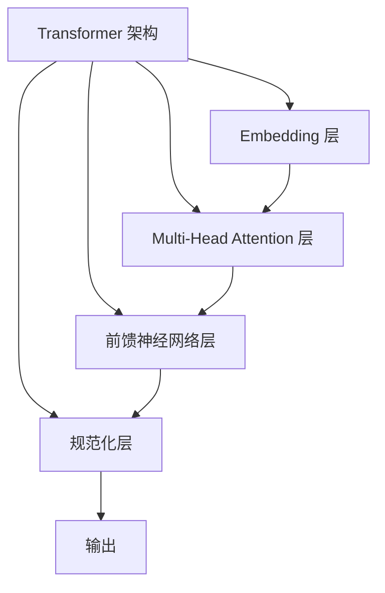

# AIGC从入门到实战：ChatGPT 简介：从 GPT-1 到 GPT-4 的发展历程和应用领域

## 1. 背景介绍

### 1.1 人工智能的崛起

人工智能(AI)是当代科技发展的重要驱动力,其应用已经渗透到我们生活的方方面面。随着算力的不断提升和数据的快速积累,AI技术正在经历飞速发展,尤其是在自然语言处理(NLP)领域取得了令人瞩目的进展。

### 1.2 GPT 模型的重要性

在NLP领域,GPT(Generative Pre-trained Transformer)模型因其强大的语言生成能力而备受关注。GPT是一种基于transformer架构的大型语言模型,通过在海量语料上进行预训练,能够捕捉丰富的语义和上下文信息,从而实现高质量的文本生成。

### 1.3 ChatGPT 的崛起

2022年11月,OpenAI推出了ChatGPT,这是一款基于GPT-3.5架构的对话式AI助手。ChatGPT展现出了令人惊叹的语言理解和生成能力,能够通过自然语言与人类进行多轮对话,回答各种复杂问题,甚至协助编写代码和创作文本。它的出现引发了科技界和大众对AI的广泛关注和热议。

## 2. 核心概念与联系

### 2.1 Transformer 架构

Transformer是一种全新的基于注意力机制(Attention Mechanism)的序列到序列(Seq2Seq)模型,它摒弃了传统RNN/LSTM结构,使用多头自注意力(Multi-Head Attention)层和前馈神经网络(Feed-Forward Neural Network)层构建了一种全新的网络架构。



### 2.2 自注意力机制

自注意力机制是Transformer架构的核心,它允许模型在计算目标序列的每个位置时,关注整个输入序列中的所有位置。这种长程依赖性捕获能力使得Transformer能够更好地建模长距离上下文信息。

### 2.3 语言模型(Language Model)

语言模型是NLP领域的基础技术,旨在学习语言的概率分布,即给定前文,预测下一个词的概率。GPT模型属于生成式语言模型,可以根据给定的上下文生成连贯、流畅的文本。

### 2.4 预训练与微调(Pre-training & Fine-tuning)

GPT模型采用了预训练与微调的范式。首先在大规模语料上进行无监督预训练,获得通用的语言表示能力;然后针对特定任务(如机器翻译、问答等)进行有监督微调,使模型适应任务需求。

## 3. 核心算法原理具体操作步骤

### 3.1 Transformer 模型训练

1. **输入表示**:将输入序列(文本)转换为词嵌入向量序列。
2. **位置编码**:为每个词嵌入向量添加位置信息,以保留序列顺序。
3. **多头自注意力**:计算每个位置与其他位置的注意力权重,捕捉长程依赖关系。
4. **前馈神经网络**:对注意力输出进行非线性变换,提取高阶特征。
5. **规范化**:对每层的输出进行归一化,加速训练收敛。
6. **损失函数**:通常采用交叉熵损失函数,最小化预测与真实标签之间的差异。
7. **反向传播**:根据损失函数梯度,更新模型参数。

### 3.2 GPT 模型预训练

1. **语料构建**:收集大量高质量文本数据,如网页、书籍、维基百科等。
2. **数据预处理**:进行文本清洗、标记化、构建字典等预处理。
3. **模型初始化**:初始化Transformer模型参数。
4. **无监督预训练**:在海量语料上训练模型,目标是最大化下一个词的预测概率。
5. **模型存储**:将预训练好的模型参数保存,作为后续任务的初始化。

### 3.3 GPT 模型微调

1. **任务数据准备**:收集与目标任务相关的数据,如问答对、机器翻译语料等。
2. **数据预处理**:对任务数据进行必要的预处理,如标记化、填充等。
3. **加载预训练模型**:加载预训练好的GPT模型参数。
4. **有监督微调**:在任务数据上对模型进行有监督微调,优化任务相关的损失函数。
5. **模型评估**:在验证集上评估模型性能,根据需要进行超参数调整。
6. **模型部署**:将微调后的模型部署到生产环境,服务于实际应用。

## 4. 数学模型和公式详细讲解举例说明

### 4.1 Transformer 模型

Transformer模型的核心是自注意力机制,它能够捕捉输入序列中任意两个位置之间的依赖关系。给定一个长度为 $n$ 的输入序列 $X = (x_1, x_2, \dots, x_n)$,自注意力机制计算每个位置 $i$ 与其他所有位置 $j$ 的注意力权重 $\alpha_{ij}$,并根据这些权重对应的值进行加权求和,得到位置 $i$ 的注意力表示 $z_i$:

$$z_i = \sum_{j=1}^n \alpha_{ij} (Wx_j)$$

其中,注意力权重 $\alpha_{ij}$ 通过以下公式计算:

$$\alpha_{ij} = \frac{e^{s_{ij}}}{\sum_{k=1}^n e^{s_{ik}}}$$

$$s_{ij} = f(Wx_i, Wx_j)$$

$f$ 是一个评分函数,用于衡量位置 $i$ 和位置 $j$ 之间的相关性。常见的评分函数包括点积评分函数和缩放点积评分函数:

$$f(x_i, x_j) = x_i^T x_j \quad \text{(点积评分函数)}$$

$$f(x_i, x_j) = \frac{x_i^T x_j}{\sqrt{d}} \quad \text{(缩放点积评分函数)}$$

其中 $d$ 是输入向量的维度,用于缓解较大向量维度时的梯度消失问题。

多头自注意力机制是将多个注意力头的输出进行拼接,以捕捉不同的依赖关系模式:

$$\text{MultiHead}(X) = \text{Concat}(z_1, z_2, \dots, z_h)W^O$$

$$z_i = \text{Attention}(XW_i^Q, XW_i^K, XW_i^V)$$

其中 $h$ 是注意力头的数量,每个注意力头都有独立的权重矩阵 $W_i^Q$、$W_i^K$ 和 $W_i^V$,用于计算查询(Query)、键(Key)和值(Value)向量。

### 4.2 GPT 模型

GPT 模型采用了自回归(Auto-Regressive)语言模型,即给定前文 $x_{<t}$,预测下一个词 $x_t$ 的条件概率:

$$P(x_t | x_{<t}) = \text{GPT}(x_{<t})$$

GPT 模型的目标是最大化语料库中所有序列的联合概率:

$$\max_\theta \sum_{x \in \mathcal{D}} \log P_\theta(x) = \max_\theta \sum_{x \in \mathcal{D}} \sum_{t=1}^{|x|} \log P_\theta(x_t | x_{<t})$$

其中 $\theta$ 表示模型参数,$\mathcal{D}$ 是训练语料库。

在实际训练中,通常采用掩码语言模型(Masked Language Model)的方式,即在输入序列中随机掩码一部分词,让模型预测被掩码的词。这种方式可以提高模型的鲁棒性,并加速训练过程。

## 5. 项目实践:代码实例和详细解释说明

以下是使用 PyTorch 实现 Transformer 模型的简化代码示例,仅包含核心部分:

```python
import torch
import torch.nn as nn

class MultiHeadAttention(nn.Module):
    def __init__(self, d_model, num_heads):
        super().__init__()
        self.num_heads = num_heads
        self.d_model = d_model
        self.d_k = d_model // num_heads
        self.W_q = nn.Linear(d_model, d_model)
        self.W_k = nn.Linear(d_model, d_model)
        self.W_v = nn.Linear(d_model, d_model)
        self.W_o = nn.Linear(d_model, d_model)

    def forward(self, x, mask=None):
        q = self.W_q(x)
        k = self.W_k(x)
        v = self.W_v(x)
        q = q.view(x.size(0), -1, self.num_heads, self.d_k).transpose(1, 2)
        k = k.view(x.size(0), -1, self.num_heads, self.d_k).transpose(1, 2)
        v = v.view(x.size(0), -1, self.num_heads, self.d_k).transpose(1, 2)
        scores = torch.matmul(q, k.transpose(-2, -1)) / math.sqrt(self.d_k)
        if mask is not None:
            scores = scores.masked_fill(mask == 0, -1e9)
        attn = nn.Softmax(dim=-1)(scores)
        out = torch.matmul(attn, v).transpose(1, 2).contiguous().view(x.size(0), -1, self.d_model)
        out = self.W_o(out)
        return out

class FeedForward(nn.Module):
    def __init__(self, d_model, d_ff):
        super().__init__()
        self.linear1 = nn.Linear(d_model, d_ff)
        self.linear2 = nn.Linear(d_ff, d_model)
        self.relu = nn.ReLU()

    def forward(self, x):
        x = self.linear1(x)
        x = self.relu(x)
        x = self.linear2(x)
        return x

class TransformerBlock(nn.Module):
    def __init__(self, d_model, num_heads, d_ff):
        super().__init__()
        self.attn = MultiHeadAttention(d_model, num_heads)
        self.ff = FeedForward(d_model, d_ff)
        self.norm1 = nn.LayerNorm(d_model)
        self.norm2 = nn.LayerNorm(d_model)

    def forward(self, x, mask=None):
        x_norm = self.norm1(x)
        attn_out = self.attn(x_norm, mask)
        x = x + attn_out
        x_norm = self.norm2(x)
        ff_out = self.ff(x_norm)
        x = x + ff_out
        return x

class TransformerModel(nn.Module):
    def __init__(self, num_layers, d_model, num_heads, d_ff, vocab_size):
        super().__init__()
        self.embed = nn.Embedding(vocab_size, d_model)
        self.pos_enc = PositionalEncoding(d_model)
        self.layers = nn.ModuleList([TransformerBlock(d_model, num_heads, d_ff) for _ in range(num_layers)])
        self.out = nn.Linear(d_model, vocab_size)

    def forward(self, x, mask=None):
        x = self.embed(x)
        x = self.pos_enc(x)
        for layer in self.layers:
            x = layer(x, mask)
        x = self.out(x)
        return x
```

上述代码实现了 Transformer 模型的核心组件,包括多头自注意力机制、前馈神经网络层和位置编码。以下是对关键部分的解释:

1. `MultiHeadAttention` 类实现了多头自注意力机制。它将输入 `x` 分别通过线性层 `W_q`、`W_k` 和 `W_v` 得到查询(Query)、键(Key)和值(Value)向量,然后计算注意力权重,并根据权重对值向量进行加权求和,得到注意力输出。

2. `FeedForward` 类实现了前馈神经网络层,包含两个线性层和一个 ReLU 激活函数。

3. `TransformerBlock` 类将多头自注意力和前馈神经网络层组合在一起,并使用残差连接和层归一化进行优化。

4. `TransformerModel` 类构建了完整的 Transformer 模型。它首先将输入词序列 `x` 通过嵌入层和位置编码层,然后依次通过多个 `TransformerBlock`,最后通过线性层输出预测结果。

在实际应用中,我们可以使用上述代码构建语言模型、机器翻