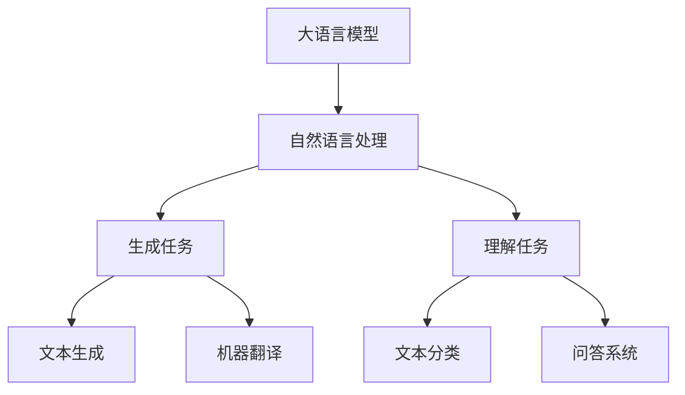
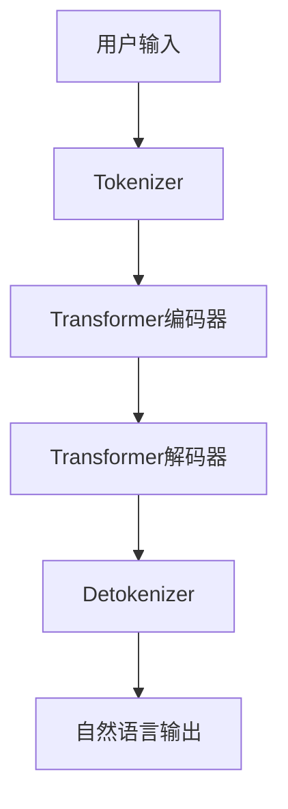

# AIGC从入门到实战：利用 ChatGPT 分析和跟踪算法代码，让它帮你探路

## 1.背景介绍

### 1.1 人工智能时代的到来

人工智能(Artificial Intelligence, AI)已经成为当今科技发展的核心驱动力,它正在深刻地改变着我们的生活、工作和思维方式。随着算力的不断提升和算法的日益复杂,AI系统的性能不断突破,展现出令人惊叹的能力。其中,大语言模型(Large Language Model, LLM)是AI发展的重要里程碑,尤其是ChatGPT的出现,让人工智能真正走进了千家万户。

### 1.2 AIGC的兴起

AIGC(AI Generated Content)是指利用人工智能技术生成的内容,包括文字、图像、视频、音频等多种形式。随着大语言模型等AI技术的不断进步,AIGC已经开始在多个领域发挥重要作用,如内容创作、辅助编程、问答系统等。ChatGPT就是一个典型的AIGC应用,它可以根据用户的提示生成高质量的自然语言内容。

### 1.3 AIGC在编程领域的应用

编程是一项高度智力密集型的工作,需要程序员具备扎实的理论知识和丰富的实践经验。传统的编程方式存在诸多痛点,如重复性工作占用大量时间、调试过程冗长乏味、文档维护成本高等。AIGC技术在编程领域的应用,可以帮助程序员提高工作效率,减轻工作负担,提升代码质量,从而推动软件开发的革新。

## 2.核心概念与联系

### 2.1 大语言模型(LLM)

大语言模型是AIGC技术的核心,它通过在海量自然语言数据上进行训练,学习人类语言的语法、语义和上下文关系,从而获得生成自然语言内容的能力。常见的大语言模型包括GPT(Generative Pre-trained Transformer)、BERT(Bidirectional Encoder Representations from Transformers)、XLNet等。

### 2.2 AIGC在编程中的应用场景

AIGC技术在编程领域的应用场景主要包括:

1. **代码生成**: 根据用户提供的需求描述或伪代码,生成对应的代码实现。
2. **代码解释**: 解释代码的功能、逻辑和实现细节,帮助程序员理解代码。
3. **代码优化**: 分析代码的性能瓶颈和潜在问题,提供优化建议。
4. **代码补全**: 根据上下文自动补全代码片段,提高编码效率。
5. **文档生成**: 自动生成代码注释、API文档等,降低文档维护成本。
6. **问答系统**: 回答与编程相关的问题,提供技术支持和解决方案。

### 2.3 ChatGPT在编程中的应用

作为一种通用的大语言模型,ChatGPT具备强大的自然语言处理能力,可以在编程领域发挥重要作用。它不仅能够生成代码、解释代码逻辑,还可以回答编程相关的问题,提供技术支持和指导。与传统的编程工具相比,ChatGPT具有以下优势:

1. **交互性强**: 用户可以与ChatGPT进行自然语言对话,提出需求或问题,获得及时的反馈和解决方案。
2. **知识广博**: ChatGPT经过了大规模的预训练,拥有丰富的编程知识和经验,可以涵盖多种编程语言和技术领域。
3. **持续学习**: ChatGPT具有自我学习和迁移学习的能力,可以根据用户的反馈不断优化和完善自身的知识库。
4. **高效便捷**: 与传统的编程工具相比,ChatGPT可以快速生成代码或提供解决方案,提高开发效率。

## 3.核心算法原理具体操作步骤

### 3.1 大语言模型的训练过程

大语言模型的训练过程主要包括以下几个步骤:

1. **数据预处理**: 收集和清洗海量的自然语言数据,如书籍、网页、论文等,构建训练数据集。

2. **标记化(Tokenization)**: 将文本数据转换为模型可以理解的token序列,通常采用字级或子词级标记化方式。

3. **模型架构选择**: 选择合适的模型架构,如Transformer、BERT、GPT等,并根据任务需求进行适当的修改和优化。

4. **预训练(Pre-training)**: 在大规模无监督数据上进行预训练,让模型学习自然语言的语法、语义和上下文关系。常用的预训练目标包括掩码语言模型(Masked Language Modeling)和下一句预测(Next Sentence Prediction)等。

5. **微调(Fine-tuning)**: 在特定任务的标注数据上进行微调,使模型适应具体的应用场景,如文本生成、机器翻译、问答系统等。

6. **模型评估**: 使用标准的评估指标(如BLEU、ROUGE、METEOR等)对模型的性能进行评估,根据评估结果进一步优化模型。

7. **模型部署**: 将训练好的模型部署到生产环境中,提供相应的服务或应用。

### 3.2 ChatGPT的工作原理

ChatGPT是一种基于GPT(Generative Pre-trained Transformer)架构的大语言模型,它的工作原理可以概括为以下几个步骤:

1. **输入处理**: 用户的自然语言输入首先被tokenizer转换为token序列。

2. **编码(Encoding)**: token序列被输入到Transformer的编码器(Encoder)中,编码器通过自注意力机制捕获输入序列中token之间的关系,生成对应的编码表示。

3. **解码(Decoding)**: 编码表示被输入到Transformer的解码器(Decoder)中,解码器根据输入的编码表示和前一个token,通过自回归(Auto-regressive)的方式生成下一个token,直到生成完整的输出序列。

4. **输出处理**: 解码器生成的token序列经过detokenizer转换为自然语言形式的输出。

5. **上下文记忆**: ChatGPT能够记住一定长度的对话历史,在生成回复时考虑上下文信息,使对话更加连贯自然。

### 3.3 基于ChatGPT的代码分析流程

利用ChatGPT分析和跟踪算法代码的具体流程如下:

1. **代码输入**: 将需要分析的算法代码作为提示输入到ChatGPT中。

2. **代码理解**: ChatGPT利用其自然语言处理能力,结合编程知识,理解代码的功能、逻辑和实现细节。

3. **代码解释**: ChatGPT生成自然语言描述,解释代码的工作原理、关键步骤和核心算法。

4. **问题交互**: 用户可以与ChatGPT进行交互式对话,提出对代码的疑问或需求,ChatGPT会根据上下文给出解答或建议。

5. **代码优化**: ChatGPT分析代码的性能瓶颈和潜在问题,提供优化建议,如算法改进、代码重构等。

6. **代码生成**: 如果需要,ChatGPT还可以根据用户的需求描述生成新的代码实现。

7. **持续迭代**: 通过不断的交互和反馈,ChatGPT可以持续优化自身的代码分析和生成能力。

## 4.数学模型和公式详细讲解举例说明

### 4.1 Transformer架构

Transformer是大语言模型中广泛使用的一种序列到序列(Sequence-to-Sequence)模型架构,它完全基于注意力机制(Attention Mechanism)构建,不依赖于循环神经网络(RNN)或卷积神经网络(CNN)。Transformer的核心组件包括编码器(Encoder)和解码器(Decoder),它们都由多个相同的层组成,每一层都包含多头自注意力(Multi-Head Attention)和前馈神经网络(Feed-Forward Neural Network)两个子层。

#### 4.1.1 多头自注意力机制

多头自注意力机制是Transformer的核心,它能够捕捉输入序列中token之间的长程依赖关系。给定一个输入序列 $X = (x_1, x_2, \dots, x_n)$,自注意力机制计算每个token与其他token的相关性得分,并根据这些得分对token进行加权求和,生成新的表示。具体计算过程如下:

$$
\begin{aligned}
\text{Attention}(Q, K, V) &= \text{softmax}\left(\frac{QK^T}{\sqrt{d_k}}\right)V \\
\text{MultiHead}(Q, K, V) &= \text{Concat}(\text{head}_1, \dots, \text{head}_h)W^O \\
\text{where}\  \text{head}_i &= \text{Attention}(QW_i^Q, KW_i^K, VW_i^V)
\end{aligned}
$$

其中 $Q$、$K$、$V$ 分别表示查询(Query)、键(Key)和值(Value)，它们通过线性变换从输入序列中得到。$d_k$ 是缩放因子,用于防止软max函数的梯度较小。多头注意力机制将注意力计算过程分成多个并行的"头"(head),每个头捕捉输入的不同表示子空间,最后将这些子空间的表示进行拼接,得到最终的注意力表示。

#### 4.1.2 位置编码

由于Transformer不像RNN那样具有记忆能力,因此需要引入位置编码(Positional Encoding)来赋予序列的位置信息。位置编码是一个将token的位置信息编码为向量的函数,常用的位置编码方式是正弦和余弦函数:

$$
\begin{aligned}
\text{PE}_{(pos, 2i)} &= \sin\left(\frac{pos}{10000^{2i/d_{\text{model}}}}\right) \\
\text{PE}_{(pos, 2i+1)} &= \cos\left(\frac{pos}{10000^{2i/d_{\text{model}}}}\right)
\end{aligned}
$$

其中 $pos$ 表示token的位置,  $i$ 表示维度的索引,  $d_{\text{model}}$ 是模型的隐状态维度。位置编码会被加到输入的嵌入向量上,从而赋予序列位置信息。

### 4.2 注意力分数

注意力分数(Attention Score)是自注意力机制中一个关键的概念,它度量了一个token对另一个token的重要性。给定一个查询向量 $q$ 和一组键向量 $K = (k_1, k_2, \dots, k_n)$,注意力分数的计算公式如下:

$$
\text{Attention}(q, K) = \text{softmax}\left(\frac{qK^T}{\sqrt{d_k}}\right)
$$

其中 $d_k$ 是缩放因子,用于防止软max函数的梯度较小。注意力分数越高,表示该token对查询token的重要性越大。通过对注意力分数进行软max归一化,我们可以得到一个概率分布,用于对值向量 $V$ 进行加权求和,生成查询token的注意力表示。

### 4.3 掩码语言模型

掩码语言模型(Masked Language Model, MLM)是大语言模型预训练的一种常用目标,它的思想是在输入序列中随机掩码一部分token,然后让模型根据上下文预测被掩码的token。具体来说,给定一个输入序列 $X = (x_1, x_2, \dots, x_n)$,我们随机选择一些位置进行掩码,得到掩码后的序列 $\hat{X} = (x_1, \text{MASK}, x_3, \dots, \text{MASK})$。模型的目标是最大化被掩码token的条件概率:

$$
\max_\theta \sum_{i \in \text{MASK}} \log P(x_i | \hat{X}, \theta)
$$

其中 $\theta$ 表示模型参数。通过这种方式,模型被迫学习捕捉输入序列中token之间的语义和上下文关系,从而获得更好的语言理解和生成能