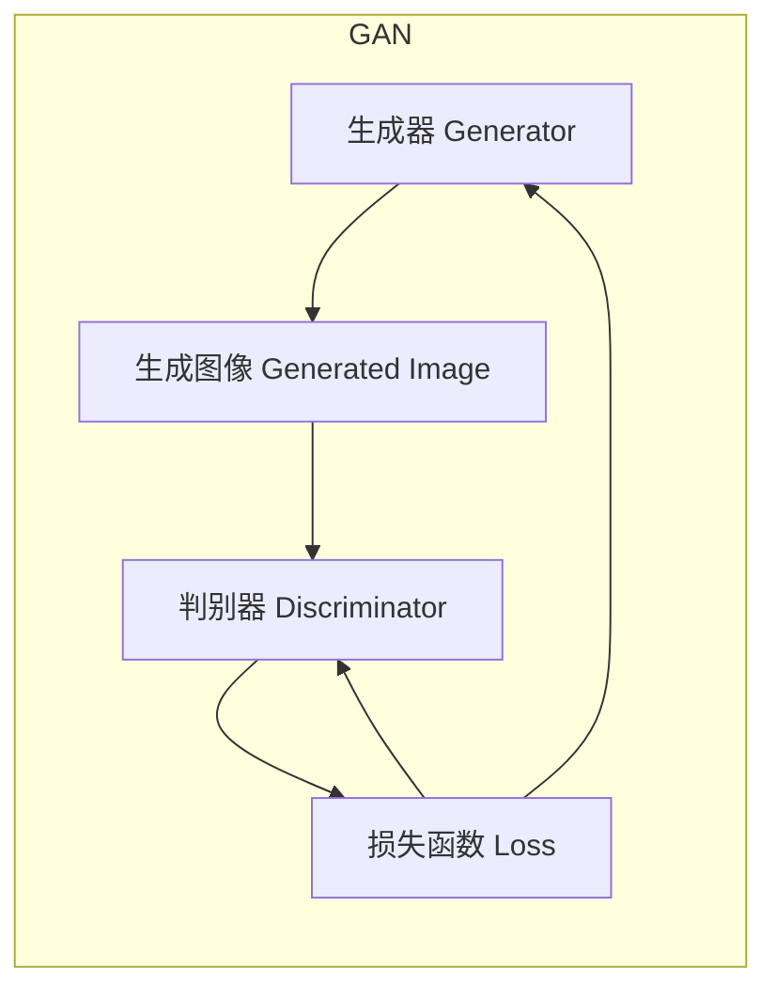
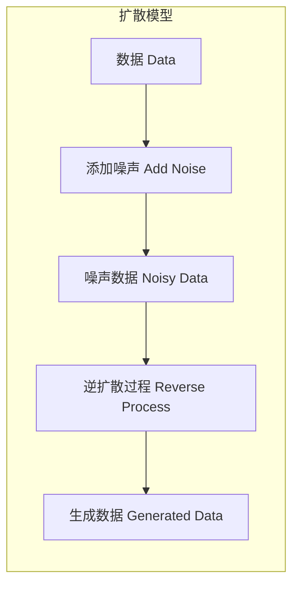
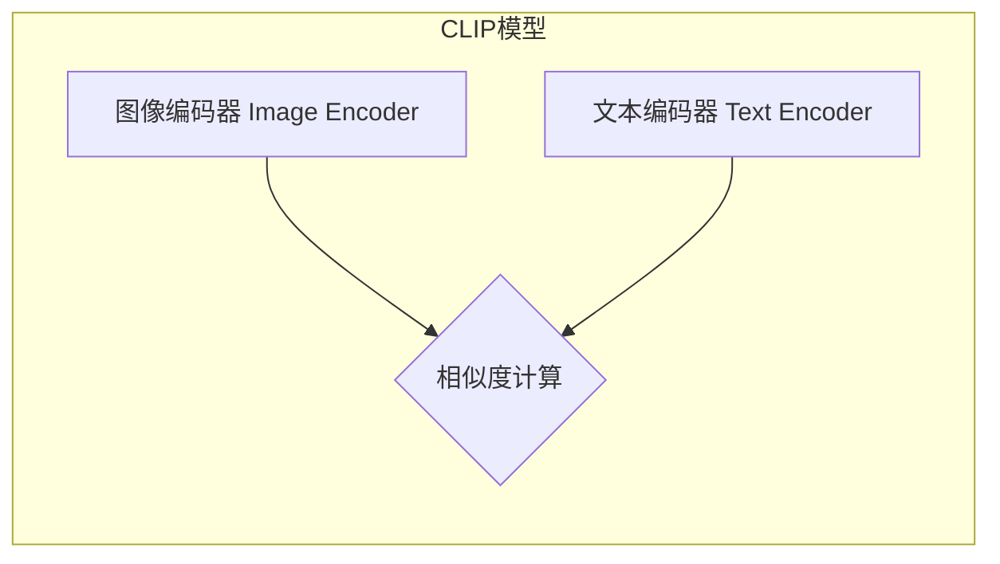
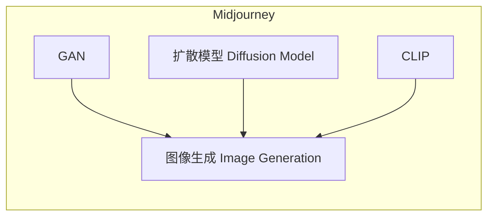

# AIGC从入门到实战：启动AIGC工具中的明星产品Midjourney

## 1.背景介绍

### 1.1 AIGC时代的到来

随着人工智能(AI)和生成式内容(GC)技术的不断发展,AIGC(AI生成式内容)已经成为当前科技界最热门的话题之一。AIGC是指利用人工智能算法生成文字、图像、音频、视频等多种形式的内容。

在过去几年中,AIGC技术取得了长足的进步,催生了诸如ChatGPT、Midjourney、DALL-E等一系列突破性应用,极大地推动了内容创作的效率和质量,为各行各业带来了前所未有的机遇。

### 1.2 Midjourney的崛起

在AIGC工具中,Midjourney无疑是当前最炙手可热的明星产品。作为一款基于人工智能的图像生成工具,Midjourney能够根据用户的文字描述,生成逼真的高分辨率图像。

自2022年7月首次公开发布以来,Midjourney就因其强大的图像生成能力而备受瞩目。无论是专业设计师还是业余爱好者,都可以借助Midjourney释放无穷的创意,打造出令人惊艳的视觉作品。

### 1.3 Midjourney的重要意义

Midjourney的出现不仅极大地提高了图像创作的效率,更重要的是它为人类开辟了一扇通往无限想象力的大门。通过与人工智能的互动,我们可以探索前所未有的视觉表现形式,挖掘更多创新的可能性。

Midjourney的成功也为AIGC技术在其他领域的应用指明了方向,为科技发展注入了新的动力。未来,AIGC必将深刻影响我们的生活、工作和学习方式。

## 2.核心概念与联系

### 2.1 生成式对抗网络(GAN)

Midjourney的核心技术是基于生成式对抗网络(Generative Adversarial Networks,GAN)。GAN是一种由两个神经网络组成的架构,包括一个生成器(Generator)和一个判别器(Discriminator)。

生成器的任务是生成逼真的图像,而判别器则需要区分生成的图像是真是假。通过不断地对抗训练,生成器和判别器相互促进,最终达到生成高质量图像的目的。

### 2.2 扩散模型(Diffusion Model)

除了GAN之外,Midjourney还采用了扩散模型(Diffusion Model)的技术。扩散模型是一种新兴的生成模型,通过学习数据的概率分布,逆向建模数据生成的过程。

扩散模型先将真实数据添加噪声,得到噪声数据;然后通过逆扩散过程,从噪声数据中重建原始数据。这种方法在图像生成任务上表现出色,可以生成更加细腻、逼真的图像。

### 2.3 CLIP模型

为了更好地将文本描述与生成的图像相匹配,Midjourney引入了CLIP(Contrastive Language-Image Pre-training)模型。CLIP是一种双塔模型,能够学习文本和图像之间的语义关联。

在CLIP中,图像和文本分别通过两个独立的编码器进行编码,然后计算两个编码向量之间的相似度。通过对比学习,CLIP可以很好地捕捉文本和图像之间的语义关联,从而指导图像生成的过程。

### 2.4 模型集成

Midjourney采用了多种先进模型的集成,包括GAN、扩散模型和CLIP等,从而实现了更加精准、高质量的图像生成能力。不同模型的优势互补,共同推动了Midjourney的卓越表现。

通过模型集成,Midjourney能够综合利用不同模型的长处,生成更加逼真、细腻、符合文本描述的高质量图像,为用户带来前所未有的创作体验。

## 3.核心算法原理具体操作步骤

### 3.1 文本编码

Midjourney的图像生成过程始于用户输入的文本描述。首先,文本描述会被输入到CLIP模型的文本编码器中,生成一个文本embedding向量,用于表示文本的语义信息。

$$\text{Text Embedding} = \text{TextEncoder}(\text{Text Description})$$

其中,TextEncoder是CLIP模型中的文本编码器。

### 3.2 图像生成

接下来,文本embedding向量会被输入到生成模型(如GAN或扩散模型)中,作为条件信息,指导图像生成的过程。生成模型会尝试生成一个与文本描述相匹配的图像。

$$\text{Generated Image} = \text{GenerativeModel}(\text{Text Embedding}, \text{Random Noise})$$

其中,GenerativeModel可以是GAN的生成器或扩散模型的逆扩散过程,Random Noise是随机噪声,用于增加图像的多样性。

### 3.3 图像编码

生成的图像会被输入到CLIP模型的图像编码器中,生成一个图像embedding向量,用于表示图像的语义信息。

$$\text{Image Embedding} = \text{ImageEncoder}(\text{Generated Image})$$

其中,ImageEncoder是CLIP模型中的图像编码器。

### 3.4 相似度计算

接下来,Midjourney会计算文本embedding向量和图像embedding向量之间的相似度,作为评估生成图像质量的指标。

$$\text{Similarity} = \text{Similarity}(\text{Text Embedding}, \text{Image Embedding})$$

其中,Similarity函数用于计算两个向量之间的相似度,可以是余弦相似度、点积等。

### 3.5 损失函数和优化

根据文本embedding和图像embedding之间的相似度,Midjourney会计算一个损失函数,用于指导生成模型的优化过程。

$$\text{Loss} = \text{LossFunction}(\text{Similarity})$$

其中,LossFunction可以是均方误差、交叉熵等。

生成模型会根据损失函数的梯度信息,不断调整内部参数,以生成更加匹配文本描述的图像。这个过程会重复多次迭代,直到达到满意的结果或者达到最大迭代次数。

$$\text{Parameters} = \text{Optimizer}(\text{Parameters}, \text{Gradients})$$

其中,Optimizer是优化算法,如Adam或SGD,用于根据梯度信息更新模型参数。

### 3.6 图像后处理

在生成高质量图像的同时,Midjourney还采用了一些后处理技术,如上色、去噪、增强细节等,进一步提高图像的质量和真实感。

$$\text{Final Image} = \text{PostProcessing}(\text{Generated Image})$$

其中,PostProcessing包括多种图像处理算法,如超分辨率、去噪自编码器等。

通过上述步骤,Midjourney能够根据用户的文本描述,生成高质量、逼真、细腻的图像,为创作者提供强大的辅助工具。

## 4.数学模型和公式详细讲解举例说明

在上一节中,我们介绍了Midjourney图像生成的核心算法原理和具体操作步骤。现在,让我们深入探讨一些关键的数学模型和公式,并通过具体的例子来加深理解。

### 4.1 CLIP模型中的余弦相似度

在CLIP模型中,文本embedding向量和图像embedding向量之间的相似度通常使用余弦相似度来计算。余弦相似度可以衡量两个向量之间的方向相似性,范围在[-1,1]之间,值越接近1,表示两个向量越相似。

$$\text{Cosine Similarity}(u, v) = \frac{u \cdot v}{\|u\| \|v\|}$$

其中,u和v分别表示文本embedding向量和图像embedding向量,点乘运算(·)计算两个向量的内积,||u||和||v||分别表示向量u和v的L2范数。

例如,假设文本描述为"一只红色的苹果",对应的文本embedding向量为u,生成的图像embedding向量为v。如果u和v之间的余弦相似度很高,说明生成的图像与文本描述相符合。

### 4.2 GAN中的最小最大损失函数

在GAN的训练过程中,生成器和判别器相互对抗,目标是找到一个Nash均衡点,使得生成器生成的图像能够尽可能地欺骗判别器。这个过程可以用最小最大损失函数来表示:

$$\min_G \max_D V(D, G) = \mathbb{E}_{x \sim p_\text{data}(x)}[\log D(x)] + \mathbb{E}_{z \sim p_z(z)}[\log (1 - D(G(z)))]$$

其中,G表示生成器,D表示判别器,x是真实数据的样本,z是随机噪声,p_data(x)是真实数据的分布,p_z(z)是随机噪声的分布。

判别器D的目标是最大化上式,即最大化对真实数据的正确判别概率,同时最大化对生成数据的错误判别概率。而生成器G的目标是最小化上式,即生成足够逼真的数据,使判别器无法区分真伪。

通过不断迭代这个对抗过程,生成器和判别器相互促进,最终达到生成高质量图像的目的。

### 4.3 扩散模型中的高斯噪声

在扩散模型中,真实数据会被添加高斯噪声,以生成噪声数据。高斯噪声服从均值为0、方差为σ^2的正态分布:

$$q(\tilde{x}_t|x_0) = \mathcal{N}(\tilde{x}_t; \sqrt{\bar{\alpha}_t}x_0, (1 - \bar{\alpha}_t)\mathbf{I})$$

其中,x_0是原始数据,\tilde{x}_t是在时间步t添加噪声后的数据,\bar{\alpha}_t是一个与时间步相关的系数,用于控制噪声的强度。

在逆扩散过程中,模型需要从噪声数据\tilde{x}_t中重建原始数据x_0。这个过程可以用条件概率密度函数表示:

$$p_\theta(x_{t-1}|x_t) = \mathcal{N}(x_{t-1}; \mu_\theta(x_t, t), \Sigma_\theta(x_t, t))$$

其中,\mu_\theta和\Sigma_\theta分别是均值和方差,由神经网络模型参数θ决定。通过迭代地去噪,最终可以从噪声数据中重建出原始数据。

扩散模型的优势在于它能够学习数据的真实分布,从而生成更加细腻、逼真的图像。

### 4.4 上采样和超分辨率

为了提高生成图像的分辨率和细节,Midjourney采用了上采样和超分辨率技术。上采样是指将低分辨率图像放大到更高分辨率,而超分辨率则是通过深度学习模型来重建高分辨率图像的细节。

一种常用的上采样方法是双三次插值(Bicubic Interpolation),它通过对邻近像素进行加权平均来计算新像素的值:

$$I(x, y) = \sum_{i=-1}^{2} \sum_{j=-1}^{2} a_{ij} I(x + i, y + j)$$

其中,I(x,y)是新像素的值,a_ij是一组预定义的权重系数。

而超分辨率则需要训练一个深度卷积神经网络,学习低分辨率和高分辨率图像之间的映射关系。常用的损失函数包括均方误差损失、感知损失等。

通过上采样和超分辨率技术,Midjourney可以生成更高分辨率、更细腻的图像,满足用户对高质量图像的需求。

## 5.