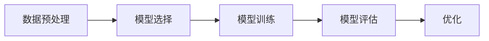

# AIGC从入门到实战：如何有效应对 AI 革命

## 1. 背景介绍
随着人工智能技术的飞速发展，AI在各行各业的应用已经成为推动社会进步的重要力量。特别是在生成内容（Generative Content，GC）方面，AI技术已经能够辅助或者独立完成音乐创作、文章撰写、图像设计等工作。AIGC（AI + GC）代表了人工智能与内容生成结合的新趋势，它不仅改变了内容创作的方式，也为传统行业带来了革命性的变革。

## 2. 核心概念与联系
AIGC涉及的核心概念包括机器学习、深度学习、自然语言处理、计算机视觉等。这些技术相互联系，共同构成了AIGC的技术基础。机器学习提供了数据分析的方法，深度学习使得模型能够处理复杂的非线性问题，自然语言处理和计算机视觉则分别让机器理解文本和图像内容。

## 3. 核心算法原理具体操作步骤
AIGC的核心算法原理包括但不限于生成对抗网络（GANs）、变分自编码器（VAEs）、序列到序列模型（Seq2Seq）等。操作步骤通常包括数据预处理、模型选择、模型训练、模型评估和优化等。



## 4. 数学模型和公式详细讲解举例说明
以生成对抗网络为例，GANs包括一个生成器G和一个判别器D。生成器G的目标是生成尽可能真实的数据，判别器D的目标是区分真实数据和生成器生成的数据。数学模型可以表示为：

$$
\min_G \max_D V(D, G) = \mathbb{E}_{x\sim p_{data}(x)}[\log D(x)] + \mathbb{E}_{z\sim p_z(z)}[\log(1 - D(G(z)))]
$$

其中，$p_{data}$是真实数据的分布，$p_z$是生成器输入的噪声分布。

## 5. 项目实践：代码实例和详细解释说明
以TensorFlow和Keras框架为例，以下是一个简单的GAN模型代码实例：

```python
from tensorflow.keras import layers, models

# 构建生成器
generator = models.Sequential([
    layers.Dense(256, input_shape=(100,)),
    layers.LeakyReLU(alpha=0.2),
    layers.BatchNormalization(momentum=0.8),
    layers.Dense(512),
    layers.LeakyReLU(alpha=0.2),
    layers.BatchNormalization(momentum=0.8),
    layers.Dense(1024),
    layers.LeakyReLU(alpha=0.2),
    layers.BatchNormalization(momentum=0.8),
    layers.Dense(784, activation='tanh'),
    layers.Reshape((28, 28, 1))
])

# 构建判别器
discriminator = models.Sequential([
    layers.Flatten(input_shape=(28, 28, 1)),
    layers.Dense(512),
    layers.LeakyReLU(alpha=0.2),
    layers.Dense(256),
    layers.LeakyReLU(alpha=0.2),
    layers.Dense(1, activation='sigmoid')
])

# 编译模型
discriminator.compile(loss='binary_crossentropy', optimizer='adam', metrics=['accuracy'])
```

## 6. 实际应用场景
AIGC技术在内容创作、游戏开发、教育、医疗等多个领域都有广泛的应用。例如，在内容创作领域，AIGC可以帮助作者生成文章草稿；在游戏开发中，AIGC可以用于生成复杂的游戏环境和角色。

## 7. 工具和资源推荐
对于想要入门AIGC的开发者，推荐以下工具和资源：
- TensorFlow和PyTorch：两个主流的深度学习框架。
- OpenAI GPT-3：强大的自然语言处理模型。
- DALL·E：OpenAI开发的图像生成模型。

## 8. 总结：未来发展趋势与挑战
AIGC的未来发展趋势将更加注重模型的创造性和多样性，同时在模型的可解释性和伦理问题上也将面临挑战。随着技术的不断进步，AIGC有望在更多领域发挥重要作用。

## 9. 附录：常见问题与解答
Q1: AIGC是否会取代人类的创作？
A1: AIGC更多的是作为人类创作的辅助工具，而不是取代者。

Q2: AIGC在处理中文内容时是否存在障碍？
A2: 目前的AIGC模型对中文的处理能力在不断提升，但仍然存在一些语言特异性的挑战。

作者：禅与计算机程序设计艺术 / Zen and the Art of Computer Programming