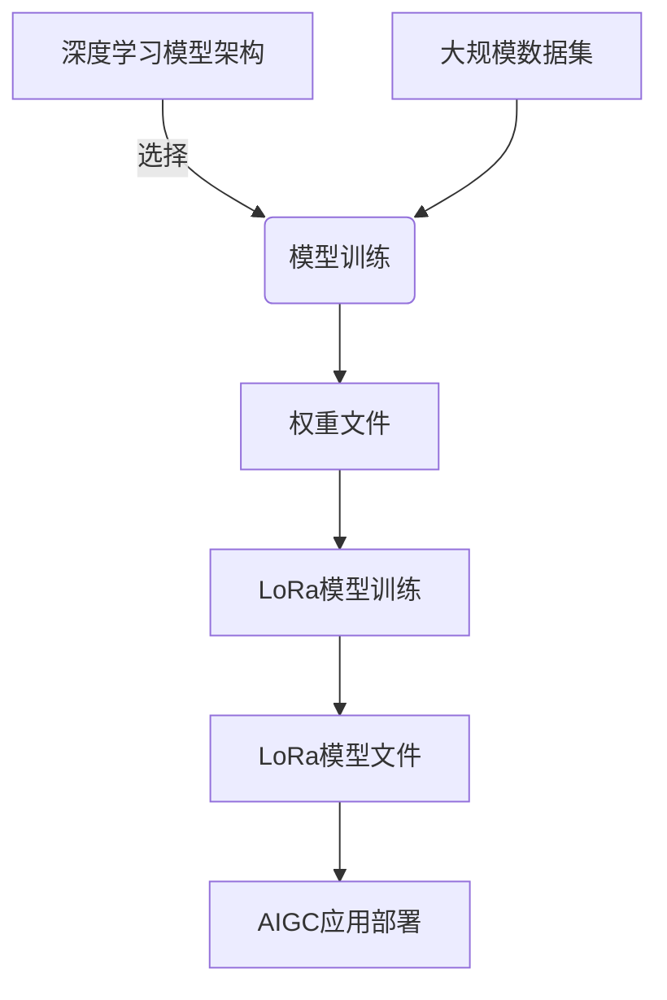

# AIGC从入门到实战：安装权重文件和 LoRa 模型文件

## 1.背景介绍

### 1.1 AIGC的兴起

近年来,人工智能生成内容(AIGC)技术的快速发展,为各行业带来了革命性的变革。作为一种新兴技术,AIGC能够利用深度学习算法生成高质量的文本、图像、音频和视频内容,大大提高了内容创作的效率和质量。

### 1.2 AIGC的应用前景

AIGC技术在多个领域展现出巨大的应用前景,如:

- 内容创作:可用于自动生成新闻报道、小说、诗歌、营销文案等。
- 设计制作:可生成图像、插画、UI设计等视觉内容。
- 客户服务:可生成自然语言对话,提供智能客服。
- 教育培训:可生成个性化学习资料和课程。

### 1.3 权重文件和LoRa模型

要充分发挥AIGC的潜力,关键在于训练高质量的模型。权重文件和LoRa模型是实现这一目标的两种重要方式。

- 权重文件是深度学习模型的参数集合,决定了模型的性能表现。通过对大规模数据的训练,可以获得高质量的权重文件。
- LoRa(Low-Rank Adaptation)是一种模型压缩技术,可以在保持模型性能的同时,大幅减小模型文件的存储空间。

## 2.核心概念与联系

### 2.1 深度学习模型

深度学习模型是AIGC技术的核心,常见的有:

- 自然语言处理(NLP)模型:GPT、BERT等,用于文本生成和理解。
- 计算机视觉(CV)模型:VGG、ResNet等,用于图像识别和生成。
- 多模态模型:CLIP、Stable Diffusion等,可处理图文等多种模态数据。

这些模型通过对大规模数据的训练,学习到特定任务的模式和规律,从而获得相应的生成或识别能力。

### 2.2 权重文件

权重文件存储了模型的参数值,是模型学习的结果。不同的权重文件对应不同的模型性能,优质的权重文件对应着高性能的模型。

权重文件的训练过程通常包括:

1. 数据预处理:清洗、标注、切分等,构建高质量的训练数据集。
2. 模型选择:根据任务需求选择合适的模型架构。
3. 模型训练:使用优化算法(如梯度下降),在训练数据上不断调整模型参数。
4. 模型评估:在验证集上评估模型性能,进行超参数调优。
5. 模型保存:将训练好的模型参数(权重)保存为文件。

### 2.3 LoRa模型

LoRa(Low-Rank Adaptation)是一种模型压缩技术,可以极大缩小模型文件的存储空间。它的核心思想是:

- 在预训练的大模型基础上,只对一小部分参数(LoRa层)进行微调,而保持大部分参数不变。
- LoRa层参数量远小于原始模型参数,因此可以大幅减小模型文件的存储空间。
- 在推理时,将LoRa层参数融合到原始模型中,从而获得与完整微调模型相近的性能表现。

LoRa模型的优势在于:存储空间小、训练成本低、可快速迁移到不同任务,是部署AIGC模型的理想选择。

### 2.4 概念联系

权重文件和LoRa模型是AIGC技术中两个密切相关的核心概念:

- 权重文件是模型训练的最终结果,决定了模型的性能水平。
- LoRa模型则是在现有权重文件基础上进行微调和压缩,以获得更小的存储空间和更快的推理速度。

两者的有机结合,使得高质量的AIGC模型能够在资源受限的环境中高效部署和运行。



## 3.核心算法原理具体操作步骤

### 3.1 权重文件训练流程

训练高质量的权重文件是AIGC模型的基础,其核心步骤包括:

1. **数据预处理**
   - 数据清洗:去除异常、重复、噪声数据。
   - 数据标注:对训练数据进行人工或自动标注。
   - 数据切分:将数据切分为训练集、验证集和测试集。

2. **模型选择**
   - 根据任务需求选择合适的模型架构,如BERT、GPT、ResNet等。
   - 设置模型超参数,如学习率、批量大小等。

3. **模型训练**
   - 使用优化算法(如Adam、SGD)迭代训练模型参数。
   - 在训练集上最小化损失函数(如交叉熵损失)。
   - 定期在验证集上评估模型性能,进行早停和模型选择。

4. **模型评估**
   - 在测试集上全面评估模型性能,计算指标如准确率、F1分数等。
   - 根据评估结果对模型进行调优,如修改超参数、增加训练数据等。

5. **模型保存**
   - 将训练好的模型参数(权重)保存为文件,如`.pth`、`.ckpt`等格式。
   - 保存模型配置、词表等相关文件,以便后续加载和部署。

### 3.2 LoRa模型训练流程

LoRa模型训练的核心步骤如下:

1. **预训练模型准备**
   - 选择合适的大型预训练模型,如GPT-2、BERT等。
   - 加载预训练模型的权重文件。

2. **LoRa层初始化**
   - 为预训练模型的每一层添加LoRa层。
   - LoRa层参数以低秩矩阵的形式初始化。

3. **LoRa微调训练**
   - 在特定任务的数据集上进行微调训练。
   - 固定预训练模型的权重,只更新LoRa层参数。
   - 使用优化算法最小化损失函数。

4. **LoRa模型保存**
   - 将微调后的LoRa层参数保存为文件。
   - 保存LoRa模型配置等相关信息。

5. **LoRa模型融合(可选)**
   - 将LoRa层参数融合到预训练模型中。
   - 生成一个新的完整微调模型权重文件。
   - 用于部署时的高效推理,避免运行时融合开销。

通过LoRa模型训练,可以在保持模型性能的同时,极大缩小模型文件的存储空间,从而实现高效的AIGC模型部署。

## 4.数学模型和公式详细讲解举例说明

### 4.1 LoRa层数学原理

LoRa层的核心思想是使用低秩矩阵来逼近模型权重矩阵的变化,从而减小需要存储的参数量。具体来说,对于模型的某一层权重矩阵$W \in \mathbb{R}^{m \times n}$,LoRa层引入两个低秩投影矩阵$A \in \mathbb{R}^{m \times k}$和$B \in \mathbb{R}^{n \times k}$,其中$k \ll \min(m, n)$。

LoRa层的作用是将原始权重矩阵$W$更新为$\tilde{W}$:

$$\tilde{W} = W + A B^T$$

其中,$A B^T$是一个低秩矩阵,用于逼近$\tilde{W}$与$W$的差异。由于$k$远小于$m$和$n$,因此只需存储$A$和$B$两个低秩矩阵,就可以近似表示整个权重矩阵的变化,从而大幅减小存储空间。

在推理时,可以直接使用更新后的$\tilde{W}$进行计算,或者现场融合$W$和$A$、$B$,计算$\tilde{W} = W + A B^T$。

### 4.2 LoRa层训练

LoRa层的训练过程是在特定任务的数据集上,固定预训练模型权重$W$,只更新LoRa层的$A$和$B$矩阵。

设损失函数为$\mathcal{L}(\tilde{W})$,则LoRa层训练的目标是最小化:

$$\min_{A, B} \mathcal{L}(W + A B^T)$$

通常使用梯度下降等优化算法来迭代更新$A$和$B$,直到损失函数收敛或达到预期性能。

### 4.3 LoRa层融合

为了避免推理时的现场融合开销,可以将LoRa层参数$A$和$B$与原始权重$W$融合,生成一个新的完整微调模型权重矩阵$\tilde{W}$:

$$\tilde{W} = W + A B^T$$

融合后的$\tilde{W}$可以直接用于高效推理,而无需运行时计算$A B^T$。

### 4.4 示例:LoRa层应用于Transformer

以Transformer模型为例,LoRa层可以应用于其自注意力(Self-Attention)和前馈神经网络(Feed-Forward Network)层。

对于自注意力层,其查询(Query)、键(Key)和值(Value)投影矩阵$W_Q$、$W_K$和$W_V$可以分别添加LoRa层:

$$\begin{aligned}
\tilde{W}_Q &= W_Q + A_Q B_Q^T \\
\tilde{W}_K &= W_K + A_K B_K^T \\
\tilde{W}_V &= W_V + A_V B_V^T
\end{aligned}$$

对于前馈神经网络层,其线性投影矩阵$W_1$和$W_2$也可以添加LoRa层:

$$\begin{aligned}
\tilde{W}_1 &= W_1 + A_1 B_1^T \\
\tilde{W}_2 &= W_2 + A_2 B_2^T
\end{aligned}$$

通过对这些关键层添加LoRa层,可以在保持Transformer模型性能的同时,极大减小模型文件的存储空间。

## 5.项目实践:代码实例和详细解释说明

### 5.1 安装权重文件

以安装PyTorch模型权重文件为例,核心代码如下:

```python
import torch

# 加载模型架构
model = MyModel(config)

# 加载模型权重文件
weights = torch.load('model_weights.pth')
model.load_state_dict(weights)

# 模型推理或继续训练
outputs = model(inputs)
```

- 首先导入PyTorch库。
- 根据模型配置实例化模型架构。
- 使用`torch.load()`函数加载保存的权重文件。
- 调用模型的`load_state_dict()`方法将权重加载到模型中。
- 加载权重后,即可使用该模型进行推理或继续训练。

### 5.2 安装LoRa模型

以安装基于Hugging Face Transformers的LoRa模型为例,核心代码如下:

```python
from peft import PeftModel, LoraConfig

# 加载预训练模型
model = AutoModel.from_pretrained('bert-base-uncased')

# 配置LoRa层
lora_config = LoraConfig(
    r=8,
    lora_alpha=32,
    target_modules=['query', 'value'],
    lora_dropout=0.05,
    bias='none',
    task_type='CAUSAL_LM'
)

# 初始化LoRa模型
model = PeftModel.from_pretrained(
    model,
    'loramodel.bin',
    lora_config=lora_config
)

# 模型推理或继续微调训练
outputs = model(inputs)
```

- 导入Hugging Face Transformers和PeftLibrary。
- 加载预训练模型,如BERT、GPT-2等。
- 配置LoRa层参数,如秩、alpha、目标层等。
- 使用`PeftModel.from_pretrained()`加载LoRa模型文件。
- 加载LoRa模型后,即可进行推理或继续微调训练。

通过上述代码,可以快速加载和部署基于LoRa的高效AIGC模型。

## 6.实际应用场景

权重文件和LoRa模型在AIGC领域有着广泛的应用场景:

### 6.1 内容创作

- 使用GPT等大型语言模型