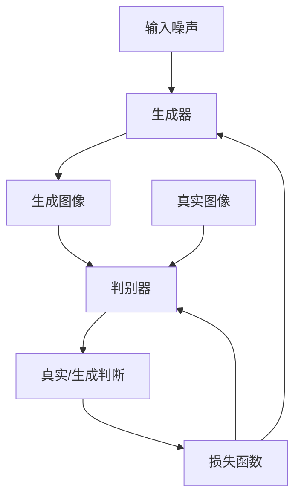
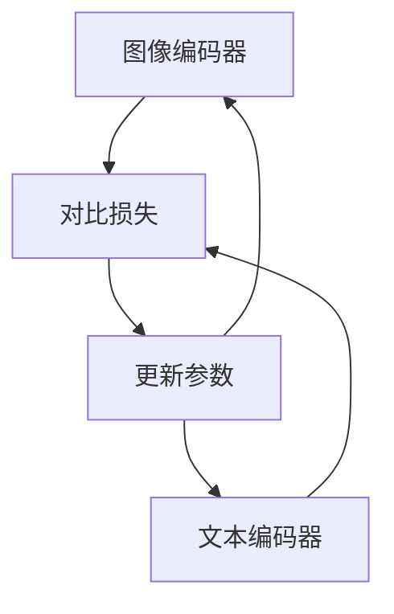
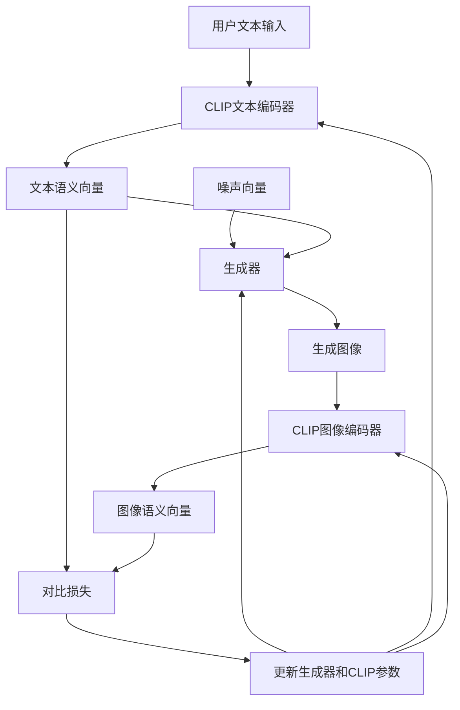

# AIGC从入门到实战：萌版头像绘制秘诀，自建你的元宇宙形象

## 1. 背景介绍

### 1.1 元宇宙时代的到来

随着科技的飞速发展，元宇宙这一概念正在逐渐走进人们的视野。元宇宙被视为未来互联网发展的新阶段,是一个由虚拟现实(VR)、增强现实(AR)、人工智能(AI)等新兴技术融合而成的虚实共生的数字世界。在这个全新的虚拟空间中,人们可以通过自己的数字化身(Avatar)进行社交、工作、娱乐等活动,体验与现实世界无异的沉浸式体验。

### 1.2 数字化身的重要性

在元宇宙中,每个人都需要一个独一无二的数字化身来代表自己的存在。这个数字化身不仅是你在虚拟世界中的形象,更是你独特个性和风格的体现。因此,拥有一个个性化、富有创意的数字化身,对于在元宇宙中获得良好的体验至关重要。

### 1.3 AIGC技术的崛起

近年来,人工智能生成内容(AIGC)技术取得了长足的进步,尤其是在图像生成领域。基于深度学习的生成对抗网络(GAN)等算法,可以根据文本描述生成逼真的图像,为创建个性化数字化身提供了新的可能性。

## 2. 核心概念与联系

### 2.1 生成对抗网络(GAN)

生成对抗网络(Generative Adversarial Networks, GAN)是一种基于深度学习的图像生成模型,由两个神经网络组成:生成器(Generator)和判别器(Discriminator)。生成器的目标是生成逼真的图像,而判别器则试图区分生成的图像和真实图像。通过这种对抗性训练,生成器不断提高生成图像的质量,最终达到以假乱真的效果。



### 2.2 CLIP模型

CLIP(Contrastive Language-Image Pre-training)是一种基于对比学习的视觉语义模型,可以学习图像和文本之间的语义关联。CLIP通过预训练,可以捕捉图像和文本之间的语义相似性,从而实现图像和文本之间的双向理解和生成。



### 2.3 AIGC头像生成流程

AIGC头像生成的核心思路是利用GAN和CLIP等模型,根据用户输入的文本描述生成个性化的头像图像。具体流程如下:



## 3. 核心算法原理具体操作步骤

### 3.1 数据预处理

AIGC头像生成需要大量的图像-文本对作为训练数据。常见的做法是从互联网上爬取大量的人物头像图像,并使用众包平台为每张图像编写相应的文本描述。

在预处理阶段,需要对图像进行标准化处理,如裁剪、调整大小和归一化像素值。对于文本,则需要进行分词、去除停用词等常规的自然语言处理操作。

### 3.2 CLIP预训练

CLIP模型需要在大规模的图像-文本对上进行预训练,以学习图像和文本之间的语义关联。预训练过程中,CLIP将图像和文本输入到各自的编码器中,得到图像语义向量和文本语义向量。然后,通过对比损失函数最小化这两个向量之间的余弦距离,从而使得语义相似的图像和文本对应的向量更加接近。

### 3.3 生成器训练

生成器的训练过程中,首先从噪声分布中采样一个随机向量,同时将用户输入的文本描述输入到CLIP的文本编码器中,得到文本语义向量。然后,将噪声向量和文本语义向量作为输入,送入生成器网络中生成一张图像。

接下来,将生成的图像输入到CLIP的图像编码器中,得到图像语义向量。通过计算图像语义向量和文本语义向量之间的对比损失,并反向传播更新生成器和CLIP的参数,使得生成的图像更加符合文本描述。

### 3.4 迭代优化

由于GAN的训练过程具有不稳定性,因此需要进行多次迭代优化,以提高生成图像的质量和多样性。常见的优化策略包括:

- 调整生成器和判别器的网络结构和超参数
- 采用不同的损失函数,如Wasserstein损失、最小二乘损失等
- 引入正则化技术,如梯度惩罚、噪声正则化等
- 采用增强学习方法,如REINFORCE算法等

通过不断的迭代优化,可以使生成的头像图像更加逼真、个性化和多样化。

## 4. 数学模型和公式详细讲解举例说明

### 4.1 生成对抗网络(GAN)数学模型

生成对抗网络(GAN)由生成器 $G$ 和判别器 $D$ 组成,它们相互对抗地训练。生成器 $G$ 的目标是从噪声分布 $p_z(z)$ 中生成逼真的样本 $G(z)$,使其难以与真实样本 $x$ 区分。判别器 $D$ 的目标是正确区分生成样本 $G(z)$ 和真实样本 $x$。

GAN的目标函数可以表示为:

$$\min_G \max_D V(D, G) = \mathbb{E}_{x \sim p_{\text{data}}(x)}[\log D(x)] + \mathbb{E}_{z \sim p_z(z)}[\log (1 - D(G(z)))]$$

其中,第一项是判别器正确识别真实样本的期望,第二项是判别器将生成样本误判为真实样本的期望。生成器和判别器相互对抗地训练,直到达到纳什均衡。

### 4.2 CLIP模型损失函数

CLIP模型的损失函数是基于对比学习(Contrastive Learning)的思想,旨在最大化图像语义向量和文本语义向量之间的相似性。

对于一个包含 $N$ 个图像-文本对的批次,CLIP的损失函数可以表示为:

$$\mathcal{L} = \frac{1}{N} \sum_{n=1}^N \Big[ -\log \frac{e^{s(I_n, T_n)/\tau}}{\sum_{m=1}^N e^{s(I_n, T_m)/\tau}} - \log \frac{e^{s(I_n, T_n)/\tau}}{\sum_{m=1}^N e^{s(I_m, T_n)/\tau}} \Big]$$

其中,
- $s(I_n, T_n)$ 表示图像语义向量 $I_n$ 和文本语义向量 $T_n$ 之间的相似性分数
- $\tau$ 是一个温度超参数,用于控制相似性分数的尺度
- 第一项是最大化正样本对的相似性
- 第二项是最小化负样本对的相似性

通过优化这个损失函数,CLIP可以学习到图像和文本之间的语义关联。

### 4.3 示例:生成一张"一只可爱的小狗在草地上玩耍"的图像

假设我们已经训练好了一个AIGC头像生成模型,现在我们想生成一张"一只可爱的小狗在草地上玩耍"的图像。具体步骤如下:

1. 将文本描述"一只可爱的小狗在草地上玩耍"输入到CLIP的文本编码器中,得到文本语义向量 $T$。
2. 从噪声分布 $p_z(z)$ 中采样一个随机向量 $z$。
3. 将噪声向量 $z$ 和文本语义向量 $T$ 作为输入,送入生成器网络 $G$,得到生成图像 $I = G(z, T)$。
4. 将生成图像 $I$ 输入到CLIP的图像编码器中,得到图像语义向量 $I'$。
5. 计算文本语义向量 $T$ 和图像语义向量 $I'$ 之间的对比损失 $\mathcal{L}(T, I')$。
6. 反向传播,更新生成器 $G$ 和CLIP的参数,使得生成图像 $I$ 更加符合文本描述。

通过多次迭代优化,最终可以生成一张满足"一只可爱的小狗在草地上玩耍"描述的逼真图像。

## 5. 项目实践:代码实例和详细解释说明

在这一部分,我们将提供一个基于PyTorch实现的AIGC头像生成项目示例,并对关键代码进行详细解释。

### 5.1 导入必要的库

```python
import torch
import torch.nn as nn
import torchvision.transforms as transforms
from PIL import Image
from clip import clip
from gan import Generator
```

我们导入了PyTorch、CLIP和GAN模型所需的库。其中,`clip`和`gan`是我们自定义的模块,分别实现了CLIP和GAN模型。

### 5.2 加载预训练的CLIP模型

```python
device = "cuda" if torch.cuda.is_available() else "cpu"
model, preprocess = clip.load("ViT-B/32", device=device)
```

我们加载了预训练的CLIP模型,并指定了设备(GPU或CPU)。`preprocess`是一个用于图像预处理的函数。

### 5.3 定义生成器

```python
gen = Generator(z_dim=128, img_size=256).to(device)
```

我们实例化了一个生成器对象,输入噪声维度为128,生成图像大小为256x256像素。

### 5.4 生成图像

```python
text = "一只可爱的小狗在草地上玩耍"
with torch.no_grad():
    text_tokens = clip.tokenize([text]).to(device)
    text_features = model.encode_text(text_tokens)
    noise = torch.randn(1, 128, device=device)
    img = gen(noise, text_features)
    img = (img.permute(0, 2, 3, 1) * 127.5 + 128).clamp(0, 255).to(torch.uint8)
    pil_img = Image.fromarray(img[0].cpu().numpy())
    pil_img.save("output.png")
```

1. 我们首先将文本描述"一只可爱的小狗在草地上玩耍"tokenize并编码为文本语义向量`text_features`。
2. 从标准正态分布中采样一个随机噪声向量`noise`。
3. 将噪声向量`noise`和文本语义向量`text_features`作为输入,送入生成器`gen`生成图像`img`。
4. 对生成的图像进行后处理,将像素值缩放到0-255的uint8范围。
5. 将处理后的图像保存为`output.png`文件。

### 5.5 训练过程

训练过程比较复杂,涉及到数据加载、模型初始化、优化器设置、损失函数计算和参数更新等多个步骤。为了简洁起见,我们在这里不再赘述。有兴趣的读者可以查阅项目源代码获取更多详细信息。

## 6. 实际应用场景

AIGC头像生成技术在元宇宙时代有着广泛的应用前景,包括但不限于:

### 6.1 虚拟化身创建

用户可以根据自己的喜好,通过文本描述生成个性化的虚拟化身,用于在元宇宙中进行社交、工作和娱乐等活动。这些虚拟化身不仅外表逼真,而且可以体现用户独特的个性和风格。

### 6.2 虚拟影视制作

在电影、电视剧和动画等影视作品中,AIGC头像生成技术可以用于创建虚拟角色、特效场景等,大大降低了制作成本