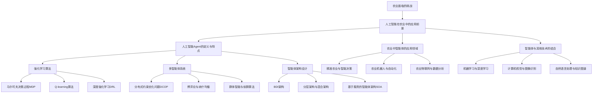

# AI人工智能 Agent：在农业中智能体的应用

## 1. 背景介绍
### 1.1 农业面临的挑战
#### 1.1.1 人口增长与粮食需求
#### 1.1.2 气候变化与自然灾害
#### 1.1.3 劳动力短缺与成本上升

### 1.2 人工智能在农业中的应用前景
#### 1.2.1 提高农业生产效率
#### 1.2.2 优化资源利用与管理
#### 1.2.3 促进农业可持续发展

## 2. 核心概念与联系
### 2.1 人工智能 Agent 的定义与特点
#### 2.1.1 自主性与目标导向
#### 2.1.2 感知、推理与决策能力
#### 2.1.3 学习与适应能力

### 2.2 农业中智能体的应用领域
#### 2.2.1 精准农业与智能决策
#### 2.2.2 农业机器人与自动化
#### 2.2.3 农业物联网与数据分析

### 2.3 智能体与其他技术的结合
#### 2.3.1 机器学习与深度学习
#### 2.3.2 计算机视觉与图像识别
#### 2.3.3 自然语言处理与知识图谱

## 3. 核心算法原理具体操作步骤
### 3.1 强化学习算法
#### 3.1.1 马尔可夫决策过程（MDP）
#### 3.1.2 Q-learning 算法
#### 3.1.3 深度强化学习（DRL）

### 3.2 多智能体系统
#### 3.2.1 分布式约束优化问题（DCOP）
#### 3.2.2 博弈论与纳什均衡
#### 3.2.3 群体智能与蚁群算法

### 3.3 智能体架构设计
#### 3.3.1 BDI（信念-欲望-意图）架构
#### 3.3.2 分层架构与混合架构
#### 3.3.3 基于服务的智能体架构（SOA）

## 4. 数学模型和公式详细讲解举例说明
### 4.1 马尔可夫决策过程（MDP）
#### 4.1.1 状态转移概率矩阵
#### 4.1.2 奖励函数与折扣因子
#### 4.1.3 最优策略与贝尔曼方程

### 4.2 Q-learning 算法
#### 4.2.1 Q 值更新公式
#### 4.2.2 探索与利用策略
#### 4.2.3 收敛性证明与复杂度分析

### 4.3 博弈论模型
#### 4.3.1 策略型博弈与扩展型博弈
#### 4.3.2 纳什均衡与帕累托最优
#### 4.3.3 重复博弈与进化博弈

## 5. 项目实践：代码实例和详细解释说明
### 5.1 基于强化学习的农作物灌溉决策系统
#### 5.1.1 问题建模与状态空间设计
#### 5.1.2 奖励函数设计与训练过程
#### 5.1.3 实验结果与性能评估

### 5.2 多智能体协同的农业机器人系统
#### 5.2.1 任务分解与角色分配
#### 5.2.2 通信协议与协商机制
#### 5.2.3 仿真实验与实际部署

### 5.3 基于知识图谱的农业智能问答系统
#### 5.3.1 农业知识图谱构建
#### 5.3.2 问题理解与语义解析
#### 5.3.3 答案生成与用户交互

## 6. 实际应用场景
### 6.1 智能温室环境控制
#### 6.1.1 环境参数监测与数据采集
#### 6.1.2 智能决策与执行机制
#### 6.1.3 应用效果与经济效益分析

### 6.2 农作物病虫害智能诊断与防治
#### 6.2.1 病虫害图像采集与预处理
#### 6.2.2 深度学习模型训练与优化
#### 6.2.3 诊断结果反馈与防治建议

### 6.3 农产品供应链智能管理
#### 6.3.1 需求预测与产量规划
#### 6.3.2 物流调度与库存优化
#### 6.3.3 质量追溯与风险预警

## 7. 工具和资源推荐
### 7.1 开源框架与库
#### 7.1.1 TensorFlow 与 PyTorch
#### 7.1.2 OpenAI Gym 与 RLlib
#### 7.1.3 JADE 与 MASON

### 7.2 数据集与模型资源
#### 7.2.1 农业遥感影像数据集
#### 7.2.2 作物生长模型与农业知识库
#### 7.2.3 预训练的深度学习模型

### 7.3 学习资料与社区支持
#### 7.3.1 在线课程与教程
#### 7.3.2 学术论文与技术博客
#### 7.3.3 开发者社区与交流平台

## 8. 总结：未来发展趋势与挑战
### 8.1 农业智能化的发展趋势
#### 8.1.1 数字孪生与虚拟农场
#### 8.1.2 边缘计算与实时决策
#### 8.1.3 人机协作与增强现实

### 8.2 面临的挑战与问题
#### 8.2.1 数据质量与隐私保护
#### 8.2.2 模型泛化能力与鲁棒性
#### 8.2.3 伦理与法律问题

### 8.3 未来研究方向与展望
#### 8.3.1 可解释性与可信赖性
#### 8.3.2 跨领域知识融合与迁移学习
#### 8.3.3 人工智能与传统农业知识的结合

## 9. 附录：常见问题与解答
### 9.1 如何选择合适的智能体架构？
### 9.2 强化学习算法在实际应用中的局限性？
### 9.3 农业领域特定的数据预处理与特征工程方法？
### 9.4 如何平衡探索与利用以提高学习效率？
### 9.5 多智能体系统中的通信瓶颈与扩展性问题？

人工智能 Agent 技术在农业领域的应用前景广阔，有望为农业生产带来革命性的变革。智能体通过感知环境、推理决策、学习适应等能力，可以有效解决农业生产中的诸多问题，提高生产效率，优化资源利用，促进农业可持续发展。

强化学习算法如 Q-learning 和深度强化学习，为智能体提供了有效的决策机制。通过不断与环境交互，智能体可以学习到最优的行为策略，适应复杂多变的农业生产环境。马尔可夫决策过程（MDP）为强化学习提供了理论基础，使得智能体的决策过程可以用数学模型来描述和优化。

多智能体系统可以用于解决农业生产中的分布式问题，如农业机器人的协同作业、农产品供应链的优化等。博弈论为多智能体的交互行为提供了理论支持，纳什均衡和帕累托最优是衡量多智能体系统性能的重要指标。群体智能算法如蚁群算法，启发了多智能体系统的设计和优化。

智能体架构的选择是实现智能体功能的关键。BDI 架构强调智能体的信念、欲望和意图，适用于需要高度自主和灵活性的场景。分层架构将智能体的功能划分为不同的层次，如反应层、规划层和交互层，有助于管理智能体的复杂性。基于服务的架构（SOA）将智能体的功能封装为服务，方便系统的集成和扩展。

在实际项目中，基于强化学习的智能灌溉决策系统可以根据环境状态和作物需求，自主调节灌溉策略，节水增产。多智能体协同的农业机器人系统可以完成播种、施肥、收割等任务，减少人工投入，提高作业效率。基于知识图谱的农业智能问答系统可以为农民提供专业的农业知识服务，助力农业科技推广。

智能温室环境控制、农作物病虫害诊断防治、农产品供应链管理等，都是智能体技术在农业领域的重要应用场景。通过对环境参数的实时监测和智能决策，智能温室可以维持最优的生长条件，提高作物产量和品质。深度学习算法可以用于识别农作物病虫害图像，给出诊断结果和防治建议。智能体技术还可以优化农产品供应链的各个环节，如需求预测、产量规划、物流调度等，减少损耗，提高效益。

为了更好地应用智能体技术，开发者可以利用 TensorFlow、PyTorch 等深度学习框架，OpenAI Gym、RLlib 等强化学习库，以及 JADE、MASON 等多智能体仿真平台。农业遥感影像数据集、作物生长模型、农业知识库等，是训练和评估智能体模型的重要资源。开发者还可以参考相关的在线课程、学术论文和技术博客，与社区中的其他开发者交流学习。

展望未来，农业智能化将向数字孪生、边缘计算、人机协作等方向发展。虚拟农场可以用于模拟和优化农业生产过程，实时决策可以利用边缘计算设备实现本地化部署，人机协作可以发挥人工智能和人类专家的互补优势。同时，我们还需要关注数据质量、隐私保护、模型泛化等问题，探索可解释性、知识融合等未来研究方向，推动人工智能在农业领域的可持续发展。

总之，人工智能 Agent 技术为农业生产带来了新的机遇和挑战。通过深入理解智能体的核心原理，积极应用前沿算法，开发实用系统，我们可以充分发挥人工智能在农业领域的潜力，为保障粮食安全、促进乡村振兴贡献智慧和力量。

作者：禅与计算机程序设计艺术 / Zen and the Art of Computer Programming