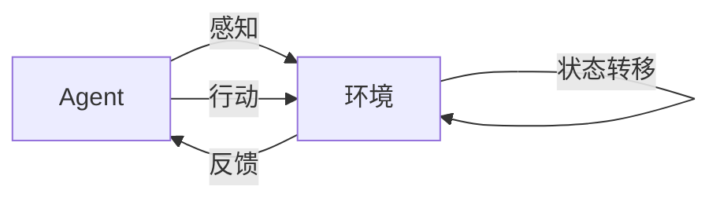

# AI人工智能 Agent：智能体与环境的交互理论

## 1.背景介绍
### 1.1 人工智能的发展历程
#### 1.1.1 人工智能的起源与早期发展
#### 1.1.2 人工智能的黄金时期
#### 1.1.3 人工智能的低谷期与复兴

### 1.2 智能Agent的概念提出
#### 1.2.1 智能Agent的定义
#### 1.2.2 智能Agent的特点
#### 1.2.3 智能Agent与传统AI的区别

### 1.3 智能Agent研究的意义
#### 1.3.1 推动人工智能的发展
#### 1.3.2 解决实际问题
#### 1.3.3 探索人类智能的本质

## 2.核心概念与联系
### 2.1 Agent的定义与属性
#### 2.1.1 Agent的定义
Agent是一个能够感知环境并根据感知结果采取行动的实体。它具有自主性、社会性、反应性和主动性等特点。
#### 2.1.2 Agent的属性
- 自主性：Agent能够独立地执行任务，不需要人为干预。
- 社会性：Agent能够与其他Agent或人类进行交互和协作。
- 反应性：Agent能够及时地感知环境的变化并做出相应的反应。
- 主动性：Agent能够主动地执行任务，不需要外界的触发。

### 2.2 环境的定义与分类
#### 2.2.1 环境的定义 
环境是Agent所处的外部世界，包括物理环境和虚拟环境。Agent通过感知环境获取信息，并通过行动改变环境的状态。
#### 2.2.2 环境的分类
- 完全可观察 vs 部分可观察
- 确定性 vs 非确定性  
- 静态 vs 动态
- 离散 vs 连续

### 2.3 Agent与环境的交互
#### 2.3.1 感知-决策-行动循环
Agent通过感知获取环境信息，根据决策算法做出决策，并采取相应的行动。这个过程不断循环，使Agent能够适应环境的变化。
#### 2.3.2 交互的数学表示
Agent与环境的交互可以用数学语言来表示。设Agent的感知为$P$，行动为$A$，环境状态为$S$，则Agent的决策函数可以表示为：

$$
f: P \rightarrow A
$$

环境的状态转移函数可以表示为：

$$
\delta: S \times A \rightarrow S
$$

### 2.4 Mermaid流程图
下面使用Mermaid流程图来表示Agent与环境的交互过程：



## 3.核心算法原理具体操作步骤
### 3.1 基于搜索的Agent
#### 3.1.1 问题表示
将Agent的决策问题表示为一个搜索问题，定义状态空间、初始状态、目标状态和行动集合。
#### 3.1.2 搜索算法
使用启发式搜索算法，如A*算法，在状态空间中搜索从初始状态到目标状态的最优路径。
#### 3.1.3 行动选择
根据搜索结果选择最优行动，并执行该行动改变环境状态。

### 3.2 基于规划的Agent
#### 3.2.1 问题表示
将Agent的决策问题表示为一个规划问题，定义状态变量、行动变量和目标条件。
#### 3.2.2 规划算法
使用基于约束的规划算法，如Graphplan算法，生成从初始状态到目标状态的行动序列。
#### 3.2.3 行动执行
按照规划结果依次执行行动，直到达到目标状态。

### 3.3 基于强化学习的Agent
#### 3.3.1 问题表示
将Agent的决策问题表示为一个马尔可夫决策过程（MDP），定义状态空间、行动空间、转移概率和奖励函数。
#### 3.3.2 学习算法
使用强化学习算法，如Q-learning或Policy Gradient，通过与环境的交互学习最优策略。
#### 3.3.3 策略执行
根据学习到的策略选择行动，并执行该行动改变环境状态。

## 4.数学模型和公式详细讲解举例说明
### 4.1 马尔可夫决策过程（MDP）
MDP是一种用于建模决策问题的数学框架，由以下元素组成：

- 状态空间 $S$：表示Agent所处的所有可能状态的集合。
- 行动空间 $A$：表示Agent在每个状态下可以采取的所有可能行动的集合。
- 转移概率 $P(s'|s,a)$：表示在状态$s$下采取行动$a$后转移到状态$s'$的概率。
- 奖励函数 $R(s,a)$：表示在状态$s$下采取行动$a$后获得的即时奖励。
- 折扣因子 $\gamma$：表示未来奖励的折扣率，取值范围为$[0,1]$。

MDP的目标是找到一个最优策略$\pi^*$，使得期望累积奖励最大化：

$$
\pi^* = \arg\max_\pi \mathbb{E}\left[\sum_{t=0}^{\infty} \gamma^t R(s_t,a_t) | \pi \right]
$$

其中，$s_t$和$a_t$分别表示在时刻$t$的状态和行动，$\mathbb{E}$表示期望值。

### 4.2 Q-learning算法
Q-learning是一种常用的无模型强化学习算法，用于学习MDP的最优策略。Q-learning算法维护一个Q值表$Q(s,a)$，表示在状态$s$下采取行动$a$的期望累积奖励。Q值表的更新公式为：

$$
Q(s,a) \leftarrow Q(s,a) + \alpha \left[R(s,a) + \gamma \max_{a'} Q(s',a') - Q(s,a)\right]
$$

其中，$\alpha$是学习率，$s'$是在状态$s$下采取行动$a$后转移到的下一个状态。

举例说明：假设有一个智能体在迷宫环境中寻找宝藏，迷宫中有陷阱和障碍物。智能体的状态为当前所处的位置，行动为上下左右四个方向。智能体的目标是尽快找到宝藏，同时避免掉入陷阱。我们可以使用Q-learning算法来学习智能体的最优策略。

- 初始化Q值表，将所有状态-行动对的Q值设置为0。
- 智能体在迷宫中随机选择一个初始位置，然后重复以下步骤：
  - 根据当前状态选择一个行动，通常使用 $\epsilon$-greedy 策略，以 $\epsilon$ 的概率随机选择行动，以 $1-\epsilon$ 的概率选择Q值最大的行动。
  - 执行选择的行动，观察下一个状态和即时奖励。如果到达宝藏位置，给予正奖励；如果掉入陷阱，给予负奖励；其他情况给予小的负奖励，鼓励智能体尽快找到宝藏。
  - 根据上述Q值更新公式，更新当前状态-行动对的Q值。
  - 如果达到终止条件（找到宝藏或掉入陷阱），则结束当前回合，否则将下一个状态作为当前状态，继续执行。
- 重复以上步骤，直到Q值收敛或达到预设的训练回合数。

经过训练，智能体学习到了一个最优策略，能够在迷宫中快速找到宝藏，同时避免掉入陷阱。这个过程展示了强化学习算法在实际问题中的应用。

## 5.项目实践：代码实例和详细解释说明
下面我们使用Python实现一个简单的Q-learning算法，用于解决上述迷宫寻宝问题。

```python
import numpy as np

# 定义迷宫环境
class Maze:
    def __init__(self):
        self.maze = np.array([
            [0, 0, 0, 0, 0],
            [0, -1, 0, -1, 0],
            [0, 0, 0, 0, 0],
            [0, -1, 0, -1, 0],
            [0, 0, 0, 0, 1]
        ])
        self.state = (0, 0)
        
    def reset(self):
        self.state = (0, 0)
        return self.state
    
    def step(self, action):
        i, j = self.state
        if action == 0:  # 上
            i = max(i - 1, 0)
        elif action == 1:  # 下
            i = min(i + 1, 4)
        elif action == 2:  # 左
            j = max(j - 1, 0)
        elif action == 3:  # 右
            j = min(j + 1, 4)
        
        next_state = (i, j)
        reward = self.maze[i, j]
        done = (reward != 0)
        self.state = next_state
        return next_state, reward, done

# 定义Q-learning智能体
class QLearningAgent:
    def __init__(self, maze):
        self.maze = maze
        self.q_table = np.zeros((5, 5, 4))
        self.epsilon = 0.1
        self.alpha = 0.1
        self.gamma = 0.9
        
    def choose_action(self, state):
        if np.random.uniform() < self.epsilon:
            action = np.random.choice(4)
        else:
            action = np.argmax(self.q_table[state])
        return action
    
    def learn(self, state, action, reward, next_state):
        q_value = self.q_table[state][action]
        max_q_next = np.max(self.q_table[next_state])
        td_error = reward + self.gamma * max_q_next - q_value
        self.q_table[state][action] += self.alpha * td_error

# 训练Q-learning智能体
def train(agent, maze, num_episodes):
    for episode in range(num_episodes):
        state = maze.reset()
        done = False
        while not done:
            action = agent.choose_action(state)
            next_state, reward, done = maze.step(action)
            agent.learn(state, action, reward, next_state)
            state = next_state

# 创建迷宫环境和Q-learning智能体
maze = Maze()
agent = QLearningAgent(maze)

# 训练智能体
train(agent, maze, num_episodes=1000)

# 测试智能体
state = maze.reset()
done = False
while not done:
    action = np.argmax(agent.q_table[state])
    state, reward, done = maze.step(action)
    print(f"State: {state}, Action: {action}, Reward: {reward}")
```

代码解释：

1. 首先定义了一个`Maze`类，表示迷宫环境。迷宫用一个5x5的numpy数组表示，其中0表示可通行的格子，-1表示陷阱，1表示宝藏。`reset`方法用于重置智能体的初始位置，`step`方法用于执行行动并返回下一个状态、即时奖励和是否终止。

2. 然后定义了一个`QLearningAgent`类，表示Q-learning智能体。智能体维护一个Q值表，用于存储每个状态-行动对的Q值。`choose_action`方法用于根据当前状态选择行动，使用 $\epsilon$-greedy 策略。`learn`方法用于根据经验样本更新Q值表。

3. `train`函数用于训练Q-learning智能体。在每个回合中，智能体从初始状态开始，不断选择行动并执行，直到达到终止状态。在每个步骤中，智能体根据当前状态选择行动，执行行动后观察下一个状态和即时奖励，然后更新Q值表。

4. 最后，我们创建迷宫环境和Q-learning智能体，调用`train`函数训练智能体，然后测试训练后的智能体在迷宫中的表现。

通过这个简单的例子，我们展示了如何使用Q-learning算法来训练一个智能体解决迷宫寻宝问题。实际应用中，我们可以根据具体问题的特点，选择合适的算法和模型，并进行相应的改进和优化。

## 6.实际应用场景
智能Agent与环境交互的理论在许多实际应用场景中都有广泛的应用，下面列举几个典型的例子：

### 6.1 自动驾驶
自动驾驶汽车可以看作一个智能Agent，它需要感知道路环境（如车道线、交通标志、其他车辆等），根据感知结果做出决策（如加速、减速、转向等），并通过执行动作来控制汽车的行驶。自动驾驶系统通常使用深度强化学习算法来训练