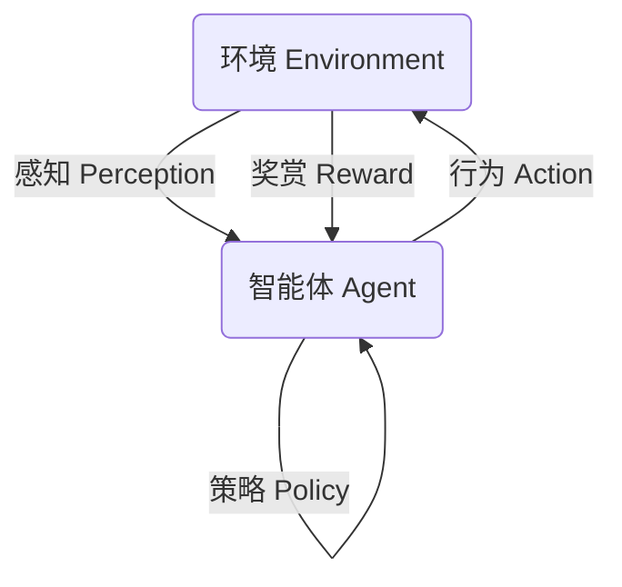
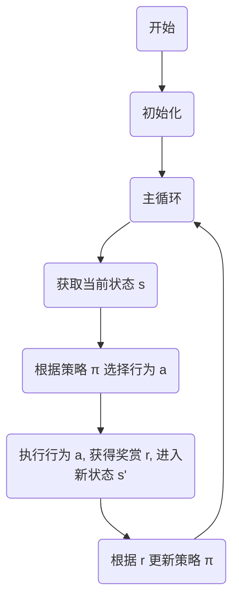

# AI人工智能 Agent：游戏中智能体的应用

## 1. 背景介绍

### 1.1 游戏智能体的重要性

在当今游戏行业中,智能体(Agent)的应用已经成为了一个不可忽视的重要组成部分。游戏智能体是指在游戏环境中能够感知环境、做出决策并执行行为的虚拟实体。它们赋予了游戏中的非玩家角色(NPC)以"智能",使得游戏更加富有挑战性、真实性和沉浸感。

### 1.2 游戏智能体的发展历程

早期的游戏智能体主要采用硬编码的方式,通过预先设定的规则和有限状态机制来控制NPC的行为。随着游戏复杂度的不断提高,硬编码的方式已经无法满足需求。近年来,人工智能技术的飞速发展为游戏智能体的设计带来了新的可能性,使得更加智能、自主和适应性强的游戏智能体成为可能。

### 1.3 人工智能在游戏智能体中的应用

人工智能技术在游戏智能体中的应用主要包括以下几个方面:

- 机器学习算法(如强化学习、深度学习等)用于训练智能体的决策和行为控制
- 路径规划和导航算法用于智能体的移动和寻路
- 自然语言处理技术用于智能体与玩家的交互
- 计算机视觉技术用于智能体对游戏环境的感知和理解

## 2. 核心概念与联系

### 2.1 智能体(Agent)

智能体是指能够感知环境、做出决策并执行行为的自主实体。在游戏中,智能体通常指代NPC(非玩家角色)。智能体需要具备以下几个核心能力:

- 感知(Perception):从环境中获取信息
- 决策(Decision Making):根据感知信息做出行为选择
- 行为执行(Action):执行选择的行为,影响环境状态

### 2.2 环境(Environment)

环境是指智能体所处的虚拟世界,包括了智能体可以感知和影响的所有对象和状态。游戏环境通常是高度动态和不确定的,智能体需要不断地从环境中获取信息并做出相应的反应。

### 2.3 奖赏(Reward)

奖赏是指智能体执行某个行为后,环境给予的正面或负面反馈。奖赏信号是训练智能体的重要依据,智能体的目标是最大化长期累积奖赏。

### 2.4 策略(Policy)

策略是指智能体在给定状态下选择行为的规则或函数映射。优秀的策略能够指导智能体做出正确的决策,从而获得更高的奖赏。

### 2.5 核心概念之间的关系

智能体、环境、奖赏和策略是相互关联的核心概念:

- 智能体通过感知获取环境状态信息
- 根据环境状态和策略,智能体选择执行相应的行为
- 行为会影响环境状态,环境会给予相应的奖赏反馈
- 智能体的目标是学习一个优秀的策略,以最大化长期累积奖赏

## 3. 核心算法原理及具体操作步骤

### 3.1 强化学习(Reinforcement Learning)

强化学习是训练游戏智能体的一种常用算法范式。它的核心思想是通过与环境的互动,智能体不断尝试不同的行为,获得奖赏反馈,并根据这些反馈调整自身的策略,最终学习到一个能够最大化长期累积奖赏的最优策略。

#### 3.1.1 强化学习的基本元素

- 状态(State)$s \in \mathcal{S}$:环境的instantaneous状态
- 行为(Action)$a \in \mathcal{A}(s)$:智能体在状态$s$下可选择的行为
- 奖赏(Reward)$r \in \mathcal{R} \subseteq \mathbb{R}$:执行行为$a$后,环境给予的奖赏反馈
- 策略(Policy)$\pi: \mathcal{S} \rightarrow \mathcal{A}$:智能体在每个状态下选择行为的策略
- 价值函数(Value Function)$V^{\pi}(s)$:在策略$\pi$下,从状态$s$开始执行,预期的长期累积奖赏

#### 3.1.2 强化学习算法流程

强化学习算法的基本流程如下:

1. 初始化智能体和环境
2. 获取当前环境状态$s$
3. 根据当前策略$\pi$选择行为$a$
4. 执行行为$a$,获得奖赏$r$,进入新状态$s'$
5. 根据奖赏$r$更新策略$\pi$
6. 重复2-5,直到达到终止条件

上述过程是一个试错的过程,智能体通过不断尝试和学习,逐步优化自身的策略,最终获得一个近似最优的策略。

#### 3.1.3 强化学习算法分类

常见的强化学习算法包括:

- 基于价值函数的算法:Q-Learning、Sarsa、Deep Q-Network(DQN)等
- 基于策略的算法:Policy Gradient、Actor-Critic、Proximal Policy Optimization(PPO)等
- 模型基础强化学习算法:Dyna、Priority Sweeping等

不同算法在具体实现细节上有所不同,但都遵循上述的基本流程。

### 3.2 路径规划与导航算法

在游戏中,智能体需要能够自主地在虚拟环境中移动和导航,这就需要路径规划与导航算法的支持。常见的路径规划与导航算法包括:

#### 3.2.1 A*算法

A*算法是一种启发式搜索算法,常用于寻找从起点到终点的最短路径。它的基本思路是:

1. 维护一个优先队列,按估计总代价(实际代价+启发代价)从小到大排序
2. 每次从队列中取出估计总代价最小的节点进行扩展
3. 重复上述过程,直到找到目标节点或队列为空

A*算法的优点是能够快速找到最优解,缺点是对内存占用较大。

#### 3.2.2 Nav Mesh导航

Nav Mesh(Navigation Mesh)是一种常用于3D游戏中的导航算法。它的基本思路是:

1. 将游戏场景离散化为一系列可行走区域(Nav Mesh)
2. 在Nav Mesh上使用寻路算法(如A*)计算出最短路径
3. 沿着计算出的路径移动智能体

Nav Mesh算法的优点是高效、可扩展,缺点是需要预先生成Nav Mesh数据。

#### 3.2.3 人群模拟算法

在一些大规模多智能体场景中,需要模拟大量智能体的移动和行为,这就需要使用人群模拟算法。常见的算法包括:

- 规则based算法:如细胞自动机(Cellular Automata)、社会力模型(Social Force Model)等
- 基于场景的算法:如导航场(Navigation Fields)、行为树(Behavior Trees)等
- 基于机器学习的算法:如强化学习、深度学习等

人群模拟算法的目标是在保证智能体行为自然、高效的同时,避免发生拥堵、碰撞等问题。

### 3.3 自然语言处理

自然语言处理(Natural Language Processing, NLP)技术在游戏中主要用于实现智能体与玩家之间的对话交互。常见的NLP技术包括:

#### 3.3.1 语音识别

语音识别技术能够将玩家的语音输入转化为文本,为智能体与玩家的对话交互提供基础。

#### 3.3.2 自然语言理解

自然语言理解(Natural Language Understanding, NLU)技术能够从玩家的语句中提取出语义信息,如意图(Intent)和实体(Entity)等,帮助智能体理解玩家的需求。

#### 3.3.3 对话管理

对话管理(Dialogue Management)技术负责根据玩家的输入和对话上下文,选择合适的响应策略和生成相应的自然语言输出。

#### 3.3.4 自然语言生成

自然语言生成(Natural Language Generation, NLG)技术将智能体的响应意图转化为自然语言文本或语音输出。

#### 3.3.5 端到端对话系统

近年来,基于深度学习的端到端对话系统(End-to-End Dialogue System)也开始在游戏中得到应用,它能够直接从玩家的语音输入生成相应的语音响应,无需经过中间的文本处理步骤。

### 3.4 计算机视觉

计算机视觉技术在游戏中主要用于智能体对游戏环境的感知和理解,包括:

#### 3.4.1 目标检测与识别

通过目标检测和识别算法,智能体能够从视觉输入中识别出游戏中的各种物体、角色等目标,为后续的决策和行为提供依据。

#### 3.4.2 场景理解

场景理解技术能够帮助智能体对整个游戏环境有更加全面的理解,包括空间布局、物体关系等信息。

#### 3.4.3 行为识别

行为识别技术可以从视觉输入中识别出玩家或其他智能体的行为动作,如走路、跳跃、攻击等,为智能体的决策提供重要线索。

#### 3.4.4 深度估计

深度估计技术能够从视觉输入中估计出每个像素点对应的深度信息,为智能体在3D环境中的导航和路径规划提供支持。

上述计算机视觉技术通常基于深度学习模型,如卷积神经网络(CNN)、递归神经网络(RNN)等,并结合了大量的训练数据和强大的GPU计算能力。

## 4. 数学模型和公式详细讲解举例说明

在强化学习和其他人工智能算法中,数学模型和公式扮演着重要的角色。下面将详细介绍一些核心的数学模型和公式。

### 4.1 马尔可夫决策过程(Markov Decision Process, MDP)

马尔可夫决策过程是强化学习算法的数学基础,用于形式化描述智能体与环境的交互过程。一个MDP可以用一个元组$(S, A, P, R, \gamma)$来表示,其中:

- $S$是状态集合
- $A$是行为集合
- $P(s'|s,a)$是状态转移概率,表示在状态$s$执行行为$a$后,转移到状态$s'$的概率
- $R(s,a)$是奖赏函数,表示在状态$s$执行行为$a$后获得的奖赏
- $\gamma \in [0, 1)$是折现因子,用于平衡即时奖赏和长期奖赏的权重

在MDP中,智能体的目标是找到一个策略$\pi: S \rightarrow A$,使得在该策略下的长期累积奖赏最大化,即:

$$\max_{\pi} \mathbb{E}\left[\sum_{t=0}^{\infty} \gamma^t R(s_t, a_t)\right]$$

其中$s_t$和$a_t$分别表示第$t$个时间步的状态和行为,都依赖于策略$\pi$。

### 4.2 Q-Learning算法

Q-Learning是一种基于价值函数的强化学习算法,它试图直接学习一个行为价值函数$Q(s,a)$,表示在状态$s$执行行为$a$后,能够获得的长期累积奖赏。Q-Learning的更新规则如下:

$$Q(s_t, a_t) \leftarrow Q(s_t, a_t) + \alpha \left[r_t + \gamma \max_{a'} Q(s_{t+1}, a') - Q(s_t, a_t)\right]$$

其中$\alpha$是学习率,$r_t$是执行$a_t$后获得的即时奖赏,$\gamma$是折