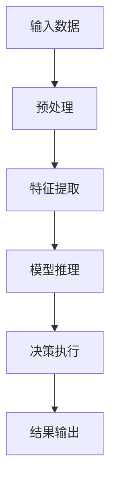

# AI人工智能代理工作流 AI Agent WorkFlow：在自动化检查中的应用

## 1.背景介绍

随着人工智能(AI)技术的不断发展,AI代理工作流程(AI Agent Workflow)已广泛应用于各个领域,尤其是在自动化检查和质量控制方面发挥着越来越重要的作用。AI代理工作流程是一种基于人工智能技术的自动化系统,能够执行各种复杂的任务,从而提高工作效率,减少人工干预。

在自动化检查领域,传统的方法通常依赖于人工检查,这不仅费时费力,而且容易出现人为错误。相比之下,AI代理工作流程能够快速、准确地执行检查任务,从而大大提高了生产效率和产品质量。

## 2.核心概念与联系

### 2.1 AI代理(AI Agent)

AI代理是指具有一定智能的软件实体,能够感知环境、处理信息、做出决策并采取行动。在AI代理工作流程中,AI代理扮演着核心角色,负责执行各种任务和决策。

### 2.2 工作流程(Workflow)

工作流程是指将一系列任务按照特定的顺序和规则组织起来的过程。在AI代理工作流程中,工作流程定义了AI代理需要执行的一系列任务,以及这些任务之间的依赖关系和执行顺序。

### 2.3 自动化检查(Automated Inspection)

自动化检查是指利用计算机系统和相关技术自动执行检查任务的过程。在AI代理工作流程中,自动化检查是一个重要的应用场景,AI代理可以根据预定义的规则和算法,对各种对象(如产品、图像、文本等)进行自动检查和评估。

这三个核心概念紧密相连,共同构成了AI代理工作流程的基础。AI代理是执行任务的主体,工作流程定义了任务的执行顺序和规则,而自动化检查则是AI代理工作流程的一个重要应用场景。

## 3.核心算法原理具体操作步骤

AI代理工作流程的核心算法原理可以概括为以下几个步骤:



### 3.1 输入数据

AI代理工作流程的第一步是获取输入数据。输入数据可以是各种形式,如图像、视频、文本、声音等。在自动化检查场景中,输入数据通常是需要检查的对象,如产品图像、代码文件等。

### 3.2 预处理

获取输入数据后,需要对数据进行预处理,以便后续的特征提取和模型推理。预处理步骤可能包括数据清洗、标准化、增强等操作,具体取决于输入数据的类型和任务需求。

### 3.3 特征提取

特征提取是将输入数据转换为机器可以理解和处理的特征向量的过程。常用的特征提取方法包括手工特征工程和自动特征学习(如深度学习)。有效的特征提取对于模型的性能至关重要。

### 3.4 模型推理

模型推理是指基于提取的特征,使用预先训练好的机器学习模型(如神经网络、决策树等)对输入数据进行分析和预测。模型推理的结果将作为AI代理决策的依据。

### 3.5 决策执行

根据模型推理的结果,AI代理需要做出相应的决策并执行相关操作。在自动化检查场景中,决策可能是判断输入对象是否合格、标记缺陷区域等。

### 3.6 结果输出

最后,AI代理工作流程将输出最终的检查结果,供人工审核或后续处理。结果输出的形式可以是文本报告、可视化界面等。

需要注意的是,上述步骤并非严格线性执行,在实际应用中可能会存在反馈循环和迭代优化。此外,每个步骤的具体实现方式也会因任务需求和应用场景而有所不同。

## 4.数学模型和公式详细讲解举例说明

在AI代理工作流程中,数学模型和公式扮演着重要角色,尤其是在特征提取和模型推理阶段。下面将详细介绍一些常见的数学模型和公式。

### 4.1 线性回归

线性回归是一种常用的监督学习算法,用于建立自变量和因变量之间的线性关系模型。其数学表达式如下:

$$
y = \theta_0 + \theta_1x_1 + \theta_2x_2 + ... + \theta_nx_n
$$

其中,y是预测值,x是自变量,θ是需要学习的参数。

线性回归在自动化检查中可以用于建立缺陷大小与产品质量之间的线性关系模型,从而预测产品质量。

### 4.2 逻辑回归

逻辑回归是一种用于分类任务的算法,它将输入映射到0到1之间的值,可以用于二分类或多分类问题。其数学表达式如下:

$$
P(y=1|x) = \sigma(\theta^Tx) = \frac{1}{1+e^{-\theta^Tx}}
$$

其中,σ是Sigmoid函数,用于将线性函数的输出映射到(0,1)区间。

在自动化检查中,逻辑回归可以用于判断输入对象是否存在缺陷,或将缺陷分类为不同类型。

### 4.3 卷积神经网络(CNN)

卷积神经网络是一种常用的深度学习模型,尤其适用于处理图像和视频数据。CNN的核心思想是通过卷积操作和池化操作提取局部特征,然后通过全连接层进行分类或回归。

卷积操作的数学表达式如下:

$$
(I*K)(i,j) = \sum_{m}\sum_{n}I(i+m,j+n)K(m,n)
$$

其中,I是输入图像,K是卷积核,*表示卷积操作。

在自动化检查中,CNN可以用于检测图像中的缺陷区域,或对缺陷进行分类。

### 4.4 递归神经网络(RNN)

递归神经网络是一种用于处理序列数据(如文本、语音等)的深度学习模型。RNN的核心思想是将当前输入与之前的隐藏状态结合,从而捕捉序列数据中的长期依赖关系。

RNN的数学表达式如下:

$$
h_t = f_W(x_t, h_{t-1})
$$

其中,h_t是当前时刻的隐藏状态,x_t是当前输入,f_W是参数化的非线性函数。

在自动化检查中,RNN可以用于处理序列数据,如代码文件、日志文件等,以检测潜在的缺陷或异常。

以上是一些常见的数学模型和公式,在实际应用中,还可以根据具体任务和数据特征选择或组合其他模型。数学模型和公式为AI代理工作流程提供了理论基础和计算支持。

## 5.项目实践:代码实例和详细解释说明

为了更好地理解AI代理工作流程在自动化检查中的应用,我们将通过一个具体的项目实践来演示。在这个项目中,我们将构建一个基于深度学习的缺陷检测系统,用于检测产品图像中的缺陷。

### 5.1 数据准备

我们首先需要准备一个包含产品图像及其对应缺陷标注的数据集。这个数据集将被分为训练集、验证集和测试集。

```python
import os
import random
from PIL import Image
import numpy as np

# 设置数据路径
data_dir = 'data/images'
annot_dir = 'data/annotations'

# 加载图像和标注
images = []
annotations = []
for filename in os.listdir(data_dir):
    img_path = os.path.join(data_dir, filename)
    annot_path = os.path.join(annot_dir, filename.split('.')[0] + '.txt')
    
    img = Image.open(img_path)
    img = np.array(img)
    images.append(img)
    
    with open(annot_path, 'r') as f:
        annot = f.readlines()
    annotations.append(annot)

# 划分数据集
random.seed(42)
indices = list(range(len(images)))
random.shuffle(indices)

train_indices = indices[:int(0.7*len(indices))]
val_indices = indices[int(0.7*len(indices)):int(0.9*len(indices))]
test_indices = indices[int(0.9*len(indices)):]

train_images = [images[i] for i in train_indices]
train_annotations = [annotations[i] for i in train_indices]

val_images = [images[i] for i in val_indices]
val_annotations = [annotations[i] for i in val_indices]

test_images = [images[i] for i in test_indices]
test_annotations = [annotations[i] for i in test_indices]
```

在上述代码中,我们首先加载图像和对应的缺陷标注文件。然后,我们将数据集随机划分为训练集、验证集和测试集,分别占70%、20%和10%。

### 5.2 数据预处理

对于图像数据,我们需要进行一些预处理操作,如调整大小、归一化等,以满足模型的输入要求。

```python
import albumentations as A

# 定义数据增强和预处理变换
train_transform = A.Compose([
    A.Resize(height=256, width=256),
    A.HorizontalFlip(p=0.5),
    A.VerticalFlip(p=0.5),
    A.Normalize()
], bbox_params=A.BboxParams(format='yolo', label_fields=['class_labels']))

val_transform = A.Compose([
    A.Resize(height=256, width=256),
    A.Normalize()
], bbox_params=A.BboxParams(format='yolo', label_fields=['class_labels']))

# 应用变换
train_dataset = [(img, annot) for img, annot in zip(train_images, train_annotations)]
train_dataset = train_transform(train_dataset)

val_dataset = [(img, annot) for img, annot in zip(val_images, val_annotations)]
val_dataset = val_transform(val_dataset)
```

在上述代码中,我们使用了Albumentations库来定义数据增强和预处理变换。对于训练集,我们应用了调整大小、水平翻转、垂直翻转和归一化等操作。对于验证集,我们只进行了调整大小和归一化操作。

### 5.3 模型构建和训练

接下来,我们将构建一个基于Faster R-CNN的目标检测模型,并在训练集上进行训练。

```python
import torch
from torchvision.models.detection import fasterrcnn_resnet50_fpn

# 初始化模型
model = fasterrcnn_resnet50_fpn(pretrained=True, num_classes=2)  # 2类别:背景和缺陷

# 定义损失函数和优化器
params = [p for p in model.parameters() if p.requires_grad]
optimizer = torch.optim.SGD(params, lr=0.005, momentum=0.9, weight_decay=0.0005)
lr_scheduler = torch.optim.lr_scheduler.StepLR(optimizer, step_size=3, gamma=0.1)

# 训练模型
num_epochs = 10
for epoch in range(num_epochs):
    # 训练模式
    model.train()
    epoch_loss = 0
    for images, annotations in train_dataset:
        images = list(image.to(device) for image in images)
        annotations = [{k: v.to(device) for k, v in t.items()} for t in annotations]
        
        loss_dict = model(images, annotations)
        losses = sum(loss for loss in loss_dict.values())
        
        optimizer.zero_grad()
        losses.backward()
        optimizer.step()
        
        epoch_loss += losses.item()
        
    # 验证模式
    model.eval()
    with torch.no_grad():
        val_loss = 0
        for images, annotations in val_dataset:
            images = list(image.to(device) for image in images)
            annotations = [{k: v.to(device) for k, v in t.items()} for t in annotations]
            
            loss_dict = model(images, annotations)
            losses = sum(loss for loss in loss_dict.values())
            val_loss += losses.item()
            
    # 更新学习率
    lr_scheduler.step()
    
    # 打印训练信息
    print(f'Epoch: {epoch+1}/{num_epochs}, Train Loss: {epoch_loss/len(train_dataset)}, Val Loss: {val_loss/len(val_dataset)}')

# 保存模型
torch.save(model.state_dict(), 'model.pth')
```

在上述代码中,我们使用PyTorch库构建了一个基于Faster R-CNN的目标检测模型。我们定义了损失函数和优化器,并在训练集上进行了10个epoch的训练。在每个epoch结束时,我们会在验证集上评估模型的性能,并