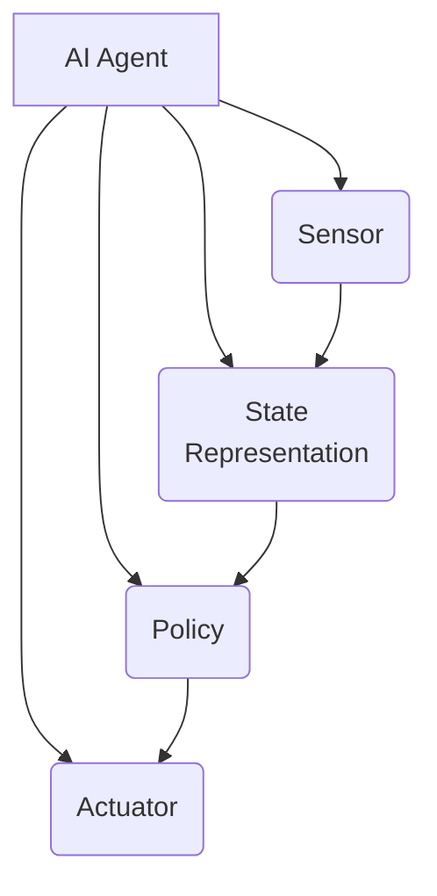
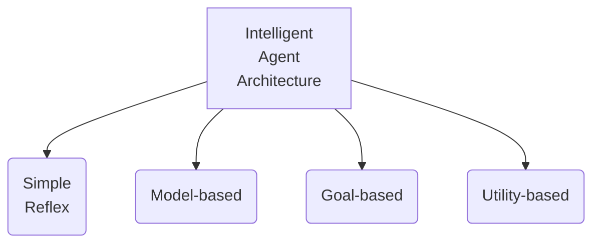
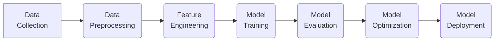

# AI人工智能代理工作流AI Agent WorkFlow：AI代理在防灾减灾系统中的作用

## 1.背景介绍

### 1.1 自然灾害的威胁

自然灾害一直是人类社会面临的重大挑战之一。无论是地震、洪水、台风还是野火,这些自然灾害不仅造成了巨大的人员伤亡和经济损失,而且对生态环境也产生了深远的影响。根据联合国统计,过去20年中,自然灾害造成了130万人死亡,影响了40亿人的生活。

### 1.2 防灾减灾的重要性

为了减轻自然灾害带来的损失,各国政府和国际组织一直在努力加强防灾减灾工作。防灾减灾是指采取一系列措施,提高社会对自然灾害的防御能力,降低灾害风险,减少灾害造成的损失。这包括灾前的预防、灾中的应急响应和灾后的重建等多个环节。

### 1.3 人工智能在防灾减灾中的作用

随着人工智能技术的不断发展,AI已经在防灾减灾领域发挥了越来越重要的作用。AI系统可以通过分析大量的数据,预测灾害发生的可能性,并提供早期预警。同时,AI也可以帮助优化救援资源的调配,提高救援效率。此外,AI还可以用于灾后重建规划、评估损失等工作。

## 2.核心概念与联系

### 2.1 人工智能代理(AI Agent)

人工智能代理是指能够感知环境,并根据感知结果做出决策和行动的软件实体。AI代理通常由以下几个核心组件组成:

- 感知器(Sensor):用于获取环境信息
- 执行器(Actuator):用于执行代理的行为
- 状态表示(State Representation):描述代理当前所处的环境状态
- 策略(Policy):根据状态决定采取何种行为

### 2.2 智能体架构

智能体架构描述了AI代理如何处理感知到的信息,并做出相应的行为决策。常见的智能体架构有:

- 简单反射架构(Simple Reflex Agent)
- 基于模型的架构(Model-based Agent)
- 基于目标的架构(Goal-based Agent)
- 基于效用的架构(Utility-based Agent)

### 2.3 AI工作流(AI Workflow)

AI工作流描述了AI系统从数据采集到模型部署的完整过程,包括以下几个关键步骤:

1. 数据采集和预处理
2. 特征工程
3. 模型训练
4. 模型评估
5. 模型优化
6. 模型部署

## 3.核心算法原理具体操作步骤

在防灾减灾系统中,AI代理通常需要执行以下几个核心任务:

### 3.1 灾害预测

灾害预测是指根据历史数据和当前环境信息,预测未来某个时间点发生灾害的可能性。常用的算法包括:

1. **机器学习算法**:如决策树、随机森林、支持向量机等
2. **深度学习算法**:如卷积神经网络、递归神经网络等
3. **时间序列分析算法**:如ARIMA、LSTM等

#### 3.1.1 机器学习算法

以随机森林算法为例,其核心步骤如下:

1. 收集历史灾害数据和相关环境数据(如气象、地质等)
2. 对数据进行预处理,处理缺失值、异常值等
3. 构建训练集和测试集
4. 使用随机森林算法在训练集上训练模型
5. 在测试集上评估模型性能
6. 将训练好的模型应用于新的环境数据,预测灾害发生概率

#### 3.1.2 深度学习算法

以卷积神经网络为例,其核心步骤如下:

1. 收集历史灾害数据,如卫星遥感图像
2. 对图像数据进行预处理,如裁剪、标注等
3. 构建训练集和验证集
4. 设计卷积神经网络模型结构
5. 使用训练集对模型进行训练
6. 在验证集上评估模型性能
7. 将训练好的模型应用于新的图像数据,预测灾害发生区域

### 3.2 资源优化调度

资源优化调度是指在灾害发生时,合理分配救援资源(如人力、物资、设备等),以最大限度减少损失。常用的算法包括:

1. **约束规划算法**:如整数规划、混合整数规划等
2. **启发式搜索算法**:如遗传算法、蚁群算法等
3. **强化学习算法**:如Q-Learning、Policy Gradient等

#### 3.2.1 约束规划算法

以整数规划为例,其核心步骤如下:

1. 收集灾区的需求信息,如受灾人口、医疗需求等
2. 收集可用救援资源的信息,如位置、数量等
3. 构建数学模型,将问题形式化为目标函数和约束条件
4. 使用整数规划算法求解最优解
5. 根据最优解调度救援资源

#### 3.2.2 强化学习算法

以Q-Learning为例,其核心步骤如下:

1. 构建环境模型,包括状态、行为、奖励等
2. 初始化Q表格
3. 对每个状态-行为对,更新Q值
4. 根据最大Q值选择最优行为
5. 执行行为,获得奖励,进入新状态
6. 重复3-5,直到收敛

### 3.3 灾后评估

灾后评估是指在灾害结束后,评估灾害造成的损失,为未来的防灾减灾工作提供决策依据。常用的算法包括:

1. **遥感图像分析算法**:如像素分类、目标检测等
2. **自然语言处理算法**:如情感分析、主题建模等
3. **计算机视觉算法**:如图像分割、3D重建等

#### 3.3.1 遥感图像分析算法

以像素分类为例,其核心步骤如下:

1. 收集灾区的遥感影像数据
2. 对影像数据进行预处理,如去噪、校正等
3. 选择合适的分类算法,如支持向量机、随机森林等
4. 使用算法对影像像素进行分类,得到不同地物的分布
5. 根据分类结果评估灾区的破坏程度

#### 3.3.2 自然语言处理算法

以情感分析为例,其核心步骤如下:

1. 收集灾区居民的社交媒体数据
2. 对文本数据进行预处理,如分词、去停用词等
3. 使用情感分析算法对文本进行情感标注
4. 统计不同情感类别的比例
5. 根据情感分析结果评估灾区居民的心理状况

## 4.数学模型和公式详细讲解举例说明

在防灾减灾系统中,数学模型和公式扮演着重要的角色。下面将详细介绍几个常见的数学模型和公式。

### 4.1 贝叶斯决策理论

贝叶斯决策理论是一种在不确定性条件下进行决策的理论,它基于概率论和效用理论。在防灾减灾中,可以利用贝叶斯决策理论来评估不同决策方案的风险和收益,从而选择最优方案。

贝叶斯决策理论的核心公式为:

$$
U(a_i) = \sum_{j=1}^n P(s_j|a_i)U(s_j)
$$

其中:

- $a_i$表示第i个决策方案
- $s_j$表示第j个状态
- $P(s_j|a_i)$表示在采取决策$a_i$的情况下,状态$s_j$发生的概率
- $U(s_j)$表示状态$s_j$的效用值

通过计算每个决策方案的期望效用$U(a_i)$,可以选择期望效用最大的方案作为最优决策。

### 4.2 马尔可夫决策过程

马尔可夫决策过程(Markov Decision Process, MDP)是一种描述序列决策问题的数学框架,它可以用于建模和求解资源优化调度等问题。

MDP由以下几个要素组成:

- 状态集合$S$
- 行为集合$A$
- 转移概率$P(s'|s,a)$,表示在状态$s$采取行为$a$后,转移到状态$s'$的概率
- 奖励函数$R(s,a,s')$,表示在状态$s$采取行为$a$后,转移到状态$s'$的奖励值

MDP的目标是找到一个策略$\pi:S\rightarrow A$,使得期望累积奖励最大化:

$$
\max_\pi \mathbb{E}\left[\sum_{t=0}^\infty \gamma^t R(s_t,a_t,s_{t+1})\right]
$$

其中$\gamma$是折现因子,用于平衡即时奖励和长期奖励。

### 4.3 混合整数规划

混合整数规划(Mixed Integer Programming, MIP)是一种将连续变量和整数变量结合起来的数学优化模型,它可以用于解决资源分配、路径规划等问题。

MIP的一般形式为:

$$
\begin{align*}
\min\quad & f(x,y) \\
\text{s.t.}\quad & g_i(x,y) \leq 0, \quad i=1,\ldots,m \\
& x \in \mathbb{R}^n \\
& y \in \mathbb{Z}^p
\end{align*}
$$

其中:

- $x$是连续变量向量
- $y$是整数变量向量
- $f(x,y)$是目标函数
- $g_i(x,y)$是约束条件

通过求解MIP模型,可以得到最优的连续变量和整数变量的值,从而解决实际问题。

### 4.4 图像分割算法

在灾后评估中,常常需要对遥感影像进行分割,以识别出不同的地物。常见的图像分割算法包括基于阈值的方法、基于边缘的方法、基于区域的方法等。

以基于阈值的Otsu算法为例,其核心思想是通过最大化类内方差和类间方差的比值,自动确定最优阈值。

设图像灰度级为$[0,L-1]$,若将图像二值化的阈值设为$k$,则前景像素点的点集合记为$C_0$,背景像素点的点集合记为$C_1$,它们的点数之比为:

$$
\omega_0 = \sum_{i=0}^{k}P(i),\quad \omega_1 = \sum_{i=k+1}^{L-1}P(i)
$$

其中$P(i)$表示灰度值为$i$的像素点在整幅图像中所占的比例。

定义前景和背景的均值为:

$$
\mu_0 = \sum_{i=0}^{k}\frac{iP(i)}{\omega_0},\quad \mu_1 = \sum_{i=k+1}^{L-1}\frac{iP(i)}{\omega_1}
$$

则类间方差为:

$$
\sigma_B^2(k) = \omega_0(\mu_0-\mu_T)^2 + \omega_1(\mu_1-\mu_T)^2
$$

其中$\mu_T$为整幅图像的均值灰度值。

Otsu算法的目标是找到一个阈值$k^*$,使得$\sigma_B^2(k^*)$最大化,从而将图像分为前景和背景两部分。

## 5.项目实践：代码实例和详细解释说明

为了更好地理解AI代理在防灾减灾系统中的应用,我们将通过一个具体的项目实践来演示。该项目旨在构建一个AI代理系统,用于预测和响应野火灾害。

### 5.1 数据采集和预处理

我们首先需要