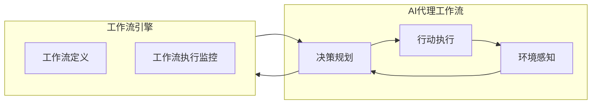

# AI人工智能代理工作流AI Agent WorkFlow：AI代理工作流在智能农业领域的应用

## 1.背景介绍

### 1.1 农业发展现状与挑战

农业是人类赖以生存的根本，在全球范围内扮演着不可或缺的重要角色。然而,当前农业生产面临着诸多挑战,例如气候变化、环境恶化、人口增长、资源短缺等。这些问题不仅影响着农产品的产量和质量,也威胁到整个生态系统的平衡。

### 1.2 智能农业的兴起

为了应对上述挑战,智能农业应运而生。智能农业是一种利用先进技术(如物联网、大数据、人工智能等)优化农业生产过程的新型农业模式。它旨在提高农业生产效率、降低资源消耗、减少环境影响,最终实现可持续发展。

### 1.3 AI代理在智能农业中的作用  

在智能农业的多个环节中,AI代理工作流(AI Agent Workflow)发挥着关键作用。AI代理是一种基于人工智能技术的自主软件实体,能够感知环境、学习知识、规划行动并执行任务。将AI代理应用于农业生产,可以极大提高决策的智能化水平和自动化程度。

## 2.核心概念与联系

### 2.1 AI代理(AI Agent)

AI代理是指能够自主感知环境、学习知识、规划行动并执行任务的软件实体。它是人工智能系统的核心组成部分,负责与外部世界进行交互并完成特定目标。

AI代理通常由以下几个关键模块组成:

- 感知器(Sensor):用于获取环境信息
- 规划器(Planner):根据感知信息制定行动计划  
- 执行器(Actuator):执行规划好的行动

### 2.2 工作流(Workflow)

工作流指的是为完成某个过程或目标而精心设计的一系列有序活动。它将复杂的任务分解为多个可管理的步骤,确保整个过程高效、一致地执行。

工作流一般包括以下几个核心要素:

- 活动(Activity):工作流中的基本执行单元
- 控制流(Control Flow):活动之间的执行顺序和条件
- 数据流(Data Flow):活动之间输入输出数据的流动
- 角色(Role):负责执行特定活动的参与者

### 2.3 AI代理工作流

AI代理工作流是将AI代理和工作流两个概念相结合的产物。它借助工作流的方式,将复杂的任务分解为一系列可由AI代理执行的活动,并对这些活动进行合理编排,从而实现智能化的过程自动化。

AI代理工作流的核心思想是:

- 利用AI代理的自主性,将工作流中的活动自动化
- 借助工作流的模式,对AI代理的行为进行规范化管理
- 将AI技术与传统工作流范式相结合,实现智能化和自动化的统一

AI代理工作流架构通常由以下几个部分组成:

- 环境感知:AI代理通过感知器获取环境数据
- 决策规划:根据感知数据和工作流定义,制定行动计划 
- 行动执行:AI代理通过执行器执行规划的行动
- 工作流引擎:管理工作流定义,监控和控制工作流执行

## 3.核心算法原理具体操作步骤  

### 3.1 AI规划算法

AI规划是AI代理工作流中的核心算法,其目的是根据当前状态和目标状态,生成一系列合理的行动来完成任务。常见的AI规划算法有:

#### 3.1.1 状态空间搜索算法

1) 建模:将问题形式化为状态空间模型
2) 节点展开:从初始状态开始,生成可能的后继状态
3) 评估函数:设计评估函数估算解的质量
4) 搜索策略:选择合适的搜索算法(BFS、DFS、A*等)
5) 路径生成:根据搜索结果,构造出行动路径

#### 3.1.2 层次任务网络(HTN)规划

1) 问题分解:将高层次复杂任务分解为子任务网络
2) 操作符匹配:寻找合适的操作符与子任务相匹配 
3) 前提约束检查:检查操作符的前提条件是否满足
4) 任务分解:将匹配的操作符分解为更低层次子任务
5) 终止检查:重复2-4步,直到所有叶子任务都是原语动作
6) 动作序列构造:按分解顺序构造出原语动作序列

#### 3.1.3 时序约束规划

1) 建模:将问题形式化为时序约束网络模型
2) 编码:将状态变量、目标和约束编码为线性约束集
3) 求解:使用线性规划或约束规划技术求解约束集
4) 解码:将求解结果(变量值)解码为时序计划

#### 3.1.4 基于案例的规划

1) 案例库构建:收集并存储历史成功规划案例
2) 案例检索:根据当前问题,在案例库中检索最相似案例
3) 案例修复:对检索出的案例进行修复和适配调整
4) 案例保存:将新生成的规划案例保存到案例库

### 3.2 工作流执行算法

工作流执行算法负责根据工作流定义,协调和控制AI代理的行为,确保工作流按预期方式执行。主要算法包括:

#### 3.2.1 基于有限状态机的工作流执行

1) 建模:将工作流定义转换为有限状态机模型
2) 初始化:设置工作流的初始状态
3) 事件处理:捕获工作流中的事件(活动完成、条件满足等)
4) 状态迁移:根据当前状态和事件类型,执行状态迁移
5) 活动调度:根据新状态,通知和调度相应的AI代理执行活动
6) 终止检查:重复3-5步,直到达到工作流终止状态

#### 3.2.2 基于Petri网的工作流执行  

1) 建模:将工作流定义转换为Petri网模型
2) 标识初始状态:在Petri网中给出初始状态的标识
3) 转移规则:定义Petri网的转移规则
4) 状态演化:遵循转移规则,让Petri网按顺序演化
5) 活动映射:将Petri网中的变迁与AI代理活动相映射
6) 活动调度:根据Petri网的演化,调度相应的AI代理活动
7) 终止检查:重复4-6步,直到达到目标状态

#### 3.2.3 基于业务规则流的工作流执行

1) 建模:将工作流定义转换为面向数据的业务规则流模型 
2) 规则执行环境:构建规则执行环境,加载业务规则
3) 事实断言:将工作流实例数据断言为事实插入环境
4) 规则匹配:匹配当前事实满足的所有业务规则
5) 规则执行:执行匹配的业务规则,产生新的事实或行动
6) 活动映射:将规则执行的行动映射为AI代理活动
7) 活动调度:调度对应的AI代理执行映射的活动
8) 状态更新:更新规则执行环境中的事实状态
9) 终止检查:重复3-8步,直到达到目标状态

## 4.数学模型和公式详细讲解举例说明

在AI代理工作流中,数学模型和公式广泛应用于多个环节,例如规划算法、工作流执行、决策过程等。下面将详细介绍其中的几个核心模型和公式。

### 4.1 马尔可夫决策过程(MDP)

马尔可夫决策过程是AI代理工作流中一种常用的数学模型,用于描述决策序列问题。一个MDP模型可以形式化定义为:

$$MDP = \langle S, A, P, R, \gamma \rangle$$

其中:
- $S$是有限状态集合
- $A$是有限动作集合  
- $P(s' \mid s, a)$是状态转移概率,表示在状态$s$执行动作$a$后,转移到状态$s'$的概率
- $R(s, a)$是奖励函数,表示在状态$s$执行动作$a$获得的即时奖励
- $\gamma \in [0, 1)$是折现因子,用于权衡当前奖励和未来奖励的权重

MDP的目标是找到一个最优策略$\pi^*(s)$,使得期望的累积折现奖励最大:

$$\max_\pi E\left[ \sum_{t=0}^\infty \gamma^t R(s_t, \pi(s_t)) \mid s_0 = s \right]$$

常用的求解MDP的算法包括价值迭代、策略迭代、Q-Learning等。

### 4.2 时序约束满足问题(TCSP)

时序约束满足问题是AI代理工作流中常用的一种建模和求解范式,适用于存在时序约束的规划问题。一个TCSP可以形式化定义为:

$$TCSP = \langle V, D, C \rangle$$

其中:
- $V$是有限变量集合,表示需要求解的时间点或时间段
- $D$是变量的值域,通常为实数集
- $C$是时序约束集合,每个约束$c_i$是对变量之间的时序关系的限制条件

TCSP的目标是找到一种变量赋值方案,使得所有约束同时满足。通常可以将TCSP编码为线性约束集,然后使用线性规划或约束规划技术求解。

例如,对于一个农场的灌溉规划问题,可以建立如下TCSP模型:

$$\begin{align*}
V &= \{t_1, t_2, \ldots, t_n\} && \text{各区域的灌溉开始时间} \\
D &= \{x \in \mathbb{R} \mid 0 \leq x \leq 24\} && \text{一天24小时的时间范围} \\
C &= \begin{cases}
t_i + d_i \leq t_j & \text{区域 $i$ 灌溉完成后才能开始区域 $j$} \\
t_i \geq r_i & \text{区域 $i$ 的最早开始时间约束} \\
\sum_{i=1}^n d_i \leq T_\text{max} & \text{总灌溉时长不超过给定上限}
\end{cases}
\end{align*}$$

求解这个TCSP即可得到满足所有约束的最优灌溉时间安排。

### 4.3 层次任务网络(HTN)

层次任务网络是AI规划中常用的知识表示形式,适合描述具有固定分解模式的复杂任务。一个HTN可以形式化定义为:

$$HTN = \langle T, O, M \rangle$$

其中:
- $T$是任务集合,包括复合任务和原语任务
- $O$是操作符集合,每个操作符$o_i$对应一种任务分解方式
- $M$是分解方法集合,描述如何将复合任务分解为子任务网络

例如,对于农场的收割任务,可以建立如下HTN模型:

$$\begin{align*}
T &= \{\text{收割}, \text{割晒}, \text{打捆}, \text{运输}, \ldots\} \\
O &= \begin{cases}
\text{收割}(\text{区域}) \Rightarrow \{\text{割晒}(\text{区域}), \text{打捆}(\text{区域}), \text{运输}(\text{区域})\} \\
\text{割晒}(\text{区域}) \Rightarrow \{\text{开割晒机}(\text{区域}), \text{监控割晒}(\text{区域})\} \\
\ldots
\end{cases} \\
M &= \{\text{收割分解}, \text{割晒分解}, \ldots\}
\end{align*}$$

HTN规划的目标是从初始任务网络出发,通过重复分解操作,直到所有叶子节点都是原语任务,从而生成一个行动序列来完成整个复合任务。

### 4.4 Petri网

Petri网是一种数学建模