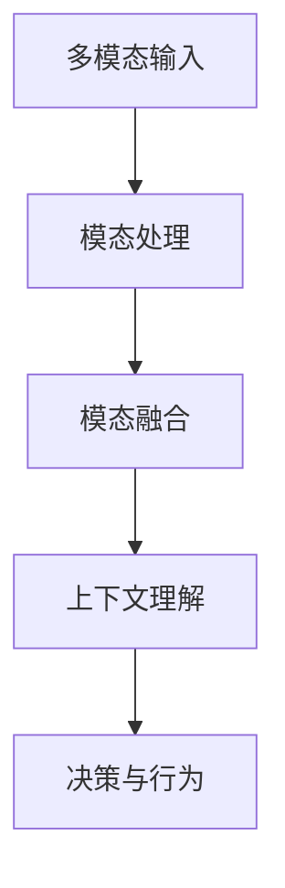

# AI人工智能代理工作流AI Agent WorkFlow：AI代理的多模态感知与处理能力

## 1.背景介绍

在当今世界,人工智能(AI)技术的飞速发展正在推动着各行各业的变革。随着人工智能系统的不断进化,它们不仅能够处理结构化的数字数据,还能够感知和理解多种形式的非结构化信息,如图像、语音、自然语言等。这种多模态感知和处理能力使得人工智能代理能够更好地与人类互动,理解人类的需求,并提供更加智能和人性化的服务。

人工智能代理工作流(AI Agent Workflow)是一种描述人工智能代理如何感知、理解和响应多种模态输入的概念模型。它阐述了人工智能代理在接收到不同形式的输入后,如何通过一系列处理步骤来生成相应的输出,并与人类或其他系统进行交互。这种工作流程不仅体现了人工智能代理的多模态能力,还强调了其在理解、推理和决策方面的智能水平。

### 1.1 人工智能代理的重要性

人工智能代理在各个领域扮演着越来越重要的角色,如智能助手、聊天机器人、自动驾驶系统、医疗诊断辅助等。它们能够通过多模态交互方式,更好地理解和满足人类的需求,提高效率和体验。人工智能代理的多模态感知与处理能力使其具有以下优势:

- **自然交互**:人工智能代理可以通过语音、图像、手势等多种模态与人类自然交互,提供更加人性化的体验。
- **信息融合**:人工智能代理能够融合来自不同模态的信息,形成更加全面和准确的理解。
- **智能决策**:基于对多模态信息的理解,人工智能代理可以进行复杂的推理和决策,提供智能化的解决方案。
- **可扩展性**:人工智能代理的模块化设计使其能够灵活地集成新的模态处理能力,满足不断变化的需求。

### 1.2 多模态感知与处理的挑战

尽管人工智能代理的多模态感知与处理能力带来了诸多优势,但也面临着一些重大挑战:

- **模态异构性**:不同模态的数据具有不同的表示形式和特征,需要设计合适的模型和算法来处理这种异构性。
- **模态关联性**:不同模态之间存在着复杂的关联关系,需要有效地捕获和利用这些关联信息。
- **上下文理解**:人工智能代理需要能够理解输入信息的上下文,才能做出合理的响应。
- **决策一致性**:在处理多模态输入时,人工智能代理需要确保其决策和行为的一致性。
- **可解释性**:人工智能代理的决策过程应该具有可解释性,以便人类能够理解和信任其行为。

## 2.核心概念与联系

为了更好地理解人工智能代理工作流中的多模态感知与处理能力,我们需要先介绍一些核心概念及其相互关系。

### 2.1 模态(Modality)

模态是指人工智能代理可以感知和处理的信息形式,包括但不限于以下几种:

1. **视觉模态**(Visual Modality):如图像、视频等。
2. **语音模态**(Audio Modality):如语音、音频等。
3. **文本模态**(Text Modality):如自然语言文本等。
4. **传感器模态**(Sensor Modality):如温度、压力、加速度等传感器数据。

不同的模态需要使用不同的算法和模型进行处理和理解。例如,计算机视觉技术用于处理图像和视频,自然语言处理技术用于处理文本,信号处理技术用于处理语音和传感器数据。

### 2.2 模态融合(Modality Fusion)

模态融合是指将来自不同模态的信息进行整合和融合,以获得更加全面和准确的理解。模态融合可以发生在不同的层次上,如特征级别、决策级别或混合级别。

常见的模态融合方法包括:

- **早期融合**(Early Fusion):在特征提取阶段就将不同模态的特征进行拼接或融合。
- **晚期融合**(Late Fusion):先分别对每种模态进行处理和决策,然后将不同模态的决策结果进行融合。
- **混合融合**(Hybrid Fusion):结合早期融合和晚期融合的优点,在不同层次上进行模态融合。

模态融合的目标是利用不同模态之间的complementary和redundancy信息,提高人工智能代理的理解和决策能力。

### 2.3 上下文理解(Context Understanding)

上下文理解是指人工智能代理能够捕捉和利用输入信息的上下文信息,以更好地理解其含义和意图。上下文信息可以包括:

- **语境信息**(Linguistic Context):如语言的语法、语义、语用等信息。
- **情景信息**(Situational Context):如时间、地点、环境等信息。
- **领域知识**(Domain Knowledge):与特定领域相关的背景知识。

通过上下文理解,人工智能代理可以更准确地解释输入信息,做出更加合理的决策和响应。

### 2.4 决策与行为(Decision and Action)

决策与行为是人工智能代理工作流的最终目标。基于对多模态输入的理解,人工智能代理需要做出相应的决策,并执行相应的行为或动作。

决策过程可能涉及推理、规划、优化等复杂的认知过程。行为或动作的形式可以是语音输出、文本生成、控制命令等,也可以是更加复杂的行为序列。

为了确保决策和行为的一致性和合理性,人工智能代理需要综合考虑多模态输入、上下文信息以及相关的领域知识和约束条件。

### 2.5 核心概念关系

上述核心概念之间存在着密切的关联关系,如下图所示:

1. 人工智能代理首先接收来自不同模态的输入信息,如图像、语音、文本等。
2. 对于每种模态,都需要使用相应的算法和模型进行处理和特征提取。
3. 将来自不同模态的特征或决策结果进行融合,以获得更加全面和准确的理解。
4. 基于模态融合的结果,结合上下文信息和领域知识,进行上下文理解。
5. 最终,人工智能代理根据上下文理解的结果,做出相应的决策并执行相应的行为或动作。

这个过程体现了人工智能代理工作流中多模态感知与处理能力的核心思想。

## 3.核心算法原理具体操作步骤

在人工智能代理工作流中,实现多模态感知与处理能力需要涉及多种算法和模型。本节将介绍一些核心算法的原理和具体操作步骤。

### 3.1 模态特征提取

对于每种模态,都需要使用相应的算法和模型来提取特征,以便后续的处理和融合。

#### 3.1.1 计算机视觉特征提取

对于视觉模态(如图像、视频),常用的特征提取算法包括:

1. **传统特征提取算法**:如SIFT、HOG等手工设计的特征提取算法。
2. **深度卷积神经网络(CNN)**:通过卷积、池化等操作自动学习特征表示。

具体操作步骤如下:

1. 对输入图像进行预处理,如归一化、数据增强等。
2. 使用CNN模型(如VGG、ResNet等)对图像进行前向传播,提取特征映射。
3. 对特征映射进行后处理,如全局平均池化、特征归一化等。

#### 3.1.2 语音特征提取

对于语音模态,常用的特征提取算法包括:

1. **梅尔频率倒谱系数(MFCC)**:基于人耳听觉特性的语音特征提取方法。
2. **深度神经网络**:如卷积神经网络(CNN)、循环神经网络(RNN)等,用于自动学习语音特征表示。

具体操作步骤如下:

1. 对输入语音信号进行预加重、分帧等预处理。
2. 计算每帧语音的MFCC特征,作为传统特征表示。
3. 使用深度神经网络模型(如CNN、RNN等)对MFCC特征进行建模,提取更高层次的特征表示。

#### 3.1.3 文本特征提取

对于文本模态,常用的特征提取算法包括:

1. **词袋模型(Bag-of-Words)**:将文本表示为词频向量。
2. **词嵌入(Word Embedding)**:如Word2Vec、GloVe等,将词映射到低维密集向量空间。
3. **深度神经网络**:如CNN、RNN、Transformer等,用于自动学习文本特征表示。

具体操作步骤如下:

1. 对输入文本进行预处理,如分词、去停用词等。
2. 使用词袋模型或词嵌入技术将文本转换为初始特征表示。
3. 使用深度神经网络模型(如CNN、RNN、Transformer等)对初始特征进行建模,提取更高层次的文本特征表示。

### 3.2 模态融合算法

模态融合算法旨在将来自不同模态的特征或决策结果进行整合,以获得更加全面和准确的理解。常见的模态融合算法包括:

#### 3.2.1 早期融合

早期融合是在特征级别进行模态融合,通常采用简单的特征拼接或融合方式。

具体操作步骤如下:

1. 分别对每种模态进行特征提取,获得对应的特征向量。
2. 将不同模态的特征向量进行拼接或融合,形成一个多模态特征向量。
3. 将多模态特征向量输入到后续的模型中,进行进一步的处理和建模。

#### 3.2.2 晚期融合

晚期融合是在决策级别进行模态融合,通常采用规则融合或机器学习模型进行融合。

具体操作步骤如下:

1. 分别对每种模态进行单模态处理,获得对应的决策结果。
2. 使用规则融合(如加权平均、多数投票等)或机器学习模型(如支持向量机、随机森林等)对不同模态的决策结果进行融合。
3. 输出融合后的最终决策结果。

#### 3.2.3 混合融合

混合融合是结合早期融合和晚期融合的优点,在不同层次上进行模态融合。

具体操作步骤如下:

1. 分别对每种模态进行特征提取,获得对应的特征向量。
2. 使用早期融合方法(如特征拼接)将不同模态的特征进行融合,形成一个多模态特征向量。
3. 使用深度神经网络模型(如CNN、RNN、Transformer等)对多模态特征进行建模,获得初步的融合特征表示。
4. 将初步的融合特征表示输入到后续的模型中,进行进一步的处理和决策。
5. 在决策层面,可以使用晚期融合方法(如规则融合或机器学习模型)对不同模态的决策结果进行融合,获得最终的决策结果。

### 3.3 上下文理解算法

上下文理解算法旨在捕捉和利用输入信息的上下文信息,以更好地理解其含义和意图。常见的上下文理解算法包括:

#### 3.3.1 语境建模

语境建模算法旨在捕捉和利用语言的语法、语义、语用等语境信息。

具体操作步骤如下:

1. 使用自然语言处理技术(如依存分析、语义角色标注等)对输入文本进行语法和语义分析。
2. 构建语境表示,如依存树、语义框架等。
3. 使用深度神经网络模型(如RNN、Transformer等)对语境表示进行建模,捕捉语境信息。
4. 将语境表示与其他模态的特征进行融合,以提高上下文理解能力。

#### 3.3.2 情景建模

情景建模算法旨在捕捉和利用时间、地点、环境等情景信息。

具体操