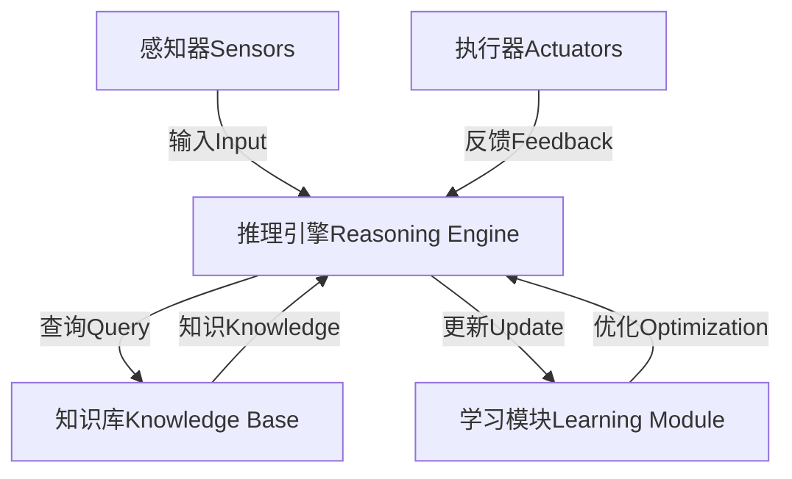

# AI人工智能代理工作流AI Agent WorkFlow：人工智能代理与用户体验设计

## 1.背景介绍

### 1.1 人工智能代理的兴起

随着人工智能技术的快速发展,人工智能代理(AI Agent)正在逐渐融入我们的日常生活和工作场景。人工智能代理是指能够感知环境,执行一系列行为以实现特定目标的软件实体。它们可以通过自然语言处理、计算机视觉、机器学习等技术来理解用户的需求,并提供相应的服务或建议。

人工智能代理的应用范围广泛,包括虚拟助手、智能客服、个人助理、游戏角色等。它们可以帮助人们完成各种任务,如查找信息、管理日程、控制智能家居设备等,从而提高生活和工作效率。

### 1.2 人工智能代理与用户体验

人工智能代理的成功与否,在很大程度上取决于它们与用户的交互体验。良好的用户体验可以增强用户对人工智能代理的信任和依赖,促进人机协作,而糟糕的用户体验则会导致用户的失望和抗拒。因此,在设计和开发人工智能代理时,用户体验设计是一个关键环节。

用户体验设计需要考虑多个方面,包括交互模式、界面设计、个性化、隐私和安全等。设计人员需要深入了解用户的需求和行为模式,并将这些因素融入到人工智能代理的设计中,以确保代理能够以自然、高效和友好的方式与用户互动。

## 2.核心概念与联系

### 2.1 人工智能代理的架构

人工智能代理通常由以下几个核心组件组成:

1. **感知器(Sensors)**: 用于从环境中获取数据,如语音输入、图像、传感器数据等。
2. **执行器(Actuators)**: 用于在环境中执行行为,如语音输出、图形显示、设备控制等。
3. **知识库(Knowledge Base)**: 存储代理所需的各种知识,如领域知识、规则、模型等。
4. **推理引擎(Reasoning Engine)**: 根据感知器获取的数据和知识库中的知识,推理出合适的行为。
5. **学习模块(Learning Module)**: 通过机器学习算法,从历史数据和交互中不断学习和优化代理的行为。

这些组件通过复杂的交互形成一个完整的人工智能代理系统。感知器和执行器负责与外部环境的交互,而推理引擎、知识库和学习模块则构成了代理的"大脑"。

### 2.2 人工智能代理与用户体验设计的关系

人工智能代理与用户体验设计密切相关,二者相互影响、相辅相成。良好的用户体验设计可以提高人工智能代理的可用性和用户满意度,而高质量的人工智能代理则能够为用户提供更好的交互体验。

具体来说,用户体验设计需要考虑以下几个方面:

1. **交互模式**: 设计自然、高效的交互方式,如自然语言对话、手势控制等。
2. **界面设计**: 设计直观、美观的用户界面,提高可用性和可访问性。
3. **个性化**: 根据用户偏好和行为习惯,提供个性化的体验。
4. **隐私和安全**: 保护用户隐私,确保系统安全可靠。
5. **情感智能**: 赋予人工智能代理情感交互能力,增强人机互动的自然性。

同时,人工智能代理的技术能力也会影响用户体验。例如,自然语言处理能力决定了代理与用户对话的流畅度,机器学习算法的性能则影响代理的个性化和适应性。因此,在设计人工智能代理时,需要平衡技术和用户体验两个方面,以实现最佳的人机交互效果。

## 3.核心算法原理具体操作步骤

### 3.1 自然语言处理

自然语言处理(Natural Language Processing, NLP)是人工智能代理中一个关键技术,它使代理能够理解和生成人类可理解的自然语言。NLP的核心算法包括以下几个步骤:

1. **分词(Tokenization)**: 将输入的自然语言文本分割成一个个单词或标记。
2. **词性标注(Part-of-Speech Tagging)**: 为每个单词或标记赋予相应的词性标签,如名词、动词、形容词等。
3. **命名实体识别(Named Entity Recognition, NER)**: 识别出文本中的命名实体,如人名、地名、组织名等。
4. **依存分析(Dependency Parsing)**: 分析句子中单词之间的依存关系,构建依存语法树。
5. **语义分析(Semantic Analysis)**: 从语法结构中提取语义信息,理解句子的真正含义。
6. **意图识别(Intent Recognition)**: 根据语义信息,确定用户的意图或目的。
7. **响应生成(Response Generation)**: 根据识别出的意图,生成相应的自然语言响应。

这些步骤通常由一系列机器学习模型完成,如序列标注模型、依存分析模型、语义分析模型等。NLP算法的性能直接影响着人工智能代理与用户对话的质量和流畅度。

### 3.2 计算机视觉

计算机视觉(Computer Vision)是另一项重要的人工智能技术,它使代理能够从图像或视频中获取有用信息。计算机视觉的核心算法包括以下几个步骤:

1. **图像预处理**: 对输入图像进行预处理,如调整大小、去噪、增强对比度等。
2. **特征提取**: 从图像中提取有用的特征,如边缘、角点、纹理等。
3. **目标检测(Object Detection)**: 识别出图像中的目标物体及其位置和大小。
4. **图像分割(Image Segmentation)**: 将图像分割成不同的区域或对象。
5. **目标识别(Object Recognition)**: 将检测到的目标物体与已知类别进行匹配,确定其类别。
6. **场景理解(Scene Understanding)**: 综合分析图像中的多个对象及其关系,理解整个场景的语义信息。

这些步骤通常由深度学习模型完成,如卷积神经网络(CNN)、区域卷积神经网络(R-CNN)等。计算机视觉算法可以帮助人工智能代理理解视觉信息,从而提供更丰富的交互体验。

### 3.3 机器学习

机器学习(Machine Learning)是人工智能代理中不可或缺的一个组成部分。它使代理能够从历史数据和交互中学习,不断优化自身的行为和决策。常见的机器学习算法包括:

1. **监督学习(Supervised Learning)**: 从已标注的训练数据中学习,如分类、回归等任务。
2. **无监督学习(Unsupervised Learning)**: 从未标注的数据中发现隐藏的模式和结构,如聚类、降维等任务。
3. **强化学习(Reinforcement Learning)**: 通过与环境的交互,学习采取何种行为能获得最大的回报。
4. **迁移学习(Transfer Learning)**: 将在一个领域学习到的知识迁移到另一个相关领域,加速学习过程。
5. **元学习(Meta Learning)**: 学习如何更好地学习,提高机器学习算法的泛化能力和效率。

这些算法可以应用于人工智能代理的各个组件,如自然语言处理、计算机视觉、决策制定等,使代理能够不断适应新的环境和需求。同时,机器学习也为用户体验设计带来了新的挑战和机遇,例如如何确保算法的公平性、可解释性和隐私保护等。

## 4.数学模型和公式详细讲解举例说明

### 4.1 自然语言处理中的数学模型

自然语言处理中常用的数学模型包括:

1. **N-gram语言模型**:

N-gram语言模型是一种基于统计的语言模型,它计算一个词序列的概率为:

$$P(w_1, w_2, \dots, w_n) = \prod_{i=1}^n P(w_i|w_1, \dots, w_{i-1})$$

由于计算复杂度太高,通常使用马尔可夫假设进行近似:

$$P(w_i|w_1, \dots, w_{i-1}) \approx P(w_i|w_{i-n+1}, \dots, w_{i-1})$$

其中 $n$ 是 N-gram 的长度。

2. **神经网络语言模型**:

神经网络语言模型使用神经网络来建模词序列的概率分布,常见的模型包括循环神经网络(RNN)、长短期记忆网络(LSTM)等。以 LSTM 为例,它的隐藏状态更新公式为:

$$\begin{aligned}
f_t &= \sigma(W_f \cdot [h_{t-1}, x_t] + b_f) \\
i_t &= \sigma(W_i \cdot [h_{t-1}, x_t] + b_i) \\
\tilde{C}_t &= \tanh(W_C \cdot [h_{t-1}, x_t] + b_C) \\
C_t &= f_t \odot C_{t-1} + i_t \odot \tilde{C}_t \\
o_t &= \sigma(W_o \cdot [h_{t-1}, x_t] + b_o) \\
h_t &= o_t \odot \tanh(C_t)
\end{aligned}$$

其中 $f_t$、$i_t$、$\tilde{C}_t$、$C_t$、$o_t$ 和 $h_t$ 分别表示遗忘门、输入门、候选细胞状态、细胞状态、输出门和隐藏状态。

3. **注意力机制**:

注意力机制是一种重要的神经网络组件,它可以帮助模型关注输入序列中的重要部分。注意力分数计算公式为:

$$\alpha_{i,j} = \frac{\exp(e_{i,j})}{\sum_{k=1}^n \exp(e_{i,k})}$$

其中 $e_{i,j}$ 表示查询向量 $q_i$ 与键向量 $k_j$ 的相似性分数,通常使用点积或加性注意力计算。注意力权重 $\alpha_{i,j}$ 反映了模型对输入 $x_j$ 的关注程度。

这些数学模型为自然语言处理任务提供了理论基础,并通过深度学习技术得到了广泛应用。

### 4.2 计算机视觉中的数学模型

计算机视觉中常用的数学模型包括:

1. **卷积神经网络(CNN)**:

卷积神经网络是一种专门用于处理图像数据的神经网络,它的核心操作是卷积运算。卷积运算可以用下式表示:

$$S(i, j) = (I * K)(i, j) = \sum_m \sum_n I(i+m, j+n)K(m, n)$$

其中 $I$ 表示输入图像, $K$ 表示卷积核, $S$ 表示输出特征图。卷积运算可以自动提取图像的局部特征,并通过多层卷积和池化操作捕获更高层次的特征。

2. **区域卷积神经网络(R-CNN)**:

R-CNN 是一种常用的目标检测模型,它将目标检测任务分解为两个步骤:先生成候选区域proposals,再对每个候选区域进行分类和边界框回归。边界框回归的目标函数为:

$$\begin{aligned}
L(t^u, t^v) = \sum_{i \in \{x, y, w, h\}} \mathrm{smooth}_{L_1}(t^u_i - t^v_i) \\
\mathrm{smooth}_{L_1}(x) = \begin{cases}
0.5x^2 & \text{if } |x| < 1 \\
|x| - 0.5 & \text{otherwise}
\end{cases}
\end{aligned}$$

其中 $t^u$ 和 $t^v$ 分别表示预测的边界框和真实边界框的参数。

3. **语义分割**:

语义分割是将图像中的每个像素分配到预定义的类别中。常用的损失函数是交叉熵损失:

$$L = -\frac{1}{N} \sum_{i=1}