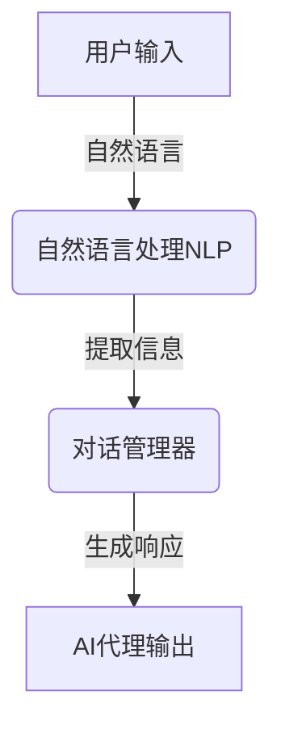
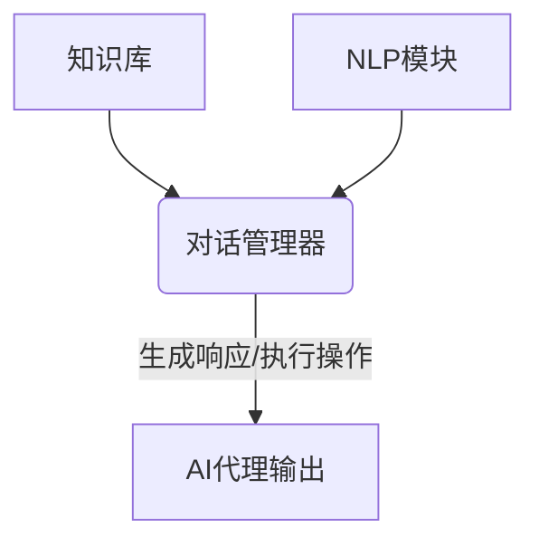
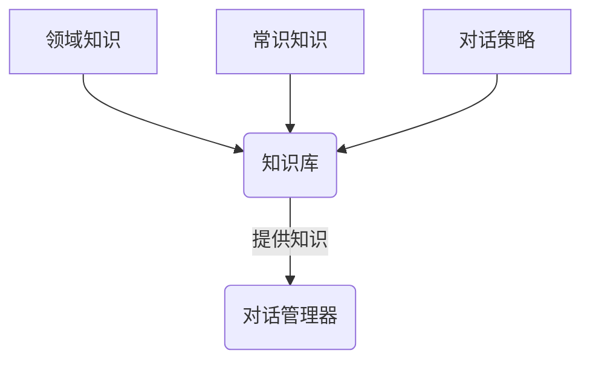
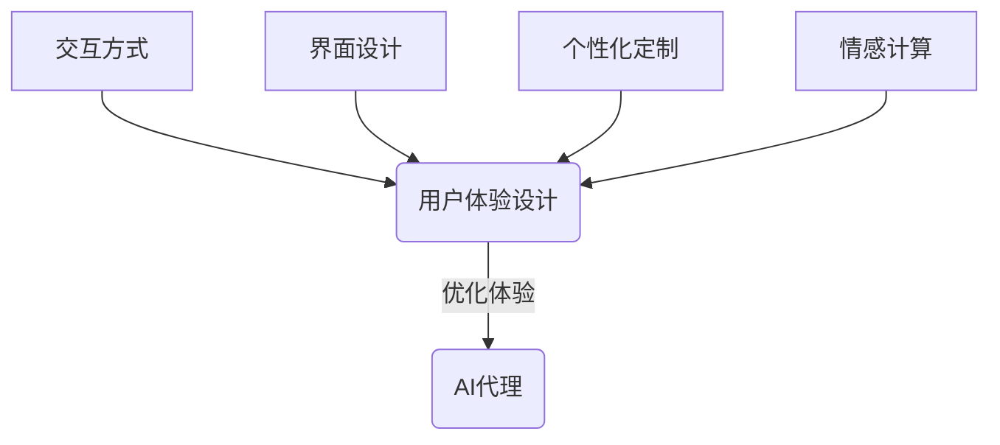

# AI人工智能代理工作流AI Agent WorkFlow：人工智能代理与用户体验设计

## 1.背景介绍

随着人工智能(AI)技术的不断发展和应用场景的日益广泛,AI代理已经成为了人机交互的重要媒介。AI代理可以理解人类的自然语言输入,并根据预设的目标和算法生成相应的响应。在许多领域,AI代理正在承担着日益重要的角色,如客户服务、个人助理、教育辅导等。

然而,要构建一个高效且用户友好的AI代理系统并非易事。它需要将自然语言处理(NLP)、对话管理、知识库等多种技术有机结合,并对用户体验进行精心设计。本文将探讨AI代理工作流程中的关键技术,以及如何优化用户体验设计,使AI代理能够更好地服务于人类。

### 1.1 AI代理的重要性

AI代理作为人机交互的桥梁,可以显著提高工作效率、降低人力成本,并为用户提供个性化的服务体验。在客户服务领域,AI代理可以7x24小时在线解答常见问题,减轻人工客服的工作压力。在个人助理领域,AI代理可以根据用户的喜好和习惯提供定制化的建议和服务。在教育领域,AI代理可以作为个性化的学习伙伴,根据学生的知识水平提供量身定制的辅导。

### 1.2 AI代理面临的挑战

尽管AI代理具有巨大的应用潜力,但在实现过程中也面临着诸多挑战:

- 自然语言理解能力有限
- 对话管理策略欠缺灵活性
- 知识库覆盖面有限且难以及时更新
- 缺乏情景化的交互能力
- 用户体验设计有待优化

只有充分认识到这些挑战,并采取有效的技术手段和设计策略,才能构建出真正智能且用户友好的AI代理系统。

## 2.核心概念与联系

在深入探讨AI代理工作流程之前,我们先来了解一些核心概念:

### 2.1 自然语言处理(NLP)

自然语言处理是AI代理的基础,它使计算机能够理解和生成人类可理解的语言。NLP技术包括许多子领域,如词法分析、句法分析、语义分析、指代消解、命名实体识别等。通过NLP,AI代理可以从用户的自然语言输入中提取出关键信息,并生成相应的自然语言响应。



### 2.2 对话管理

对话管理是AI代理的"大脑",它根据当前对话状态和上下文信息,决策下一步的行为策略。对话管理器需要综合考虑NLP模块提取的信息、知识库中的相关知识,并结合预设的目标和策略,生成合理的响应或执行相应的操作。



### 2.3 知识库

知识库存储了AI代理所需的各种知识,包括领域知识、常识知识、对话策略等。知识库的广度和深度直接影响了AI代理的能力水平。通常,知识库需要由人工专家持续维护和更新,以确保其准确性和时效性。



### 2.4 用户体验设计

用户体验设计是AI代理成功的关键因素之一。良好的用户体验设计可以提高AI代理的易用性、亲和力和用户粘性。设计时需要考虑多方面因素,如交互方式、界面设计、个性化定制、情感计算等,以满足不同场景和用户群体的需求。



上述核心概念相互关联、环环相扣,共同构成了AI代理的工作流程。接下来,我们将详细探讨这些概念在AI代理中的具体实现和优化策略。

## 3.核心算法原理具体操作步骤

AI代理工作流程中涉及多种算法和技术,我们将重点介绍自然语言处理(NLP)和对话管理两个核心模块的算法原理和具体操作步骤。

### 3.1 自然语言处理(NLP)

NLP是AI代理理解和生成自然语言的基础,它包括以下主要步骤:

#### 3.1.1 词法分析

词法分析是NLP的第一步,它将输入的自然语言文本拆分为一个个单词(token)。常用的词法分析算法包括正则表达式匹配、最大匹配法、N-gram等。

```python
import re

def tokenize(text):
    tokens = re.findall(r'\w+', text)
    return tokens
```

#### 3.1.2 句法分析

句法分析旨在确定单词之间的语法关系,构建句子的语法树。常用的句法分析算法有基于规则的方法(如上下文无关文法)和基于统计的方法(如转移规则等)。

```python
import nltk

def parse_sentence(tokens):
    grammar = nltk.CFG.fromstring("""
        S -> NP VP
        NP -> DT NN
        VP -> VB NP
        DT -> 'the'
        NN -> 'dog' | 'cat'
        VB -> 'chased'
    """)
    parser = nltk.ChartParser(grammar)
    trees = parser.parse(tokens)
    return trees
```

#### 3.1.3 语义分析

语义分析旨在理解句子的实际含义,通常需要结合领域知识库。常用的语义分析技术包括词义消歧、命名实体识别、关系抽取等。

```python
import spacy

def semantic_analysis(text):
    nlp = spacy.load('en_core_web_sm')
    doc = nlp(text)
    entities = [(ent.text, ent.label_) for ent in doc.ents]
    return entities
```

#### 3.1.4 自然语言生成

自然语言生成是NLP的最后一步,它根据语义表示生成自然语言响应。常用的技术包括基于模板的生成、基于规则的生成和基于神经网络的生成(如Seq2Seq、Transformer等)。

```python
import torch
from transformers import T5ForConditionalGeneration, T5Tokenizer

def generate_response(input_text):
    model = T5ForConditionalGeneration.from_pretrained('t5-base')
    tokenizer = T5Tokenizer.from_pretrained('t5-base')
    input_ids = tokenizer.encode(input_text, return_tensors='pt')
    outputs = model.generate(input_ids, max_length=100, num_beams=4, early_stopping=True)
    response = tokenizer.decode(outputs[0], skip_special_tokens=True)
    return response
```

上述代码示例展示了NLP各个步骤的基本实现,在实际应用中,还需要根据具体场景和需求进行算法优化和模型训练。

### 3.2 对话管理

对话管理是AI代理的"大脑",它根据当前对话状态和上下文信息,决策下一步的行为策略。常用的对话管理算法和模型包括:

#### 3.2.1 基于规则的对话管理

基于规则的对话管理系统依赖于人工设计的一系列规则和流程,根据用户输入和当前对话状态进行模式匹配,并执行相应的操作。这种方法易于理解和调试,但缺乏灵活性和可扩展性。

```python
def rule_based_dialogue(user_input, dialogue_state):
    if dialogue_state == 'greeting':
        if 'hello' in user_input.lower():
            response = "Hello! How can I assist you today?"
            dialogue_state = 'main'
        else:
            response = "I didn't understand that. Could you please rephrase?"
    elif dialogue_state == 'main':
        # 处理主要对话流程
        ...
    return response, dialogue_state
```

#### 3.2.2 基于机器学习的对话管理

基于机器学习的对话管理系统利用大量的对话数据进行训练,学习对话模式和策略。常用的模型包括隐马尔可夫模型(HMM)、部分可观测马尔可夫决策过程(POMDP)、深度学习模型(如序列到序列模型)等。这种方法具有更好的灵活性和可扩展性,但需要大量的训练数据和计算资源。

```python
import torch
from transformers import BlenderbotForConditionalGeneration, BlenderbotTokenizer

def ml_based_dialogue(user_input, dialogue_history):
    model = BlenderbotForConditionalGeneration.from_pretrained('facebook/blenderbot-400M-distill')
    tokenizer = BlenderbotTokenizer.from_pretrained('facebook/blenderbot-400M-distill')
    inputs = tokenizer(dialogue_history + [user_input], return_tensors='pt')
    outputs = model.generate(**inputs, max_length=100, num_beams=5, early_stopping=True)
    response = tokenizer.decode(outputs[0], skip_special_tokens=True)
    return response
```

#### 3.2.3 混合对话管理

混合对话管理系统结合了基于规则和基于机器学习的方法,利用规则处理简单的对话流程,利用机器学习模型处理复杂的对话场景。这种方式可以兼顾规则系统的可解释性和机器学习模型的灵活性,是目前较为流行的对话管理方案。

```python
def hybrid_dialogue(user_input, dialogue_state, dialogue_history):
    if dialogue_state in ['greeting', 'farewell']:
        response, new_state = rule_based_dialogue(user_input, dialogue_state)
    else:
        response = ml_based_dialogue(user_input, dialogue_history)
        new_state = 'main'
    return response, new_state
```

对话管理是一个复杂的过程,需要综合考虑多种因素,如对话历史、上下文信息、领域知识等。在实际应用中,还需要根据具体场景和需求进行算法优化和模型微调,以提高对话管理的效率和质量。

## 4.数学模型和公式详细讲解举例说明

在自然语言处理和对话管理领域,有许多数学模型和公式被广泛应用,我们将介绍其中几个核心模型和公式,并通过实例说明其原理和应用。

### 4.1 N-gram语言模型

N-gram语言模型是自然语言处理中最基础和最广泛使用的模型之一。它根据前面的 N-1 个词来预测下一个词的概率,公式如下:

$$P(w_n|w_1, w_2, ..., w_{n-1}) \approx P(w_n|w_{n-N+1}, ..., w_{n-1})$$

其中,$ w_i $表示第 i 个词,N 表示 N-gram 的长度。通常,N 取值为 2(双词模型)、3(三词模型)或更高阶。

例如,对于句子"the dog chased a cat",我们可以计算出以下三元模型概率:

$$
\begin{aligned}
P(the|<s>,<s>) \\
P(dog|<s>,the) \\
P(chased|the,dog) \\
P(a|dog,chased) \\
P(cat|chased,a) \\
P(</s>|a,cat)
\end{aligned}
$$

其中,`<s>`表示句子开始符号,`</s>`表示句子结束符号。通过计算这些概率的乘积,我们可以得到该句子的整体概率。

N-gram 模型广泛应用于语言模型、机器翻译、拼写检查等任务中,但它也存在一些缺陷,如数据稀疏问题、无法捕捉长距离依赖等。因此,在现代自然语言处理中,人们往往会使用更加先进的神经网络语言模型。

### 4.2 神经网络语言模型

神经网络语言模型利用神经网络的强大建模能力,可以更好地捕捉语言的复杂结构和长距离依赖关系。常见的神经网络语言模型包括循环神经网络(RNN)、长短期记忆网络(LSTM)、门控循环单元(GRU)等。

以 LSTM 为例,它的核心公式如下:

$$
\begin{aligned}
f_t &= \sigma(W_f \cdot [h_{t-1}, x_t] + b_f) \\
i_t &=