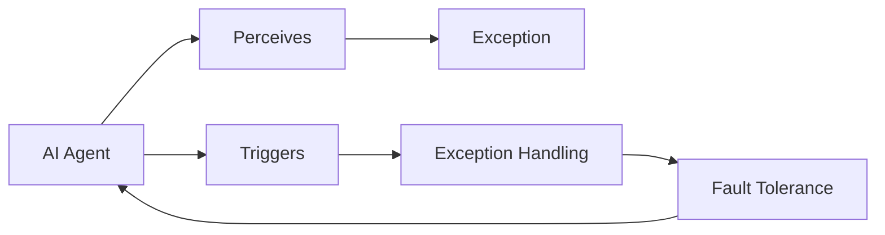

# AI人工智能代理工作流AI Agent WorkFlow：代理工作流中的异常处理与容错

## 1. 背景介绍
### 1.1 人工智能代理工作流的发展历程
人工智能(Artificial Intelligence, AI)技术的飞速发展，使得AI系统能够执行越来越复杂的任务。尤其是在企业级应用场景中，AI代理(Agent)需要协同工作来完成端到端的业务流程，这就形成了AI代理工作流(AI Agent Workflow)。然而，在复杂多变的现实环境中，AI代理工作流的执行过程往往伴随着各种异常情况的发生，如何有效地处理这些异常并保证工作流的容错性,成为了一个亟待解决的关键问题。

### 1.2 异常处理与容错的重要意义
AI代理工作流中的异常处理与容错至关重要，主要基于以下几点原因：

1. 保证业务连续性。AI系统往往承担着关键的业务职责，一旦发生异常中断，将对业务连续性造成严重影响。有效的异常处理可以最大限度减少异常带来的损失。

2. 提高系统可用性。频繁的异常发生会降低系统可用性，影响用户体验。通过异常处理与容错机制，可以提升系统稳定性，让AI工作流高效、可靠地运行。

3. 增强系统鲁棒性。在开放、动态的应用环境下，AI系统面临的不确定因素较多。通过异常处理提高系统容错能力，可以增强AI工作流抵御外部干扰的鲁棒性。

4. 支撑智能决策。从异常处理过程中收集到的数据与知识，可以用于优化工作流本身，也可以辅助上层智能决策，不断提升AI系统的智能水平。

### 1.3 研究现状与面临的挑战
目前，异常处理与容错在传统工作流领域已有较为成熟的理论与实践基础，但将其应用到AI代理工作流中仍面临诸多挑战：

1. 异常类型多样。除了通用的系统异常外，AI工作流还会遇到感知异常、推理异常、决策异常等AI特有的异常类型，需要有针对性地处理。

2. 工作流结构复杂。AI代理之间错综复杂的交互关系，以及工作流的动态演化特性，使得异常传播与影响分析变得尤为困难。

3. 实时性要求高。很多AI应用场景对异常处理的实时性有较高要求，需要尽快发现异常并在局部采取措施，避免异常扩散。

4. 领域差异大。不同行业领域的AI工作流差异很大，普适的异常处理方法论仍有待探索。

因此，研究AI代理工作流中的异常处理与容错，对于提升AI系统的可靠性、可用性、鲁棒性具有重要意义，也是实现工业级应用不可或缺的关键一环。

## 2. 核心概念与联系
### 2.1 AI代理
AI代理是一种基于人工智能技术构建的自主实体，能够感知环境、进行推理决策并采取行动。它们通常以软件形态存在，运行在分布式环境中。AI代理具有一定的自主性、社会性、反应性、主动性等特征。在复杂业务流程的执行过程中，往往需要多个AI代理相互配合与协作。

### 2.2 工作流
工作流(Workflow)是对业务流程的计算机建模与自动化执行。它定义了一系列活动任务的执行次序，规定了任务之间的数据流转与控制关系。工作流技术可以显著提升业务效率，保证流程执行的标准化与合规性。引入AI代理后，工作流呈现出更加智能、灵活、自适应的特点。

### 2.3 异常
异常(Exception)是指系统运行过程中出现的反常情况或意外事件，通常会导致系统偏离预期状态，甚至发生故障。AI工作流中的异常可分为两大类：

1. 通用异常：如网络故障、硬件故障、内存溢出等。这类异常多源于基础设施层面。

2. AI特有异常：如感知异常(摄像头脏污)、推理异常(知识冲突)、决策异常(策略矛盾)等。这类异常源于AI系统自身。

### 2.4 异常处理
异常处理(Exception Handling)是指系统用于检测异常、控制异常影响、恢复正常运行的一系列机制与策略。常见的异常处理手段包括忽略异常、重试操作、回退状态、终止任务、升级处理等。

### 2.5 容错
容错(Fault Tolerance)是指系统在异常发生后仍能维持正常功能的能力。通过设计容错机制，可以最大程度避免因局部异常导致整个系统瘫痪。常见的容错技术有异常屏蔽、异常补偿、状态检查点、故障切换等。

### 2.6 概念之间的关系
在AI代理工作流的语境下，以上核心概念之间的关系可总结为：
AI代理作为工作流的执行主体，异常处理作为保障机制，容错作为系统目标，三者相辅相成，共同支撑起鲁棒、高可用的工作流系统。具体而言：

- AI代理感知异常的发生，触发异常处理过程。
- 代理间通过协作完成异常处理，将局部异常控制在一定范围内。
- 工作流平台内置容错机制，保证在异常发生后工作流仍能持续运转。
- 容错能力的高低决定了工作流对异常的敏感程度。

下图以Mermaid流程图的形式直观展示了这些概念间的交互关系：

总的来说，只有深刻理解这些核心概念之间的有机联系，才能在工作流的设计与实现中做到有的放矢，提供有效的异常处理与容错保障。

## 3. 核心算法原理与操作步骤
异常处理与容错贯穿于AI代理工作流的整个生命周期。本节将重点介绍几种核心算法的基本原理与操作步骤。

### 3.1 异常检测算法
异常检测是异常处理的首要环节。常见的异常检测算法包括：

#### 3.1.1 基于阈值的检测
该方法通过设定关键指标的正常阈值范围，对实时采集的数据流进行判断，一旦超出阈值即认为发生异常。

算法步骤如下：
1. 确定关键监控指标(如响应时间、资源利用率等)
2. 根据历史数据确定正常阈值上下界 
3. 实时采集指标数据，判断是否超出阈值
4. 若超出阈值，触发异常警报

优点是简单直观，易于实现；缺点是阈值的设定需要大量经验，且难以应对复杂异常。

#### 3.1.2 基于机器学习的检测
该方法通过对历史数据进行学习，构建异常检测模型，再用于实时数据的异常判别。

算法步骤如下：
1. 收集并标注历史运行数据(正常/异常) 
2. 特征工程：特征提取、选择、降维等
3. 选择适当的机器学习模型(如SVM、PCA等)并训练
4. 使用训练好的模型对实时数据进行异常判别
5. 若判别为异常，触发异常警报

优点是判别准确率高，可发现未知类型异常；缺点是需要大量标注数据，训练与推理成本高。

### 3.2 异常恢复算法
异常恢复旨在将系统从异常状态恢复到正常状态,常见的异常恢复算法包括：

#### 3.2.1 基于补偿的恢复
该方法通过定义异常处理补偿操作，在异常发生后执行这些操作,从而抵消异常影响。

算法步骤如下：
1. 定义异常处理补偿操作
2. 异常发生时，判断异常类型
3. 根据异常类型，执行对应的补偿操作
4. 补偿完成后，重新评估系统状态
5. 若恢复正常，则结束；否则进入人工处理

优点是恢复速度快；缺点是针对不同异常需要定义大量补偿操作，工作量大。

#### 3.2.2 基于回滚的恢复
该方法通过在系统正常运行时设置检查点(Checkpoint),记录当前状态快照。发生异常时,通过回滚到最近的检查点,恢复到之前的正常状态。

算法步骤如下：
1. 在工作流的关键节点设置检查点
2. 定期保存系统状态到检查点
3. 异常发生时，停止工作流执行
4. 识别最近的可用检查点
5. 从该检查点恢复系统状态
6. 重启工作流执行

优点是恢复彻底，状态一致；缺点是恢复时间长，且检查点的设置与存储需要额外开销。

### 3.3 容错调度算法
容错调度算法通过优化任务调度策略、资源分配策略等，在面对异常时维持工作流的持续运行。

#### 3.3.1 主动复制容错
该方法通过主动创建任务副本,并行执行,通过多数表决来屏蔽个别副本的异常。

算法步骤如下：
1. 接收到任务请求
2. 创建该任务的多个副本(通常为奇数)
3. 将副本分发到不同的执行节点
4. 并行执行各副本
5. 收集副本执行结果
6. 通过多数表决确定最终结果
7. 返回结果给请求方

优点是容错透明，请求方无感知；缺点是资源开销大。

#### 3.3.2 基于检查点的容错调度
该方法与前面介绍的基于检查点恢复类似,通过在任务执行过程中设置检查点来最小化异常损失。

算法步骤如下：
1. 接收到任务请求
2. 选择合适的执行节点
3. 将任务分发到执行节点
4. 启动任务执行
5. 在任务执行过程中周期性设置检查点
6. 若任务异常，重启任务，从最近检查点恢复
7. 任务完成，返回结果

优点是可将异常损失控制在检查点间隔内；缺点是需要修改任务执行逻辑。

以上介绍的算法思想可以灵活组合,形成完整的异常处理与容错策略。在实际应用中,需要根据具体的业务场景、系统架构、性能需求等因素,权衡利弊,选择合适的算法。

## 4. 数学模型与公式详解
为了更精准地刻画AI代理工作流中的异常处理与容错行为,需要借助数学建模的方法。本节选取几个典型问题,给出其数学模型与求解思路。

### 4.1 异常检测阈值优化
对于基于阈值的异常检测方法,阈值的设定至关重要。过高的阈值会漏检异常,过低的阈值又会导致误报。因此需要寻找最优阈值。假设异常服从泊松分布,则问题可建模为:

$$
\min_{\lambda} \quad P_{miss}(\lambda) + \alpha P_{false}(\lambda) \\
\begin{align*}
\text{s.t.} \quad
P_{miss}(\lambda) &= \sum_{k=0}^{\lambda}\frac{\beta^k e^{-\beta}}{k!} \\
P_{false}(\lambda) &= 1 - \sum_{k=0}^{\lambda}\frac{\theta^k e^{-\theta}}{k!} \\
\end{align*}
$$

其中,$\lambda$为待优化的阈值, $\beta$为异常强度,$\theta$为正常情况下的指标均值,$\alpha$为漏检代价与误报代价的权重比。

求解该优化问题的一般步骤为:
1. 根据历史数据估计 $\beta$ 和 $\theta$ 的值
2. 根据实际情况确定惩罚因子 $\alpha$ 
3. 将目标函数与约束条件代入优化求解器求解

### 4.2 副本数量优化
对于主动复制容错方法,副本数量的设置需要在资源开销和容错能力间权衡。假设单个副本出错