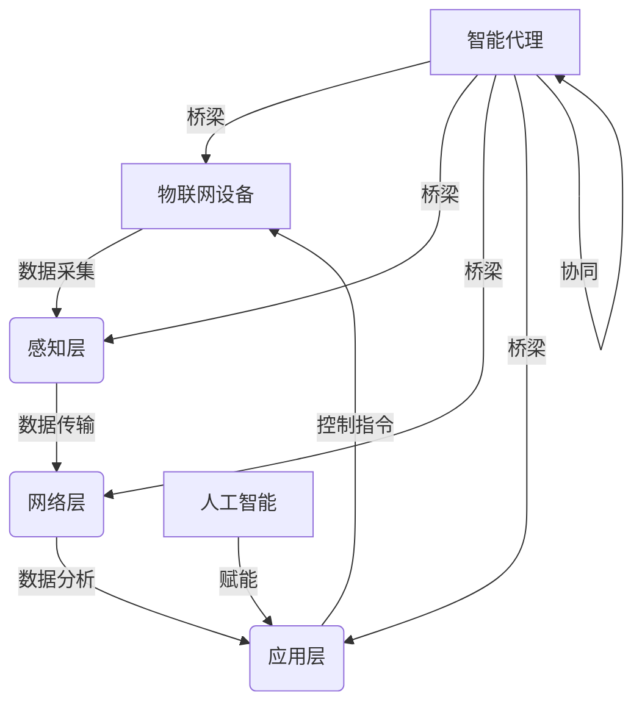
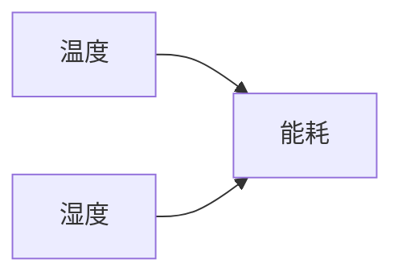

# AI人工智能代理工作流AI Agent WorkFlow：智能代理在物联网系统中的应用

## 1. 背景介绍
### 1.1 物联网系统的发展现状
物联网(Internet of Things, IoT)是一个动态的全球网络基础设施,它具有基于标准和互操作通信协议的自组织能力,其中物理和虚拟"物"具有身份标识、物理属性、虚拟特性和智能接口,并与信息网络无缝整合。随着物联网技术的快速发展,越来越多的设备接入网络,产生海量的数据,对系统的管理和控制提出了新的挑战。

### 1.2 人工智能在物联网中的应用前景
人工智能(Artificial Intelligence, AI)是研究、开发用于模拟、延伸和扩展人的智能的理论、方法、技术及应用系统的一门新的技术科学。将人工智能技术应用于物联网系统,可以显著提高系统的自动化水平和智能化程度,实现设备的自主管理和协同工作,提升用户体验。

### 1.3 智能代理技术概述
智能代理(Intelligent Agent)是一种能够感知环境并自主行动以实现其目标的计算机系统。它融合了人工智能的多个分支如机器学习、自然语言处理、计算机视觉等技术,具有自主性、社交性、反应性、主动性等特点。将智能代理引入物联网系统,可构建一个高度自治的分布式网络,动态适应环境变化。

## 2. 核心概念与联系
### 2.1 物联网系统架构
一个典型的物联网系统由感知层、网络层和应用层组成。感知层负责采集物理世界的数据并进行初步处理。网络层提供数据传输和路由功能,实现不同设备间的互联。应用层根据具体需求,对数据进行分析、决策和控制。

### 2.2 人工智能的关键技术
人工智能涉及机器学习、知识表示、自然语言处理、计算机视觉、语音识别等多个技术领域。其中,机器学习是实现智能系统的核心,包括监督学习、无监督学习、强化学习等范式。知识表示使计算机能够存储、推理复杂的结构化信息。

### 2.3 智能代理的内部结构
一个智能代理通常由感知模块、决策模块和执行模块构成。感知模块负责获取外界信息,并转换为代理可以理解的形式。决策模块根据当前状态、目标和环境作出行动决策。执行模块将决策转化为具体动作,通过执行器影响外部环境。

### 2.4 多智能代理系统
在实际应用中,往往需要多个智能代理协同工作,构成一个多智能代理系统(Multi-Agent System, MAS)。每个代理负责不同的任务,通过通信和协商实现分工与合作。MAS 可以解决单个代理难以完成的复杂问题。

### 2.5 核心概念之间的关系
智能代理作为连接物联网三层架构的纽带,通过感知、分析、决策、控制等过程,将人工智能技术与物联网设备进行无缝集成。多个分布式部署的智能代理互联互通,借助机器学习不断优化系统性能,形成一个灵活高效的物联网应用。



## 3. 核心算法原理与具体操作步骤

### 3.1 智能代理的感知与建模
智能代理需要通过传感器获取外界信息,并建立合适的世界模型。常见的建模方法包括:
1. 基于知识的建模:使用本体、语义网等知识表示方法,构建层次化的概念体系。
2. 基于逻辑的建模:使用一阶逻辑、描述逻辑等形式化语言,推理环境状态。
3. 基于概率的建模:使用贝叶斯网络、马尔可夫决策过程等,表示不确定性。

具体步骤如下:
1. 确定建模范围和粒度,选择合适的建模方法。
2. 收集领域知识,定义核心概念、属性和关系。
3. 使用建模工具(如本体编辑器、概率图建模软件)构建模型。
4. 将传感数据与模型关联,动态更新环境状态。

### 3.2 智能代理的决策与规划
智能代理根据世界模型和目标,自主地产生行为决策。常用的决策与规划算法包括:
1. 基于规则的推理:将领域知识编码为if-then规则,通过前向或后向推理产生决策。
2. 搜索与规划:将问题抽象为状态空间,使用启发式搜索、遗传算法等寻找最优解。
3. 强化学习:通过与环境的交互,学习最优的行动策略。

具体步骤如下:
1. 定义智能代理的目标函数和效用函数。
2. 根据建模方法,选择匹配的决策算法。
3. 设计状态空间、行动空间和转移函数(对于搜索与规划)。
4. 设计奖励函数和学习算法(对于强化学习)。
5. 实现算法,并在仿真或真实环境中测试。

### 3.3 智能代理的通信与协商
在多智能代理系统中,代理之间需要交换信息、协调行动。常用的通信与协商机制包括:
1. 契约网协议:代理通过广播任务、投标等方式分配任务。
2. 投票机制:代理对不同提案进行投票,少数服从多数。
3. argumentation:代理通过论证、反驳等对话式交互达成一致。

具体步骤如下:
1. 选择适当的通信语言和本体,实现语义互操作。
2. 设计通信协议,定义消息格式和交互流程。
3. 构建协商策略,如何根据自身效用选择行动。
4. 实现代理间通信模块,处理消息收发。
5. 评估协商结果,必要时进行重协商。

## 4. 数学模型和公式详细讲解举例说明

### 4.1 贝叶斯网络
贝叶斯网络是一种用于表示变量之间依赖关系的概率图模型。形式上,一个贝叶斯网络由有向无环图和条件概率表组成。每个节点表示一个随机变量,边表示变量间的依赖关系,条件概率表定义了每个变量在其父节点取值下的概率分布。贝叶斯网络常用于智能代理对环境的建模与推理。

假设代理需要根据温度和湿度预测空调的能耗,可以构建如下的贝叶斯网络:



条件概率表 $P(能耗|温度,湿度)$ 可根据历史数据学习得到。代理可利用贝叶斯公式进行推理:

$$
P(温度,湿度|能耗) = \frac{P(能耗|温度,湿度)P(温度,湿度)}{P(能耗)}
$$

### 4.2 马尔可夫决策过程
马尔可夫决策过程(Markov Decision Process, MDP)是表示序贯决策问题的数学框架。一个MDP由状态集合S、行动集合A、转移概率矩阵P和奖励函数R构成。代理的目标是寻找一个最优策略 $\pi: S \rightarrow A$,使得长期累积奖励最大化。

以一个简单的温控系统为例,状态空间为:

$$
S = \{s_1: 温度<18℃, s_2: 18℃ \leq 温度 \leq 25℃, s_3: 温度>25℃\}
$$

行动空间为:

$$
A = \{a_1: 制冷, a_2: 关闭, a_3: 制热\}
$$

转移概率 $P(s'|s,a)$ 表示在状态s下执行行动a后转移到状态s'的概率。奖励函数可设计为:

$$
R(s,a)=\begin{cases}
-1, & \text{if }s=s_1\text{ or }s_3 \\
1, & \text{if }s=s_2
\end{cases}
$$

求解MDP的经典算法是值迭代和策略迭代。值迭代通过更新状态值函数 $V(s)$ 收敛到最优策略:

$$
V(s) \leftarrow \max_a \sum_{s'} P(s'|s,a) [R(s,a) + \gamma V(s')]
$$

其中 $\gamma$ 为折扣因子。策略迭代交替进行策略评估和策略改进,直至找到最优策略。

### 4.3 博弈论
博弈论研究多个理性决策者之间的策略互动。在多智能代理系统中,博弈论为分析代理间的竞争与合作提供了有力工具。常见的博弈模型有:
1. 合作博弈:代理通过绑定协议形成联盟,最大化联盟的收益。
2. 非合作博弈:代理独立决策,追求个体利益最大化。
3. 重复博弈:代理重复地进行交互,可能采取合作或报复等策略。

以著名的囚徒困境为例,两名囚犯面临是否认罪的选择,收益矩阵如下:

|  | 认罪 | 不认罪 |
|:---:|:---:|:---:|
| 认罪 | (-5,-5) | (0,-10) |  
| 不认罪 | (-10,0) | (-1,-1) |

纳什均衡为两人均认罪,但合作策略(均不认罪)可以带来更高的收益。重复博弈中,代理可以采取"以牙还牙"等策略,实现长期合作。

## 5. 项目实践：代码实例和详细解释说明

下面以Python为例,演示如何实现一个简单的反应式智能代理。该代理根据环境温度自主调节空调设置。

```python
class ThermostatAgent:
    def __init__(self, temp_range=(18, 25)):
        self.temp_range = temp_range
        self.action_space = ['cooling', 'off', 'heating']
        
    def sense(self, temp):
        self.curr_temp = temp
        
    def plan(self):
        if self.curr_temp < self.temp_range[0]:
            return 'heating'
        elif self.curr_temp > self.temp_range[1]:
            return 'cooling'
        else:
            return 'off'
        
    def act(self, action):
        print(f'Agent sets the thermostat to {action} mode.')
        
if __name__ == '__main__':
    agent = ThermostatAgent()
    
    # 模拟环境
    temp_data = [16, 20, 28, 23]
    
    for temp in temp_data:
        agent.sense(temp)
        action = agent.plan()
        agent.act(action)
```

代码解释:
1. 定义了ThermostatAgent类,初始化时设置了舒适温度范围和行动空间。
2. sense方法模拟代理感知当前温度。
3. plan方法根据温度范围决定空调模式,实现了简单的反应式决策。
4. act方法执行具体的控制指令。
5. 在main函数中,使用模拟数据测试代理。

输出结果:
```
Agent sets the thermostat to heating mode.
Agent sets the thermostat to off mode.
Agent sets the thermostat to cooling mode.
Agent sets the thermostat to off mode.
```

可以看到,代理能够根据环境变化自主调整空调设置,无需人工干预。在实际系统中,代理还可以通过机器学习不断优化决策模型,提高控制性能。

## 6. 实际应用场景

智能代理在物联网系统中有广泛的应用前景,典型场景包括:

### 6.1 智慧家庭
在智能家居场景下,多个传感器和控制设备部署在家中,如照明、安防、家电等。智能代理可以根据用户偏好、设备状态、环境参数等,自动调节各设备,提供舒适、节能、安全的居住体验。例如,代理可以在用户回家前打开空调,根据天气调节窗帘,夜间开启安防系统等。

### 6.2 智慧城市