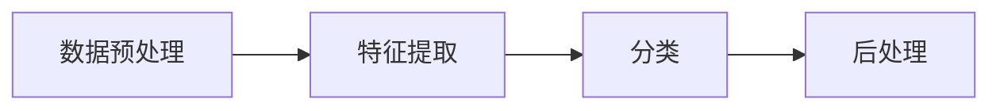

# AI人工智能代理工作流AI Agent WorkFlow：智能代理在遥感数据处理系统中的应用

## 1. 背景介绍

### 1.1 遥感数据处理面临的挑战

遥感技术的快速发展为地球观测和环境监测提供了海量的数据资源。然而,如何高效地处理和分析这些海量遥感数据,已成为目前遥感领域面临的重大挑战之一。传统的遥感数据处理方法,如人工目视解译、简单的自动化处理等,已难以满足日益增长的数据处理需求。因此,迫切需要引入先进的人工智能技术,实现遥感数据处理的智能化和自动化。

### 1.2 人工智能在遥感领域的应用现状

近年来,人工智能技术在遥感领域得到了广泛应用,如深度学习在遥感图像分类、目标检测等任务中取得了显著成果。然而,目前的AI应用主要集中在单一任务的处理上,缺乏对遥感数据处理全流程的系统性考虑。如何将人工智能技术与遥感数据处理流程进行深度融合,构建一个智能化的遥感数据处理系统,是一个亟待解决的问题。

### 1.3 智能代理技术概述

智能代理(Intelligent Agent)是人工智能领域的一个重要分支,它是一种能够感知环境、自主决策和执行任务的智能实体。智能代理具有自主性、社会性、反应性和主动性等特点,能够根据环境的变化动态调整自身行为,并与其他代理协同完成复杂任务。将智能代理引入遥感数据处理领域,有望突破传统方法的局限性,实现遥感数据处理的智能化和自动化。

## 2. 核心概念与联系

### 2.1 智能代理的核心概念

智能代理的核心概念包括:

- 自主性(Autonomy):代理能够独立地感知环境,并根据自身的知识和目标做出决策和行动,无需人工干预。
- 社会性(Social Ability):代理能够与其他代理或人类进行交互和协作,共同完成任务。  
- 反应性(Reactivity):代理能够及时感知环境的变化,并做出相应的反应和调整。
- 主动性(Proactiveness):代理具有主动性,能够根据自身的目标采取行动,而不是被动地等待任务的到来。

### 2.2 工作流的核心概念

工作流(Workflow)是对业务流程的抽象和建模,它定义了一系列活动的执行顺序和数据流向。工作流的核心概念包括:

- 活动(Activity):工作流中的基本处理单元,代表一个具体的任务或操作。
- 顺序流(Sequence Flow):定义活动之间的执行顺序和依赖关系。
- 数据对象(Data Object):在工作流执行过程中流转的数据或文档。
- 网关(Gateway):用于控制工作流的分支和汇聚,如条件判断、并行执行等。

### 2.3 智能代理与工作流的关系

将智能代理与工作流相结合,可以构建一个灵活、自适应的数据处理流程。每个工作流活动都由一个或多个智能代理完成,代理根据任务需求和环境状态自主决策和执行。同时,代理之间通过社会性进行协作和数据交换,形成一个分布式的任务处理网络。工作流则提供了一个全局的视角,协调和调度代理的执行,实现整个数据处理流程的自动化。

## 3. 核心算法原理具体操作步骤

### 3.1 基于智能代理的工作流构建算法

1. 定义工作流活动:根据遥感数据处理的需求,定义一系列的数据处理活动,如数据预处理、特征提取、分类、变化检测等。每个活动都由一个或多个智能代理完成。

2. 构建代理社会网络:根据活动之间的依赖关系和数据流向,构建代理之间的社会网络。网络中的边代表代理之间的通信和数据传递通道。

3. 初始化代理:为每个活动创建对应的智能代理,并根据任务需求初始化代理的知识库、目标和决策模型。

4. 工作流执行:启动工作流,代理开始执行各自的任务。代理根据环境状态和任务需求,自主决策和执行具体的数据处理操作。

5. 代理协作:在工作流执行过程中,代理通过社会网络进行协作和数据交换。一个代理完成任务后,将结果传递给下一个代理,直到整个工作流完成。

6. 动态调整:代理根据任务执行的反馈结果,动态调整自身的知识库和决策模型,实现工作流的自适应优化。

7. 异常处理:如果某个代理执行任务失败,工作流管理器会根据预定义的异常处理策略,重新分配任务或调整工作流结构,保证整个流程的鲁棒性。

### 3.2 代理决策算法

智能代理的决策是基于马尔可夫决策过程(Markov Decision Process, MDP)的。MDP定义了一个四元组$(S, A, P, R)$:

- 状态集合$S$:代表代理所处的环境状态。
- 行为集合$A$:代表代理可以采取的行为或动作。
- 状态转移概率$P$:$P(s'|s,a)$表示在状态$s$下执行行为$a$后,转移到状态$s'$的概率。
- 奖励函数$R$:$R(s,a)$表示代理在状态$s$下执行行为$a$获得的即时奖励。

代理的目标是学习一个最优策略$\pi^*:S \rightarrow A$,使得在任意状态$s$下,选择行为$a=\pi^*(s)$能够最大化未来累积奖励的期望值:

$$V^*(s)=\max_{\pi} \mathbb{E}\left[\sum_{t=0}^{\infty} \gamma^t R\left(s_t, \pi\left(s_t\right)\right) | s_0=s\right]$$

其中,$\gamma \in [0,1]$是折扣因子,用于平衡即时奖励和未来奖励的重要性。

常用的MDP求解算法包括动态规划、蒙特卡洛方法和时序差分学习等。其中,Q-Learning是一种常用的无模型、异策略的时序差分学习算法,其更新公式为:

$$Q(s, a) \leftarrow Q(s, a)+\alpha\left[r+\gamma \max _{a^{\prime}} Q\left(s^{\prime}, a^{\prime}\right)-Q(s, a)\right]$$

其中,$\alpha \in (0,1]$是学习率。代理通过不断与环境交互,更新Q值函数,最终收敛到最优策略。

## 4. 数学模型和公式详细讲解举例说明

### 4.1 马尔可夫决策过程详解

马尔可夫决策过程是一种用于描述决策问题的数学框架,它由四个元素组成:状态集合、行为集合、状态转移概率和奖励函数。下面通过一个简单的例子来说明MDP的基本概念。

假设一个智能代理的任务是对遥感图像进行分类,它需要决定对每个像素使用哪种分类器。为简化问题,我们假设只有两种分类器可选:支持向量机(SVM)和随机森林(RF)。代理所处的环境有两种状态:图像质量好($s_1$)和图像质量差($s_2$)。

- 状态集合:$S=\{s_1,s_2\}$
- 行为集合:$A=\{a_1,a_2\}$,其中$a_1$表示选择SVM,$a_2$表示选择RF。
- 状态转移概率:$P(s_1|s_1,a_1)=0.8$,$P(s_2|s_1,a_1)=0.2$,$P(s_1|s_2,a_2)=0.6$,$P(s_2|s_2,a_2)=0.4$。
- 奖励函数:$R(s_1,a_1)=10$,$R(s_1,a_2)=8$,$R(s_2,a_1)=5$,$R(s_2,a_2)=7$。

代理的目标是学习一个最优策略,使得在任意状态下选择的行为能够最大化未来累积奖励的期望值。假设折扣因子$\gamma=0.9$,我们可以使用Q-Learning算法来求解这个MDP问题。

初始化Q值函数为0:

$$Q(s_1,a_1)=0, Q(s_1,a_2)=0, Q(s_2,a_1)=0, Q(s_2,a_2)=0$$

假设第一次与环境交互,代理在状态$s_1$下选择行为$a_1$,得到即时奖励$r=10$,环境转移到状态$s_2$。则Q值函数的更新过程为:

$$
\begin{aligned}
Q(s_1,a_1) &\leftarrow Q(s_1,a_1)+\alpha[r+\gamma \max_{a'} Q(s_2,a')-Q(s_1,a_1)] \\
&= 0 + 0.1[10 + 0.9 \times 0 - 0] \\
&= 1
\end{aligned}
$$

经过多次迭代,Q值函数会收敛到最优值,代理据此可以得到最优策略:在状态$s_1$下选择行为$a_1$,在状态$s_2$下选择行为$a_2$。

### 4.2 工作流建模

工作流可以用有向无环图(Directed Acyclic Graph, DAG)来建模。设工作流$G=(V,E)$,其中节点集合$V$表示数据处理活动,边集合$E$表示活动之间的依赖关系。每个节点$v_i \in V$都由一个智能代理$a_i$完成,边$(v_i,v_j) \in E$表示活动$v_i$的输出是活动$v_j$的输入。

假设一个简单的遥感数据处理工作流包含以下活动:数据预处理($v_1$)、特征提取($v_2$)、分类($v_3$)和后处理($v_4$)。则该工作流可以表示为:

$$G=(V,E), V=\{v_1,v_2,v_3,v_4\}, E=\{(v_1,v_2),(v_2,v_3),(v_3,v_4)\}$$

对应的代理集合为$A=\{a_1,a_2,a_3,a_4\}$。工作流的执行过程可以描述为:

1. 代理$a_1$执行数据预处理任务,将结果传递给代理$a_2$。
2. 代理$a_2$执行特征提取任务,将结果传递给代理$a_3$。
3. 代理$a_3$执行分类任务,将结果传递给代理$a_4$。
4. 代理$a_4$执行后处理任务,输出最终结果。

工作流的执行可以用下面的Mermaid流程图表示:



## 5. 项目实践：代码实例和详细解释说明

下面我们使用Python实现一个简单的智能代理工作流系统,用于遥感图像分类任务。

### 5.1 定义智能代理类

首先,我们定义一个通用的智能代理类`Agent`,它包含了代理的基本属性和方法。

```python
class Agent:
    def __init__(self, name, knowledge_base):
        self.name = name
        self.knowledge_base = knowledge_base
        
    def perceive(self, environment):
        # 感知环境状态
        pass
        
    def decide(self, state):
        # 根据状态做出决策
        pass
        
    def act(self, action):
        # 执行行为
        pass
```

### 5.2 定义具体的数据处理代理

接下来,我们定义三个具体的数据处理代理类:预处理代理`PreprocessAgent`、特征提取代理`FeatureExtractionAgent`和分类代理`ClassificationAgent`。

```python
class PreprocessAgent(Agent):
    def __init__(self, name, knowledge_base):
        super().__init__(name, knowledge_base)
        
    def process(self, data):
        # 数据预处理逻辑
        preprocessed_data = preprocess(data)
        return preprocessed_data

class FeatureExtractionAgent(Agent):
    def __init__(self, name, knowledge_base):
        super().__init__(name, knowledge_base)
        
    def process(self, data):
        # 特征提取逻辑
        features = extract_features(data)