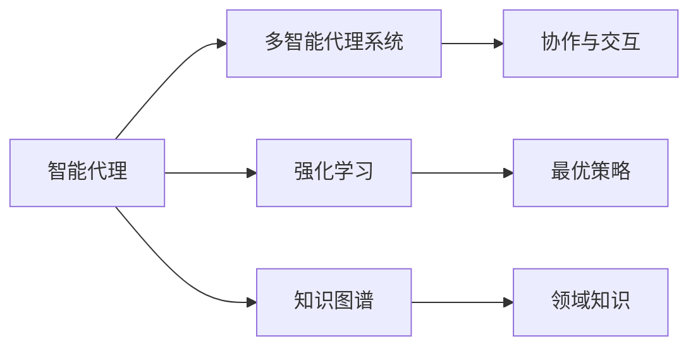

# AI人工智能代理工作流AI Agent WorkFlow：智能代理在金融系统中的应用

## 1. 背景介绍

人工智能(AI)技术的快速发展正在深刻影响着各行各业,金融领域也不例外。AI智能代理(Agent)作为人工智能的重要分支,在金融系统中的应用日益广泛。智能代理能够模拟人类专家的决策过程,自主完成复杂的金融任务,为金融机构提供高效、精准的服务。本文将重点探讨AI智能代理在金融系统中的工作流程和应用实践。

### 1.1 人工智能在金融领域的发展现状
#### 1.1.1 智能投资顾问
#### 1.1.2 智能风控与反欺诈
#### 1.1.3 智能客服与营销

### 1.2 AI智能代理的概念与特点  
#### 1.2.1 智能代理的定义
#### 1.2.2 智能代理的关键特征
#### 1.2.3 智能代理与传统软件的区别

### 1.3 智能代理在金融系统中的应用前景
#### 1.3.1 提升金融服务效率
#### 1.3.2 优化风险管控能力 
#### 1.3.3 创新金融产品与服务模式

## 2. 核心概念与联系

要理解AI智能代理在金融系统中的工作流程,首先需要了解几个核心概念:

### 2.1 智能代理(Intelligent Agent)
智能代理是一种能够感知环境、自主决策并采取行动以实现特定目标的计算机程序。它具有自主性、社会性、反应性、主动性等特点。

### 2.2 多智能代理系统(Multi-Agent System, MAS)
多智能代理系统由多个智能代理组成,通过彼此协作与交互来解决复杂问题。在金融系统中,不同功能的智能代理需要协同工作,共同完成投资决策、风险管控等任务。

### 2.3 强化学习(Reinforcement Learning, RL)  
强化学习是智能代理的核心算法之一,通过不断试错和环境反馈来学习最优策略。在金融交易等场景中,智能代理利用强化学习算法,在海量历史数据中寻找最佳投资组合与交易策略。

### 2.4 知识图谱(Knowledge Graph)
知识图谱以结构化的方式表示实体及其关联,为智能代理提供丰富的领域知识。在金融系统中,知识图谱能够刻画公司、市场、经济政策等要素之间的复杂关系,辅助智能代理做出精准判断。

下图展示了这几个核心概念之间的联系:



## 3. 核心算法原理与具体操作步骤

### 3.1 强化学习算法原理
#### 3.1.1 马尔可夫决策过程(MDP)
强化学习问题可以用马尔可夫决策过程来建模,其核心要素包括:状态(State)、动作(Action)、转移概率(Transition Probability)、奖励(Reward)和折扣因子(Discount Factor)。

#### 3.1.2 值函数与策略函数
值函数(Value Function)估计某一状态或状态-动作对的长期回报,常见的有状态值函数 $V(s)$ 和动作值函数 $Q(s,a)$。策略函数 $\pi(a|s)$ 则定义了在某一状态下智能体选择动作的概率分布。

#### 3.1.3 值迭代与策略迭代
值迭代(Value Iteration)和策略迭代(Policy Iteration)是两种经典的强化学习算法。值迭代通过迭代贝尔曼方程来更新值函数,进而获得最优策略。策略迭代则交替进行策略评估(Policy Evaluation)和策略提升(Policy Improvement)。

### 3.2 强化学习算法操作步骤
#### 3.2.1 环境建模
首先需要将问题抽象为马尔可夫决策过程,明确状态空间、动作空间、转移概率和奖励函数的定义。以股票交易为例,状态可以包括持仓、账户余额等,动作包括买入、卖出、持有等,奖励可以是收益率。

#### 3.2.2 算法选择与实现
根据问题的特点选择合适的强化学习算法,如DQN、DDPG、PPO等,并参考论文或开源实现进行编码。要注意算法的超参数调节,如学习率、折扣因子、探索率等。

#### 3.2.3 模型训练与测试
利用历史数据对强化学习模型进行训练,并在验证集上评估策略的有效性。可视化训练过程中的奖励、损失等指标,以监控训练进度。训练完成后,在测试集上评估模型的最终性能。

#### 3.2.4 策略部署与更新
将训练好的强化学习策略部署到实际的交易系统中,并持续监控其表现。根据市场变化和新数据的反馈,定期对策略进行再训练和更新。

## 4. 数学模型与公式详解

### 4.1 马尔可夫决策过程(MDP)的数学定义
一个马尔可夫决策过程可以表示为一个五元组 $\langle S, A, P, R, \gamma \rangle$,其中:

- $S$ 是有限的状态集合
- $A$ 是有限的动作集合
- $P$ 是状态转移概率矩阵,$P(s'|s,a)$ 表示在状态 $s$ 下执行动作 $a$ 后转移到状态 $s'$ 的概率
- $R$ 是奖励函数,$R(s,a)$ 表示在状态 $s$ 下执行动作 $a$ 获得的即时奖励
- $\gamma \in [0,1]$ 是折扣因子,表示未来奖励的折现程度

### 4.2 值函数与贝尔曼方程
状态值函数 $V^{\pi}(s)$ 表示从状态 $s$ 开始,遵循策略 $\pi$ 能获得的期望累积奖励:

$$V^{\pi}(s) = \mathbb{E}_{\pi}[\sum_{t=0}^{\infty} \gamma^t R(s_t,a_t) | s_0=s]$$

动作值函数 $Q^{\pi}(s,a)$ 表示在状态 $s$ 下执行动作 $a$,然后遵循策略 $\pi$ 能获得的期望累积奖励:

$$Q^{\pi}(s,a) = \mathbb{E}_{\pi}[\sum_{t=0}^{\infty} \gamma^t R(s_t,a_t) | s_0=s, a_0=a]$$

根据贝尔曼方程,值函数满足如下递推关系:

$$V^{\pi}(s) = \sum_{a} \pi(a|s) \sum_{s'} P(s'|s,a) [R(s,a) + \gamma V^{\pi}(s')]$$

$$Q^{\pi}(s,a) = \sum_{s'} P(s'|s,a) [R(s,a) + \gamma \sum_{a'} \pi(a'|s') Q^{\pi}(s',a')]$$

### 4.3 值迭代算法
值迭代算法通过迭代更新状态值函数来获得最优策略。每次迭代按照如下公式更新值函数:

$$V_{k+1}(s) = \max_{a} \sum_{s'} P(s'|s,a) [R(s,a) + \gamma V_k(s')]$$

当值函数收敛时,即可得到最优策略:

$$\pi^*(s) = \arg\max_{a} \sum_{s'} P(s'|s,a) [R(s,a) + \gamma V^*(s')]$$

### 4.4 Q-Learning算法
Q-Learning是一种常用的无模型强化学习算法,它直接学习动作值函数。Q-Learning的更新公式为:

$$Q(s,a) \leftarrow Q(s,a) + \alpha [R(s,a) + \gamma \max_{a'} Q(s',a') - Q(s,a)]$$

其中 $\alpha$ 是学习率,$s'$ 是在状态 $s$ 下执行动作 $a$ 后转移到的新状态。

## 5. 项目实践：代码实例与详解

下面以一个简单的股票交易策略为例,展示如何用Python实现Q-Learning算法。

### 5.1 环境建模

首先定义股票交易环境类`StockTradingEnv`,包括状态空间、动作空间、转移函数和奖励函数:

```python
import numpy as np

class StockTradingEnv:
    def __init__(self, stock_prices, initial_balance=1000):
        self.stock_prices = stock_prices
        self.initial_balance = initial_balance
        self.n_steps = len(stock_prices) - 1
        
        self.action_space = np.array([0, 1, 2])  # 0: 持有, 1: 买入, 2: 卖出
        self.state_space = np.zeros((self.n_steps, 3))  # 状态: [当前时间步, 持有现金, 持有股票数]
        
        self.current_step = 0
        self.balance = initial_balance
        self.num_stocks = 0
    
    def reset(self):
        self.current_step = 0
        self.balance = self.initial_balance
        self.num_stocks = 0
        return self._get_state()
    
    def step(self, action):
        assert action in self.action_space
        
        current_price = self.stock_prices[self.current_step]
        if action == 1:  # 买入
            num_buy = self.balance // current_price
            self.balance -= num_buy * current_price
            self.num_stocks += num_buy
        elif action == 2:  # 卖出  
            self.balance += self.num_stocks * current_price
            self.num_stocks = 0
        
        self.current_step += 1
        done = (self.current_step == self.n_steps)
        next_state = self._get_state()
        reward = self._get_reward(action)
        return next_state, reward, done
    
    def _get_state(self):
        state = np.zeros(3)
        state[0] = self.current_step
        state[1] = self.balance
        state[2] = self.num_stocks
        return state
    
    def _get_reward(self, action):
        if self.current_step == self.n_steps:
            return self.balance + self.num_stocks * self.stock_prices[-1] - self.initial_balance
        else:
            return 0
```

### 5.2 Q-Learning算法实现

接下来实现Q-Learning算法,包括Q表的初始化、贪婪策略和Q值更新:

```python
class QLearningAgent:
    def __init__(self, env, alpha=0.5, gamma=0.9, epsilon=0.1):
        self.env = env
        self.alpha = alpha
        self.gamma = gamma
        self.epsilon = epsilon
        
        self.q_table = np.zeros((env.n_steps, 3))
    
    def choose_action(self, state):
        if np.random.uniform() < self.epsilon:
            return np.random.choice(self.env.action_space)
        else:
            return np.argmax(self.q_table[int(state[0])])
    
    def update_q_table(self, state, action, reward, next_state):
        current_q = self.q_table[int(state[0]), action]
        next_max_q = np.max(self.q_table[int(next_state[0])])
        new_q = (1 - self.alpha) * current_q + self.alpha * (reward + self.gamma * next_max_q)
        self.q_table[int(state[0]), action] = new_q
```

### 5.3 训练与评估

最后,进行Q-Learning算法的训练和评估:

```python
def train(agent, num_episodes=1000):
    for episode in range(num_episodes):
        state = agent.env.reset()
        done = False
        while not done:
            action = agent.choose_action(state)
            next_state, reward, done = agent.env.step(action)
            agent.update_q_table(state, action, reward, next_state)
            state = next_state

def evaluate(agent):
    state = agent.env.reset()
    done = False
    while not done:
        action = np.argmax(agent.q_table[int(state[0])])
        next_state, reward, done = agent.env.step(action)
        state = next_state
    
    return agent.env.balance + agent.env.num_stocks * agent.env.stock_prices[-1]

if __name__ == "__main__":
    stock_prices = [100, 102, 105, 103, 101, 106, 110, 112, 115, 119]
    env = StockTradingEnv(stock_prices)
    agent = QLearningAgent(env)
    
    train(agent)
    final_value = evaluate(agent)
    print(f"Final portfolio value: {final_value:.2f}")
```

以上就是一个简单的股票交易强化学习策略的Python实现。实际应用中,还需要考虑更复杂的状态表