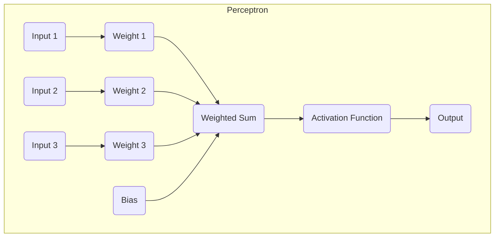

# AI人工智能核心算法原理与代码实例讲解：感知器

## 1.背景介绍

人工神经网络是人工智能领域的一个重要分支,它的发展源于对生物神经系统的模拟和研究。作为最早提出的神经网络模型之一,感知器(Perceptron)在神经网络发展历程中扮演着重要角色。

感知器是一种简单的二元线性分类器,由加拿大心理学家弗兰克·罗森布拉特(Frank Rosenblatt)于1957年提出。它模拟了人脑中单个神经元的工作原理,旨在通过机器学习的方式来识别简单的模式。虽然感知器的结构相对简单,但它奠定了神经网络发展的基础,并启发了后续更复杂神经网络模型的诞生。

### 1.1 感知器的历史背景

感知器的提出源于对生物神经系统的模拟研究。早在20世纪40年代,研究人员就开始尝试构建能够模拟生物神经元行为的数学模型。1943年,神经生理学家沃伦·麦卡洛克(Warren McCulloch)和逻辑学家沃尔特·皮茨(Walter Pitts)提出了第一个人工神经网络模型,被称为"M-P神经元模型"。

在M-P神经元模型的基础上,罗森布拉特进一步发展了感知器模型。他的目标是创建一种能够自动学习和识别模式的机器。1957年,罗森布拉特在康奈尔航空实验室工作时,成功开发出了感知器算法。这被认为是神经网络发展的里程碑事件。

### 1.2 感知器的局限性

尽管感知器是神经网络发展的重要一步,但它也存在一些局限性。1969年,马文·明斯基(Marvin Minsky)和西摩尔·派珀特(Seymour Papert)发表了著名的书籍《感知器》(Perceptrons),指出感知器无法学习异或(XOR)等非线性可分函数。这一发现导致了人工神经网络研究在一段时间内陷入停滞。

然而,感知器的局限性也促进了后续神经网络模型的发展,如多层感知器、反向传播算法等。这些新模型克服了感知器的缺陷,能够处理更复杂的问题。因此,感知器虽然简单,但对于理解神经网络的发展历程和基本原理至关重要。

## 2.核心概念与联系

### 2.1 感知器的结构

感知器是一种单层神经网络,由输入层、权重和偏置组成。它接收多个二进制输入,对每个输入赋予一个权重,然后计算加权和。如果加权和大于某个阈值,感知器会输出1,否则输出0。这种二元输出使感知器成为一种线性分类器。

感知器的结构如下图所示:

在上图中,输入层包含多个输入节点(I1、I2、I3),每个输入节点都与一个权重(W1、W2、W3)相连。此外,还有一个偏置(B)项。所有加权输入的和被传递到激活函数(ACT),激活函数决定输出(OUT)是0还是1。

### 2.2 感知器的工作原理

感知器的工作原理可以用以下公式表示:

$$
y = \begin{cases}
1, & \text{if } \sum_{i=1}^{n} w_i x_i + b > 0\\
0, & \text{otherwise}
\end{cases}
$$

其中:
- $y$ 是感知器的输出(0或1)
- $x_i$ 是第 $i$ 个输入
- $w_i$ 是与第 $i$ 个输入相关联的权重
- $b$ 是偏置项
- $n$ 是输入的总数

感知器通过计算加权和 $\sum_{i=1}^{n} w_i x_i + b$,然后将其与阈值0进行比较,从而决定输出是0还是1。如果加权和大于0,输出为1,否则为0。

### 2.3 感知器的学习规则

感知器使用一种简单的学习规则,称为"感知器学习规则"或"delta规则",用于调整权重和偏置,以最小化错误率。该规则可以总结为以下步骤:

1. 初始化权重和偏置为小的随机值。
2. 对于每个训练样本:
   - 计算加权和并获得输出。
   - 将输出与期望输出进行比较,计算误差。
   - 如果存在误差,则更新权重和偏置以减小误差。
3. 重复步骤2,直到达到收敛或满足停止条件。

权重和偏置的更新规则如下:

$$
w_i^{(t+1)} = w_i^{(t)} + \eta (y^{(target)} - y^{(output)}) x_i
$$

$$
b^{(t+1)} = b^{(t)} + \eta (y^{(target)} - y^{(output)})
$$

其中:
- $w_i^{(t)}$ 和 $b^{(t)}$ 分别是第 $t$ 次迭代时的权重和偏置
- $\eta$ 是学习率,控制更新的步长
- $y^{(target)}$ 是期望输出
- $y^{(output)}$ 是实际输出
- $x_i$ 是第 $i$ 个输入

通过不断调整权重和偏置,感知器可以逐步减小误差,从而学习到能够正确分类训练数据的参数。

## 3.核心算法原理具体操作步骤

感知器算法的核心操作步骤如下:

1. **初始化权重和偏置**

   将所有权重 $w_i$ 和偏置 $b$ 初始化为小的随机值,通常在 $[-1, 1]$ 范围内。

2. **输入样本并计算加权和**

   对于每个训练样本 $(x_1, x_2, \dots, x_n)$,计算加权和:

   $$
   \sum_{i=1}^{n} w_i x_i + b
   $$

3. **应用激活函数获得输出**

   将加权和传递给激活函数,通常使用阶跃函数(Heaviside Step Function):

   $$
   y = \begin{cases}
   1, & \text{if } \sum_{i=1}^{n} w_i x_i + b > 0\\
   0, & \text{otherwise}
   \end{cases}
   $$

   这会产生一个二元输出 $y$,表示感知器对该样本的预测结果。

4. **计算误差并更新权重和偏置**

   将预测输出 $y$ 与期望输出 $y^{(target)}$ 进行比较,计算误差:

   $$
   \text{error} = y^{(target)} - y
   $$

   如果存在误差,则根据感知器学习规则更新权重和偏置:

   $$
   w_i^{(t+1)} = w_i^{(t)} + \eta \text{error} \cdot x_i
   $$

   $$
   b^{(t+1)} = b^{(t)} + \eta \text{error}
   $$

   其中 $\eta$ 是学习率,控制更新的步长。

5. **重复训练直到收敛**

   对所有训练样本重复步骤2到4,直到误差足够小或达到最大迭代次数。在这个过程中,权重和偏置会不断调整,使感知器能够逐步学习到正确的决策边界。

通过上述步骤,感知器可以学习到一组权重和偏置,从而能够对新的输入样本进行正确的二元分类。

## 4.数学模型和公式详细讲解举例说明

在前面的章节中,我们已经介绍了感知器的基本结构和工作原理。现在,让我们更深入地探讨感知器的数学模型和公式,并通过具体示例来说明它们的应用。

### 4.1 感知器的数学模型

感知器的数学模型可以用以下公式表示:

$$
y = \phi\left(\sum_{i=1}^{n} w_i x_i + b\right)
$$

其中:
- $y$ 是感知器的输出
- $x_i$ 是第 $i$ 个输入
- $w_i$ 是与第 $i$ 个输入相关联的权重
- $b$ 是偏置项
- $n$ 是输入的总数
- $\phi(\cdot)$ 是激活函数,通常使用阶跃函数(Heaviside Step Function)

阶跃函数的定义如下:

$$
\phi(z) = \begin{cases}
1, & \text{if } z > 0\\
0, & \text{otherwise}
\end{cases}
$$

将阶跃函数代入感知器的数学模型,我们可以得到:

$$
y = \begin{cases}
1, & \text{if } \sum_{i=1}^{n} w_i x_i + b > 0\\
0, & \text{otherwise}
\end{cases}
$$

这个公式表示,如果加权和 $\sum_{i=1}^{n} w_i x_i + b$ 大于0,感知器将输出1,否则输出0。

### 4.2 感知器学习规则

感知器使用一种简单的学习规则,称为"感知器学习规则"或"delta规则",用于调整权重和偏置,以最小化错误率。该规则可以用以下公式表示:

$$
w_i^{(t+1)} = w_i^{(t)} + \eta (y^{(target)} - y^{(output)}) x_i
$$

$$
b^{(t+1)} = b^{(t)} + \eta (y^{(target)} - y^{(output)})
$$

其中:
- $w_i^{(t)}$ 和 $b^{(t)}$ 分别是第 $t$ 次迭代时的权重和偏置
- $\eta$ 是学习率,控制更新的步长
- $y^{(target)}$ 是期望输出
- $y^{(output)}$ 是实际输出
- $x_i$ 是第 $i$ 个输入

这些公式表示,如果存在误差(即 $y^{(target)} - y^{(output)} \neq 0$),则需要调整权重和偏置以减小误差。权重的更新量与输入 $x_i$ 和误差项 $(y^{(target)} - y^{(output)})$ 成正比,而偏置的更新量只与误差项有关。

通过不断调整权重和偏置,感知器可以逐步减小误差,从而学习到能够正确分类训练数据的参数。

### 4.3 示例说明

为了更好地理解感知器的数学模型和学习规则,让我们通过一个简单的二维示例来说明。

假设我们有一个二维数据集,包含两个特征 $x_1$ 和 $x_2$,以及对应的二元标签 $y \in \{0, 1\}$。我们希望训练一个感知器来对这个数据集进行分类。

初始化权重 $w_1=0.1$、$w_2=0.2$ 和偏置 $b=-0.3$,学习率 $\eta=0.1$。对于一个训练样本 $(x_1=0.5, x_2=0.6, y^{(target)}=1)$,我们可以计算如下:

1. 计算加权和:

   $$
   \sum_{i=1}^{2} w_i x_i + b = 0.1 \times 0.5 + 0.2 \times 0.6 - 0.3 = -0.07
   $$

2. 应用激活函数获得输出:

   $$
   y^{(output)} = \phi(-0.07) = 0
   $$

3. 计算误差:

   $$
   \text{error} = y^{(target)} - y^{(output)} = 1 - 0 = 1
   $$

4. 更新权重和偏置:

   $$
   w_1^{(t+1)} = w_1^{(t)} + \eta \text{error} \cdot x_1 = 0.1 + 0.1 \times 1 \times 0.5 = 0.15
   $$

   $$
   w_2^{(t+1)} = w_2^{(t)} + \eta \text{error} \cdot x_2 = 0.2 + 0.1 \times 1 \times 0.6