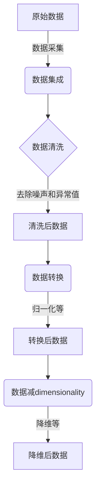
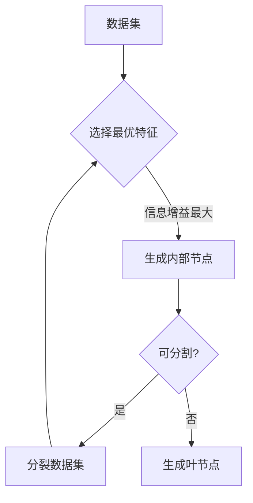
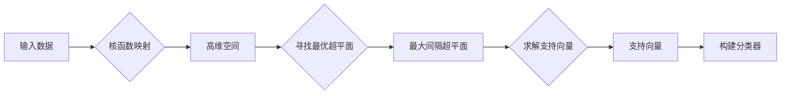
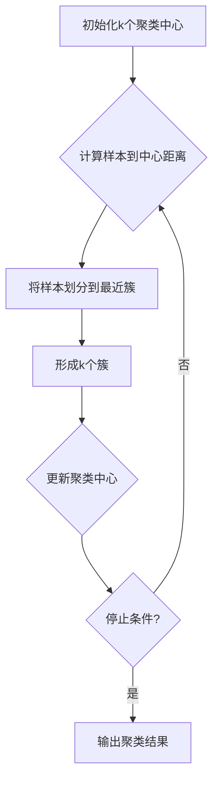
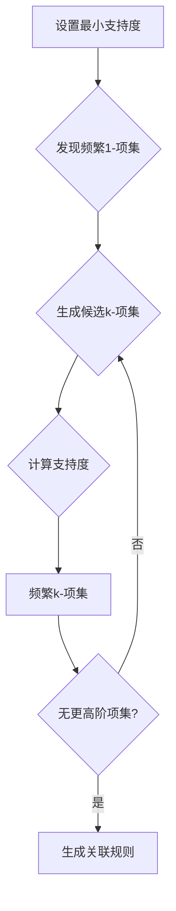

# AI人工智能核心算法原理与代码实例讲解：数据挖掘

## 1.背景介绍

### 1.1 数据时代的到来

在当今时代，数据已经成为了一种新型的战略资源。随着信息技术的飞速发展,各行各业产生的数据量都呈现出爆炸式的增长趋势。无论是社交媒体平台、电子商务网站,还是物联网设备、金融交易系统,都在不断地产生着海量的数据。这些数据蕴含着巨大的商业价值和洞见,但同时也给数据的存储、处理和分析带来了前所未有的挑战。

### 1.2 数据挖掘的重要性

面对如此庞大的数据量,传统的数据处理方式已经无法满足需求。这就催生了数据挖掘(Data Mining)这一崭新的技术领域。数据挖掘旨在从海量数据中发现隐藏的、潜在有价值的信息和知识,为企业的决策提供数据支持。通过数据挖掘,我们可以发现数据中的模式和规律,预测未来的趋势,优化业务流程,提高运营效率等。

### 1.3 人工智能与数据挖掘的融合

随着人工智能(AI)技术的不断发展,数据挖掘也开始与之深度融合。传统的数据挖掘算法主要依赖于人工设计的规则和特征,而现代的数据挖掘算法则越来越多地采用机器学习、深度学习等人工智能技术,从而能够自动发现数据中的复杂模式,提高挖掘的准确性和效率。

## 2.核心概念与联系

在深入探讨数据挖掘的核心算法原理之前,我们需要先了解一些基本概念和它们之间的联系。

### 2.1 数据预处理



数据预处理是数据挖掘的基础环节,包括数据采集、数据集成、数据清洗、数据转换和数据减dimensionality等步骤。这一过程旨在从原始数据中获取高质量、统一格式的数据集,为后续的挖掘算法提供输入。

### 2.2 数据挖掘任务

数据挖掘任务可以分为以下几类:

- **分类(Classification)**: 基于已知样本数据,构建分类模型,对新数据进行分类。常见应用包括垃圾邮件过滤、疾病诊断等。
- **聚类(Clustering)**: 根据数据之间的相似性,将数据自动划分为若干簇。常见应用包括客户细分、图像分割等。
- **关联规则挖掘(Association Rule Mining)**: 发现数据集中的频繁模式、相关性等规则。常见应用包括购物篮分析、网页挖掘等。
- **回归分析(Regression Analysis)**: 建立自变量和因变量之间的数学模型,用于预测连续值。常见应用包括销量预测、股票预测等。
- **异常检测(Anomaly Detection)**: 识别数据集中的异常值或异常模式。常见应用包括欺诈检测、故障诊断等。

### 2.3 评估指标

为了评估数据挖掘算法的性能,我们需要一些评估指标。常用的指标包括:

- **准确率(Accuracy)**: 正确预测的样本数占总样本数的比例。
- **精确率(Precision)**: 被预测为正例的样本中真正为正例的比例。
- **召回率(Recall)**: 真实的正例样本中被正确预测为正例的比例。
- **F1分数(F1-score)**: 精确率和召回率的调和平均值。
- **ROC曲线(ROC Curve)**: 以真正例率为纵坐标,假正例率为横坐标绘制的曲线,用于评估二分类模型的性能。
- **均方根误差(RMSE)**: 对于回归任务,用于衡量预测值与实际值之间的差异程度。

## 3.核心算法原理具体操作步骤

### 3.1 决策树算法

决策树是一种常用的分类和回归算法,它通过构建决策树模型来对数据进行预测。决策树的构建过程可以概括为以下步骤:

1. **选择最优特征**: 根据信息增益或信息增益比等指标,选择能够最好地区分样本的特征作为当前节点。
2. **生成子节点**: 根据选定的特征,将样本集合分裂为若干子集。
3. **构建子树**: 对于每个子集,重复步骤1和2,构建子树。
4. **生成决策树**: 当子集无法再分割或满足停止条件时,生成决策树的叶节点。



常用的决策树算法包括ID3、C4.5和CART等。这些算法在处理离散值和连续值特征、处理缺失值、剪枝等方面有所不同。

### 3.2 支持向量机算法

支持向量机(SVM)是一种有监督的学习模型,常用于分类和回归问题。SVM的基本思想是在高维空间中寻找一个超平面,将不同类别的样本分开,同时使得两类样本到超平面的距离最大化。

对于线性可分的情况,SVM的工作步骤如下:

1. **将数据映射到高维空间**: 利用核函数(如线性核、多项式核、高斯核等)将数据从低维映射到高维。
2. **寻找最大间隔超平面**: 在高维空间中找到一个超平面,使得两类样本到超平面的距离最大化。
3. **求解支持向量**: 确定位于最大间隔边界上的支持向量。
4. **构建分类器**: 基于支持向量和最大间隔超平面构建分类器。



对于线性不可分的情况,SVM引入了软间隔的概念,允许有少量样本位于超平面两侧,但需要支付一定的惩罚代价。

### 3.3 K-Means聚类算法

K-Means是一种常用的无监督聚类算法,其基本思想是将n个样本划分为k个簇,使得簇内样本尽可能紧密,簇间样本尽可能疏远。算法步骤如下:

1. **初始化k个聚类中心**: 通常随机选择k个样本作为初始聚类中心。
2. **计算每个样本到各个聚类中心的距离**: 常用的距离度量包括欧氏距离、曼哈顿距离等。
3. **将每个样本划分到最近的聚类中心所在的簇**: 形成k个簇。
4. **更新每个簇的聚类中心**: 将簇内所有样本的均值作为新的聚类中心。
5. **重复步骤2-4**: 直到聚类中心不再发生变化或达到最大迭代次数。



K-Means算法的优点是简单高效,但缺点是对初始聚类中心的选择敏感,并且需要事先指定簇的数量k。

### 3.4 Apriori算法

Apriori算法是关联规则挖掘中最著名的算法之一,用于发现数据集中的频繁项集和关联规则。算法步骤如下:

1. **设置最小支持度阈值**: 确定判断频繁项集的支持度阈值。
2. **发现频繁1-项集**: 扫描数据集,统计每个项的支持度,保留支持度大于阈值的项作为频繁1-项集。
3. **发现更高阶频繁项集**: 利用Apriori原理(任何非频繁项集的超集也是非频繁的),从频繁(k-1)-项集生成候选k-项集,再扫描数据集计算支持度,保留频繁k-项集。
4. **重复步骤3**: 直到无法生成更高阶的频繁项集为止。
5. **生成关联规则**: 从频繁项集中提取满足最小置信度阈值的关联规则。



Apriori算法的优点是简单易懂,但当数据集较大或最小支持度设置较低时,算法效率会急剧下降。

## 4.数学模型和公式详细讲解举例说明

### 4.1 决策树算法中的信息增益

在决策树算法中,信息增益是一个重要的概念,用于选择最优特征进行数据集划分。给定一个数据集D,包含m个样本,属于k个类别,记样本属于第i类的概率为$p_i$,则数据集D的信息熵定义为:

$$
Ent(D) = -\sum_{i=1}^{k}p_i\log_2p_i
$$

信息熵越大,数据集的混乱程度就越高。在对数据集D根据特征A进行划分后,得到若干子集$D_1,D_2,...,D_v$,其中$D_j$包含$m_j$个样本,则条件熵定义为:

$$
Ent(D|A) = \sum_{j=1}^{v}\frac{m_j}{m}Ent(D_j)
$$

信息增益则定义为原始信息熵与条件熵之差:

$$
Gain(D,A) = Ent(D) - Ent(D|A)
$$

信息增益越大,说明使用特征A对数据集进行划分所获得的"纯度提升"越大。因此,我们可以选择信息增益最大的特征作为当前节点的划分特征。

例如,假设有一个天气数据集,包含4个特征:阴天(Overcast)、温度(Temperature)、湿度(Humidity)和是否适合打球(PlayTennis),我们希望根据前3个特征预测是否适合打球。经过计算,可得:

- 阴天的信息增益为0.971
- 温度的信息增益为0.555
- 湿度的信息增益为0.152

因此,我们应该选择阴天作为根节点的划分特征。

### 4.2 支持向量机中的核函数

在支持向量机中,核函数是一种将低维数据映射到高维空间的技术,使得原本线性不可分的数据在高维空间中变得可分。常用的核函数包括:

1. **线性核函数**:

$$
K(x_i,x_j) = x_i^Tx_j
$$

2. **多项式核函数**:

$$
K(x_i,x_j) = (\gamma x_i^Tx_j + r)^d, \gamma > 0
$$

3. **高斯核函数(RBF核)**:

$$
K(x_i,x_j) = \exp(-\gamma||x_i - x_j||^2), \gamma > 0
$$

其中,$\gamma,r,d$是核函数的参数,需要通过交叉验证等方法进行调优。

例如,对于下图所示的二维数据,在原始空间中是线性不可分的,但是通过高斯核函数映射到三维空间后,就变得线性可分了。

```mermaid
graph LR
    A[原始二维空间] -->|高斯核函数映射| B[三维空间]
    A