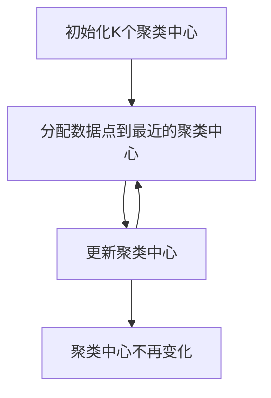
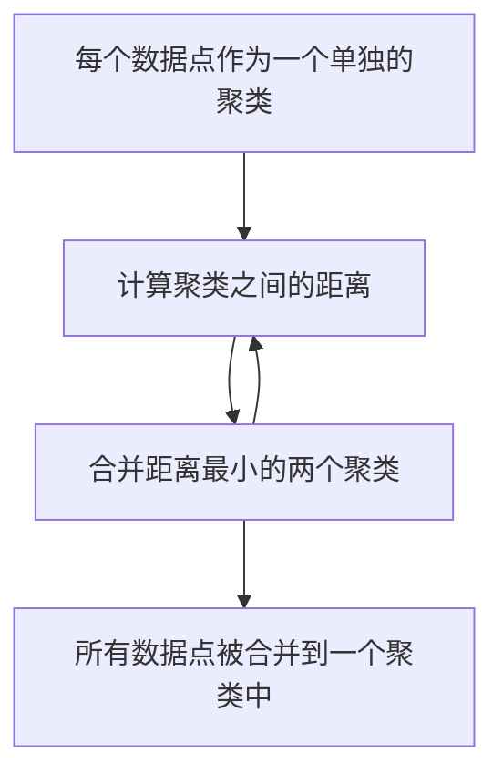
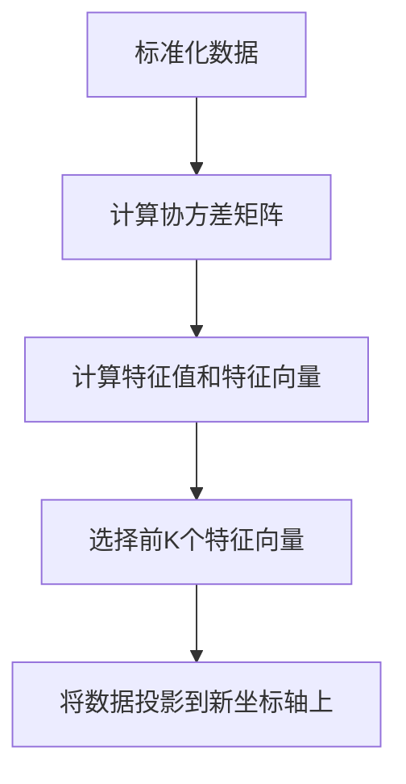

# AI人工智能核心算法原理与代码实例讲解：无监督学习

## 1.背景介绍

无监督学习是机器学习中的一个重要分支，与监督学习不同，无监督学习不依赖于标注数据，而是通过数据本身的结构和分布来发现潜在的模式和关系。无监督学习在数据挖掘、图像处理、自然语言处理等领域有着广泛的应用。本文将深入探讨无监督学习的核心算法原理，并通过代码实例进行详细讲解。

## 2.核心概念与联系

### 2.1 无监督学习的定义

无监督学习是一种机器学习方法，它在没有标签的情况下对数据进行分析和建模。其主要目标是发现数据中的隐藏模式、结构或分布。

### 2.2 无监督学习与监督学习的区别

- **数据标注**：监督学习需要标注数据，而无监督学习不需要。
- **目标**：监督学习的目标是预测标签，无监督学习的目标是发现数据的内在结构。
- **算法**：常见的监督学习算法包括线性回归、决策树等；无监督学习算法包括聚类、降维等。

### 2.3 无监督学习的主要任务

- **聚类**：将数据分成多个组，每组中的数据具有相似性。
- **降维**：将高维数据映射到低维空间，保留数据的主要特征。
- **异常检测**：识别数据中的异常点或异常模式。

## 3.核心算法原理具体操作步骤

### 3.1 聚类算法

#### 3.1.1 K-means算法

K-means算法是一种常见的聚类算法，其基本步骤如下：

1. 初始化K个聚类中心。
2. 将每个数据点分配到最近的聚类中心。
3. 更新聚类中心为当前聚类中所有数据点的均值。
4. 重复步骤2和3，直到聚类中心不再变化。



#### 3.1.2 层次聚类

层次聚类通过构建一个树状结构来表示数据的层次关系，其基本步骤如下：

1. 将每个数据点作为一个单独的聚类。
2. 计算所有聚类之间的距离，合并距离最小的两个聚类。
3. 重复步骤2，直到所有数据点被合并到一个聚类中。



### 3.2 降维算法

#### 3.2.1 主成分分析（PCA）

PCA是一种常见的降维算法，其基本步骤如下：

1. 标准化数据。
2. 计算数据的协方差矩阵。
3. 计算协方差矩阵的特征值和特征向量。
4. 选择前K个特征向量作为新的坐标轴，将数据投影到这些坐标轴上。



## 4.数学模型和公式详细讲解举例说明

### 4.1 K-means算法的数学模型

K-means算法的目标是最小化以下目标函数：

$$
J = \sum_{i=1}^{K} \sum_{x \in C_i} \| x - \mu_i \|^2
$$

其中，$K$ 是聚类的数量，$C_i$ 是第 $i$ 个聚类，$\mu_i$ 是第 $i$ 个聚类的中心，$x$ 是数据点。

### 4.2 PCA的数学模型

PCA的目标是找到一个投影矩阵 $W$，使得投影后的数据方差最大化。其目标函数为：

$$
\max_W \text{Tr}(W^T S W)
$$

其中，$\text{Tr}$ 表示矩阵的迹，$S$ 是数据的协方差矩阵。

## 5.项目实践：代码实例和详细解释说明

### 5.1 K-means算法的代码实现

```python
import numpy as np
from sklearn.datasets import make_blobs
import matplotlib.pyplot as plt

# 生成数据
X, _ = make_blobs(n_samples=300, centers=4, cluster_std=0.60, random_state=0)

# 初始化聚类中心
def initialize_centroids(X, k):
    return X[np.random.choice(X.shape[0], k, replace=False)]

# 计算距离
def compute_distance(X, centroids):
    return np.linalg.norm(X[:, np.newaxis] - centroids, axis=2)

# 更新聚类中心
def update_centroids(X, labels, k):
    return np.array([X[labels == i].mean(axis=0) for i in range(k)])

# K-means算法
def kmeans(X, k, max_iters=100):
    centroids = initialize_centroids(X, k)
    for _ in range(max_iters):
        distances = compute_distance(X, centroids)
        labels = np.argmin(distances, axis=1)
        new_centroids = update_centroids(X, labels, k)
        if np.all(centroids == new_centroids):
            break
        centroids = new_centroids
    return centroids, labels

# 运行K-means算法
k = 4
centroids, labels = kmeans(X, k)

# 可视化结果
plt.scatter(X[:, 0], X[:, 1], c=labels, s=50, cmap='viridis')
plt.scatter(centroids[:, 0], centroids[:, 1], s=200, c='red', marker='X')
plt.show()
```

### 5.2 PCA的代码实现

```python
import numpy as np
from sklearn.datasets import load_iris
import matplotlib.pyplot as plt

# 载入数据
data = load_iris()
X = data.data

# 标准化数据
X_mean = np.mean(X, axis=0)
X_std = np.std(X, axis=0)
X_normalized = (X - X_mean) / X_std

# 计算协方差矩阵
cov_matrix = np.cov(X_normalized.T)

# 计算特征值和特征向量
eigenvalues, eigenvectors = np.linalg.eig(cov_matrix)

# 选择前两个特征向量
W = eigenvectors[:, :2]

# 投影数据
X_pca = X_normalized.dot(W)

# 可视化结果
plt.scatter(X_pca[:, 0], X_pca[:, 1], c=data.target, cmap='viridis')
plt.xlabel('Principal Component 1')
plt.ylabel('Principal Component 2')
plt.show()
```

## 6.实际应用场景

### 6.1 聚类的应用

- **客户细分**：通过聚类算法将客户分成不同的群体，以便进行个性化营销。
- **图像分割**：将图像分成多个区域，每个区域代表不同的物体或背景。
- **文档分类**：将文档分成不同的类别，以便进行信息检索和推荐。

### 6.2 降维的应用

- **数据可视化**：通过降维算法将高维数据映射到低维空间，以便进行可视化分析。
- **特征提取**：通过降维算法提取数据的主要特征，以便进行后续的建模和分析。
- **噪声消除**：通过降维算法去除数据中的噪声，提高数据的质量。

## 7.工具和资源推荐

### 7.1 工具推荐

- **Scikit-learn**：一个强大的Python机器学习库，提供了丰富的无监督学习算法。
- **TensorFlow**：一个开源的机器学习框架，支持大规模的机器学习任务。
- **MATLAB**：一个高效的数值计算工具，适合进行数据分析和建模。

### 7.2 资源推荐

- **《Pattern Recognition and Machine Learning》**：一本经典的机器学习教材，详细介绍了无监督学习的理论和算法。
- **Coursera上的机器学习课程**：由Andrew Ng教授讲授的机器学习课程，涵盖了无监督学习的基本概念和算法。
- **Kaggle**：一个数据科学竞赛平台，提供了丰富的数据集和竞赛，适合进行无监督学习的实践。

## 8.总结：未来发展趋势与挑战

无监督学习在数据分析和建模中具有重要的地位，随着数据量的不断增加和计算能力的提升，无监督学习的应用前景将更加广阔。然而，无监督学习也面临着一些挑战，如算法的可解释性、计算复杂度和数据质量等问题。未来的研究将致力于提高无监督学习算法的性能和可解释性，以便更好地应用于实际问题。

## 9.附录：常见问题与解答

### 9.1 无监督学习与监督学习的主要区别是什么？

无监督学习不依赖于标注数据，而是通过数据本身的结构和分布来发现潜在的模式和关系；监督学习则需要标注数据，并通过学习标注数据中的模式来进行预测。

### 9.2 K-means算法的主要优缺点是什么？

K-means算法的优点是简单易懂、计算效率高；缺点是需要预先指定聚类数量，对初始聚类中心敏感，容易陷入局部最优解。

### 9.3 PCA的主要应用场景有哪些？

PCA主要用于数据降维、特征提取和数据可视化，适合处理高维数据和去除数据中的噪声。

### 9.4 如何选择合适的无监督学习算法？

选择无监督学习算法时需要考虑数据的特点、任务的目标和算法的性能。对于聚类任务，可以选择K-means或层次聚类；对于降维任务，可以选择PCA或t-SNE。

### 9.5 无监督学习的未来发展方向是什么？

无监督学习的未来发展方向包括提高算法的可解释性、处理大规模数据和复杂数据结构、结合深度学习技术等。

---

作者：禅与计算机程序设计艺术 / Zen and the Art of Computer Programming