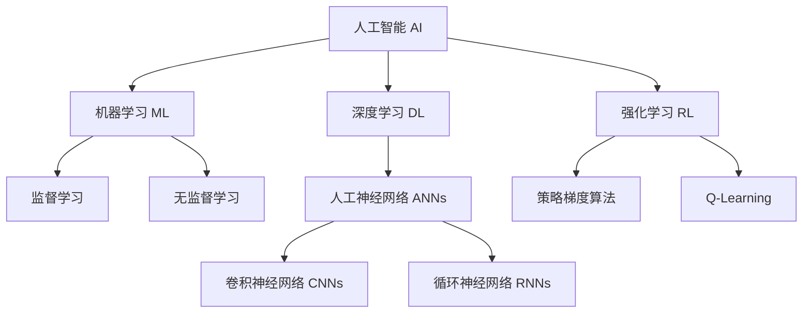

# AI人工智能核心算法原理与代码实例讲解：机器思维

## 1.背景介绍

### 1.1 人工智能的兴起

人工智能(Artificial Intelligence, AI)是当代科技领域最具革命性和颠覆性的技术之一。自20世纪50年代AI概念被正式提出以来,经过数十年的发展,AI已经渗透到我们生活的方方面面,深刻影响着人类社会的发展进程。随着算力的不断提升、数据量的激增以及算法的持续创新,AI技术正在呈现出前所未有的能力,展现出令人惊叹的智能表现。

### 1.2 AI的核心驱动力

推动AI飞速发展的核心驱动力主要来自以下几个方面:

1. **算力的飞速增长**:计算能力的持续提升为AI算法的训练和部署提供了强大动力,使得大规模深度神经网络模型的训练成为可能。
2. **海量数据的积累**:互联网时代产生了前所未有的大量数据,为数据驱动的AI算法提供了宝贵的训练资源。
3. **算法创新**:深度学习、强化学习等新兴算法的不断涌现,极大拓展了AI的能力边界。
4. **应用需求的驱动**:来自各行各业的迫切应用需求,为AI技术的发展注入了强大动力。

### 1.3 AI的发展阶段

AI的发展大致可以分为以下几个阶段:

1. **早期阶段(1950s-1970s)**:AI概念的提出,专家系统、搜索算法等传统AI技术的兴起。
2. **知识陷阱时期(1970s-1990s)**:AI发展遇到瓶颈,资金短缺,进展缓慢。
3. **深度学习时代(1990s-至今)**:多层神经网络、深度学习算法的兴起,推动AI取得突破性进展。
4. **通用人工智能时代(未来)**:旨在实现与人类智能相当,甚至超越人类智能水平的通用AI系统。

## 2.核心概念与联系

### 2.1 机器学习

机器学习(Machine Learning, ML)是AI的核心子领域之一,它赋予了计算机从数据中自动学习和获取经验的能力。机器学习算法通过从大量数据中发现内在模式和规律,从而获取知识并用于预测和决策。常见的机器学习算法包括监督学习、无监督学习、强化学习等。

### 2.2 深度学习

深度学习(Deep Learning, DL)是机器学习的一个重要分支,它基于具有多层非线性变换单元的人工神经网络。深度学习能够从原始数据中自动学习多层次抽象特征表示,并通过端到端的训练获得强大的模型。深度学习在计算机视觉、自然语言处理、语音识别等领域取得了卓越的成就。

### 2.3 强化学习

强化学习(Reinforcement Learning, RL)是机器学习的另一重要分支,它借鉴了行为主义心理学中的强化理论。强化学习系统通过与环境进行交互,根据获得的奖励信号来调整自身的策略,最终获得最优策略。强化学习在游戏AI、机器人控制等领域有着广泛应用。

### 2.4 人工神经网络

人工神经网络(Artificial Neural Networks, ANNs)是深度学习和部分强化学习算法的核心模型。它借鉴了生物神经系统的工作原理,通过构建由大量互连节点组成的网络结构,对输入数据进行非线性变换和特征提取。不同类型的神经网络,如卷积神经网络(CNNs)、循环神经网络(RNNs)等,被广泛应用于各种AI任务中。

## 3.核心算法原理具体操作步骤

### 3.1 监督学习算法

监督学习算法是机器学习中最常见和广泛使用的一类算法。它们从标注的训练数据中学习,目标是找到一个能够将输入映射到正确输出的函数或模型。常见的监督学习算法包括:

1. **线性回归**
2. **逻辑回归**
3. **决策树**
4. **支持向量机(SVM)**
5. **朴素贝叶斯**
6. **K-近邻(KNN)**

以线性回归为例,其算法步骤如下:

1. **收集数据**:获取包含输入变量X和目标变量Y的数据集。
2. **数据预处理**:对数据进行清洗、标准化等预处理操作。
3. **定义代价函数**:选择合适的代价函数,如均方误差(MSE)。
4. **模型训练**:使用梯度下降等优化算法,通过最小化代价函数来找到最优参数。
5. **模型评估**:在测试集上评估模型的性能,如R平方值。
6. **模型调优**:根据评估结果,调整超参数或特征工程以提高模型性能。
7. **模型部署**:将训练好的模型部署到实际应用中进行预测。

### 3.2 深度学习算法

深度学习算法是基于人工神经网络的一类算法,它们能够从原始数据中自动学习多层次的特征表示。常见的深度学习算法包括:

1. **卷积神经网络(CNN)**
2. **循环神经网络(RNN)**
3. **长短期记忆网络(LSTM)**
4. **门控循环单元(GRU)**
5. **自编码器(Autoencoder)**
6. **生成对抗网络(GAN)**

以卷积神经网络为例,其算法步骤如下:

1. **数据准备**:收集并预处理图像数据集。
2. **网络架构设计**:设计合适的CNN架构,包括卷积层、池化层和全连接层。
3. **初始化参数**:对网络权重进行随机初始化。
4. **前向传播**:输入数据经过网络层层传播,计算输出。
5. **计算损失**:比较输出与标签的差异,计算损失函数值。
6. **反向传播**:通过反向传播算法计算每层参数的梯度。
7. **参数更新**:使用优化算法(如SGD)根据梯度更新网络参数。
8. **重复训练**:重复执行步骤4-7,直到模型收敛或达到最大迭代次数。
9. **模型评估**:在测试集上评估模型性能,如准确率等指标。
10. **模型部署**:将训练好的模型部署到实际应用中进行预测或特征提取。

### 3.3 强化学习算法

强化学习算法是一种基于环境交互的学习范式,智能体通过试错与环境交互,根据获得的奖励信号来优化自身的策略。常见的强化学习算法包括:

1. **Q-Learning**
2. **深度Q网络(DQN)**
3. **策略梯度(Policy Gradient)**
4. **Actor-Critic**
5. **蒙特卡罗树搜索(MCTS)**

以Q-Learning为例,其算法步骤如下:

1. **初始化Q表**:创建一个Q表,用于存储每个状态-动作对的Q值。
2. **初始化参数**:设置学习率、折扣因子等超参数。
3. **开始训练循环**:
    - 观察当前状态s
    - 根据Q表选择动作a(如ε-贪婪策略)
    - 执行动作a,获得奖励r和新状态s'
    - 更新Q表中(s,a)对应的Q值:Q(s,a) = Q(s,a) + α[r + γ*max(Q(s',a')) - Q(s,a)]
    - 将s'作为新的当前状态
4. **重复训练**:重复执行步骤3,直到收敛或达到最大迭代次数。
5. **评估策略**:使用训练好的Q表,在测试环境中评估策略的表现。

## 4.数学模型和公式详细讲解举例说明

### 4.1 线性回归

线性回归是一种常见的监督学习算法,用于建立输入变量X和目标变量Y之间的线性关系模型。其数学表达式为:

$$y = \theta_0 + \theta_1x_1 + \theta_2x_2 + ... + \theta_nx_n$$

其中:
- $y$是目标变量
- $x_1, x_2, ..., x_n$是输入变量
- $\theta_0, \theta_1, ..., \theta_n$是待求的模型参数

为了找到最优参数,我们需要定义一个代价函数,通常使用均方误差(MSE):

$$J(\theta) = \frac{1}{2m}\sum_{i=1}^m(h_\theta(x^{(i)}) - y^{(i)})^2$$

其中:
- $m$是训练样本数量
- $h_\theta(x^{(i)})$是模型对第i个样本的预测值
- $y^{(i)}$是第i个样本的真实值

通过梯度下降等优化算法,我们可以最小化代价函数$J(\theta)$,从而找到最优参数$\theta$。

### 4.2 逻辑回归

逻辑回归是一种用于分类任务的监督学习算法。它通过sigmoid函数将线性回归的输出值映射到0到1之间,从而表示样本属于某个类别的概率。

sigmoid函数的数学表达式为:

$$\sigma(z) = \frac{1}{1 + e^{-z}}$$

其中$z$是线性回归的输出值。

对于二分类问题,逻辑回归模型的数学表达式为:

$$h_\theta(x) = \sigma(\theta^Tx) = \frac{1}{1 + e^{-\theta^Tx}}$$

其中:
- $h_\theta(x)$表示样本x属于正类的概率
- $\theta$是待求的模型参数向量

我们可以定义逻辑回归的代价函数为:

$$J(\theta) = -\frac{1}{m}\sum_{i=1}^m[y^{(i)}\log(h_\theta(x^{(i)})) + (1-y^{(i)})\log(1-h_\theta(x^{(i)}))]$$

通过梯度下降等优化算法,我们可以最小化代价函数$J(\theta)$,从而找到最优参数$\theta$。

### 4.3 神经网络

神经网络是深度学习的核心模型,它由多层神经元组成,每层神经元通过权重矩阵相连。神经网络的数学表达式可以表示为:

$$y = f(W_Lf(W_{L-1}...f(W_1x + b_1) + b_{L-1}) + b_L)$$

其中:
- $x$是输入向量
- $W_1, W_2, ..., W_L$是各层的权重矩阵
- $b_1, b_2, ..., b_L$是各层的偏置向量
- $f$是激活函数,如ReLU、sigmoid等

在训练过程中,我们需要定义一个损失函数,如交叉熵损失函数:

$$J(\theta) = -\frac{1}{m}\sum_{i=1}^m\sum_{j=1}^k[y_j^{(i)}\log(h_\theta(x^{(i)}))_j + (1-y_j^{(i)})\log(1-h_\theta(x^{(i)}))_j]$$

其中:
- $m$是训练样本数量
- $k$是类别数量
- $y_j^{(i)}$是第i个样本属于第j类的真实标签
- $h_\theta(x^{(i)})_j$是模型对第i个样本属于第j类的预测概率

通过反向传播算法计算梯度,并使用优化算法(如SGD)更新网络参数,我们可以最小化损失函数$J(\theta)$,从而训练出高质量的神经网络模型。

### 4.4 Q-Learning

Q-Learning是一种基于时间差分的强化学习算法,它通过不断更新Q值表来学习最优策略。Q值表存储了每个状态-动作对的Q值,表示在当前状态下执行某个动作,能够获得的期望累计奖励。

Q-Learning的更新规则如下:

$$Q(s_t, a_t) \leftarrow Q(s_t,