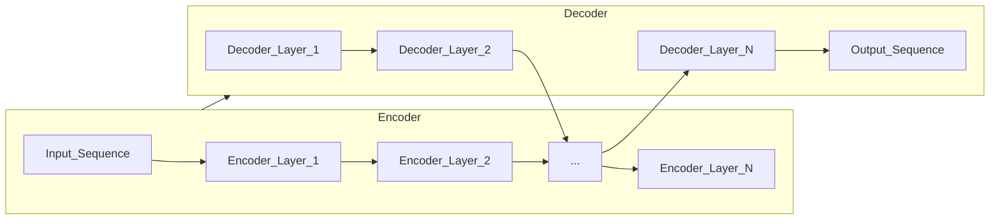
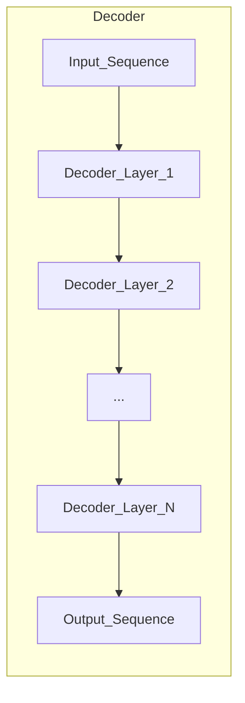

# AI人工智能核心算法原理与代码实例讲解：语言模型

## 1.背景介绍

语言模型是自然语言处理领域的核心技术之一,它在机器翻译、语音识别、文本生成、问答系统等诸多应用中扮演着关键角色。随着深度学习技术的快速发展,基于神经网络的语言模型在捕捉语言的复杂语义和语法结构方面展现出了卓越的能力。

在过去几年中,转换器(Transformer)模型彻底改变了语言模型的发展轨迹。自2017年Transformer模型问世以来,基于Transformer的语言模型不断刷新着各项自然语言处理任务的记录,展现出了强大的语言理解和生成能力。GPT(Generative Pre-trained Transformer)、BERT(Bidirectional Encoder Representations from Transformers)、XLNet等语言模型在学术界和工业界广受关注和应用。

### 1.1 语言模型的重要性

语言模型在自然语言处理中扮演着基础性的角色,它旨在学习和捕捉语言的统计规律,为更高层次的自然语言处理任务提供支持。一个优秀的语言模型能够:

- 更好地理解和表示语言的语义和语法结构
- 生成更加流畅、自然的文本内容
- 为下游任务(如机器翻译、问答系统等)提供有力的语言理解和生成支持

### 1.2 语言模型的发展历程

语言模型的发展经历了从基于统计的n-gram模型,到基于神经网络的模型,再到基于Transformer的大型语言模型的演进过程。

- **n-gram模型**: 最早的语言模型是基于n-gram的统计语言模型,它通过计算语料库中n个连续词元的共现概率来预测下一个词元。尽管简单,但n-gram模型在捕捉长距离依赖关系方面存在局限性。

- **神经网络语言模型**: 随着深度学习技术的兴起,基于神经网络的语言模型应运而生。它们能够更好地捕捉语言的上下文信息和长距离依赖关系,显著提高了语言模型的性能。典型模型包括基于循环神经网络(RNN)的语言模型和基于卷积神经网络(CNN)的语言模型。

- **Transformer语言模型**: 2017年,Transformer模型问世,它完全基于注意力机制,摒弃了RNN和CNN的结构,在捕捉长距离依赖关系方面表现出色。Transformer模型为语言模型的发展开启了新的里程碑,催生了一系列大型预训练语言模型,如GPT、BERT、XLNet等。这些模型通过在大规模语料库上预训练,获得了强大的语言理解和生成能力,在各种自然语言处理任务中表现卓越。

## 2.核心概念与联系

语言模型的核心概念包括:

1. **词元(Token)**: 语言模型的基本单位,可以是单词、字符或子词(Subword)。
2. **上下文(Context)**: 给定词元前后的词元序列,用于捕捉语言的语义和语法信息。
3. **概率分布(Probability Distribution)**: 语言模型的目标是学习给定上下文下,下一个词元的概率分布。
4. **自回归(Autoregressive)**: 语言模型通常采用自回归的方式,即使用历史上下文来预测下一个词元。
5. **预训练(Pre-training)**: 在大规模语料库上预先训练语言模型,获得通用的语言表示能力。
6. **微调(Fine-tuning)**: 在特定任务上微调预训练的语言模型,使其适应具体的应用场景。

这些核心概念相互关联,构成了语言模型的理论基础和实现框架。

### 2.1 语言模型的形式化定义

给定一个长度为n的词元序列$S = (x_1, x_2, ..., x_n)$,语言模型的目标是学习该序列的联合概率分布:

$$P(x_1, x_2, ..., x_n) = \prod_{i=1}^{n}P(x_i|x_1, x_2, ..., x_{i-1})$$

通过链式法则,联合概率可以分解为条件概率的乘积,每一项$P(x_i|x_1, x_2, ..., x_{i-1})$表示在给定历史上下文$(x_1, x_2, ..., x_{i-1})$的条件下,当前词元$x_i$的条件概率。

语言模型的目标是最大化上述联合概率,即最小化负对数似然损失:

$$\mathcal{L} = -\frac{1}{n}\sum_{i=1}^{n}\log P(x_i|x_1, x_2, ..., x_{i-1})$$

### 2.2 语言模型的核心架构

基于Transformer的语言模型通常采用Encoder-Decoder或Decoder-only的架构。

#### 2.2.1 Encoder-Decoder架构

Encoder-Decoder架构常用于机器翻译等序列到序列(Seq2Seq)任务。Encoder将输入序列编码为上下文表示,Decoder根据上下文表示和历史生成的词元,自回归地预测下一个词元。

#### 2.2.2 Decoder-only架构

Decoder-only架构常用于语言生成等单序列任务。它只包含Decoder部分,通过自注意力机制捕捉输入序列的上下文信息,并自回归地生成输出序列。

无论是Encoder-Decoder还是Decoder-only架构,注意力机制都是Transformer模型的核心,它能够有效捕捉长距离依赖关系,提高语言模型的性能。

## 3.核心算法原理具体操作步骤

### 3.1 Transformer模型

Transformer模型是当前语言模型的核心架构,它完全基于注意力机制,摒弃了RNN和CNN的结构,在捕捉长距离依赖关系方面表现出色。Transformer模型主要包括以下几个核心组件:

#### 3.1.1 多头注意力机制(Multi-Head Attention)

多头注意力机制是Transformer模型的核心,它允许模型同时关注输入序列的不同表示子空间,捕捉更丰富的依赖关系。

对于一个查询向量$q$,键向量$k$和值向量$v$,单头注意力计算如下:

$$\text{Attention}(q, k, v) = \text{softmax}(\frac{qk^T}{\sqrt{d_k}})v$$

其中$d_k$是缩放因子,用于防止点积过大导致的梯度饱和问题。

多头注意力机制将注意力计算过程分成多个子空间,最终将各个子空间的注意力结果拼接起来:

$$\text{MultiHead}(Q, K, V) = \text{Concat}(head_1, ..., head_h)W^O$$
$$\text{where } head_i = \text{Attention}(QW_i^Q, KW_i^K, VW_i^V)$$

其中$W_i^Q, W_i^K, W_i^V$是不同子空间的线性变换,用于将查询、键和值映射到对应的子空间表示。$W^O$是一个可学习的线性变换,用于将各个子空间的注意力结果拼接起来。

#### 3.1.2 位置编码(Positional Encoding)

由于Transformer模型完全基于注意力机制,没有像RNN那样的递归结构,因此需要一种机制来注入序列的位置信息。位置编码就是为了解决这个问题而设计的。

位置编码是一个向量,它对应输入序列中每个位置的位置信息。位置编码向量将与输入的词嵌入相加,从而为模型提供位置信息。

常用的位置编码方式是使用正弦和余弦函数:

$$\begin{aligned}
\text{PE}_{(pos, 2i)} &= \sin(pos / 10000^{2i/d_\text{model}}) \\
\text{PE}_{(pos, 2i+1)} &= \cos(pos / 10000^{2i/d_\text{model}})
\end{aligned}$$

其中$pos$是词元的位置索引,而$i$是维度索引。这种位置编码方式允许模型学习相对位置信息,因为对于特定的偏移量$k$,
$\text{PE}_{pos+k}$可以被恒定地表示为$\text{PE}_{pos}$的线性函数。

#### 3.1.3 前馈网络(Feed-Forward Network)

除了多头注意力子层,每个Transformer编码器/解码器层还包含一个前馈网络子层,它对每个位置上的输出执行同样的前馈函数:

$$\text{FFN}(x) = \max(0, xW_1 + b_1)W_2 + b_2$$

其中$W_1, W_2$是可学习的权重矩阵,而$b_1, b_2$是可学习的偏置向量。前馈网络引入了非线性,增强了模型的表示能力。

#### 3.1.4 残差连接和层归一化(Residual Connection and Layer Normalization)

为了缓解深度神经网络中的梯度消失/爆炸问题,Transformer模型采用了残差连接和层归一化。

残差连接将子层的输入与输出相加,确保梯度可以直接传递到更深层:

$$x' = \text{LayerNorm}(x + \text{Sublayer}(x))$$

层归一化则对残差连接后的输出进行归一化,加速收敛并稳定训练过程。

### 3.2 自回归语言模型(Autoregressive Language Model)

自回归语言模型是一种常见的语言模型架构,它通过自回归的方式,使用历史上下文来预测下一个词元。

在自回归语言模型中,给定一个长度为$n$的词元序列$S = (x_1, x_2, ..., x_n)$,模型的目标是最大化该序列的条件概率:

$$P(x_1, x_2, ..., x_n) = \prod_{i=1}^{n}P(x_i|x_1, x_2, ..., x_{i-1})$$

在训练阶段,模型会被输入一个长度为$n$的序列,并预测第$n+1$个词元的概率分布。在推理阶段,模型会自回归地生成一个新的序列,每次使用已生成的历史上下文来预测下一个词元。

自回归语言模型的核心步骤如下:

1. **输入编码**: 将输入序列编码为上下文表示,通常使用Transformer的Encoder或Decoder进行编码。

2. **自回归预测**: 使用编码后的上下文表示,自回归地预测下一个词元的概率分布。对于每个时间步,模型会根据历史上下文和当前预测的词元,更新上下文表示,并预测下一个词元。

3. **损失计算**: 将预测的概率分布与真实标签进行比较,计算交叉熵损失。

4. **模型优化**: 使用优化算法(如Adam)基于损失函数,更新模型参数。

在推理阶段,自回归语言模型会从一个起始符号开始,自回归地生成序列,直到遇到终止符号或达到最大长度。生成的序列质量取决于模型在训练阶段学习到的语言知识。

### 3.3 掩码语言模型(Masked Language Model)

掩码语言模型(Masked Language Model, MLM)是一种常见的预训练任务,它通过随机掩码输入序列中的部分词元,并要求模型预测被掩码的词元。

MLM任务的核心步骤如下:

1. **掩码输入**: 从输入序列中随机选择一些词元,将它们替换为特殊的掩码符号(通常是`[MASK]`令牌)。

2. **编码输入**: 将掩码后的输入序列输入到Transformer的Encoder或Decoder中,获得每个位置的上下文表示。

3. **预测掩码词元**: 对于被掩码的位置,使用对应的上下文表示,预测该位置的词元概率分布。

4. **损失计算**: 将预测的