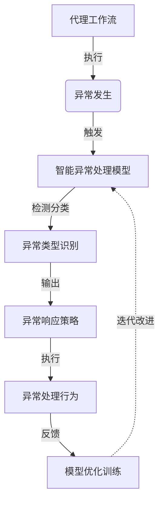

# AI人工智能深度学习算法：代理工作流中的异常处理与容错

## 1.背景介绍

在现代软件系统中,工作流自动化和任务代理是不可或缺的组成部分。随着系统复杂性的增加,异常情况和错误处理变得至关重要。代理工作流需要具备健壮的容错机制,以确保在出现异常时能够正确响应、恢复并继续执行。

传统的规则引擎和脚本方法往往缺乏灵活性,难以应对多变的异常场景。而人工智能(AI)和深度学习技术为解决这一挑战提供了新的途径。通过构建智能异常处理模型,代理工作流能够主动学习、预测并应对各种异常情况,提高系统的可靠性和弹性。

## 2.核心概念与联系

### 2.1 代理工作流(Agent Workflow)

代理工作流是一种自动化系统,由一组智能代理组成,每个代理负责执行特定的任务或流程。这些代理相互协作,按照预定义的规则和约束条件完成复杂的业务流程。代理工作流广泛应用于企业自动化、物联网、机器人控制等领域。

### 2.2 异常处理(Exception Handling)

异常处理是指在软件系统遇到意外情况或错误时,采取适当的响应和恢复措施。这包括异常检测、隔离、记录、通知和恢复等环节。有效的异常处理机制可以提高系统的鲁棒性和可靠性,防止错误蔓延和数据损坏。

### 2.3 深度学习(Deep Learning)

深度学习是机器学习的一种技术,它基于人工神经网络模型,通过对大量数据进行训练,自动学习特征表示和模式,并用于各种预测和决策任务。深度学习在计算机视觉、自然语言处理、推荐系统等领域取得了突破性进展。

### 2.4 智能异常处理模型

智能异常处理模型是将深度学习技术应用于代理工作流异常处理的创新方法。该模型利用历史数据和专家知识,训练出能够检测、分类和响应各种异常情况的神经网络模型。与传统的规则引擎相比,智能模型具有更强的泛化能力和适应性,可以有效应对复杂多变的异常场景。

### 2.5 Mermaid 流程图



上图展示了智能异常处理模型在代理工作流中的工作流程。当执行过程中发生异常时,智能模型会检测并识别异常类型,然后输出相应的响应策略。代理工作流根据策略执行异常处理行为,并将结果反馈给模型进行优化训练,形成迭代改进的闭环。

## 3.核心算法原理具体操作步骤  

智能异常处理模型的核心是一种基于深度神经网络的异常检测和分类算法。该算法分为以下几个主要步骤:

### 3.1 数据预处理

首先需要收集和清洗历史异常数据,包括异常日志、上下文信息、人工标注等。然后对数据进行标准化、编码和切分,形成模型的输入特征向量。

### 3.2 模型构建

构建一个深度神经网络模型,通常包括输入层、多个隐藏层和输出层。隐藏层可以使用卷积层、递归层等不同类型的网络层,用于自动提取异常模式的高级特征表示。

### 3.3 模型训练

利用预处理的历史数据,采用监督学习的方式训练神经网络模型的参数。常用的训练算法包括反向传播、随机梯度下降等。训练过程中需要设置合理的损失函数、正则化策略和超参数,以避免过拟合。

### 3.4 在线推理

将训练好的模型部署到代理工作流系统中,在线接收新的异常数据,并通过前向传播计算得到异常类型的概率分布。根据设定的阈值,判断是否发生异常及异常类型。

### 3.5 异常响应

根据推理得到的异常类型,查询预定义的异常响应策略库,执行相应的处理行为,如记录日志、发送通知、重启服务、回滚事务等。

### 3.6 模型优化

持续收集新的异常数据和反馈,定期重新训练模型,不断优化模型的性能和准确性,形成闭环的迭代改进过程。

## 4.数学模型和公式详细讲解举例说明

智能异常处理模型的核心是一种基于深度神经网络的异常检测和分类算法。下面我们详细介绍其中的数学原理和模型。

### 4.1 神经网络模型

神经网络模型是一种由多层神经元组成的非线性函数逼近器,具有强大的模式识别和特征提取能力。对于异常检测任务,我们可以构建一个多层前馈神经网络,其中包括输入层、隐藏层和输出层。

假设输入层有 $n$ 个神经元,表示异常数据的特征向量 $\boldsymbol{x} = (x_1, x_2, \ldots, x_n)$。第一个隐藏层的输出为:

$$\boldsymbol{h}^{(1)} = f\left(\boldsymbol{W}^{(1)}\boldsymbol{x} + \boldsymbol{b}^{(1)}\right)$$

其中 $\boldsymbol{W}^{(1)}$ 是第一层的权重矩阵, $\boldsymbol{b}^{(1)}$ 是偏置向量, $f$ 是非线性激活函数(如 ReLU 或 Sigmoid)。

后续隐藏层的计算方式类似,第 $l$ 层的输出为:

$$\boldsymbol{h}^{(l)} = f\left(\boldsymbol{W}^{(l)}\boldsymbol{h}^{(l-1)} + \boldsymbol{b}^{(l)}\right)$$

最终,输出层的计算结果 $\boldsymbol{y}$ 表示异常类型的概率分布:

$$\boldsymbol{y} = g\left(\boldsymbol{W}^{(L)}\boldsymbol{h}^{(L-1)} + \boldsymbol{b}^{(L)}\right)$$

其中 $g$ 是输出层的激活函数,如 Softmax 函数。

### 4.2 模型训练

为了训练神经网络模型,我们需要定义一个损失函数(Loss Function),衡量模型输出与真实标签之间的差异。对于异常分类任务,常用的损失函数是交叉熵损失函数:

$$\mathcal{L}(\boldsymbol{\theta}) = -\frac{1}{N}\sum_{i=1}^{N}\sum_{k=1}^{K}y_i^{(k)}\log\hat{y}_i^{(k)}$$

其中 $N$ 是训练样本数, $K$ 是异常类型数, $y_i^{(k)}$ 是第 $i$ 个样本属于第 $k$ 类的真实标签(0或1), $\hat{y}_i^{(k)}$ 是模型预测的概率。$\boldsymbol{\theta}$ 表示模型的所有可训练参数(权重和偏置)。

训练的目标是通过优化算法(如梯度下降)最小化损失函数,找到最优的模型参数 $\boldsymbol{\theta}^*$:

$$\boldsymbol{\theta}^* = \arg\min_{\boldsymbol{\theta}}\mathcal{L}(\boldsymbol{\theta})$$

### 4.3 正则化

为了防止过拟合,我们还需要在损失函数中加入正则化项,例如 L2 正则化:

$$\mathcal{L}(\boldsymbol{\theta}) = -\frac{1}{N}\sum_{i=1}^{N}\sum_{k=1}^{K}y_i^{(k)}\log\hat{y}_i^{(k)} + \lambda\|\boldsymbol{\theta}\|_2^2$$

其中 $\lambda$ 是正则化系数,控制正则化的强度。$\|\boldsymbol{\theta}\|_2^2$ 是模型参数的 L2 范数,也称为权重衰减项。正则化可以约束模型复杂度,提高泛化能力。

### 4.4 示例

假设我们有一个三层神经网络模型,用于异常分类任务。输入层有 10 个神经元,表示异常数据的特征;第一个隐藏层有 20 个神经元,使用 ReLU 激活函数;第二个隐藏层有 10 个神经元,也使用 ReLU 激活函数;输出层有 5 个神经元,表示 5 种异常类型,使用 Softmax 激活函数。

对于一个输入样本 $\boldsymbol{x} = (x_1, x_2, \ldots, x_{10})$,第一个隐藏层的输出为:

$$\boldsymbol{h}^{(1)} = \text{ReLU}\left(\boldsymbol{W}^{(1)}\boldsymbol{x} + \boldsymbol{b}^{(1)}\right)$$

其中 $\boldsymbol{W}^{(1)}$ 是 $20\times10$ 的权重矩阵, $\boldsymbol{b}^{(1)}$ 是长度为 20 的偏置向量。

第二个隐藏层的输出为:

$$\boldsymbol{h}^{(2)} = \text{ReLU}\left(\boldsymbol{W}^{(2)}\boldsymbol{h}^{(1)} + \boldsymbol{b}^{(2)}\right)$$

其中 $\boldsymbol{W}^{(2)}$ 是 $10\times20$ 的权重矩阵, $\boldsymbol{b}^{(2)}$ 是长度为 10 的偏置向量。

最终,输出层的计算结果 $\boldsymbol{y} = (y^{(1)}, y^{(2)}, \ldots, y^{(5)})$ 表示 5 种异常类型的概率分布:

$$\boldsymbol{y} = \text{Softmax}\left(\boldsymbol{W}^{(3)}\boldsymbol{h}^{(2)} + \boldsymbol{b}^{(3)}\right)$$

其中 $\boldsymbol{W}^{(3)}$ 是 $5\times10$ 的权重矩阵, $\boldsymbol{b}^{(3)}$ 是长度为 5 的偏置向量。

在训练过程中,我们可以使用交叉熵损失函数和 L2 正则化,并采用随机梯度下降等优化算法,不断调整模型参数 $\boldsymbol{W}^{(1)}$, $\boldsymbol{b}^{(1)}$, $\boldsymbol{W}^{(2)}$, $\boldsymbol{b}^{(2)}$, $\boldsymbol{W}^{(3)}$, $\boldsymbol{b}^{(3)}$,使损失函数最小化。

通过上述数学模型和公式,我们可以构建出一个端到端的智能异常检测和分类系统,为代理工作流中的异常处理提供强有力的支持。

## 5.项目实践:代码实例和详细解释说明

为了更好地理解智能异常处理模型的实现,我们提供了一个基于 Python 和 TensorFlow 的代码示例。该示例包括数据预处理、模型构建、训练和推理等核心功能。

### 5.1 数据预处理

```python
import pandas as pd
import numpy as np

# 加载异常日志数据
logs = pd.read_csv('logs.csv')

# 对异常类型进行编码
from sklearn.preprocessing import LabelEncoder
encoder = LabelEncoder()
logs['label'] = encoder.fit_transform(logs['error_type'])

# 将文本日志转换为数值向量
from sklearn.feature_extraction.text import TfidfVectorizer
vectorizer = TfidfVectorizer()
X = vectorizer.fit_transform(logs['log_message'])
y = logs['label'].values

# 划分训练集和测试集
from sklearn.model_selection import train_test_split
X_train, X_test, y_train, y_test = train_test_split(X, y, test_size=0.2, random_state=42)
```

上述代码加载了异常日志数据,对异常类型进行了编码,并使用 TF-IDF 将文本日志转换为数值向量。最后,将数据划分为训练集和测试集。

### 5.2 模型构建

```python
import tensorflow as tf