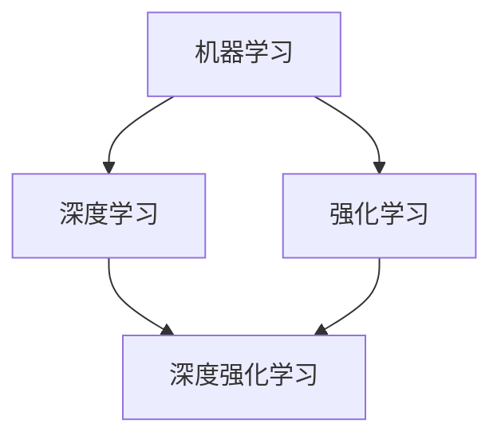

# AI人工智能深度学习算法：使用强化学习优化深度学习模型

## 1.背景介绍

人工智能(Artificial Intelligence, AI)是计算机科学的一个重要分支,它致力于研究如何让计算机模拟甚至超越人类的智能。近年来,随着计算机硬件性能的不断提升和大数据时代的到来,AI技术取得了突飞猛进的发展,尤其是以深度学习(Deep Learning, DL)为代表的人工智能算法,在计算机视觉、自然语言处理、语音识别等领域取得了令人瞩目的成就。

深度学习是机器学习的一个重要分支,它模仿人脑的神经网络结构,通过构建具有多个隐藏层的人工神经网络,并利用大量的训练数据对网络参数进行优化,从而让计算机从数据中自动学习到有用的特征表示和映射关系。深度学习强大的特征学习和抽象能力,使其在很多任务上取得了超越人类的性能。

然而,训练一个高性能的深度学习模型往往需要大量的数据和计算资源,并且深度神经网络的训练过程也比较困难,需要精心设计网络结构和调试超参数。如何提高深度学习的训练效率和模型性能,一直是AI领域的研究热点。

近年来,强化学习(Reinforcement Learning, RL)作为一种端到端的学习范式受到了广泛关注。与监督学习不同,强化学习是一种试错式学习,智能体(Agent)通过与环境的交互,根据环境的反馈不断调整策略,最终学习到最优的决策。AlphaGo、AlphaZero等成功案例表明,将深度学习与强化学习相结合,可以大幅提升AI系统的智能水平。

本文将重点探讨如何利用强化学习技术来优化深度学习模型的训练过程,提高深度学习的效率和性能。我们将从算法原理入手,结合数学推导和代码实践,系统阐述深度强化学习的核心思想和关键技术。同时,本文也会介绍一些前沿的研究进展和实际应用,展望深度强化学习的发展前景和挑战。

## 2.核心概念与联系

在探讨如何使用强化学习优化深度学习之前,我们先来了解一下相关的核心概念:

### 2.1 深度学习
深度学习是一类模仿人脑结构和功能,利用多层神经网络对数据进行表示学习的机器学习方法。一个典型的深度学习模型由输入层、多个隐藏层和输出层组成,每一层都包含大量的神经元,通过非线性变换对数据进行处理和传递。深度学习通过端到端的训练,自动学习数据的多层次抽象特征表示。

### 2.2 强化学习
强化学习是一种让智能体通过与环境交互学习最优决策的机器学习范式。在强化学习中,智能体在每个时间步根据当前环境状态采取一个动作,环境接收动作后状态发生变化,同时给予智能体一个奖励值作为反馈。智能体的目标是最大化长期累积奖励,即学习一个最优策略函数,根据当前状态选择能获得最大期望长期奖励的动作。

### 2.3 深度强化学习 
深度强化学习是将深度学习与强化学习相结合的一类方法。它使用深度神经网络来逼近强化学习中的策略函数、值函数等,从而让智能体从高维输入数据(如图像、文本)中直接学习最优决策。深度神经网络强大的特征提取和函数拟合能力,使得智能体能够在复杂环境中学习到优秀的策略。

深度学习和强化学习的结合主要有以下几个方面:

1. 使用深度神经网络作为强化学习的函数逼近器,学习策略网络和值网络。
2. 利用强化学习的探索机制,指导深度神经网络的训练,避免数据分布偏移等问题。 
3. 通过元学习、迁移学习等方式,提高深度强化学习的训练效率和泛化能力。
4. 将深度强化学习应用于神经网络结构搜索、超参数优化等任务,实现深度学习的自动化。

下图展示了深度学习、强化学习和深度强化学习三者之间的关系:

## 3.核心算法原理与操作步骤

本节我们将重点介绍几种常见的用于优化深度学习的强化学习算法,主要包括DQN、DDPG、PPO和TRPO等。

### 3.1 DQN算法

DQN(Deep Q-Network)是将Q学习与深度学习相结合的一种值函数逼近算法。传统的Q学习使用Q表存储每个状态-动作对的Q值,在状态和动作空间很大时难以存储和收敛。DQN使用深度神经网络来逼近Q函数,将状态作为网络输入,输出各个动作的Q值。DQN的核心思想是:

1. 当前Q网络 $Q(s,a;\theta)$ 用于选择动作和计算 TD 目标。
2. 目标Q网络 $\hat{Q}(s,a;\theta^-)$ 用于计算 TD 目标,其参数 $\theta^-$ 定期从当前网络复制得到。
3. 经验回放(Experience Replay):将转移样本 $(s_t,a_t,r_t,s_{t+1})$ 存入回放缓冲区,训练时从中随机抽取小批量样本用于更新网络参数。
4. TD 误差损失函数定义为:
$$
L(\theta)=\mathbb{E}_{(s,a,r,s')\sim D}\left[\left(r+\gamma \max_{a'} \hat{Q}(s',a';\theta^-)-Q(s,a;\theta)\right)^2\right]
$$

其中 $D$ 为经验回放缓冲区。

DQN算法的具体操作步骤如下:

1. 随机初始化当前Q网络参数 $\theta$ 和目标Q网络参数 $\theta^-=\theta$。
2. 初始化经验回放缓冲区 $D$。
3. 对于每个 episode:
   - 初始化环境状态 $s_0$。
   - 对于每个时间步 $t=0,1,...,T$:
     - 根据 $\epsilon-greedy$ 策略选择动作 $a_t=\arg\max_a Q(s_t,a;\theta)$ 或随机动作。
     - 执行动作 $a_t$,观察奖励 $r_t$ 和下一状态 $s_{t+1}$。
     - 将转移样本 $(s_t,a_t,r_t,s_{t+1})$ 存入 $D$。
     - 从 $D$ 中随机抽取小批量转移样本 $(s_j,a_j,r_j,s_{j+1})$。
     - 计算 TD 目标 $y_j=r_j+\gamma \max_{a'} \hat{Q}(s_{j+1},a';\theta^-)$。
     - 最小化损失 $L(\theta)=\frac{1}{N}\sum_j(y_j-Q(s_j,a_j;\theta))^2$ 更新 $\theta$。
     - 每隔 C 步将 $\theta^-$ 更新为 $\theta$。
   - 状态变为 $s_{t+1}$。

DQN通过引入目标网络、经验回放等机制,有效地提高了Q学习的稳定性和效率。但DQN难以处理连续动作空间,且存在高估偏差问题。后续的Double DQN、Dueling DQN、PER-DQN等变体对此进行了改进。

### 3.2 DDPG算法

DDPG(Deep Deterministic Policy Gradient)是一种基于行动者-评论家(Actor-Critic)框架的深度强化学习算法,它结合了DQN和DPG(Deterministic Policy Gradient),可以直接处理连续动作空间。

DDPG由两个深度神经网络组成:

1. 行动者网络(Actor) $\mu(s;\theta^\mu)$:将状态映射为确定性动作。
2. 评论家网络(Critic) $Q(s,a;\theta^Q)$:估计状态-动作对的Q值。

此外,还有对应的目标网络 $\mu'(s;\theta^{\mu'})$ 和 $Q'(s,a;\theta^{Q'})$。

DDPG的核心思想是:

1. Critic网络根据 Bellman 方程计算 TD 误差,并用 TD 误差的梯度更新 Critic 网络参数。
2. Actor网络根据 Critic 网络的梯度更新参数,使得 Actor 网络朝着使 Q 值提高的方向优化。
3. 引入了软更新(Soft Update)机制,即每次以一个较小的系数 $\tau$ 将当前网络参数向目标网络参数靠近。

DDPG算法的具体操作步骤如下:

1. 随机初始化 Actor 网络 $\mu(s;\theta^\mu)$ 和 Critic 网络 $Q(s,a;\theta^Q)$。
2. 初始化目标网络参数 $\theta^{\mu'}=\theta^\mu$, $\theta^{Q'}=\theta^Q$。
3. 初始化经验回放缓冲区 $R$。
4. 对于每个 episode:
   - 初始化环境,得到初始状态 $s_0$。
   - 对于每个时间步 $t=0,1,...,T$:
     - 根据 Actor 网络选择动作 $a_t=\mu(s_t;\theta^\mu)+\mathcal{N}_t$,其中 $\mathcal{N}_t$ 是探索噪声。
     - 执行动作 $a_t$,观察奖励 $r_t$ 和新状态 $s_{t+1}$。
     - 将转移样本 $(s_t,a_t,r_t,s_{t+1})$ 存入 $R$。
     - 从 $R$ 中抽取 $N$ 个小批量样本 $(s_i,a_i,r_i,s_{i+1})$。
     - 根据目标 Actor 网络计算下一状态的动作 $a_{i+1}=\mu'(s_{i+1};\theta^{\mu'})$。
     - 计算 TD 目标 $y_i=r_i+\gamma Q'(s_{i+1},a_{i+1};\theta^{Q'})$。
     - 根据 TD 误差 $L=\frac{1}{N}\sum_i(y_i-Q(s_i,a_i;\theta^Q))^2$ 更新 Critic 网络参数 $\theta^Q$。
     - 根据 Critic 网络的策略梯度 $\nabla_{\theta^\mu}J=\frac{1}{N}\sum_i\nabla_aQ(s,a;\theta^Q)|_{s=s_i,a=\mu(s_i)}\nabla_{\theta^\mu}\mu(s;\theta^\mu)|_{s_i}$ 更新 Actor 网络参数 $\theta^\mu$。
     - 软更新目标网络参数:
       $\theta^{Q'}\leftarrow\tau\theta^Q+(1-\tau)\theta^{Q'}$
       $\theta^{\mu'}\leftarrow\tau\theta^\mu+(1-\tau)\theta^{\mu'}$
   - 状态变为 $s_{t+1}$。

DDPG在连续控制任务上取得了不错的效果,但它对超参数较为敏感,且存在一定的采样效率问题。TD3、SAC等算法在此基础上进行了改进。

### 3.3 PPO算法

PPO(Proximal Policy Optimization)是一种基于策略梯度的on-policy算法,它通过引入surrogate objective和信赖域等技巧,在保证单调性能提升的同时避免策略偏离太远。

PPO的核心思想是:

1. 引入surrogate objective $L^{CLIP}$:
$$
L^{CLIP}(\theta)=\hat{\mathbb{E}}_t\left[\min\left(r_t(\theta)\hat{A}_t,\text{clip}(r_t(\theta),1-\epsilon,1+\epsilon)\hat{A}_t\right)\right]
$$
其中 $r_t(\theta)=\frac{\pi_\theta(a_t|s_t)}{\pi_{\theta_{old}}(a_t|s_t)}$ 表示概率比, $\hat{A}_t$ 是优势函数的估计, $\epsilon$ 是超参数。这个目标函数鼓励概率比接近1,但又不会偏离太远。

2. 引入信赖域约束,限制新旧策略的KL散度:
$$
\mathbb{E}_{s\sim\rho_{\theta_{old}}}\left[D_{KL}\left(\pi_{\theta_{old}}(\cdot