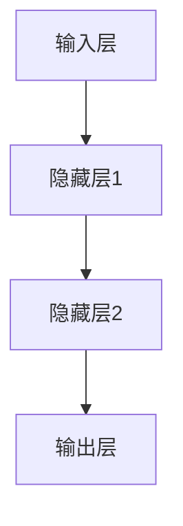
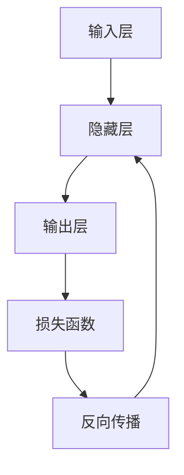
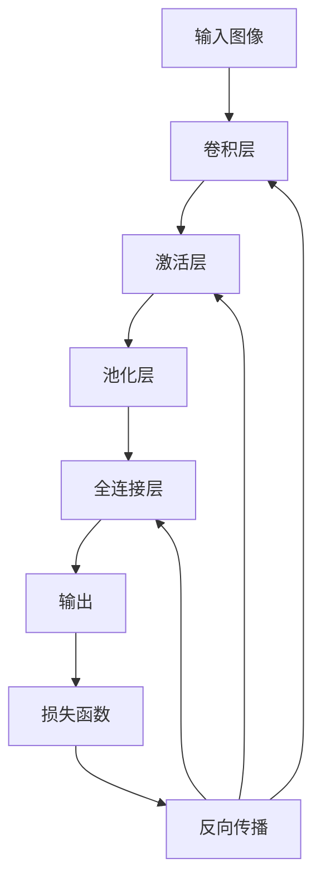
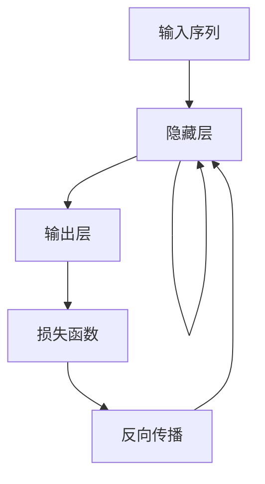
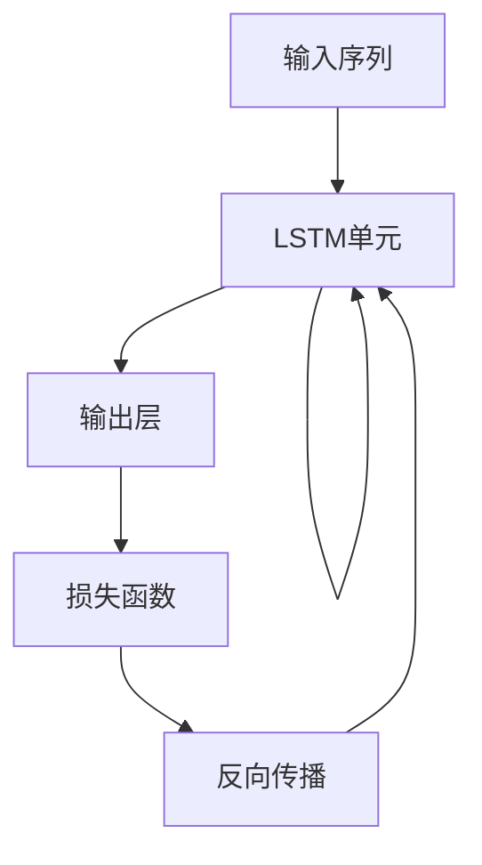

# AI人工智能深度学习算法：在复杂系统建模中的应用

## 1.背景介绍

在当今快速发展的科技时代，复杂系统无处不在。从天气预报到股票市场预测,从交通控制到社交网络分析,这些系统都具有高度的复杂性和非线性。传统的建模方法往往难以有效捕捉这些复杂系统的内在规律和动态行为。而人工智能(AI)深度学习算法则为解决这一挑战提供了强大的工具。

深度学习是机器学习的一个新兴热点领域,其灵感来源于人类大脑的结构和功能。通过构建深层次的神经网络模型,并利用大量数据进行训练,深度学习算法能够自动学习数据中的特征模式,从而对复杂的非线性系统进行精确建模和预测。

### 1.1 复杂系统的挑战

复杂系统具有以下几个主要特点:

1. **高维度**: 复杂系统通常涉及大量的变量和参数,形成高维度的数据空间。
2. **非线性**: 系统内部变量之间存在着复杂的非线性关系。
3. **动态性**: 系统状态会随时间动态变化,需要动态建模。
4. **噪声和不确定性**: 真实数据往往存在噪声和不确定因素的干扰。

传统的线性模型和浅层神经网络很难有效捕捉这些复杂特征,因此需要更强大的建模工具。

### 1.2 深度学习的优势

深度学习算法能够通过构建深层次的网络结构,自动学习数据的层次特征表示,从而更好地对复杂系统进行建模。其主要优势包括:

1. **自动特征提取**: 深层网络能够自动从原始数据中提取多层次的抽象特征,无需人工设计特征。
2. **非线性建模**: 深层网络具有强大的非线性映射能力,能够学习复杂的非线性函数。
3. **端到端学习**: 深度学习模型能够直接从原始数据中端到端地学习,无需复杂的特征工程。
4. **泛化能力强**: 通过大量数据训练,深度模型能够学习到数据的内在分布,具有很强的泛化能力。

基于这些优势,深度学习算法已在诸多复杂系统的建模和预测任务中取得了卓越的成绩,展现出巨大的应用潜力。

## 2.核心概念与联系

在探讨深度学习算法在复杂系统建模中的应用之前,我们需要了解一些核心概念及其相互关系。

### 2.1 神经网络

神经网络是深度学习算法的基础模型,其灵感来源于生物神经系统。一个神经网络由大量的人工神经元(节点)组成,这些神经元通过加权连接进行信息传递和处理。

根据网络结构的不同,神经网络可分为前馈神经网络(Feedforward Neural Network, FNN)和循环神经网络(Recurrent Neural Network, RNN)两大类。前馈网络是单向传播的静态模型,而循环网络则能够处理序列数据,并具有内部记忆能力。

上图展示了一个典型的前馈神经网络结构,包括输入层、隐藏层和输出层。在训练过程中,网络会不断调整连接权重,使得输出值逼近期望值。

### 2.2 深度学习

深度学习(Deep Learning)是机器学习的一个分支,它通过构建深层次的神经网络模型,从大量数据中自动学习多层次的抽象特征表示。与传统的浅层神经网络相比,深度学习模型具有更强的表示学习能力,能够捕捉数据的内在分布和复杂模式。

常见的深度学习模型包括:

- **卷积神经网络(Convolutional Neural Network, CNN)**: 擅长处理图像、视频等结构化数据。
- **循环神经网络(Recurrent Neural Network, RNN)**: 擅长处理序列数据,如自然语言、时间序列等。
- **长短期记忆网络(Long Short-Term Memory, LSTM)**: 一种特殊的RNN,能够更好地捕捉长期依赖关系。
- **生成对抗网络(Generative Adversarial Network, GAN)**: 用于生成式建模,能够生成逼真的数据样本。

通过组合和扩展这些基础模型,研究人员不断推出新的深度学习架构,以满足不同领域的需求。

### 2.3 复杂系统建模

复杂系统建模旨在构建数学模型来描述和预测系统的行为。传统的建模方法包括:

- **物理模型**: 基于已知的物理定律和方程,描述系统的动力学过程。
- **统计模型**: 利用统计学方法,从历史数据中估计系统的参数和关系。
- **机器学习模型**: 使用机器学习算法,从数据中自动学习系统的映射函数。

深度学习作为一种强大的机器学习方法,能够有效捕捉复杂系统的非线性动态,因此在复杂系统建模领域备受关注。

### 2.4 核心联系

上述三个核心概念之间存在着紧密的联系:

1. **神经网络是深度学习的基础模型**: 深度学习算法通过构建深层次的神经网络,从大量数据中自动学习特征表示。
2. **深度学习为复杂系统建模提供强大工具**: 复杂系统具有高维度、非线性和动态性等特点,深度学习算法能够有效捕捉这些复杂模式,从而实现精确建模。
3. **复杂系统建模是深度学习的重要应用领域**: 深度学习在复杂系统建模领域展现出巨大的应用潜力,推动了相关理论和算法的快速发展。

通过有机结合这三个方面,我们可以更好地利用深度学习算法解决实际中的复杂系统建模问题。

## 3.核心算法原理具体操作步骤

在上一节中,我们了解了深度学习算法在复杂系统建模中的核心概念及其联系。接下来,我们将深入探讨一些核心算法的原理和具体操作步骤。

### 3.1 前馈神经网络

前馈神经网络(Feedforward Neural Network, FNN)是深度学习中最基础的网络结构,它由输入层、隐藏层和输出层组成。信息在网络中是单向传播的,没有反馈连接。

前馈神经网络的训练过程可以概括为以下几个步骤:

1. **初始化**: 随机初始化网络的连接权重和偏置项。
2. **前向传播**: 将输入数据传递到输出层,计算每个节点的激活值。
3. **计算损失**: 比较输出值与期望值的差异,计算损失函数的值。
4. **反向传播**: 根据损失函数的梯度,计算每个权重的梯度,并更新权重。
5. **迭代训练**: 重复步骤2-4,直到模型收敛或达到最大迭代次数。

上图展示了前馈神经网络的训练流程。通过不断迭代,网络能够逐步调整权重,使输出值逼近期望值。

### 3.2 卷积神经网络

卷积神经网络(Convolutional Neural Network, CNN)是一种专门用于处理结构化数据(如图像、视频)的深度学习模型。它通过卷积操作和池化操作来提取局部特征,从而实现对输入数据的有效建模。

CNN的训练过程包括以下几个关键步骤:

1. **卷积层**: 使用多个卷积核对输入数据进行卷积操作,提取局部特征。
2. **激活层**: 通过非线性激活函数(如ReLU)增强特征的表示能力。
3. **池化层**: 对特征图进行下采样,减少计算量并提高空间不变性。
4. **全连接层**: 将提取的特征映射到输出空间,进行分类或回归任务。
5. **损失计算和反向传播**: 计算损失函数,并通过反向传播算法更新网络权重。

上图展示了CNN的基本结构和训练流程。通过堆叠多个卷积层、激活层和池化层,CNN能够逐层提取更高级的特征表示,从而实现对复杂图像数据的精确建模。

### 3.3 循环神经网络

循环神经网络(Recurrent Neural Network, RNN)是一种专门用于处理序列数据(如自然语言、时间序列)的深度学习模型。与前馈网络不同,RNN在隐藏层之间存在循环连接,能够捕捉序列数据中的长期依赖关系。

RNN的训练过程包括以下几个关键步骤:

1. **初始化**: 初始化网络的权重和隐藏状态。
2. **序列输入**: 逐个时间步输入序列数据。
3. **前向计算**: 计算当前时间步的隐藏状态和输出值。
4. **损失计算**: 将输出值与期望值进行比较,计算损失函数。
5. **反向传播**: 通过反向传播算法计算梯度,并更新网络权重。

上图展示了RNN的基本结构和训练流程。由于存在循环连接,RNN能够在每个时间步都利用之前的隐藏状态,从而捕捉序列数据中的长期依赖关系。

### 3.4 长短期记忆网络

长短期记忆网络(Long Short-Term Memory, LSTM)是一种特殊的RNN,它通过引入门控机制和记忆细胞,能够更好地捕捉长期依赖关系。LSTM在许多序列建模任务中表现出色,如自然语言处理、时间序列预测等。

LSTM的训练过程与RNN类似,但在计算隐藏状态时引入了门控机制和记忆细胞。具体步骤如下:

1. **初始化**: 初始化网络的权重、隐藏状态和记忆细胞。
2. **序列输入**: 逐个时间步输入序列数据。
3. **门控计算**: 计算遗忘门、输入门和输出门的激活值。
4. **记忆细胞更新**: 根据门控值更新当前时间步的记忆细胞。
5. **隐藏状态计算**: 基于记忆细胞和输出门计算当前隐藏状态。
6. **输出计算**: 将隐藏状态映射到输出空间,得到当前时间步的输出值。
7. **损失计算和反向传播**: 计算损失函数,并通过反向传播算法更新网络权重。

上图展示了LSTM的基本结构和训练流程。通过引入门控机制和记忆细胞,LSTM能够有效地控制信息的流动,从而更好地捕捉长期依赖关系。

### 3.5 生成对抗网络

生成对抗网络(Generative Adversarial Network, GAN)是一种用于生成式建模的深度学习架构。它由一个生成器(Generator)和一个判别器(Discriminator)组成,两者通过对抗训练的方式相互竞争,最终达到生成逼真数据样本的目的。

GAN的训练过程包括以下几个关键步骤:

1. **初始化**: 初始化生成器和判别器的权重。
2. **生成器训练**: 生成器从随机噪声中生成假样本,目标是欺骗判别器。
3. **判别器训