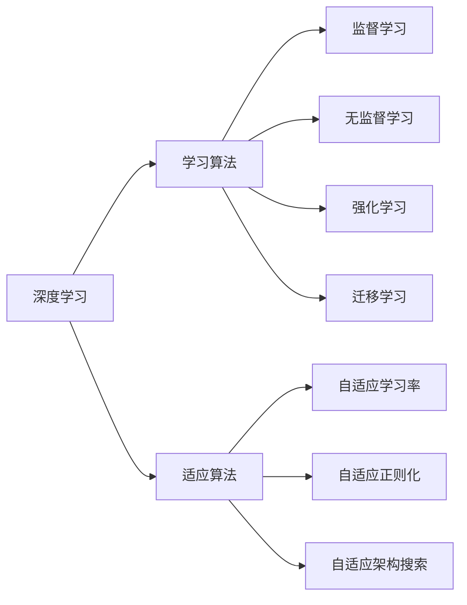

# AI人工智能深度学习算法：学习与适应的算法框架

## 1. 背景介绍
### 1.1 人工智能的发展历程
#### 1.1.1 人工智能的起源
#### 1.1.2 人工智能的三次浪潮
#### 1.1.3 人工智能的现状与挑战

### 1.2 深度学习的崛起
#### 1.2.1 深度学习的概念
#### 1.2.2 深度学习的发展历程
#### 1.2.3 深度学习的优势与局限性

### 1.3 学习与适应的重要性
#### 1.3.1 学习能力的意义
#### 1.3.2 适应能力的重要性
#### 1.3.3 学习与适应的关系

## 2. 核心概念与联系
### 2.1 深度学习的核心概念
#### 2.1.1 人工神经网络
#### 2.1.2 前馈神经网络
#### 2.1.3 卷积神经网络（CNN）
#### 2.1.4 循环神经网络（RNN）

### 2.2 学习算法
#### 2.2.1 监督学习
#### 2.2.2 无监督学习 
#### 2.2.3 强化学习
#### 2.2.4 迁移学习

### 2.3 适应算法
#### 2.3.1 自适应学习率
#### 2.3.2 自适应正则化
#### 2.3.3 自适应架构搜索

### 2.4 学习与适应算法的关系

## 3. 核心算法原理具体操作步骤
### 3.1 监督学习算法
#### 3.1.1 前馈神经网络训练步骤
#### 3.1.2 卷积神经网络训练步骤
#### 3.1.3 循环神经网络训练步骤

### 3.2 无监督学习算法
#### 3.2.1 自编码器训练步骤
#### 3.2.2 生成对抗网络训练步骤
#### 3.2.3 变分自编码器训练步骤

### 3.3 强化学习算法
#### 3.3.1 Q-learning算法步骤
#### 3.3.2 策略梯度算法步骤
#### 3.3.3 Actor-Critic算法步骤

### 3.4 迁移学习算法
#### 3.4.1 fine-tuning算法步骤
#### 3.4.2 domain adaptation算法步骤
#### 3.4.3 few-shot learning算法步骤

## 4. 数学模型和公式详细讲解举例说明
### 4.1 神经网络的数学表示
#### 4.1.1 前馈神经网络的数学表示
单个神经元可以表示为：

$y = f(\sum_{i=1}^{n} w_i x_i + b)$

其中，$x_i$为输入，$w_i$为权重，$b$为偏置，$f$为激活函数。

对于包含多个隐藏层的前馈神经网络，可以表示为：

$h^{(1)} = f^{(1)}(W^{(1)}x + b^{(1)})$

$h^{(2)} = f^{(2)}(W^{(2)}h^{(1)} + b^{(2)})$

$\cdots$

$\hat{y} = f^{(L)}(W^{(L)}h^{(L-1)} + b^{(L)})$

其中，$L$为网络的层数，$h^{(l)}$为第$l$层的隐藏状态，$W^{(l)}$和$b^{(l)}$分别为第$l$层的权重矩阵和偏置向量，$f^{(l)}$为第$l$层的激活函数。

#### 4.1.2 卷积神经网络的数学表示
对于卷积层，可以表示为：

$h_{i,j}^{(l)} = f(\sum_{m=0}^{M-1}\sum_{n=0}^{N-1} w_{m,n}^{(l)} \cdot x_{i+m,j+n}^{(l-1)} + b^{(l)})$

其中，$h_{i,j}^{(l)}$为第$l$层第$(i,j)$个位置的输出，$x_{i,j}^{(l-1)}$为第$l-1$层第$(i,j)$个位置的输入，$w_{m,n}^{(l)}$为第$l$层卷积核的权重，$b^{(l)}$为第$l$层的偏置，$M$和$N$分别为卷积核的高度和宽度。

对于池化层，可以表示为：

$h_{i,j}^{(l)} = \text{pool}(x_{i\cdot s, j\cdot s}^{(l-1)}, \cdots, x_{i\cdot s+s-1, j\cdot s+s-1}^{(l-1)})$

其中，$s$为池化窗口的大小，$\text{pool}$为池化函数，常见的有最大池化和平均池化。

#### 4.1.3 循环神经网络的数学表示
对于简单的RNN，可以表示为：

$h_t = f(W_{hh}h_{t-1} + W_{xh}x_t + b_h)$

$y_t = W_{hy}h_t + b_y$

其中，$h_t$为第$t$个时间步的隐藏状态，$x_t$为第$t$个时间步的输入，$y_t$为第$t$个时间步的输出，$W_{hh}$、$W_{xh}$和$W_{hy}$分别为隐藏状态到隐藏状态、输入到隐藏状态和隐藏状态到输出的权重矩阵，$b_h$和$b_y$分别为隐藏状态和输出的偏置向量。

对于LSTM，可以表示为：

$f_t = \sigma(W_f \cdot [h_{t-1}, x_t] + b_f)$

$i_t = \sigma(W_i \cdot [h_{t-1}, x_t] + b_i)$ 

$\tilde{C}_t = \tanh(W_C \cdot [h_{t-1}, x_t] + b_C)$

$C_t = f_t * C_{t-1} + i_t * \tilde{C}_t$

$o_t = \sigma(W_o \cdot [h_{t-1}, x_t] + b_o)$

$h_t = o_t * \tanh(C_t)$

其中，$f_t$、$i_t$和$o_t$分别为遗忘门、输入门和输出门，$C_t$为细胞状态，$\tilde{C}_t$为候选细胞状态，$\sigma$为sigmoid激活函数，$*$为逐元素相乘。

### 4.2 损失函数与优化算法
#### 4.2.1 均方误差损失
均方误差损失（Mean Squared Error, MSE）可以表示为：

$L(y, \hat{y}) = \frac{1}{N}\sum_{i=1}^{N}(y_i - \hat{y}_i)^2$

其中，$y_i$为第$i$个样本的真实值，$\hat{y}_i$为第$i$个样本的预测值，$N$为样本数量。

#### 4.2.2 交叉熵损失
对于二分类问题，交叉熵损失（Cross Entropy Loss）可以表示为：

$L(y, \hat{y}) = -\frac{1}{N}\sum_{i=1}^{N}[y_i \log \hat{y}_i + (1-y_i) \log (1-\hat{y}_i)]$

其中，$y_i \in \{0, 1\}$为第$i$个样本的真实标签，$\hat{y}_i \in (0, 1)$为第$i$个样本的预测概率。

对于多分类问题，交叉熵损失可以表示为：

$L(y, \hat{y}) = -\frac{1}{N}\sum_{i=1}^{N}\sum_{j=1}^{C}y_{ij} \log \hat{y}_{ij}$

其中，$y_{ij} \in \{0, 1\}$为第$i$个样本是否属于第$j$类，$\hat{y}_{ij} \in (0, 1)$为第$i$个样本属于第$j$类的预测概率，$C$为类别数量。

#### 4.2.3 梯度下降法
梯度下降法（Gradient Descent）可以表示为：

$\theta := \theta - \alpha \nabla_{\theta} J(\theta)$

其中，$\theta$为待优化的参数，$\alpha$为学习率，$\nabla_{\theta} J(\theta)$为损失函数$J(\theta)$对$\theta$的梯度。

对于小批量梯度下降法（Mini-batch Gradient Descent），可以表示为：

$\theta := \theta - \alpha \nabla_{\theta} J(\theta; x^{(i:i+m)}, y^{(i:i+m)})$

其中，$x^{(i:i+m)}$和$y^{(i:i+m)}$分别为第$i$到第$i+m$个样本的输入和标签，$m$为小批量的大小。

#### 4.2.4 Adam优化算法
Adam优化算法可以表示为：

$m_t := \beta_1 m_{t-1} + (1 - \beta_1) g_t$

$v_t := \beta_2 v_{t-1} + (1 - \beta_2) g_t^2$

$\hat{m}_t := \frac{m_t}{1 - \beta_1^t}$

$\hat{v}_t := \frac{v_t}{1 - \beta_2^t}$

$\theta := \theta - \alpha \frac{\hat{m}_t}{\sqrt{\hat{v}_t} + \epsilon}$

其中，$m_t$和$v_t$分别为梯度的一阶矩估计和二阶矩估计，$\beta_1$和$\beta_2$为衰减率，$\hat{m}_t$和$\hat{v}_t$为校正后的一阶矩估计和二阶矩估计，$\epsilon$为平滑项，用于防止分母为零。

### 4.3 自适应学习率算法
#### 4.3.1 AdaGrad算法
AdaGrad算法可以表示为：

$g_{t,i} := \nabla_{\theta_i} J(\theta_i)$

$G_{t,ii} := G_{t-1,ii} + g_{t,i}^2$

$\theta_{t+1,i} := \theta_{t,i} - \frac{\alpha}{\sqrt{G_{t,ii} + \epsilon}} \cdot g_{t,i}$

其中，$g_{t,i}$为第$t$步第$i$个参数的梯度，$G_t \in \mathbb{R}^{d \times d}$为对角矩阵，对角线上的元素为历史梯度平方和，$\epsilon$为平滑项，用于防止分母为零。

#### 4.3.2 RMSProp算法
RMSProp算法可以表示为：

$g_{t,i} := \nabla_{\theta_i} J(\theta_i)$

$E[g^2]_t := \gamma E[g^2]_{t-1} + (1 - \gamma) g_t^2$

$\theta_{t+1} := \theta_t - \frac{\alpha}{\sqrt{E[g^2]_t + \epsilon}} \cdot g_t$

其中，$E[g^2]_t$为梯度平方的指数加权移动平均，$\gamma$为衰减率，$\epsilon$为平滑项，用于防止分母为零。

### 4.4 自适应正则化算法
#### 4.4.1 L1正则化
L1正则化可以表示为：

$J(\theta) := J(\theta) + \lambda \sum_{i=1}^{n} |\theta_i|$

其中，$J(\theta)$为原始的损失函数，$\lambda$为正则化系数，$\theta_i$为第$i$个参数。

L1正则化可以产生稀疏的参数，即许多参数被压缩到0。这可以用于特征选择，去除不重要的特征。

#### 4.4.2 L2正则化
L2正则化可以表示为：

$J(\theta) := J(\theta) + \frac{\lambda}{2} \sum_{i=1}^{n} \theta_i^2$

其中，$J(\theta)$为原始的损失函数，$\lambda$为正则化系数，$\theta_i$为第$i$个参数。

L2正则化可以防止参数过大，使得模型更加平滑，减少过拟合的风险。

#### 4.4.3 Dropout正则化
Dropout正则化可以表示为：

$r^{(l)} \sim \text{Bernoulli}(p)$

$\tilde{h}^{(l)} = r^{(l)} * h^{(l)}$

$h^{(l+1)} = f(W^{(l+1)} \tilde{h}^{(l)} + b^{(l+1)})$

其中，$r^{