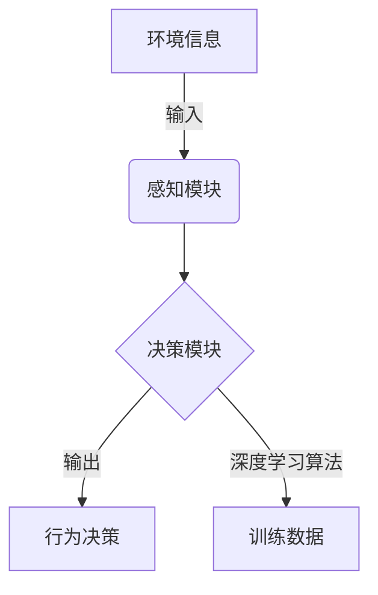

# AI人工智能深度学习算法：智能深度学习代理在公关危机管理中的应用

## 1.背景介绍

### 1.1 公关危机的重要性

在当今快节奏的商业环境中,公关危机管理已经成为企业不可或缺的一个重要组成部分。一场突如其来的公关危机可能会给企业带来巨大的经济损失和声誉打击,甚至可能导致企业的倒闭。因此,及时有效地应对公关危机,将危机控制在最小范围内,已经成为企业生存和发展的关键。

### 1.2 传统公关危机管理的挑战

传统的公关危机管理方式主要依赖于人工的经验判断和响应,存在以下几个主要挑战:

1. **反应滞后**:人工判断和决策需要一定的时间,可能会错失最佳的危机处理时机。
2. **决策偏差**:人的判断往往带有主观色彩,容易受到情绪、经验等因素的影响,导致决策失误。
3. **资源有限**:人工处理能力有限,难以同时应对多起危机事件。
4. **缺乏预测**:传统方式缺乏对危机事态发展的预测能力,难以提前制定应对策略。

### 1.3 AI助力公关危机管理的契机

随着人工智能技术的不断发展,尤其是深度学习算法的飞速进步,AI技术为公关危机管理带来了全新的契机和可能性。智能深度学习代理可以克服传统方式的诸多弊端,为企业提供更加高效、精准的公关危机管理能力。

## 2.核心概念与联系

### 2.1 深度学习算法

深度学习算法是机器学习的一个重要分支,它模拟人类大脑的神经网络结构,通过对大量数据的训练,自动学习数据特征,并用于各种预测和决策任务。常见的深度学习算法包括卷积神经网络(CNN)、递归神经网络(RNN)、长短期记忆网络(LSTM)等。

### 2.2 智能代理

智能代理是指具有一定智能的软件系统,能够根据环境的变化做出合理的决策和行为。智能代理通常由感知模块、决策模块和执行模块组成。感知模块负责获取环境信息,决策模块根据感知信息做出决策,执行模块执行决策行为。

### 2.3 深度学习智能代理

深度学习智能代理是将深度学习算法应用于智能代理系统的产物。它利用深度学习算法对海量数据进行训练,自动学习危机事件的特征模式,从而能够对新的危机事件做出准确的感知、预测和决策,指导危机管理的具体行动。



上图展示了深度学习智能代理的基本工作流程。感知模块获取环境信息作为输入,决策模块基于深度学习算法对输入信息进行分析和决策,输出行为决策指令,同时将输入输出数据加入训练数据集,用于持续优化深度学习模型。

## 3.核心算法原理具体操作步骤  

### 3.1 数据采集与预处理

构建高质量的训练数据集是深度学习智能代理的基础。这需要从各种渠道(如新闻媒体、社交网络等)采集历史公关危机案例数据,包括危机事件的描述、发展过程、处理措施、最终结果等信息。

对采集的原始数据进行预处理是必要的,主要包括:

1. **数据清洗**:去除无关、重复、错误的数据。
2. **文本预处理**:对文本数据进行分词、去停用词等处理,提高后续建模的效率。
3. **标注数据**:根据危机事件的类型、严重程度等,为数据标注合适的标签。

### 3.2 特征工程

特征工程对于提高深度学习模型的性能至关重要。针对公关危机管理场景,可以考虑构建以下几种特征:

1. **文本特征**:利用自然语言处理技术,从危机事件描述中提取关键词、情感倾向等文本特征。
2. **事件特征**:描述危机事件的类型、发生时间、地点、影响范围等特征。
3. **主体特征**:描述涉事企业的行业、规模、声誉等特征。
4. **传播特征**:描述危机事件在各渠道的传播范围、传播速度等特征。

### 3.3 模型构建与训练

基于采集的训练数据和提取的特征,可以构建深度学习模型,并通过训练学习危机事件的模式。常用的模型包括:

1. **卷积神经网络(CNN)**:适用于对文本数据进行建模,可以自动提取文本的局部特征。
2. **长短期记忆网络(LSTM)**:适用于对序列数据(如事件发展过程)进行建模,能够有效捕获长期依赖关系。
3. **注意力机制**:通过自动分配不同特征的权重,提高模型对关键特征的关注程度。

在训练过程中,需要选择合适的损失函数(如交叉熵损失)、优化器(如Adam优化器)和超参数,并进行大量的实验调优,以获得最佳的模型性能。

### 3.4 模型评估与优化

在训练完成后,需要对模型进行全面评估,包括:

1. **离线评估**:在保留的测试集上评估模型的准确性、召回率等指标。
2. **在线评估**:将模型应用于实际场景,评估其实际效果。

基于评估结果,可以对模型进行持续优化,如增加训练数据、调整特征工程、改进模型结构等。同时也需要持续关注最新的深度学习算法进展,及时将新算法应用于公关危机管理场景。

## 4.数学模型和公式详细讲解举例说明

### 4.1 卷积神经网络(CNN)

卷积神经网络是一种常用的深度学习模型,广泛应用于计算机视觉和自然语言处理任务。CNN通过卷积操作自动提取输入数据(如图像或文本)的局部特征,并通过池化操作降低特征维度,最终通过全连接层对特征进行分类或回归。

对于文本数据,我们可以将其表示为词向量矩阵$X$,其中每一行对应一个词的词向量。卷积操作使用滤波器$W$在词向量矩阵上滑动,提取局部特征:

$$c_i = f(W \cdot x_{i:i+h-1} + b)$$

其中$c_i$是提取的特征,${x_{i:i+h-1}}$是大小为$h$的词窗口,${f}$是非线性激活函数(如ReLU函数),$W$和$b$分别是滤波器权重和偏置。

通过多个滤波器并行操作,可以提取不同的特征图$C$。接下来进行最大池化操作,对每个特征图的子区域取最大值,从而降低特征维度:

$$\hat{c}_j = \max(c_{j1}, c_{j2}, \cdots, c_{jn})$$

最终将所有池化后的特征拼接,输入全连接层进行分类或回归任务。

### 4.2 长短期记忆网络(LSTM)

长短期记忆网络是一种有效捕获长期依赖关系的循环神经网络,在自然语言处理和时序数据建模任务中表现出色。LSTM通过设计特殊的门控机制,可以很好地解决传统RNN的梯度消失和梯度爆炸问题。

LSTM的核心是细胞状态$C_t$,它像一条传送带一样,沿着链路传递相关信息。LSTM通过遗忘门$f_t$、输入门$i_t$和输出门$o_t$来控制细胞状态的更新和输出:

$$\begin{aligned}
f_t &= \sigma(W_f \cdot [h_{t-1}, x_t] + b_f) \\
i_t &= \sigma(W_i \cdot [h_{t-1}, x_t] + b_i) \\
\tilde{C}_t &= \tanh(W_C \cdot [h_{t-1}, x_t] + b_C) \\
C_t &= f_t \odot C_{t-1} + i_t \odot \tilde{C}_t \\
o_t &= \sigma(W_o \cdot [h_{t-1}, x_t] + b_o) \\
h_t &= o_t \odot \tanh(C_t)
\end{aligned}$$

其中$\sigma$是sigmoid函数,$\odot$是元素wise乘积,${W}$和${b}$是可学习的权重和偏置参数。

遗忘门$f_t$决定了细胞状态中要遗忘多少过去的信息,输入门$i_t$决定了要保留多少当前输入的信息,输出门$o_t$控制着细胞状态对隐藏状态$h_t$的影响程度。通过这种门控机制,LSTM能够有效捕获长期依赖关系,在处理序列数据时表现出色。

### 4.3 注意力机制

注意力机制是一种增强深度学习模型的技术,通过自动分配不同特征的权重,提高模型对关键特征的关注程度。在公关危机管理场景中,注意力机制可以帮助模型更好地关注危机事件的关键信息,提高预测和决策的准确性。

假设输入是一个序列$X = (x_1, x_2, \cdots, x_n)$,我们需要计算注意力权重$\alpha_i$,表示对第$i$个元素的关注程度:

$$\alpha_i = \frac{\exp(e_i)}{\sum_{j=1}^n \exp(e_j)}$$

其中$e_i$是一个评分函数,用于评估第$i$个元素的重要性。评分函数可以有多种形式,如:

$$e_i = v^\top \tanh(W_h h_i + W_s s)$$

这里$h_i$是第$i$个元素的隐藏状态,$s$是当前的查询向量(如任务目标),${W_h}$、${W_s}$和${v}$是可学习的权重参数。

计算出注意力权重后,可以将其与输入特征进行加权求和,得到注意力表示:

$$a = \sum_{i=1}^n \alpha_i h_i$$

注意力表示$a$可以替代原始输入,输入到下游的任务模型(如分类或回归模型)中,从而提高模型的性能。

## 5.项目实践：代码实例和详细解释说明

为了更好地理解深度学习智能代理在公关危机管理中的应用,我们提供了一个基于PyTorch的实现示例。该示例包括数据预处理、模型构建、训练和评估等全流程。

### 5.1 数据预处理

```python
import pandas as pd
from sklearn.model_selection import train_test_split

# 加载数据
data = pd.read_csv('crisis_data.csv')

# 数据清洗和标注
data = data.dropna()
data = data[data['text'].str.len() > 10]
data['label'] = data['crisis_type'].map({'type1': 0, 'type2': 1, 'type3': 2})

# 划分训练集和测试集
train_data, test_data = train_test_split(data, test_size=0.2, random_state=42)
```

上述代码加载了公关危机数据集`crisis_data.csv`。首先进行数据清洗,删除空值和文本长度过短的样本。然后根据危机类型为每个样本标注标签。最后将数据划分为训练集和测试集。

### 5.2 文本预处理

```python
import re
import torch
from torchtext.data import Field, TabularDataset, BucketIterator

# 定义文本字段
text_field = Field(sequential=True, tokenize=lambda x: re.findall(r"\w+", x), lower=True)
label_field = Field(sequential=False, use_vocab=False, dtype=torch.long)

# 构建词表
text_field.build_vocab(train_data['text'], min_freq=5)

# 构建数据集和迭代器
train_dataset = TabularDataset(train_data, fields={'text': ('text', text_field), 'label': ('label', label_field)}, vocab=text_field.vocab)
test_dataset = TabularDataset(test_data, fields={'text': ('text', text_field), 'label': ('label', label_field)}, vocab=text_field.vocab)

train_iter = BucketIterator(train_dataset, batch_size=32,