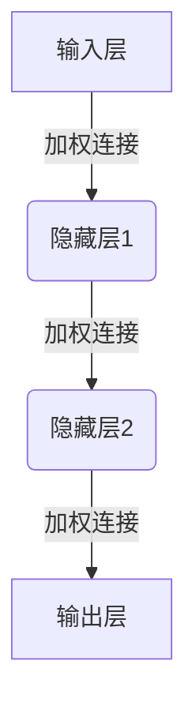
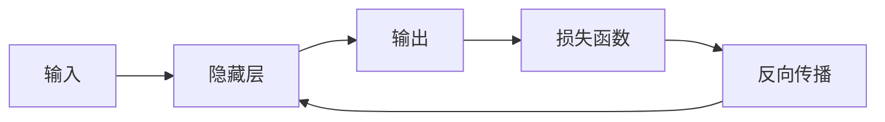
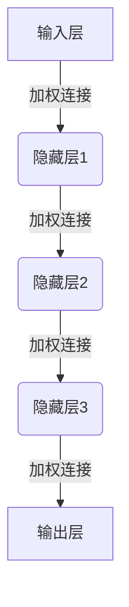
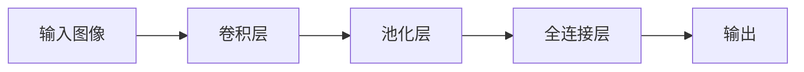
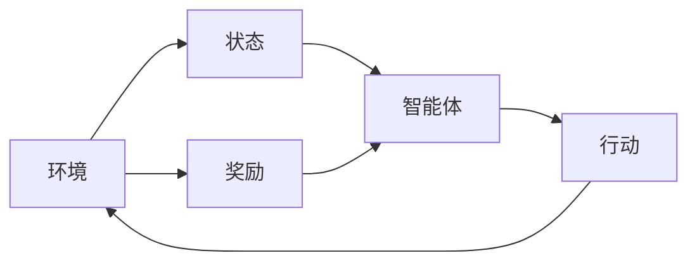
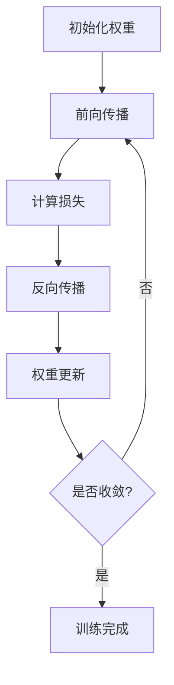
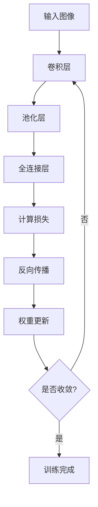
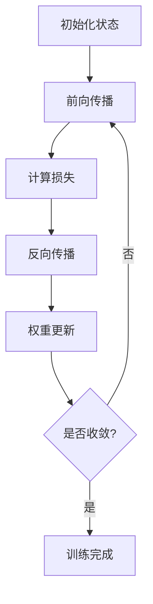
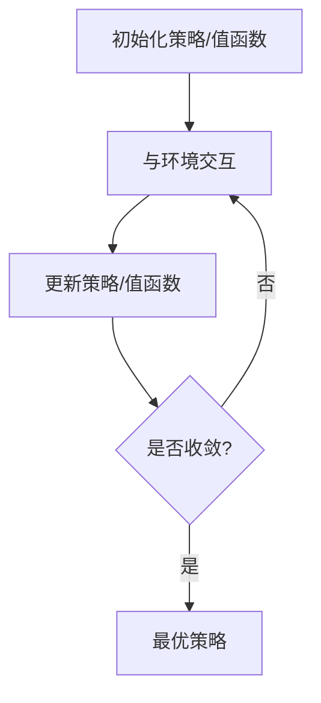

# AI人工智能深度学习算法：理解决策制定与推理机制

## 1.背景介绍

在当今的数字时代，人工智能(AI)已经渗透到了我们生活的方方面面。从智能助手到自动驾驶汽车,再到医疗诊断和金融分析,AI系统正在帮助我们做出更好的决策并简化复杂的任务。然而,这些智能系统背后的核心是什么?它们是如何模拟人类的思维过程并做出明智的决定的?答案就在于深度学习算法和推理机制。

深度学习是机器学习的一个子领域,它利用神经网络的多层结构来模拟人脑的工作方式,从海量数据中自主学习特征模式,并对新的输入数据做出预测或决策。而推理则是一种逻辑推理过程,通过对已知信息的分析和综合,得出新的结论或决策。深度学习算法结合了这两种能力,使AI系统能够从复杂的数据中提取有价值的信息,并基于这些信息做出明智的决策。

## 2.核心概念与联系

要理解深度学习算法的决策制定与推理机制,我们需要先了解几个核心概念:

### 2.1 神经网络

神经网络是深度学习算法的基础,它模仿了人脑中神经元之间的连接和信息传递方式。一个典型的神经网络由输入层、隐藏层和输出层组成,每一层都包含多个节点(类似于神经元),通过加权连接进行信息传递和处理。

### 2.2 前馈神经网络和反向传播

前馈神经网络是最基本的神经网络结构,信息只能从输入层单向传递到输出层。在训练过程中,我们使用反向传播算法来调整每个连接的权重,使网络能够学习到正确的映射关系。

### 2.3 深度神经网络

深度神经网络指的是包含多个隐藏层的神经网络结构。增加隐藏层的数量可以提高网络对复杂模式的学习能力,但也会增加训练的难度和计算资源需求。

### 2.4 卷积神经网络

卷积神经网络(CNN)是一种专门用于处理图像和视频数据的深度神经网络。它通过卷积和池化操作来提取局部特征,从而能够高效地学习视觉模式。CNN广泛应用于图像分类、目标检测和语义分割等计算机视觉任务。

### 2.5 递归神经网络

递归神经网络(RNN)是一种专门用于处理序列数据(如文本、语音和时间序列)的深度神经网络。它通过内部循环连接来捕获序列中的长期依赖关系,广泛应用于自然语言处理、语音识别和时间序列预测等任务。

### 2.6 强化学习

强化学习是机器学习的另一个重要分支,它通过与环境的交互来学习如何做出最优决策。在这个过程中,智能体(Agent)根据当前状态采取行动,并从环境中获得奖励或惩罚,目标是最大化长期累积奖励。强化学习算法常用于决策制定和控制任务,如机器人控制、游戏AI和自动驾驶等。

## 3.核心算法原理具体操作步骤

### 3.1 前馈神经网络训练

前馈神经网络的训练过程主要包括以下步骤:

1. **初始化权重**: 随机初始化神经网络中所有连接的权重。
2. **前向传播**: 将输入数据传递到输出层,计算每一层的输出值。
3. **计算损失**: 将输出值与真实标签进行比较,计算损失函数的值。
4. **反向传播**: 利用链式法则,计算每个权重对损失函数的梯度。
5. **权重更新**: 使用优化算法(如梯度下降)根据梯度值更新每个权重。
6. **重复迭代**: 重复步骤2-5,直到损失函数收敛或达到预设的迭代次数。

### 3.2 卷积神经网络训练

卷积神经网络的训练过程与前馈神经网络类似,但需要额外考虑卷积和池化操作:

1. **卷积层**: 使用多个滤波器(kernel)对输入图像进行卷积操作,提取局部特征。
2. **池化层**: 对卷积层的输出进行下采样,减少特征图的维度。
3. **全连接层**: 将池化层的输出展平,并传递到全连接层进行分类或回归。
4. **损失计算和反向传播**: 与前馈神经网络相同,计算损失函数并反向传播梯度。
5. **权重更新**: 更新卷积核和全连接层的权重。

### 3.3 递归神经网络训练

递归神经网络的训练过程涉及到序列数据的处理:

1. **初始化状态**: 初始化RNN单元的初始状态。
2. **前向传播**: 逐个时间步骤将输入序列传递到RNN单元,计算每个时间步的输出和新的状态。
3. **计算损失**: 将最终输出与真实标签进行比较,计算损失函数的值。
4. **反向传播**: 利用反向传播算法计算每个时间步的梯度。
5. **权重更新**: 使用优化算法更新RNN单元的权重。
6. **重复迭代**: 重复步骤2-5,直到损失函数收敛或达到预设的迭代次数。

### 3.4 强化学习算法

强化学习算法通常采用策略迭代或值迭代的方式来学习最优策略:

1. **初始化策略或值函数**: 初始化智能体的策略或状态-值函数。
2. **与环境交互**: 根据当前策略或值函数与环境进行交互,获取状态、行动和奖励。
3. **更新策略或值函数**: 根据获得的经验,使用算法(如Q-learning、策略梯度等)更新策略或值函数。
4. **重复迭代**: 重复步骤2-3,直到策略或值函数收敛或达到预设的迭代次数。

## 4.数学模型和公式详细讲解举例说明

### 4.1 神经网络模型

神经网络的核心数学模型是由权重矩阵和激活函数组成的前馈计算过程。对于一个单层神经网络,输入 $\mathbf{x}$ 和输出 $\mathbf{y}$ 之间的关系可以表示为:

$$\mathbf{y} = f(\mathbf{W}\mathbf{x} + \mathbf{b})$$

其中:
- $\mathbf{W}$ 是权重矩阵
- $\mathbf{b}$ 是偏置向量
- $f$ 是非线性激活函数,如 Sigmoid、ReLU 等

对于多层神经网络,每一层的输出都会作为下一层的输入,形成一个复合函数:

$$\mathbf{y} = f_L(\mathbf{W}_L f_{L-1}(\mathbf{W}_{L-1} \cdots f_1(\mathbf{W}_1\mathbf{x} + \mathbf{b}_1) + \mathbf{b}_{L-1}) + \mathbf{b}_L)$$

其中 $L$ 是网络的层数。

### 4.2 反向传播算法

反向传播算法是训练神经网络的关键,它利用链式法则计算每个权重对损失函数的梯度。假设我们的损失函数为 $J(\mathbf{W})$,则对于第 $l$ 层的权重矩阵 $\mathbf{W}_l$,其梯度可以表示为:

$$\frac{\partial J}{\partial \mathbf{W}_l} = \frac{\partial J}{\partial \mathbf{y}} \frac{\partial \mathbf{y}}{\partial \mathbf{z}_L} \frac{\partial \mathbf{z}_L}{\partial \mathbf{z}_{L-1}} \cdots \frac{\partial \mathbf{z}_{l+1}}{\partial \mathbf{W}_l}$$

其中 $\mathbf{z}_i$ 表示第 $i$ 层的加权输入。通过反向传播,我们可以逐层计算每个梯度项,并使用优化算法(如梯度下降)更新权重。

### 4.3 卷积神经网络模型

卷积神经网络的核心操作是卷积和池化。对于一个二维卷积操作,输入特征图 $\mathbf{X}$ 和输出特征图 $\mathbf{Y}$ 之间的关系可以表示为:

$$\mathbf{Y}_{i,j} = \sum_{m,n} \mathbf{W}_{m,n} \cdot \mathbf{X}_{i+m,j+n}$$

其中 $\mathbf{W}$ 是卷积核,对输入特征图进行滑动卷积操作。池化操作则是对特征图进行下采样,常用的方法有最大池化和平均池化。

### 4.4 递归神经网络模型

递归神经网络的核心是循环连接,它可以捕获序列数据中的长期依赖关系。对于一个简单的 RNN 单元,在时间步 $t$ 的隐藏状态 $\mathbf{h}_t$ 和输出 $\mathbf{y}_t$ 可以表示为:

$$\begin{aligned}
\mathbf{h}_t &= f(\mathbf{W}_{hh}\mathbf{h}_{t-1} + \mathbf{W}_{xh}\mathbf{x}_t + \mathbf{b}_h) \\
\mathbf{y}_t &= g(\mathbf{W}_{hy}\mathbf{h}_t + \mathbf{b}_y)
\end{aligned}$$

其中 $f$ 和 $g$ 是非线性激活函数,如 tanh 或 ReLU。$\mathbf{W}_{hh}$、$\mathbf{W}_{xh}$ 和 $\mathbf{W}_{hy}$ 分别是隐藏层到隐藏层、输入到隐藏层和隐藏层到输出层的权重矩阵。

### 4.5 强化学习模型

强化学习的核心是马尔可夫决策过程(MDP),它可以用一个元组 $(\mathcal{S}, \mathcal