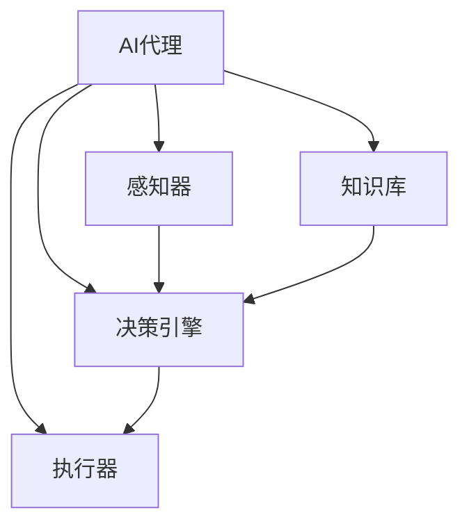
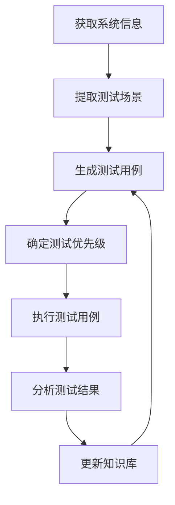

# AI代理在自动化测试中的工作流及应用

## 1.背景介绍

随着软件系统日益复杂,传统的手动测试方式已经无法满足现代软件开发的需求。自动化测试凭借其高效、可重复性和可扩展性,成为了保证软件质量的关键手段。在自动化测试领域,AI代理(AI Agent)的应用正在引领一场新的革命。

AI代理是一种智能软件实体,能够感知环境、作出决策并执行相应的操作。通过机器学习和自然语言处理等技术,AI代理可以模拟人类测试员的行为,执行各种测试任务,从而大大提高了测试的效率和覆盖率。

### 自动化测试的挑战

尽管自动化测试带来了诸多好处,但它也面临着一些挑战:

1. **测试用例维护成本高**:随着系统的不断迭代,测试用例需要持续更新,维护工作量巨大。
2. **测试覆盖率有限**:编写测试用例需要对系统有深入的了解,很容易遗漏边角案例。
3. **测试脚本编写复杂**:编写测试脚本需要专业的编程技能,对非技术人员来说是一个挑战。

AI代理的引入正是为了解决这些挑战,提高自动化测试的效率和质量。

## 2.核心概念与联系

在探讨AI代理在自动化测试中的应用之前,我们需要了解以下几个核心概念:

### 机器学习(Machine Learning)

机器学习是一种使计算机具有学习能力的技术,它可以从数据中自动分析并获取模式,并用所学的模式对新数据进行预测或决策。在自动化测试中,机器学习可以用于:

- **测试用例生成**:通过分析历史测试数据和系统行为,生成新的测试用例。
- **测试优先级确定**:根据历史缺陷数据和风险评估,确定测试用例的执行优先级。
- **测试报告分析**:自动分析测试报告,识别潜在的问题和趋势。

### 自然语言处理(Natural Language Processing, NLP)

自然语言处理是一门研究计算机处理人类语言的技术,包括语音识别、文本分析、机器翻译等。在自动化测试中,NLP可以用于:

- **需求分析**:从需求文档中提取测试场景和用例。
- **测试脚本生成**:根据自然语言描述,自动生成可执行的测试脚本。
- **测试报告解读**:理解和解释测试报告中的自然语言描述。

### AI代理架构

AI代理通常由以下几个核心组件构成:

1. **感知器(Sensor)**:用于获取环境信息,如系统界面、日志文件等。
2. **决策引擎(Decision Engine)**:基于感知器获取的信息和机器学习模型,作出测试决策。
3. **执行器(Actuator)**:执行测试操作,如输入测试数据、触发事件等。
4. **知识库(Knowledge Base)**:存储历史测试数据、系统规范等信息。



## 3.核心算法原理具体操作步骤

AI代理在自动化测试中的工作流程通常包括以下几个步骤:

1. **获取系统信息**:通过感知器获取系统界面、日志文件等信息。
2. **提取测试场景**:利用NLP技术从系统信息和需求文档中提取测试场景。
3. **生成测试用例**:基于机器学习模型和历史测试数据,生成新的测试用例。
4. **确定测试优先级**:根据风险评估和历史缺陷数据,确定测试用例的执行优先级。
5. **执行测试用例**:通过执行器执行测试操作,如输入测试数据、触发事件等。
6. **分析测试结果**:利用NLP技术分析测试报告,识别潜在的问题和趋势。
7. **更新知识库**:将新的测试数据和经验添加到知识库中,用于下一轮迭代。



这个过程是一个闭环,每一轮迭代都会利用之前积累的知识和经验,不断优化测试策略和效率。

## 4.数学模型和公式详细讲解举例说明

在AI代理的自动化测试过程中,涉及到多种数学模型和算法,下面我们将介绍其中几个关键模型。

### 测试用例生成

测试用例生成的目标是根据系统规范和历史测试数据,生成高质量的测试用例集合。常用的方法是组合测试(Combinatorial Testing),它通过构造正交阵(Orthogonal Array)来覆盖不同输入参数的组合。

对于一个有$n$个输入参数的系统,每个参数有$v_i$个不同的取值,我们需要构造一个$N \times n$的正交阵$OA(N, n, v_1, v_2, \ldots, v_n)$,其中$N$是测试用例的数量。正交阵的构造需要满足:

$$
\forall 1 \leq j_1 < j_2 \leq n, \quad \forall 0 \leq h_1, h_2 < v_{j_1}, \quad \forall 0 \leq k_1, k_2 < v_{j_2}, \\
\exists 1 \leq x \leq N, \quad \text{s.t.} \quad OA[x, j_1] = h_1, \quad OA[x, j_2] = k_1
$$

这个条件保证了在生成的$N$个测试用例中,任意两个参数的所有值组合都至少出现一次。通过构造合适的正交阵,我们可以用最少的测试用例覆盖所有参数组合,从而提高测试效率。

### 测试优先级确定

在有限的测试资源下,我们需要优先执行那些更有可能发现缺陷的测试用例。常用的方法是基于历史缺陷数据,构建缺陷预测模型。

假设我们有$m$个历史测试用例$\{c_1, c_2, \ldots, c_m\}$,每个测试用例都由$n$个特征向量$\boldsymbol{x}_i = (x_{i1}, x_{i2}, \ldots, x_{in})$描述,如代码复杂度、开发人员经验等。我们的目标是学习一个函数$f(\boldsymbol{x})$,对给定的特征向量$\boldsymbol{x}$预测其对应测试用例发现缺陷的概率。

常用的机器学习模型包括逻辑回归(Logistic Regression)、决策树(Decision Tree)和神经网络(Neural Network)等。以逻辑回归为例,我们需要学习参数向量$\boldsymbol{\theta} = (\theta_0, \theta_1, \ldots, \theta_n)$,使得:

$$
f(\boldsymbol{x}) = \frac{1}{1 + e^{-\boldsymbol{\theta}^T \boldsymbol{x}}}
$$

对于新的测试用例$c_\text{new}$,我们可以计算$f(\boldsymbol{x}_\text{new})$,并根据这个概率值确定其执行优先级。

### 测试报告分析

测试报告通常是自然语言形式的,我们需要利用NLP技术对其进行分析和理解。常用的方法是基于深度学习的序列标注模型,如长短期记忆网络(Long Short-Term Memory, LSTM)和transformer等。

假设我们有一个包含$m$个单词的测试报告$\{w_1, w_2, \ldots, w_m\}$,我们的目标是为每个单词$w_i$预测其标签$y_i$,如"缺陷描述"、"测试步骤"等。我们可以将单词表示为词向量$\boldsymbol{x}_i \in \mathbb{R}^d$,并使用LSTM模型学习一个函数$f$,使得:

$$
\boldsymbol{h}_i = f(\boldsymbol{h}_{i-1}, \boldsymbol{x}_i) \\
P(y_i | \boldsymbol{h}_i) = \text{softmax}(\boldsymbol{W}\boldsymbol{h}_i + \boldsymbol{b})
$$

其中$\boldsymbol{h}_i$是隐藏状态向量,通过当前输入$\boldsymbol{x}_i$和上一时刻的隐藏状态$\boldsymbol{h}_{i-1}$计算得到。$\boldsymbol{W}$和$\boldsymbol{b}$是需要学习的参数。

通过序列标注模型,我们可以自动识别测试报告中的关键信息,如缺陷描述、影响范围等,从而更好地理解测试结果并指导下一步的测试策略。

## 5.项目实践:代码实例和详细解释说明

为了更好地理解AI代理在自动化测试中的应用,我们将通过一个具体的项目实践来演示其工作流程。

假设我们需要测试一个在线购物网站,它包括以下几个核心功能:

1. 用户登录
2. 浏览商品
3. 加入购物车
4. 下单付款
5. 订单查询

我们将使用Python编程语言和相关库来实现AI代理。

### 1. 获取系统信息

我们首先需要获取系统的界面信息和需求文档。在这个示例中,我们假设已经有了一个包含网站UI元素的文件`website.xml`和一个需求文档`requirements.txt`。

```python
import xml.etree.ElementTree as ET

# 解析网站UI信息
tree = ET.parse('website.xml')
root = tree.getroot()
ui_elements = [elem.attrib for elem in root.iter()]

# 读取需求文档
with open('requirements.txt', 'r') as f:
    requirements = f.read()
```

### 2. 提取测试场景

接下来,我们利用NLP技术从需求文档中提取测试场景。这里我们使用基于规则的方法,通过关键词匹配来识别测试场景。

```python
import re

# 定义测试场景关键词
scenario_keywords = ['when', 'if', 'given']

# 提取测试场景
scenarios = []
for line in requirements.split('\n'):
    for keyword in scenario_keywords:
        if keyword in line.lower():
            scenarios.append(line.strip())
            break

print('Extracted test scenarios:')
print('\n'.join(scenarios))
```

### 3. 生成测试用例

有了测试场景,我们就可以生成具体的测试用例了。这里我们使用组合测试的方法,通过构造正交阵来覆盖不同输入参数的组合。

```python
import numpy as np
from pycoat import oa_construction

# 定义输入参数及其取值范围
params = {
    'username': ['user1', 'user2', 'user3'],
    'password': ['pass1', 'pass2', 'pass3'],
    'product': ['book', 'electronics', 'clothing'],
    'payment': ['credit_card', 'paypal', 'cash_on_delivery']
}

# 构造正交阵
oa = oa_construction(params.values(), 'oa')
test_cases = []
for row in oa:
    case = {}
    for i, value in enumerate(row):
        param_name = list(params.keys())[i]
        param_values = params[param_name]
        case[param_name] = param_values[value]
    test_cases.append(case)

print('Generated test cases:')
for case in test_cases:
    print(case)
```

### 4. 执行测试用例

现在我们可以执行生成的测试用例了。这里我们使用Selenium库来模拟浏览器操作,并自动执行测试步骤。

```python
from selenium import webdriver
from selenium.webdriver.common.by import By
from selenium.webdriver.support.ui import WebDriverWait
from selenium.webdriver.support import expected_conditions as EC

# 初始化浏览器
driver = webdriver.Chrome()
driver.get('https://www.example.com')

# 执行测试用例
for case in test_cases:
    # 登录
    username_input = WebDriverWait(driver, 10).until(
        EC.presence_of_element_located((By.ID, 'username'))
    )
    username_input.send_keys(case['username'])
    password_input = driver.find_element_by_id('password')
    password_input.send_keys(case['password'])
    login_button = driver.find_element_by_id('login')
    login_button.click()

    # 浏览商品
    product_link = WebDriverWait(