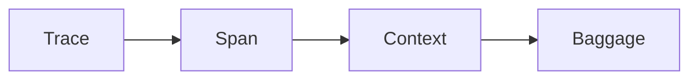
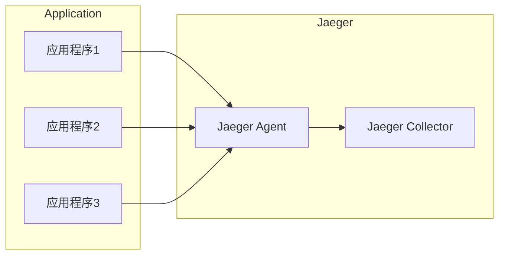
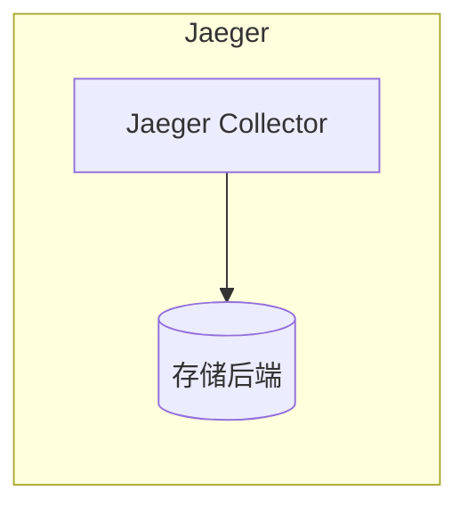
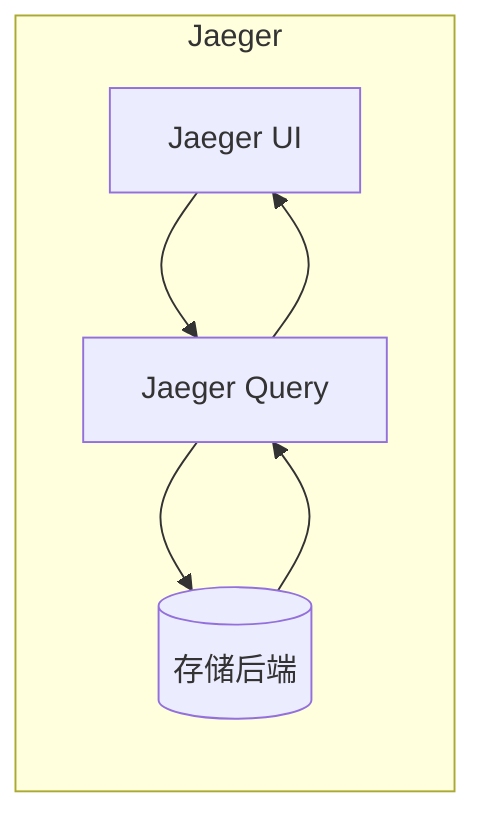
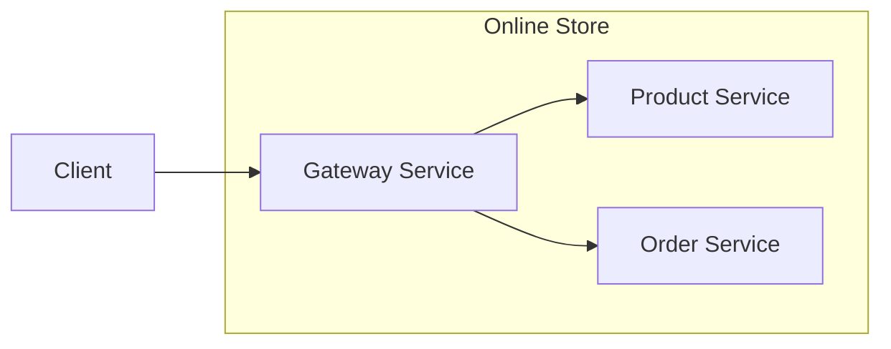

# AI系统Jaeger原理与代码实战案例讲解

## 1.背景介绍

在当今数字时代,人工智能(AI)已经渗透到各个领域,成为推动科技创新和社会进步的重要驱动力。随着大数据、云计算和高性能计算等技术的快速发展,AI系统也在不断演进,展现出越来越强大的能力。其中,Jaeger是一款开源的、高性能的分布式追踪系统,被广泛应用于微服务架构、云原生环境等复杂的分布式系统中,用于监控、分析和诊断系统的性能和行为。

Jaeger的核心目标是提供一种高效、可扩展的方式来追踪分布式系统中的请求,从而帮助开发人员和运维人员快速定位和解决系统中的性能瓶颈、错误和异常。它通过收集和分析来自各个服务组件的追踪数据,为整个系统提供全面的可视化和洞察,从而提高系统的可观察性、可维护性和可靠性。

随着微服务架构和云原生技术的不断普及,分布式系统的复杂性也在不断增加。在这种背景下,Jaeger这样的分布式追踪系统变得越来越重要,它能够帮助开发人员和运维人员更好地理解和管理复杂的分布式系统,提高系统的性能和可靠性,从而为用户提供更好的服务体验。

## 2.核心概念与联系

在深入探讨Jaeger的原理和实践之前,我们需要先了解一些核心概念和它们之间的关系。

### 2.1 Trace(追踪)

Trace是Jaeger中最基本的概念,它表示一个分布式系统中的端到端请求流程。每个Trace由一个唯一的ID标识,并包含多个Span(跨度)。

### 2.2 Span(跨度)

Span代表Trace中的一个单独的工作单元,通常对应于一个函数调用、一个远程过程调用或者一个数据库查询等操作。每个Span都有一个唯一的ID,以及一些其他元数据,如操作名称、开始时间、持续时间等。

### 2.3 Context(上下文)

Context是一种跨越进程边界的数据传播机制,用于在分布式系统中传递Trace和Span的元数据。它通常被编码到请求头或消息头中,以便在不同的服务组件之间传递追踪信息。

### 2.4 Baggage(附加数据)

Baggage是一种键值对形式的数据,可以在Trace的整个生命周期中传播。它常用于传递一些与请求相关的元数据,如用户ID、会话ID等。

这些核心概念之间的关系如下所示:



一个Trace包含多个Span,每个Span都携带一个Context,Context中可以包含Baggage数据。这些概念共同构成了Jaeger的追踪模型,为分布式系统提供了全面的可观察性和可追踪性。

## 3.核心算法原理具体操作步骤

Jaeger的核心算法原理主要包括三个部分:数据收集、数据存储和数据查询。

### 3.1 数据收集

Jaeger使用了OpenTracing标准,通过客户端库(Client Libraries)将追踪数据发送到Jaeger Agent。具体操作步骤如下:

1. 应用程序通过OpenTracing API创建Trace和Span。
2. 应用程序将Span数据发送到Jaeger Agent。
3. Jaeger Agent将收集到的Span数据批量发送到Jaeger Collector。



### 3.2 数据存储

Jaeger Collector接收到Span数据后,会将其存储到后端存储系统中。Jaeger支持多种存储后端,包括Cassandra、Elasticsearch、Kafka等。存储操作步骤如下:

1. Jaeger Collector将收集到的Span数据写入存储后端。
2. 存储后端持久化Span数据。



### 3.3 数据查询

Jaeger提供了一个UI界面,用户可以通过该界面查询和可视化存储在后端的追踪数据。查询操作步骤如下:

1. 用户通过Jaeger UI界面发起查询请求。
2. Jaeger Query服务从存储后端读取相关的Trace数据。
3. Jaeger UI界面展示查询结果,包括Trace的时间线视图、Span详情等。



通过这三个核心算法原理,Jaeger实现了对分布式系统的全面追踪和可观察性,为系统的性能优化、故障诊断和问题排查提供了强有力的支持。

## 4.数学模型和公式详细讲解举例说明

在分布式追踪系统中,常常需要对追踪数据进行统计和分析,以便更好地理解系统的性能和行为。Jaeger使用了一些数学模型和公式来量化和评估追踪数据,下面我们将详细讲解其中的一些重要模型和公式。

### 4.1 延迟分布

延迟(Latency)是衡量系统性能的一个重要指标,它表示一个操作从开始到完成所需的时间。在分布式系统中,每个Span的持续时间就代表了该操作的延迟。

对于一个给定的Trace,我们可以计算出所有Span的延迟分布,从而了解系统中不同操作的延迟特征。常用的延迟分布指标包括:

- 平均延迟(Mean Latency): $\bar{x} = \frac{1}{n}\sum_{i=1}^{n}x_i$
- 中位数延迟(Median Latency): 将延迟值从小到大排序,取中间值
- 百分位延迟(Percentile Latency): 例如95百分位延迟,表示95%的延迟值小于该值

通过分析这些延迟分布指标,我们可以了解系统的整体响应速度,以及是否存在延迟异常的操作。

### 4.2 吞吐量

吞吐量(Throughput)是指系统在单位时间内能够处理的操作数量。在Jaeger中,我们可以通过统计单位时间内的Trace数量来估计系统的吞吐量。

设单位时间内的Trace数量为$N$,平均Trace持续时间为$\bar{t}$,则系统的吞吐量可以近似计算为:

$$\text{Throughput} \approx \frac{N}{\bar{t}}$$

通过监控吞吐量的变化趋势,我们可以评估系统的负载情况,并及时发现性能瓶颈。

### 4.3 错误率

错误率(Error Rate)是指系统中出现错误的比例。在Jaeger中,我们可以通过统计带有错误标记的Span数量来计算错误率。

设总的Span数量为$N$,错误Span数量为$N_e$,则错误率可以计算为:

$$\text{Error Rate} = \frac{N_e}{N}$$

错误率是衡量系统可靠性的重要指标,通过监控错误率的变化,我们可以及时发现和修复系统中的错误和异常。

这些数学模型和公式为我们提供了量化和评估分布式系统性能的工具,有助于我们更好地理解系统的行为,并进行相应的优化和调整。

## 5.项目实践:代码实例和详细解释说明

为了更好地理解Jaeger的工作原理和使用方式,我们将通过一个实际的代码示例来演示如何在一个简单的分布式系统中集成和使用Jaeger进行追踪。

### 5.1 系统架构

我们将构建一个简单的在线商店系统,包含三个微服务:

1. **Gateway Service**: 负责接收用户请求,并将请求转发给相应的服务。
2. **Product Service**: 负责管理商品信息,提供商品查询和购买功能。
3. **Order Service**: 负责管理订单信息,处理订单创建和支付流程。

这三个服务将使用gRPC进行通信,并使用Jaeger进行分布式追踪。系统架构如下所示:



### 5.2 集成Jaeger

我们将使用Go语言编写这个示例项目,并使用Jaeger的Go客户端库`go.opentracing.io/opentracing`来集成Jaeger。

首先,我们需要初始化Jaeger Tracer,并将其注入到应用程序的上下文中:

```go
import (
    "io"
    "github.com/opentracing/opentracing-go"
    "github.com/uber/jaeger-client-go"
    jaegercfg "github.com/uber/jaeger-client-go/config"
)

func initJaeger(service string) (opentracing.Tracer, io.Closer, error) {
    cfg := jaegercfg.Configuration{
        ServiceName: service,
        Sampler: &jaegercfg.SamplerConfig{
            Type:  jaeger.SamplerTypeConst,
            Param: 1,
        },
        Reporter: &jaegercfg.ReporterConfig{
            LogSpans: true,
        },
    }

    tracer, closer, err := cfg.NewTracer(jaegercfg.Logger(jaeger.StdLogger))
    if err != nil {
        return nil, nil, err
    }

    opentracing.SetGlobalTracer(tracer)
    return tracer, closer, nil
}
```

在这个示例中,我们使用了`jaeger-client-go`库,并配置了服务名称、采样策略和报告选项。`initJaeger`函数返回一个`opentracing.Tracer`实例,以及一个用于关闭Tracer的`io.Closer`实例。

接下来,我们将在每个服务的gRPC处理程序中创建和传播Span:

```go
import "github.com/opentracing/opentracing-go"

func (s *server) SomeMethod(ctx context.Context, req *pb.Request) (*pb.Response, error) {
    span, ctx := opentracing.StartSpanFromContext(ctx, "SomeMethod")
    defer span.Finish()

    // 处理请求逻辑...

    return &pb.Response{}, nil
}
```

在这个示例中,我们使用`opentracing.StartSpanFromContext`函数从当前上下文中创建一个新的Span。在处理请求的逻辑中,我们可以使用`span.LogFields`记录一些关键事件,或者使用`span.SetBaggageItem`设置一些附加数据。最后,我们调用`span.Finish`来结束该Span。

对于跨服务的调用,我们需要将当前的追踪上下文传递给下游服务:

```go
import "github.com/opentracing/opentracing-go"

func callDownstream(ctx context.Context, req *pb.Request) (*pb.Response, error) {
    span, ctx := opentracing.StartSpanFromContext(ctx, "CallDownstream")
    defer span.Finish()

    // 将追踪上下文注入到gRPC元数据中
    md, ok := metadata.FromOutgoingContext(ctx)
    if !ok {
        md = metadata.New(nil)
    } else {
        md = md.Copy()
    }
    opentracing.GlobalTracer().Inject(span.Context(), opentracing.HTTPHeaders, opentracing.HTTPHeadersCarrier(md))

    // 使用包含追踪上下文的元数据调用下游服务
    resp, err := downstreamClient.SomeMethod(metadata.NewOutgoingContext(ctx, md), req)
    if err != nil {
        span.LogFields(log.Error(err))
        return nil, err
    }

    return resp, nil
}
```

在这个示例中,我们使用`opentracing.GlobalTracer().Inject`函数将当前的追踪上下文注入到gRPC元数据中。然后,我们使用包含追踪上下文的元数据调用下游服务。下游服务可以从接收到的元数据中提取追踪上下文,并创建新的Span。

通过这种方式,我们可以在整个分布式系统中传播追踪上下文,从而实现端到端的分布式追踪。

### 5.3 查询和可视化

在集成了Jaeger之后,我们可以通过Jaeger UI界面查询和可视化追踪数据。