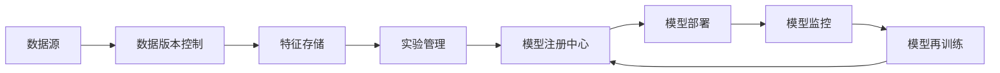

# AI系统MLOps原理与代码实战案例讲解

## 1. 背景介绍
### 1.1 MLOps的兴起
随着人工智能和机器学习技术的快速发展,越来越多的企业开始将AI/ML模型应用到实际的生产环境中。然而,将ML模型从实验室研究阶段转移到生产环境中并非易事,其中涉及数据处理、模型训练、模型部署、模型监控等一系列复杂的流程。为了解决这些问题,MLOps(Machine Learning Operations)应运而生。

### 1.2 MLOps的定义
MLOps是一种结合了机器学习(ML)和运维(Operations)的实践,旨在高效、自动化地管理端到端的机器学习生命周期。它借鉴了DevOps的理念和实践,将ML系统开发与IT运维进行有机融合,实现ML模型的持续集成、持续交付和持续监控。

### 1.3 MLOps的必要性
在实际的ML项目中,我们往往面临以下挑战:
- 数据处理和特征工程繁琐
- 模型训练耗时长,调参难度大 
- 模型部署流程复杂,环境依赖难以管理
- 缺乏有效的模型监控和版本管理机制
- 团队协作效率低,开发与运维职责界限模糊

MLOps的出现就是为了解决这些痛点,提高ML项目的开发效率、部署速度和运行稳定性,实现ML模型的工业化落地。

## 2. 核心概念与联系
### 2.1 CICD
CICD(Continuous Integration/Continuous Delivery)是一种软件工程实践,旨在频繁地将代码变更集成到主干,并尽早发现和修复错误,快速交付高质量的软件。MLOps借鉴了CICD的理念,将其应用到ML系统开发中。

### 2.2 数据版本控制
类似于代码版本控制,数据版本控制对ML项目的数据集进行管理,记录数据的变更历史,方便数据集的共享和复现。常见的数据版本控制工具有DVC、Pachyderm等。

### 2.3 实验管理
实验管理是指对ML实验过程中的代码、数据、参数、指标等元信息进行记录和管理,方便实验的追踪、比较和复现。MLflow是一个优秀的开源实验管理平台。

### 2.4 模型注册中心  
模型注册中心类似于程序包仓库,提供了ML模型的存储、版本管理、共享和部署等功能。通过在注册中心登记模型的元数据,方便不同团队和项目之间共享和复用训练好的模型。

### 2.5 特征存储
特征存储是一个中心化的存储层,用于管理ML项目中的特征数据。它提供了特征注册、发现、共享、版本控制等功能,可以显著提高特征工程的效率,避免重复计算。

### 2.6 概念之间的联系
下图展示了MLOps中这些核心概念之间的关系:



从数据源出发,经过数据版本控制、特征存储、实验管理、模型注册、模型部署、模型监控,最终实现模型的持续优化和再训练,形成一个闭环的MLOps流程。

## 3. 核心算法原理具体操作步骤
这里我们以一个常见的分类任务为例,讲解MLOps的核心算法原理和操作步骤。

### 3.1 数据准备
- 收集和标注数据,划分训练集、验证集和测试集
- 使用DVC对数据集进行版本控制
- 数据清洗,处理缺失值、异常值等
- 数据预处理,进行特征缩放、编码等

### 3.2 特征工程
- 特征提取,从原始数据中提取有效特征
- 特征选择,去除冗余和无关特征
- 特征组合,创建新的组合特征
- 将特征保存到特征存储中

### 3.3 模型训练
- 选择合适的分类算法,如逻辑回归、决策树、SVM等
- 使用MLflow跟踪实验过程,记录超参数和评估指标
- 进行交叉验证,调整超参数,得到最优模型
- 评估模型在测试集上的性能

### 3.4 模型部署
- 将训练好的模型打包为标准格式,如ONNX、PMML等 
- 将模型包上传到模型注册中心,填写版本号、使用说明等元数据
- 使用Docker或Kubernetes进行模型服务化部署
- 配置流量路由策略,实现蓝绿部署、金丝雀发布等

### 3.5 模型监控
- 埋点收集线上服务的请求数据和预测结果
- 计算模型的各项线上指标,如准确率、延迟等
- 使用控制台或报警机制实时监控模型性能
- 分析预测偏差,收集新的反馈数据

### 3.6 模型再训练
- 合并新的训练数据,重新进行特征工程
- 使用新数据重新训练模型,生成新版本
- 比较新旧版本的性能,决定是否发布更新
- 定期重复上述步骤,实现模型的持续优化

## 4. 数学模型和公式详细讲解举例说明
在MLOps中,我们经常使用一些经典的机器学习算法来解决分类、回归等任务。这里我们以逻辑回归为例,讲解其数学模型和公式。

逻辑回归是一种常用的二分类算法,它的目标是学习一个决策边界,将样本点划分为正负两类。给定一个样本$x$,逻辑回归模型预测其为正类的概率为:

$$
P(y=1|x) = \frac{1}{1+e^{-w^Tx}}
$$

其中$w$是模型的权重向量。对应的负类概率为:

$$
P(y=0|x) = 1 - P(y=1|x) = \frac{e^{-w^Tx}}{1+e^{-w^Tx}}
$$

逻辑回归的目标是最小化下面的交叉熵损失函数:

$$
L(w) = -\sum_{i=1}^{N}[y_i\log(P(y=1|x_i)) + (1-y_i)\log(P(y=0|x_i))]
$$

其中$N$是训练样本数,$y_i$是样本$x_i$的真实标签。

在训练阶段,我们通过梯度下降法不断更新权重$w$,最小化损失函数$L(w)$,得到最优的模型参数。预测阶段,对于新的样本$x$,我们计算$P(y=1|x)$,如果大于0.5则预测为正类,否则预测为负类。

举个例子,假设我们要基于用户的年龄、收入、信用分数等特征,预测其是否会违约。我们收集了1000个用户的数据,其中100个违约,900个未违约。我们将数据划分为训练集和测试集,训练逻辑回归模型,得到权重向量$w$。对于一个新用户,根据其特征计算出$P(y=1|x)=0.8$,则我们预测该用户有很大概率会违约。

## 5. 项目实践：代码实例和详细解释说明
下面我们通过一个简单的代码实例,演示如何使用Python实现MLOps中的一些关键步骤。

### 5.1 数据版本控制
使用DVC对数据集进行版本控制:

```python
import dvc.api

# 将数据集添加到DVC跟踪
dvc.api.add('data/dataset.csv')

# 将更改提交到Git仓库
import os
os.system('git add data/dataset.csv.dvc')
os.system('git commit -m "Add dataset version 1.0"')
```

这段代码首先使用`dvc.api.add`将`dataset.csv`添加到DVC跟踪,然后使用Git提交数据集的DVC元数据文件,实现数据版本控制。

### 5.2 特征存储
使用Feast将特征保存到特征存储:

```python
from feast import FeatureStore, Entity, Feature, ValueType

# 定义实体和特征
customer = Entity(name='customer_id', value_type=ValueType.INT64)

age = Feature(name='age', dtype=ValueType.INT64)
income = Feature(name='income', dtype=ValueType.DOUBLE)
credit_score = Feature(name='credit_score', dtype=ValueType.INT64)

# 创建特征库
store = FeatureStore(repo_path="feature_repo")

# 创建特征视图
customer_features_view = store.create_feature_view(
    name='customer_features',
    entities=[customer], 
    features=[age, income, credit_score]
)

# 提取特征数据并存入特征库
store.apply([customer_features_view])
```

这段代码定义了客户ID、年龄、收入、信用分数等实体和特征,创建了一个Feast特征库和特征视图,并将特征数据提取并保存到特征库中,方便后续的特征共享和复用。

### 5.3 实验管理
使用MLflow跟踪模型训练实验:

```python
import mlflow

# 启动MLflow跟踪
mlflow.set_tracking_uri("sqlite:///mlruns.db")
mlflow.set_experiment("credit_scoring")

# 记录参数
mlflow.log_param("model", "LogisticRegression")
mlflow.log_param("penalty", "l2")
mlflow.log_param("C", 1.0)

# 记录指标
mlflow.log_metric("auc", 0.83)
mlflow.log_metric("accuracy", 0.91)

# 记录模型
mlflow.sklearn.log_model(model, "model")
```

这段代码创建了一个名为`credit_scoring`的MLflow实验,并在训练逻辑回归模型时,使用MLflow记录了模型类型、正则化参数、评估指标以及训练好的模型对象,方便实验的管理和比较。

### 5.4 模型部署
使用BentoML打包模型并生成API服务:

```python
import bentoml
from bentoml.io import JSON

# 将训练好的模型打包为Bento
model_bento = bentoml.sklearn.save_model("credit_model", model)

# 定义推理服务
model_runner = model_bento.to_runner()
svc = bentoml.Service("credit_model_service", runners=[model_runner]) 

@svc.api(input=JSON(), output=JSON())
def predict(input_data):
    result = model_runner.predict.run(input_data)
    return result
```

这段代码使用BentoML将训练好的逻辑回归模型打包为一个标准格式,并定义了一个推理服务`credit_model_service`,暴露了一个`predict`接口,可以接受JSON格式的输入并返回预测结果。打包好的模型可以方便地部署到生产环境中。

## 6. 实际应用场景
MLOps在许多实际场景中都有广泛应用,下面列举几个典型的应用案例:

### 6.1 智能客服
在电商、金融等行业,传统的人工客服面临成本高、效率低的问题。引入基于NLP和知识图谱的智能客服系统,可以自动解答用户的常见问题,大幅提高客服效率。MLOps可以帮助智能客服团队管理和优化对话意图识别、槽位填充、答案检索等NLP模型。

### 6.2 欺诈检测
对于银行、保险等金融机构,识别和防范欺诈交易是一项关键任务。基于异常检测、行为分析等机器学习算法,可以从海量交易数据中实时识别出可疑交易。MLOps可以帮助欺诈检测团队快速迭代模型,持续优化检测策略,应对不断变化的欺诈手法。

### 6.3 新闻推荐  
新闻APP希望给用户推荐其感兴趣的新闻文章,提高用户粘性。通过对用户历史浏览、点击等行为数据进行分析,训练个性化推荐模型,可以预测用户对不同新闻的兴趣度。MLOps可以帮助推荐团队管理不同粒度的特征,实现算法和策略的快速迭代和上线。

### 6.4 工业质检
在工业生产中,产品质量检测是一个关键环节。传统的人工质检效率低下,准确率不高。引入基于计算机视觉的自动化质检系统,可以快速、准确地发现产品缺陷,提高生产效率和品质。MLOps可以帮助质检团